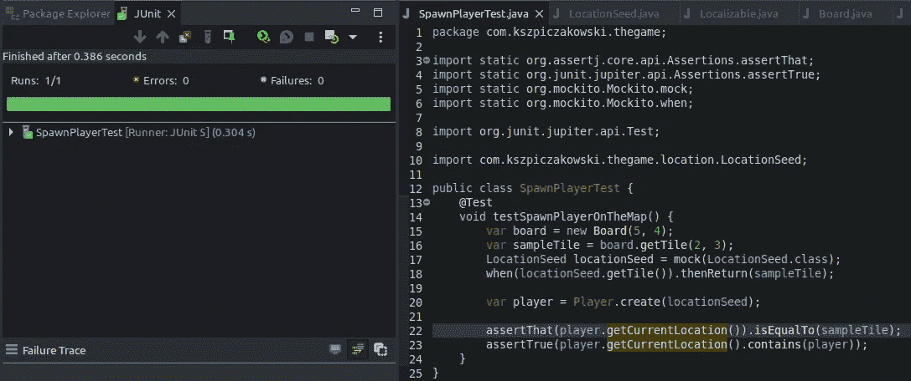

# 让我们闻闻测试# 3——测试 Java 中的随机性

> 原文：<https://betterprogramming.pub/lets-smell-some-tests-3-testing-randomness-in-java-26a70a017239>

## 为什么您应该避免测试非确定性行为

卢卡斯·乔治·温迪特在 [Unsplash](https://unsplash.com?utm_source=medium&utm_medium=referral) 上拍摄的照片

你好，欢迎来到*系列的第四篇《来闻点测试吧》。在前一集，我们看到了锻炼内部行为的测试，我们指出了这种方法的缺点。*

*今天，我们将分析另一个有趣的话题:为什么测试不可测试性是一个糟糕的实践，为什么它会导致过度复杂的测试用例。*

*以下是我在今天的例子中使用的内容:*

*   *Java 17*
*   *JUnit 5.8.2*
*   *AssertJ 3.22.0*
*   *摩奇托 4.5.1*

# *例子:在地图上随机选择一个地方繁殖一个玩家*

## *要求*

*此用例的要求如下:*

*   *当游戏开始时，在地图上产生一个新玩家*
*   *地图是一个平铺矩阵；地图的大小是可以配置的*
*   *默认情况下，将玩家放在随机牌上*

## *第一种实现方法*

*这些需求的一个示例实现可能类似于下面的代码片段:*

**

*测试通过了，尽管应该返工*

*简短的解释:*

*   *`Board`类由一个对象矩阵组成，每个对象都属于`Tile`类型*
*   *`Tile`类由`x`和`y`属性表示，加上它持有一组`Localizable`对象，像玩家；在未来,`Localizable`界面可能还会显示其他物体，比如敌人、可消耗的物品，以及任何可以绑定到地图上一个区块的东西*
*   *因为我们想在地图上的某个地方放置一个新玩家，所以`Player`类实现了`Localizable`接口，它带有`getCurrentLocation()`函数。*
*   *为了实例化一个新的`Player`，我们必须调用一个工厂方法`create(Board board)`*
*   *为了满足要求，`Player`类包含选择随机牌的逻辑，玩家应该在这里开始游戏*

# *代码分析*

*代码可以被编写成能够正常工作，也可以工作并保持高质量。不幸的是，当前的实现代表了第一种选择。*

*上面的代码编译通过，测试通过，理论上，我们可以继续并实现其他功能，但是让我们看看还有什么可以做得更好:*

*   *测试用例`SpawnPlayerTest#testSpawnPlayerOnTheMap`通过检查棋盘大小进行了过多的验证(测试的名称表明它只关注于生成玩家，这是不正确的)*
*   *断言逻辑太复杂(因为玩家被分配到的牌是随机的，我们从棋盘上收集所有的牌，并且我们正在检查玩家是否被分配到其中的一个)*
*   *为新玩家选择牌的逻辑是硬编码在`Player`类中的(违反了单一责任和开闭原则)*

# *如何改进代码*

*处理随机性可能很棘手，我们的代码就是这种情况。根据这个例子，我们有一个尺寸为 5x4 的板。这给了我们 20 个可能的牌，产卵玩家可以从中选择牌。*

*现在，有一件重要的事情要说:即使我们知道有 20 个可能的值要断言，实际上也没有办法确定在下一次测试执行中将选择哪个特定的图块。随机性是一种我们有点无法控制的东西，在我看来，如果我们接受这个事实，而不是在测试中与之斗争，那会更好。*

*可以用以下几点来描述更适合当前需求的解决方案:*

*   *提取逻辑为玩家选择一个独立的单位*
*   *为这个逻辑创建一个抽象，以便在需求变化时可以使用不同的实现*
*   *要生成玩家，通过构造函数将磁贴选择器传递给`Player`类*
*   *简化测试`SpawnPlayerTest#testSpawnPlayerOnTheMap`*

## *步骤 1:提取为玩家选择牌*

*如果将来需求发生变化，我们将需要编写另一个类来实现`LocationSeed`接口。*

## *步骤 2:告诉玩家对象在哪里可以得到初始的方块*

*构造函数通过调用`locationSeed.getTile()`方法来利用提供的`LocationSeed`对象。将来，当需要时，我们可以简单地提供一个不同的`LocationSeed`接口实现，这样我们就不会接受修改，但可以接受扩展。*

## *步骤 3:重做测试*

*我将电路板创建的逻辑提取到一个新的测试类中的一个单独的测试方法中。现在，这个测试验证了它的名字的含义。*

*从现在开始，旧的测试被简化了。它只专注于繁殖玩家。*

*我使用来自 Mockito 的`mock()`方法创建了一个`RandomLocationSeed`类的伪实现。这在开始时似乎有点违反直觉，因为我们希望我们的测试验证玩家的生成是否如预期的那样工作。*

*请记住，我们应该测试可观察的行为，也就是“在地图上的随机位置繁殖玩家”然而，我们希望用我们可以控制的相关性来设置这个测试，因为随机性是我们无法控制的外部因素。*

*然后，我通过调用同样由 Mockito 提供的`when()`和`then()`函数来设置 mock。这些函数用于配置调用方法时应该做什么。我简单地查询了`Board`对象以返回它的一个图块，每当调用`getTile()`函数时，它都会返回一个样本图块。*

*关于模仿`LocationSeed`的最后一件事是调用`verify()`方法，它检查模仿是否被调用过。*

*在这一点上，我建议对上面的测试做最后一点小小的修改。事实上，我们是用存根来处理测试，而不是用模拟。它们之间的主要区别是 mocks 不返回值(它们充当命令)，而 stubs 确实返回值(它们充当查询)。*

*在存根上调用`verify()`方法是一种不好的做法，因为它验证内部行为。在我们的案例中，可观察到的行为是“产生一个玩家”，因此查询图块只是业务案例的中间步骤。因此，让我们删除对`verify()`方法的调用，这样测试的最终版本将如下所示:*

*测试的最终版本，不检查模拟是否被调用*

**

*测试的最终版本已经通过*

# *结论*

*如你所见，编程游戏可以和玩游戏一样有趣:)。*

*让我们总结一下从这个例子中得到的教训:*

*   *不要让你的测试过于复杂*
*   *如果您的测试做得太多，例如，包含多个`assert`语句并检查多个对象，考虑将这个测试分成更小的测试*
*   *不是所有的功能都适合直接测试(比如依赖于随机性的特性)*
*   *在事情失去控制的地方使用 mock/stub(测试随机性，但也跨越应用程序边界，比如调用文件系统、web 服务/消息总线等等)*

# *参考*

*[1]:王南钧·什皮查考斯基，*让我们闻闻一些测试# 2*[https://better programming . pub/Let-smeet-Some-Tests-2-asserting-the-internal-behavior-in-Java-1c 0 f 34 Fe 8 BBC](/lets-smell-some-tests-2-asserting-the-internal-behavior-in-java-1c0f34fe8bbc)*