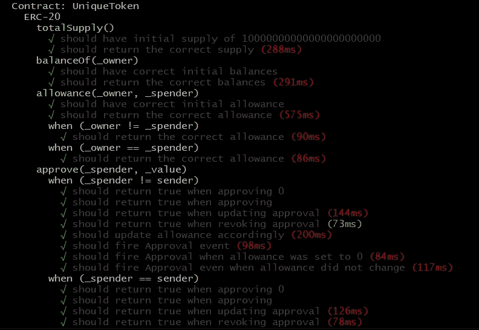
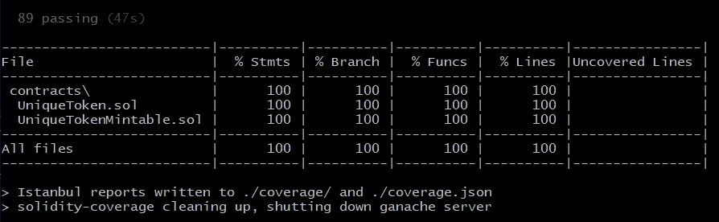

# 让我们来谈谈智能合同单元测试

> 原文：<https://betterprogramming.pub/lets-talk-about-smart-contract-unit-testing-1317a2d2365a>

## 用几行代码向您的智能合约添加一个完整的测试套件


由 [NASA](https://unsplash.com/@nasa?utm_source=medium&utm_medium=referral) 在 [Unsplash](https://unsplash.com?utm_source=medium&utm_medium=referral) 上拍摄的照片。

欢迎来到区块链无处不在系列的另一部分。如果你错过了，看看[之前的部分](https://medium.com/better-programming/how-to-integrate-the-curve-fi-protocol-into-your-defi-protocol-e1d4c43f716d)。上次，我们谈到了大 DeFi 协议集成。我们可以从中得出的一个主要结论是，这样一大块工作应该由完整的单元测试覆盖来支持，以验证形式逻辑。

这就是今天文章的主题。让我们谈一谈智能合约的单元测试。

单元测试是任何基于智能合约的协议中最重要的部分之一。它们由社区检查，它们应该在每次提交时运行，单元测试覆盖率由审计员强制检查。所有用于可靠性单元测试的通用技术都是众所周知的，并且已经描述过了。关于[柴框架](https://www.chaijs.com)、[松露测试助手](https://www.npmjs.com/package/truffle-test-helpers)甚至现代 [OpenZeppelin 测试助手](https://docs.openzeppelin.com/test-helpers/0.5/)的文章很多。所以我们换个角度来看一下。

# 我们在谈论什么

假设您有一个 ERC20 兼容的令牌和一些额外的方法。你知道它的基本功能是有效的，你的社区也知道它是有效的。你可能从 [OpenZeppelin 库](https://github.com/OpenZeppelin/openzeppelin-contracts-upgradeable/tree/master/contracts/token/ERC20)复制了部分代码(或者全部代码)。但是你不能足够肯定你实现之后没有破坏原有的令牌功能(比如具体的转移方法)。这种情况需要特定的工具，因为您可能不会用标准的单元测试来覆盖 ERC20 令牌。

当然，这样的工具是存在的。有一个`token-test-suite`包，它包含了 ERC20 兼容功能的所有必要测试，包括`Mintable`令牌。可以在 GitHub 上找到原库[。](https://github.com/mancze/token-test-suite)

为了与包一起开始开发，您可以在`packages`文件中向您的开发依赖项添加一行代码:

```
“token-test-suite”: “0.1.1”
```

# 从令牌开始

首先，我们需要令牌本身，这样我们就有东西可以测试了。当然，你可以自己写完整的代码，但是我们来缩短路径。多亏了 OpenZeppelin，我们可以用五行代码创建一个 ERC20 令牌:

此外，让我们再添加几行代码，使我们的令牌可铸造:

我们宝贵的令牌已经准备好了，所以我们现在可以专注于测试(或者如何避免整个单元测试集的创建)。

也就是说，我将再次提醒您，ERC20 的 OZ 实现可以完美地工作，但这并不意味着您不需要测试。该测试套件面向自定义令牌或具有附加功能的令牌。

# 设置测试套件

首先，您可以在原始存储库中找到所有必要的指令[，尽管我将跟随您完成主要阶段:](https://github.com/mancze/token-test-suite)

*   从`regenerator-runtime`包中导入再生器:

```
require(“regenerator-runtime/runtime”);
```

*   复制软件包自述文件中推荐的初始代码。只需检查是否导入了正确的工件，以及是否正确设置了所有令牌的参数。
*   在`create`参数中设置正确的创建:

```
create: async function () {
    return await UniqueToken.new(accounts[0], “10000000000000000000000”);
},
```

*   根据令牌的性质(不可铸造或可铸造)设置转移或铸造参数:

*   设置供应(根据您的创建功能)和初始余额。请记住，使用了五个帐户，第一个帐户被视为所有者/minter。

并且该过程结束。在我的 GitHub 上查看完整的测试示例(每个令牌少于 50 行)[，让我们开始测试。](https://github.com/Midvel/medium_blockchain_notes/tree/main/erc20_test_suit)

# 没有测试的测试

在我们设置好测试套件之后，我们现在可以调用`truffle test`命令:



您将观察到许多与初始供应、转移、铸造、津贴和平衡相关的测试案例——所有的核心内容。这个套件真正的好处是它完美地覆盖了一个令牌。



来自`solidity-coverage` [工具](https://www.npmjs.com/package/solidity-coverage)的输出就是最好的证明。

现在，您可以在标准化的事情上节省大量时间，并专注于您独特的功能。

# 结论

我发现区块链世界非常迷人和令人兴奋。每天，我都在这个领域里寻找更多有趣的东西。如果你和我一样对区块链发展感兴趣，就等着看区块链的下一期吧。

和往常一样，您可以在我的 GitHub 上找到一个完整的工作示例:

[](https://github.com/Midvel/medium_blockchain_notes/tree/main/erc20_test_suit) [## 中级/中等 _ 区块链 _ 笔记

### 出于开发目的，您将需要 Node.js 和包管理器- npm。对于开发，以下…

github.com](https://github.com/Midvel/medium_blockchain_notes/tree/main/erc20_test_suit) 

确保你没有错过我的区块链无处不在系列的前一部分:

[](https://medium.com/better-programming/how-to-integrate-the-curve-fi-protocol-into-your-defi-protocol-e1d4c43f716d) [## 如何整合曲线？Fi 协议转换成 DeFi 协议

### 使用曲线适配器为 DeFi 应用供电。金融机构流动性池

medium.com](https://medium.com/better-programming/how-to-integrate-the-curve-fi-protocol-into-your-defi-protocol-e1d4c43f716d)