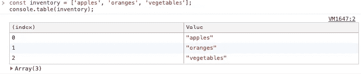
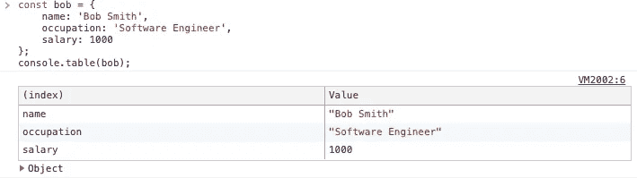
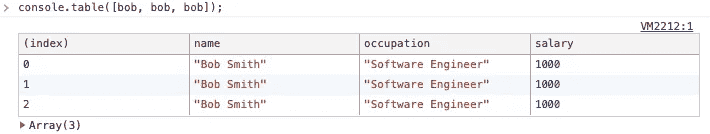
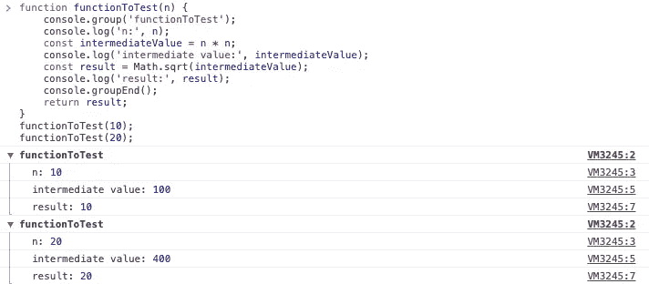
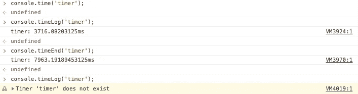

# 升级您的 JavaScript 日志游戏

> 原文：<https://betterprogramming.pub/level-up-your-javascript-logging-game-261f8875a68c>

## 你的浏览器控制台比你想象的有更多的功能

[Sean Lim](https://unsplash.com/@seanlimm?utm_source=medium&utm_medium=referral) 在 [Unsplash](https://unsplash.com?utm_source=medium&utm_medium=referral) 上拍摄的照片。

日志记录功能是每种编程语言的必备功能。JavaScript 有`console.log`用于基本调试，但是你知道浏览器的控制台暴露了很多其他的调试功能吗？让我们来看看它们，看看你如何能让你的日志更有价值。

快速浏览一下浏览器控制台的[文档](https://developer.mozilla.org/en-US/docs/Web/API/Console)，可以看到除了`console.log`之外，至少还有 20 个其他公开的功能。我将挑选出对开发最重要的函数，并向您展示如何使用它们。

# 控制台.错误和控制台.警告

将日志划分到不同的级别通常很有用，因为它允许您快速查看哪些消息需要您更多的关注。`console.error`和`console.warn`的功能与`console.log`非常相似，但是日志信息清楚地表明它们需要您更多的关注。

警告和错误消息还带有堆栈跟踪，有助于您的调试。不要对每条消息都使用`console.log`，而是在应用程序中断错误发生时使用`console.error`，在意外情况发生时使用`console.warn`。

# 控制台.表格

许多开发人员可能会感到惊讶，有一种方法可以在浏览器的控制台中以表格格式查看对象和数组。`console.table`帮助您轻松地在浏览器控制台中显示表格数据。

显示数组时，它会在第一列显示每个元素的索引:

它还能很好地处理对象和对象数组——使用`console.table`时，在对象之间进行比较要容易得多。

# console.group 和 console.groupEnd

当所有日志消息都出现在同一层次结构中时，可能很难将它们分开。`console.group`允许您将日志消息组织到不同的组中，提高可读性。

`console.group`接受一个标签作为它的参数，在`console.group`和`console.groupEnd`之间记录的消息被很好地分组在一起，如上所示。它还支持嵌套，这允许您在必要时构建日志的层次结构。

# console.time、console.timeEnd 和 console.timeLog

这三个函数为您提供了浏览器控制台中的秒表功能。`console.time`启动定时器，`console.timeLog`记录定时器的当前时间值，`console.timeEnd`停止定时器。

一个页面上可以同时有多达 10，000 个不同标签的计时器。请注意，一旦调用`console.timeEnd`，定时器将从内存中删除，进一步调用`console.timeLog`和`console.timeEnd`将输出一条警告消息。您可以使用它来简单地分析函数的运行时间，而不必创建自己的计时器功能。

# 就是这样！

有效地记录日志是所有开发人员都应该具备的技能之一。利用您可以使用的日志功能将帮助您更有效地开发。

在浏览器的控制台中还有几个其他的功能可以使用，但是我发现它们只有几个用例。如果你仍然对它们感兴趣，可以去阅读 MDN 的文档。