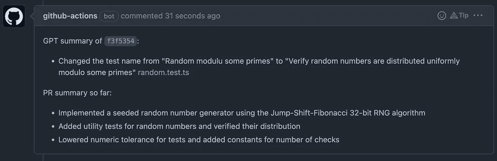
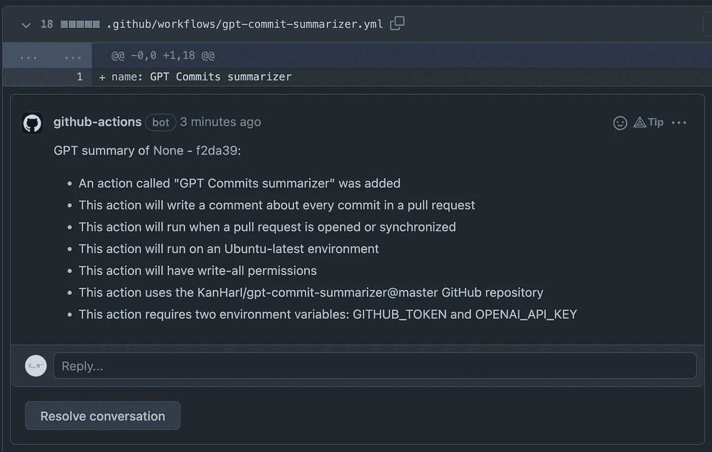
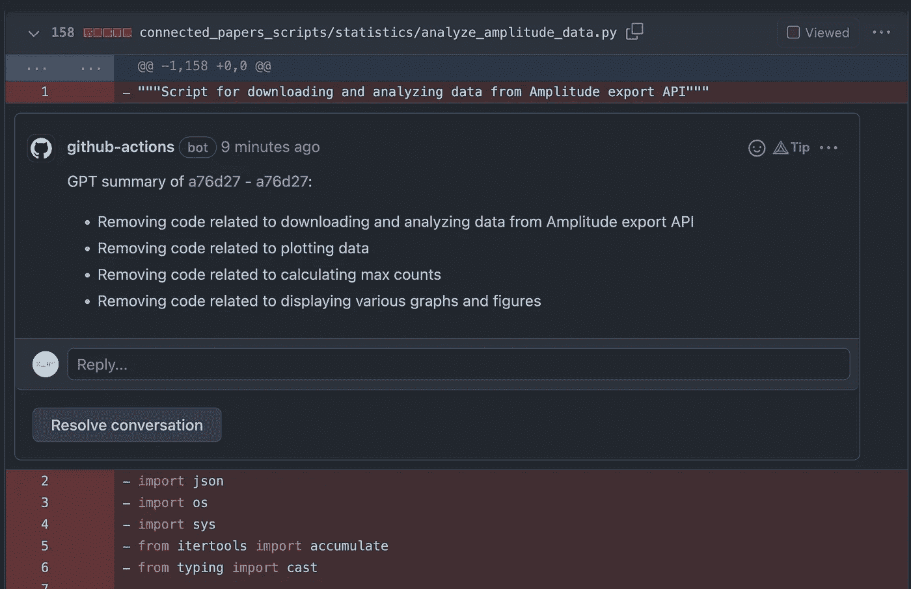
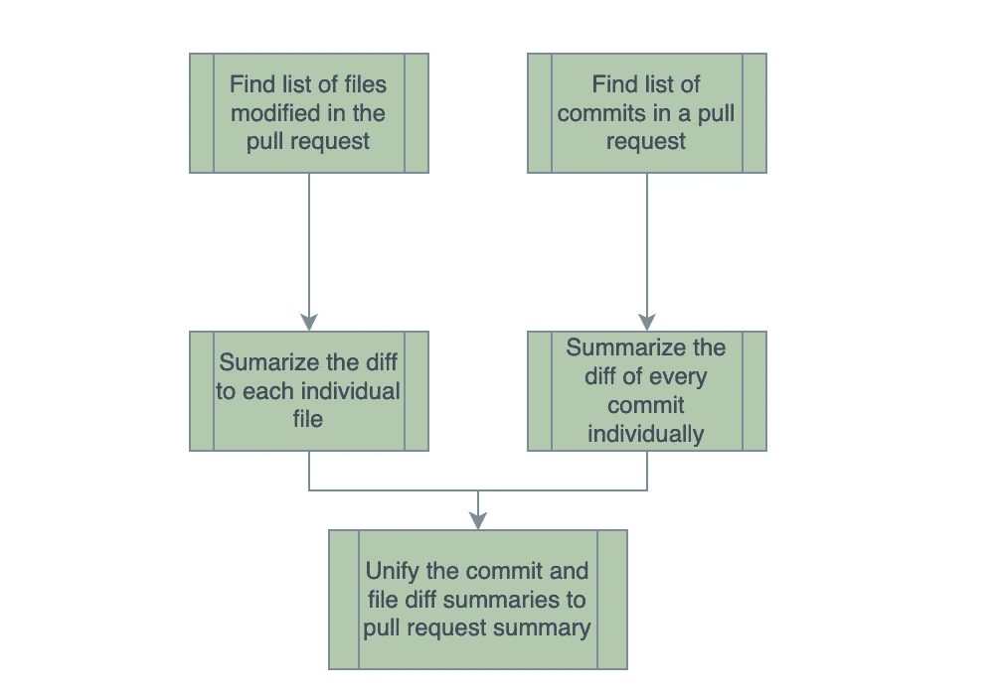
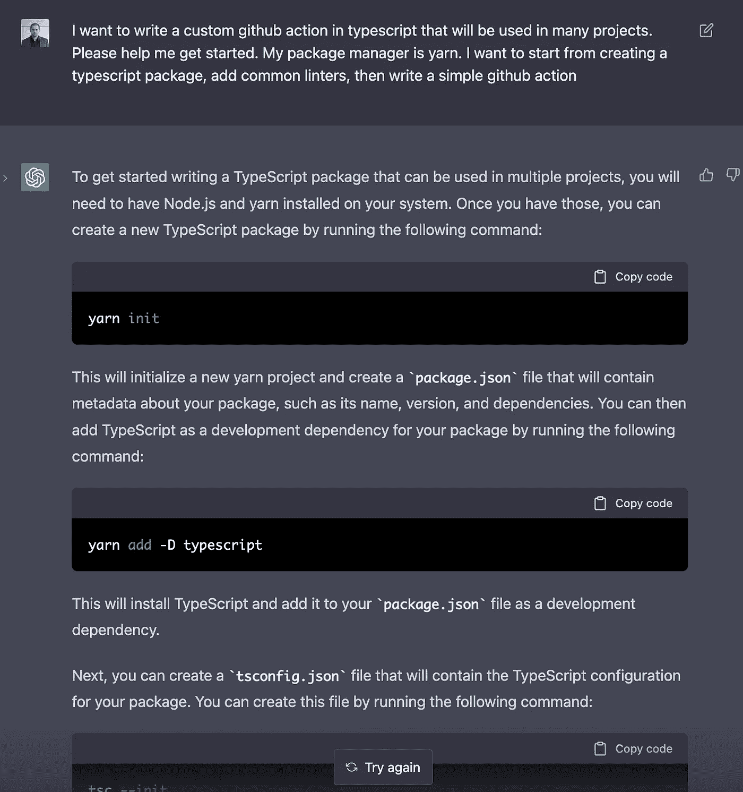
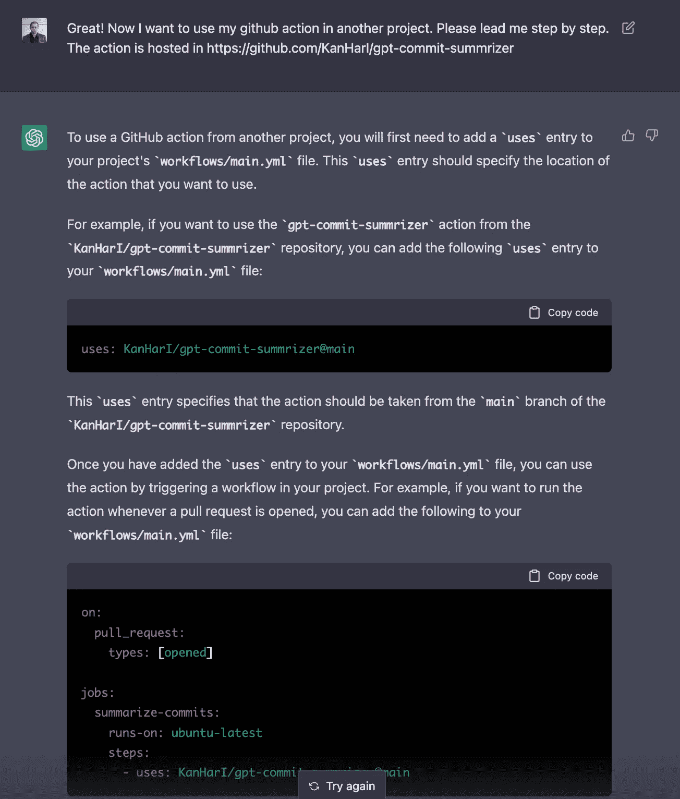

# 使用 OpenAI 语言模型的自动提交摘要

> 原文：<https://betterprogramming.pub/leverage-openais-language-model-for-automated-commit-summaries-8181cef30375>

## GPT 汇总器简介—生成拉式请求汇总和提交描述


卢克·切瑟在 [Unsplash](https://unsplash.com?utm_source=medium&utm_medium=referral) 上的照片

您是否在寻找使工作流更高效的方法，或者厌倦了手动筛选长提交日志来理解拉取请求？

介绍 GPT 摘要器 GitHub action:这是一个强大的工具，它利用 OpenAI 最新和最棒的大型语言模型来生成整个拉请求的简明和信息丰富的摘要，以及对单个文件和单个提交的更改的描述。

# 在几分钟内启动并运行

准备好开始使用 GPT 提交摘要生成器了吗？将动作添加到您的存储库中既快速又简单——您所需要的只是一个 OpenAI API 令牌、存储库中的一个秘密，以及添加一个文件来定义工作流。

按照[自述文件](https://github.com/KanHarI/gpt-commit-summarizer/blob/master/Readme.md)中的说明，你可以在几分钟内启动并运行。该操作支持所有编程语言和框架-结果可能会有所不同。点击查看[。](https://github.com/KanHarI/gpt-commit-summarizer/)

# 真实代码库上的结果

所有结果都来自真实代码库——个人项目，[同上. fit](https://ditto.fit/) ，以及[connectedpapers.com](https://connectedpapers.com/)。



准确的提交和 PR 总结



添加到存储库中的定义工作流的文件的描述



摘要捕获删除的和添加的代码

*   PR 总结注释对于抓住拉动式请求的主要思想有很大的帮助。这些被称为“到目前为止的 PR 总结”,因为它们是增量生成的，以避免当提交被添加到拉请求时，讨论页面因双重注释而混乱。
*   单个文件差异摘要通常是准确的，并在审查过程中提供进一步的帮助。GitHub 动作会自动清理，删除过时的摘要评论，防止评论页面被垃圾邮件攻击。
*   如果某个特定的文件更改让您感到困惑，您可以随时查看发生该更改的提交摘要，通常会找到有用的解释。

# 在幕后



解决方案的数据流

将来，总有一天会出现一种模型，它可以在整个代码库的上下文中评估完整的拉请求，并给出一个摘要。然而，今天不是那一天。

目前，Summarizer 项目中使用的`text-davinci-003`模型(支持 ChatGPT 的模型)被限制为 4096 个令牌，大约 200 行代码。

这意味着可以输入到模型中的代码变更数量比典型的拉请求中的变更数量要少得多。此外，模型需要在代码上下几行的上下文中看到代码变化，以便能够理解它们，这导致在任何实际的工作流中输入都超出了它的限制。

为了解决这个问题，GPT-提交-摘要生成器将拉请求分解成更小的差异——单个文件的差异和其中的提交。然后对这些进行单独总结。然后，所有这些摘要被组合到一个查询中，以生成整个拉请求的摘要。

# 一种新的软件工程

软件工程师将很快意识到这与你设计问题解决方案时所用的思维方式非常相似。将一个问题分解成更小的、可管理的部分，了解任务之间的依赖关系，然后得到统一的结果。

与经典软件工程的相似之处并不止于此——请看一下查询的开头，总结 git 提交:

```
You are an expert programmer, and you are trying to summarize a git diff.
Reminders about the git diff format:
For every file, there are a few metadata lines, like (for example):
```
diff --git a/lib/index.js b/lib/index.js
index aadf691..bfef603 100644
--- a/lib/index.js
+++ b/lib/index.js
```
This means that `lib/index.js` was modified in this commit. Note that this is only an example.
Then there is a specifier of the lines that were modified.
A line starting with `+` means it was added.
A line that starting with `-` means that line was deleted.
A line that starts with neither `+` nor `-` is code given for context and better understanding.
It is not part of the diff.
[...]
EXAMPLE SUMMARY COMMENTS:
```
* Raised the amount of returned recordings from `10` to `100` [packages/server/recordings_api.ts], [packages/server/constants.ts]
* Fixed a typo in the github action name [.github/workflows/gpt-commit-summarizer.yml]
* Moved the `octokit` initialization to a separate file [src/octokit.ts], [src/index.ts]
* Added an OpenAI API for completions [packages/utils/apis/openai.ts]
* Lowered numeric tolerance for test files
```
Most commits will have less comments than this examples list.
The last comment does not include the file names,
because there were more than two relevant files in the hypothetical commit.
Do not include parts of the example in your summary.
It is given only as an example of appropriate comments.
```

这…感觉不像写英语。我知道这种感觉。这就是编程。

这种新的编程方式，使用英语作为编程语言，为语言模型编写生成文本的指令，正在成为软件工程工具箱中的一个强大工具。

我毫不怀疑“调用大型语言模型”将很快成为软件架构和规划会议中的常见讨论思想——对于一些任务，用英语指定它们并调用一个 API 就是您所需要的全部。

# 用 GPT 写代码



当我第一次开始编写 GitHub 动作时，我不知道如何编写这样的动作，也不熟悉 OpenAI API。

然而，在模型的帮助下，我能够快速有效地编写代码的许多部分，而不用浪费宝贵的时间在晦涩的库文档中搜索正确的函数。

即使对于代码重构，该模型也被证明是一个有效的工具。总而言之，我确信利用语言模型将成为所有软件开发人员的基本工具，无论他们属于哪个领域。



我从这个工具中学到的提高工作效率的最重要的技巧是:

*   提供你想要它做什么的清晰指示。
*   如果您的代码构建失败或者有任何错误——告诉它，并粘贴错误消息，要求模型重写它。我发现它通常可以修复错误和简单的 bug。
*   每当你需要访问一个 API 或者使用一个库的时候——问模型“我如何在库 Y 中做 X？”它通常会提供答案。
*   利用类型化语言(我用的是 TypeScript)被证明是这个过程中非常有用的工具。模型经常不能产生正确的类型签名。有时这是一个小的语法问题，但是很多时候它也强调了真正的问题——当出现类型错误时，模型会修复这些问题。
*   为了使用这个工具，你必须已经知道如何编程。它有时会犯愚蠢的错误，当涉及到重构代码或进行更改时，您需要提供指导。
*   使用[操场](https://beta.openai.com/playground)，不要使用 ChatGPT。这允许以下非常高效的工作流:每当你对输出不满意时，确定模型偏离你的愿景的第一点，写一两个词(或大约一行代码)，删除其余的——并让模型从那里继续(从截图中可以看出，这种认识是在过程的后期出现的……我必须承认，ChatGPT 更上相)。
*   创建小的提交并使用 git 被证明是一个非常有价值的实践。偶尔，模型会在重构代码时出错——经常提交，如果它做错了什么，就重置为最近的工作提交。

我知道我不是第一个这么说的人，但是我强烈推荐使用 GPT。不仅仅是对于编程任务，对于各种各样的活动都是如此——我发现在写这篇博客时，它非常有帮助。

# 已知限制

对于非常大的 PRs，当前的解决方案仍然经常超出模型的大小限制，导致一些失败的汇总。该操作可以很好地处理它—例如，如果一个文件差异非常大，它将无法总结它，但它仍然可以总结所有其他文件差异和参与 PR 的所有提交，从而产生一个可接受的总 PR 总结。

此外，有时(在我的测试中很少)模型会误解某些东西，写下完全错误的注释。更常见的情况是不写差异的重要部分。所以，用你的判断力，千万不要盲目相信结果。

*感谢 Soof Golan 对代码库的贡献和编写*[*add-GPT-summarizer*](https://github.com/soof-golan/add-gpt-summarizer)*。*

*作者伊塔伊·克纳安-哈帕兹现任* [*同上. fit*](https://ditto.fit) *首席技术官、*[*connectedpapers.com*](https://www.connectedpapers.com)*联合创始人。*