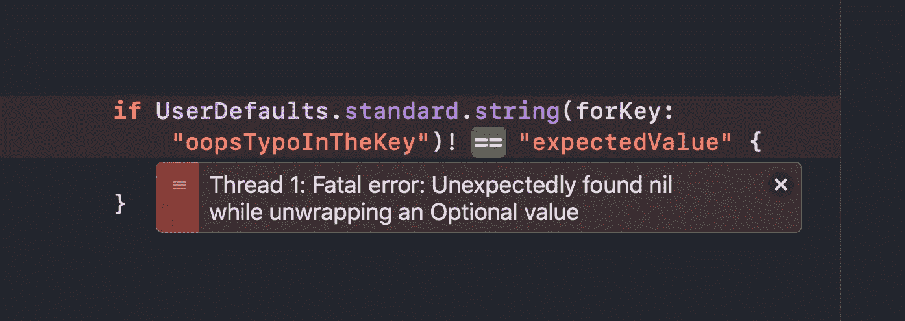

# 以正确的方式利用 Swift 的用户默认值

> 原文：<https://betterprogramming.pub/leverage-swifts-userdefaults-the-right-way-827ddc5c0085>

## 通过避免直接处理字符串，使代码不容易出错

您可能已经多次看到过这种实现:

这里会出什么问题呢？因为我们使用字符串来获取/设置特定键的值(字符串)(也是字符串！)，我们正在使我们的代码容易出现可能的错别字。

在这篇短文中，我们将以`AuthCredentials`为例，学习如何以非常安全的方式使用`UserDefaults`，T1 负责跟踪用户之前是否启动过应用程序，存储认证令牌，以及处理其他非敏感的补充信息。

# 认证证书

我们是这样做的。

首先，我们创建一个名为`defaults`的属性，在自定义的 getters 和 setters 中重用它。然后，我们为`hasLaunchedBefore`、`token`和`isNewSeller`定义字符串键。

剩下的工作就是实现这些实际的 getters 和 setters。下面是实现过程:

现在最有趣的部分——我们如何使用我们的`UserDefaults`？

很简单——这就是我们如何检查假定的卖家是否是新卖家:

`isNewSeller`状态的分配也非常简单:

因此，我们在幕后实现了一个`UserDefaults`存储，我们所要关心的只是基本的获取/设置操作。

感谢您的阅读！