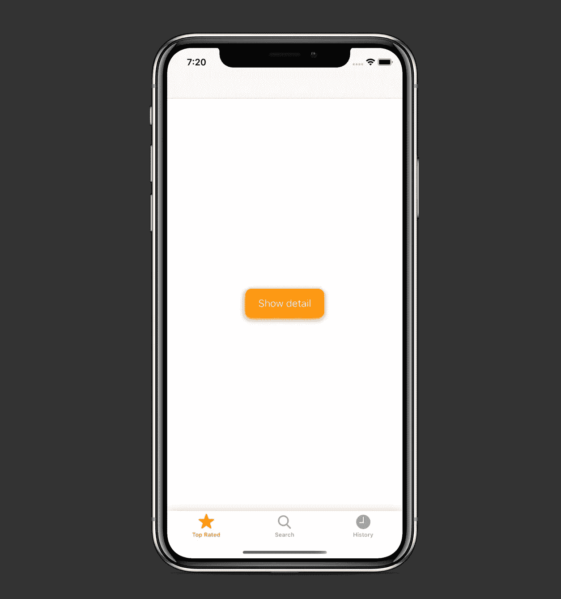
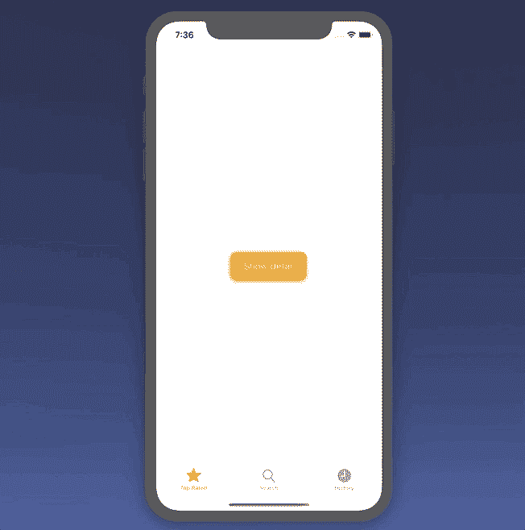
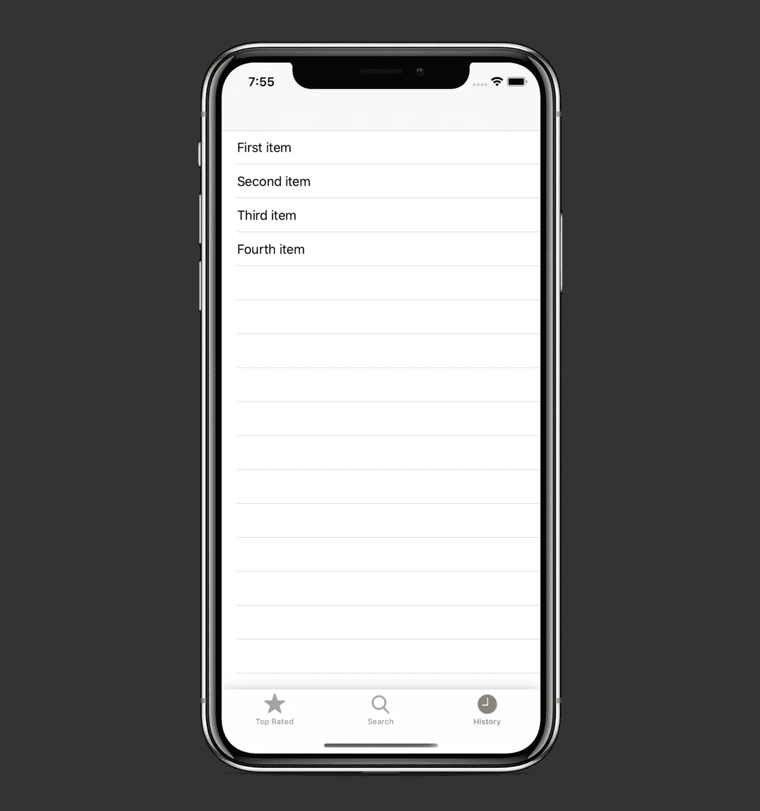
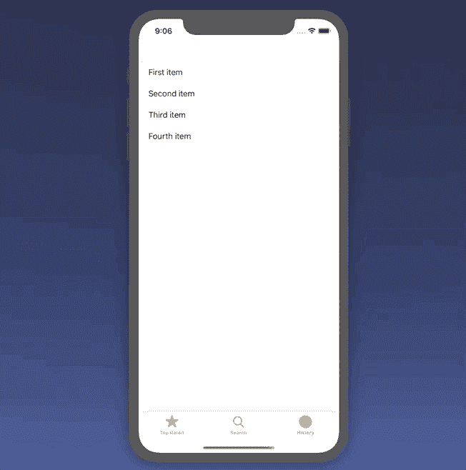
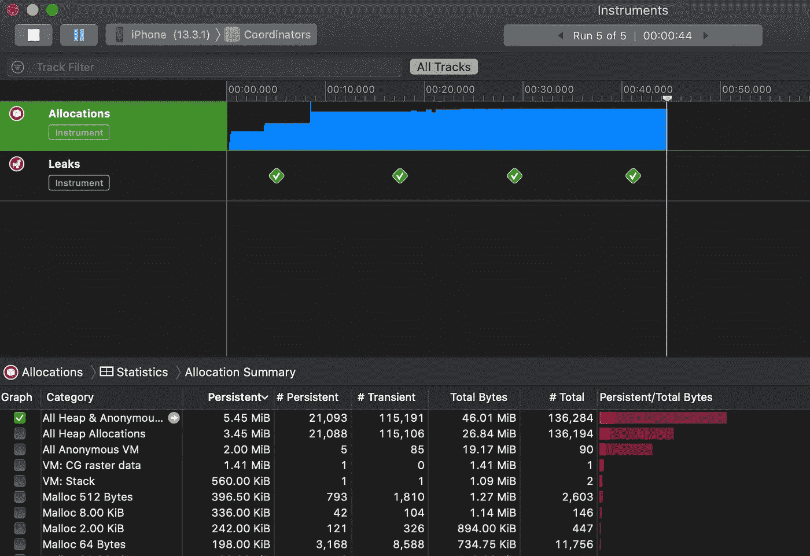

# 利用 Swift 5 中的协调器设计模式

> 原文：<https://betterprogramming.pub/leverage-the-coordinator-design-pattern-in-swift-5-cd5bb9e78e12>

## 隔离您的视图控制器，使它们更易于测试和重用

阿尔瓦罗·雷耶斯在 [Unsplash](https://unsplash.com?utm_source=medium&utm_medium=referral) 上拍摄的照片

在本教程中，我们将通过一个示例项目探索 Swift 中的协调器设计模式。

协调模式允许我们控制应用程序的流程，避免将导航逻辑直接放入控制器中。它还帮助我们将视图控制器相互隔离，当我们想要在我们的项目中重用它们时，这很方便。

我们将讨论以下部分:

*   创建个人协调员
*   利用协调员流程
*   使用协调器在视图控制器之间传递数据

该项目的源代码可以在文章的底部找到。

# 我们开始吧

首先，让我们创建所有协调员都要遵守的`Coordinator`协议:

现在，我们需要创建负责启动我们的应用程序的`AppCoordinator`:

为了完成初始设置，我们需要启动`AppDelegate`中`AppCoordinator`的`start`方法:

现在，让我们进入应用程序的第一个屏幕。

## StartCoordinator

类似于我们在`AppCoordinator`中所做的，我们创建了`StartCoordinator`类并使其符合`Coordinator`协议。我们还定义了包含方法`coordinateToTabBar()`的`StartFlow`协议，我们将在`StartViewController`中触发它。

## 开始视图控制器

这里，我们简单地在屏幕中央布置了一个按钮，并创建了`startTapped`处理程序(其中我们调用了`coordinateToTabBar()`方法):

让我们来看看我们如何协调到`TabBarCoordinator`:

我们所要做的就是实例化协调器并调用`coordinate(to:)`方法。

现在让我们探索一下如何使用带有`UITabBarController`的协调器。

## TabBarCoordinator

正如我们在`start()`方法中看到的，我们创建了单独的`UINavigationController`和协调器，然后触发每个协调器的`coordinate(to:)`方法。

因此，我们有了不知道其他控制器的`TabBarController`类:

让我们来看看标签栏的各个屏幕:`TopRated`、`Search`和`History`。

## 顶级协调员

我们为`TopRatedViewController`构造协调器如下:

而`TopRatedViewController`本身:

## TopRatedViewController

因此，我们有以下布局:

让我们实现当用户点击`showDetailButton`时我们将呈现的细节屏幕。

## TopRatedDetailCoordinator

这里，一切几乎都是一样的——不同之处在于我们执行的是`present`方法，而不是`pushViewController`:

## TopRatedDetailViewController

和前面的视图控制器一样，我们有一个`coordinator`属性，在`dismissDetailTapped`按钮处理程序中使用:

因此，我们有以下工作流程:

`Search`工作流是相同的——让我们转而关注如何在`History`屏幕中的协调员之间传递数据。

## 历史项目

我们定义了一个非常简单的类来表示`Model`，我们将把它从一个协调器传递给另一个协调器:

## 历史协调员

就像之前一样，我们在`start()`方法中实例化并推送一个全新的视图控制器到导航堆栈上:

## 历史视图控制器

我们创建一个视图控制器，显示包含我们的`HistoryItem`对象的`UITableView`。当我们选择一个特定的`UITableViewCell`时，`didSelectRow`方法被触发(其中我们捕获相应的`HistoryItem`并将其传递给`HistoryCoordinator`):

现在，我们有以下布局:

让我们转到详细信息屏幕。

## 历史详细协调员

我们可以看到除了标准的`navigationController`，我们还有`historyItemTitle`属性。

我们在`start()`方法中将它赋给`HistoryDetailViewController`自己的`historyItemTitle`属性:

## HistoryDetailViewController

该控制器仅在屏幕顶部显示一个标签，并在中间显示一个解散按钮:

我们建立了以下工作流程:

# 泄漏仪器

内存管理呢？我们可以看到每个被解除的视图控制器和一个相应的协调器被使用 Leaks 工具解除分配:

如果你不熟悉泄漏仪器，我建议你看看我的文章，我在文章中详细解释了如何使用它:

 [## 使用 Xcode 工具诊断内存泄漏

### 面临记忆问题时，leaks 仪器可能会成为你最好的朋友

medium.com](https://medium.com/better-programming/diagnose-memory-leaks-using-xcode-instruments-5692a6458020) 

# 资源

该项目的源代码可以在 GitHub 上找到:

 [## zafarivaev/CoordinatorDesignPattern

### 显示协调器设计模式实现的应用程序。为一篇中等文章写的…

github.com](https://github.com/zafarivaev/CoordinatorDesignPattern) 

# 包扎

对其他设计模式感兴趣？请随意查看我的其他相关作品:

 [## 在 Swift 中实施适配器设计模式

### 让不兼容的接口协同工作

medium.com](https://medium.com/better-programming/implement-the-adapter-design-pattern-in-swift-165ac22bc868)  [## 在 Swift 5 中实施构建器设计模式

### 创建和使用自定义 URLRequests 和 URLSessionDataTasks

medium.com](https://medium.com/better-programming/implement-the-builder-design-pattern-in-swift-5-ff5bc6f2fc3d)  [## 在 Swift 中实施战略设计模式

### 只需一行代码就可以在领域和核心数据之间切换

medium.com](https://medium.com/better-programming/implement-the-strategy-design-pattern-in-swift-5d9c3f221277)  [## 新 MVC:单一责任原则和委托

### 苹果的模型视图控制器，终于做对了

medium.com](https://medium.com/better-programming/this-is-how-you-implement-mvc-architecture-in-2020-b39d65b4212f)  [## 在 Swift 5 中实施模型-视图-演示者架构

### 使用领域数据库作为业务逻辑层

medium.com](https://medium.com/better-programming/implement-a-model-view-presenter-architecture-in-swift-5-dfa21bbb8e0b)  [## 反应式 MVVM 和协调模式做对了

### 使用 Swift 5、RxSwift 和 RxDataSources

medium.com](https://medium.com/better-programming/reactive-mvvm-and-the-coordinator-pattern-done-right-88248baf8ca5)  [## 如何使用 Swift 5 在您的 iOS 应用中实现 VIPER 架构

### 使用方便的 Xcode 模板和参考报告

medium.com](https://medium.com/better-programming/how-to-implement-viper-architecture-in-your-ios-app-rest-api-and-kingfisher-f494a0891c43)  [## 在 Swift 5 中实施面向服务的架构

### 为什么只用 MVC/MVVM/蝰蛇还不够

medium.com](https://medium.com/better-programming/implement-a-service-oriented-architecture-in-swift-5-fc70b8117616) 

感谢阅读！