# 使用 Visual Studio/VS 代码快捷方式和重构提高您的工作效率

> 原文：<https://betterprogramming.pub/leverage-your-coding-speed-to-the-maximum-with-visual-studio-vscode-shortcuts-and-refactorings-fcbed61b7540>

## 超过 20 种快捷方式和重构技术来增强您的工作流程

照片由 [AltumCode](https://unsplash.com/@altumcode?utm_source=medium&utm_medium=referral) 在 [Unsplash](https://unsplash.com?utm_source=medium&utm_medium=referral) 上拍摄

如果你已经像我一样学会了编码，在 IDE 几乎不支持的情况下编写 [MS Excel](https://www.microsoft.com/de-de/microsoft-365/excel) 宏，你可能也已经适应了尝试自己编写所有东西的行为——而不是让你的 IDE 帮忙。

现代 ide 或代码编辑器为您提供了大量的键盘快捷键、重构选项和自动代码完成功能。掌握它们会大大提高你编码的生产力。

在这篇文章中，我将向你展示一些我学到的技巧，让你用[微软 Visual Studio](https://visualstudio.microsoft.com/de/) (2019+)编写代码变得极具性能。通过扩展 [Visual Studio Keymap](https://marketplace.visualstudio.com/items?itemName=ms-vscode.vs-keybindings) ，这些技术中的大部分也将适用于[微软 Visual Studio 代码](https://code.visualstudio.com/)。

*不使用 Visual Studio 或者 VS 代码？我仍然建议您查看下面的一些快捷方式和重构选项，并研究您的 IDE 能为您做些什么。当你学会使用它们时，你的编码体验将会大大提高。*

# 快捷键

## **重复行(** CTRL+D)

当你必须添加多行相似的代码时，你可以用`CTRL+D` 复制选中的行，然后再编辑它们。

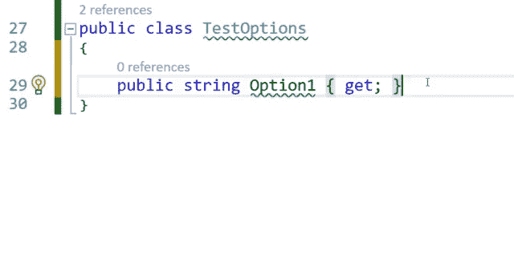

重复行

## **上下移动线条** (ALT+↑/↓)

您可以使用`**ALT+**↑`或`**ALT+**↓**.**` 在代码文件中上下移动一行，这在与“重复行**的协作中经常会很方便。**

****

**移动线条**

## ****多行编辑**(ALT+SHIFT+↑/←)**

**可以用`ALT+SHIFT+↑/↓`一次编辑多个类似的行，一个在另一个下面**

**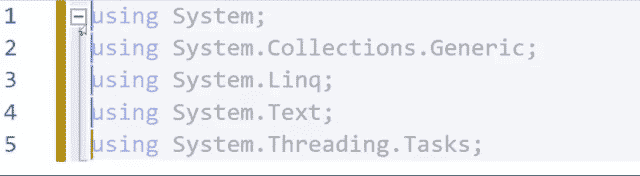**

**多行编辑**

## ****删除行** (CTRL+SHIFT+L)**

**如果想删除一整行，用 `CTRL+SHIFT+L`就可以了。然而在这种情况下，我喜欢使用像`CTRL+SHIFT+DEL`这样的自定义快捷键，因为我认为这样更容易记忆。**

**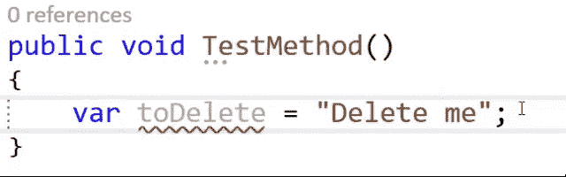**

**删除行**

## ****删除整个单词**(CTRL+Delete/CTRL+back space)**

**CTRL 键最常用于编辑整个单词。在这种情况下，我们可以使用`CTRL+DEL`或`CTRL+Backspace.`删除整个单词**

****

**删除整个单词**

## ****标记全字** (CTRL+SHIFT+ ←/ →)**

**如果你想快速标记整个单词，只需使用`CTRL+SHIFT+ ←`或`CTRL+SHIFT+ →`。如果你用的是鼠标，你也可以双击一个单词！**

**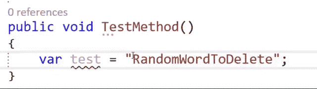**

**标记整个单词**

## ****跳到终点/起点**(终点/起点)**

**从技术上讲，这不是捷径，但我从未发现自己默认使用这一条。**

**如果您已经习惯了这一点，您可以更快地跳到一行的末尾或开头。**

****

**跳到结尾**

## ****重命名** (CTRL+R+R)**

**在我看来，最重要的捷径之一就是重命名。您可以快速重命名变量、类定义、接口以及几乎所有在您的解决方案中的每个文件中都有名称的东西！在名称上使用`CTRL+R+R`，您要更改。**

**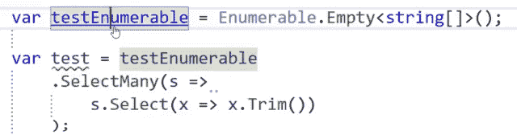**

**重新命名**

## ****重命名文件** (F2)**

**重命名文件默认设置为 **F2** 。如果您的类与文件同名，您还可以选择将您的类重命名为您的文件。**

**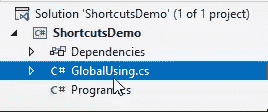**

**重命名文件**

**顺便说一下，这个快捷方式也适用于 windows 资源管理器中的文件。**

## ****注释/取消注释** (CTRL+SHIFT+#)**

**有时你想用键盘一次注释掉多行。你可以用`CTRL+SHIFT+#` 来做这个。**

**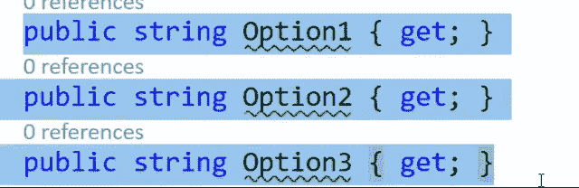**

**加注释**

## ****导航到定义或实现** (F12，CTRL+F12)**

**这也是我用的最多的快捷键之一！当您在代码中引用其他类或接口并想检查它们的定义时，只需使用 **F12** 转到定义。**

**如果使用了接口，这将导航到接口定义，否则，它将跳转到类定义。**

**如果您已经实现了一个接口，并且想要直接导航到类定义，请使用`CTRL+F12`。**

## ****调试快捷键** (F5，F11)**

**出于调试目的，用`F5`开始调试可能会派上用场。要在遇到断点后逐句通过代码，请使用`F11`。**

## ****下一个警告/错误** (F8)**

**为了获得干净的代码，听取 IDE 的警告通常是有用的。默认情况下，Visual Studio 将显示错误、警告和建议的列表。您可以使用`F8`从一个警告(或错误)跳到下一个。**

## ****左/右缩进** (TAB / SHIFT + TAB)**

**缩进是主要原因之一，在我看来，代码看起来更漂亮，可读性更好。**

**可悲的是，Visual Studio 仍然没有完美的自动缩进，这就是为什么我需要一直手动缩进像下面这样的代码。你可以用`TAB` 缩进一行，用`SHIFT+TAB`去掉一个缩进。**

**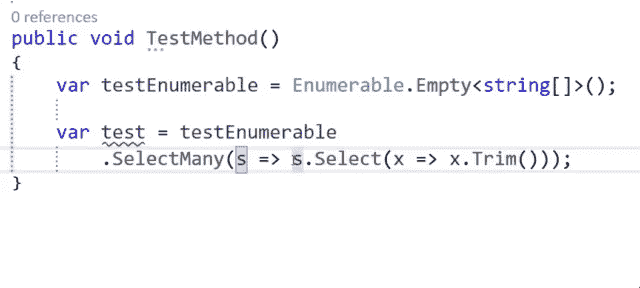**

**缩进 LINQ 表达式**

**一些好的经验法则，打破和缩进是:**

*   **左括号和右括号的缩进级别应该匹配。**
*   **在一个点之前中断。这样，您可以删除整行代码来删除代码部分。**
*   **一行代码不能超过半个屏幕。这使得阅读更容易，你可以在一个分屏中打开两个文件，而不会丢失一些代码。**
*   **每个 Lambda 函数都获得一个新的缩进级别。**

# ****快捷方式汇总****

**概观**

# **重构**

**Visual Studio (2019+)和 VSCode 都有非常强大的重构选项。您可以使用`**CTRL+ .**` 来访问它们。**

**重构选项可以大大减少添加样板代码或只是让代码更具可读性所需的时间。**

## ****添加或安装缺少的引用(仅限 VS)****

**这是重构选项之一，我大部分时间都在使用。如果你知道一个类或者接口是如何命名的，你只需要输入它，按 CTRL+就可以了。Visual Studio Intellisense 知道什么是包含定义的公共包。**

**当然，这并不适用于所有的软件包，但是对于常见的软件包，尤其是微软的软件包。**

**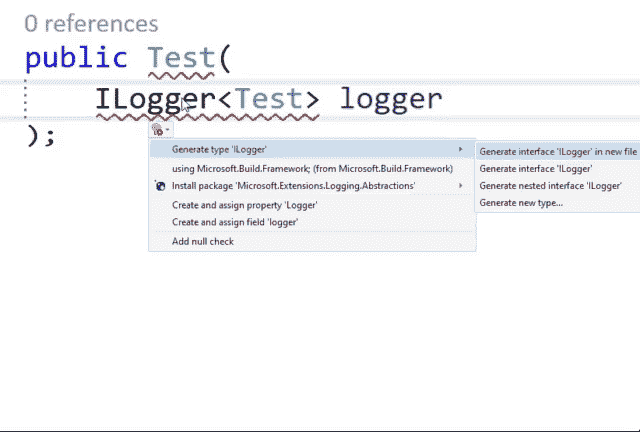**

**添加/安装缺少的引用**

**在这里，您还可以将缺少的引用添加到同一解决方案中的其他项目/命名空间。**

## ****快速生成构造函数****

**我发现有两种非常快速的方法来设置你的类的依赖关系。**

**一种是，要生成一个空的构造函数，键入您的参数，让重构选项为您创建只读字段和构造函数代码。**

**此外，您可以直接添加空支票，而无需移动光标。**

****

**生成构造函数和字段**

**另一个是我经常使用的，如果我从其他类中复制并粘贴依赖项的话。添加您的字段，让重构为您生成一个带有空检查的构造函数。**

****

**从字段生成构造函数**

## ****在同一名称空间中生成新类的快速方法****

**对于你们中的一些人来说，创建新的类可能需要几秒钟的时间。**

**一个简单的解决方案是，在现有文件中创建一个类(在相同的名称空间中),然后使用重构，将它提取到一个新文件中:**

**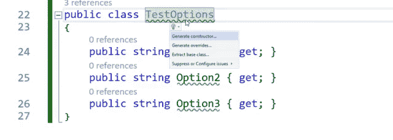**

**将类提取到新文件中**

## ****更改名称空间以匹配文件夹结构****

**有时，您可能会发现自己从其他项目或名称空间中复制类，这对于您的文件夹结构来说会有错误的名称空间。**

**在这里，您可以使用重构来调整名称空间以适应您的文件夹结构。**

**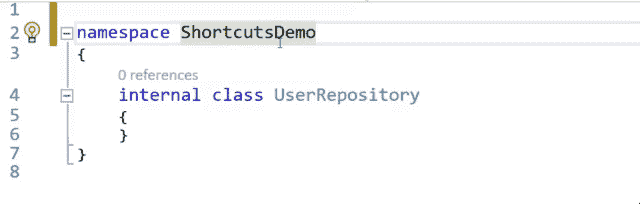**

**更改名称空间**

**一个更强大的功能是将项目中文件的所有名称空间与文件夹结构同步。**

**只需右键单击一个项目，然后单击“同步名称空间”。这将根据您的文件夹结构调整所有文件。**

**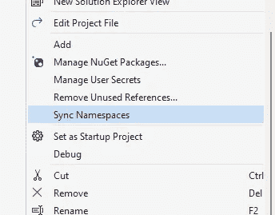**

**同步所有命名空间**

## ****门面或装饰图案****

**使用 decorator 模式可以向类中添加额外的逻辑。只需添加一个字段，包含原来的接口，重构选项可以通过现有的变量实现整个接口。**

**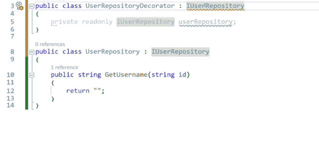**

**装饰图案**

## ****换块或表情体****

**当一个方法或属性只返回一行代码时，使用表达式体可能更好。**

**重构选项可以快速的从表达式体切换到块体以及反向。**

****

**更改为表达式正文**

## ****换行和缩进参数****

**同样，过长的行会变得难以阅读。这就是为什么长参数列表应该换行和缩进的原因。重构会帮你做到这一点。**

**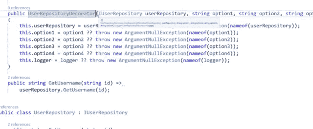**

**换行和缩进**

## ****添加参数名****

**此外，在包装和缩进之后，我个人认为在调用中添加参数名是一个好的做法。**

**特别是当你的变量命名不完美的时候，就更容易理解，函数或者构造函数需要什么。**

**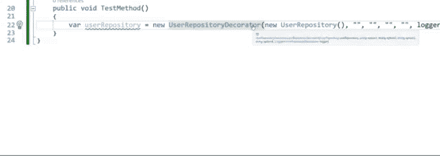**

**添加参数名称**

# **扩展ˌ扩张**

**IDE 的扩展也可以极大地提高您的工作效率。以下是我日常使用的一些扩展。**

*   **CodeMaid —我最喜欢的 Visual Studio 扩展是 CodeMaid。这个扩展可以在保存时格式化你的代码。我知道还有其他的扩展也可以做到这一点，但是我发现这个是性能最好的，几乎不需要花时间根据可定义的规则来格式化你的代码。**
*   **[Visual Studio 拼写检查器](https://marketplace.visualstudio.com/items?itemName=EWoodruff.VisualStudioSpellCheckerVS2022andLater) —这个扩展检查代码中纯文本的拼写。这通常对异常消息很有帮助。**
*   **这个扩展将为每一级缩进添加行，所以你可以很快地看到，什么还没有正确缩进。**

**感谢您花时间阅读这篇文章。我希望，你会觉得它有知识性、教育性和趣味性。
非常感谢您的支持和参与。**

**如果您有兴趣了解干净架构、干净编码和最新技术栈的最新趋势、技巧和诀窍，尤其是在 C#环境中。净和有棱角——如果你考虑跟踪我，我会很感激。**

**祝你有美好的一天！**

****

**如果你还没有每天使用媒体来增长你的知识，现在是开始的最佳时机！借助 Medium，您可以轻松获得更多关于高度专业的主题的知识，发布高质量的内容，并接触到更广泛的受众。要开始，只需使用以下链接创建一个中型帐户:**

**[*加入中现*](https://medium.com/@tobias.streng/membership)**

**通过这样做，你将获得一个强大的平台，可以帮助你联系新的作者和读者，每天学习新的东西。**