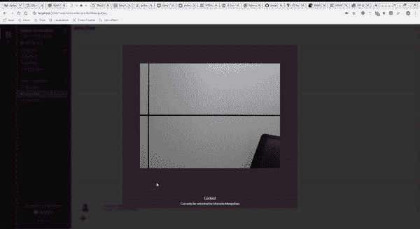
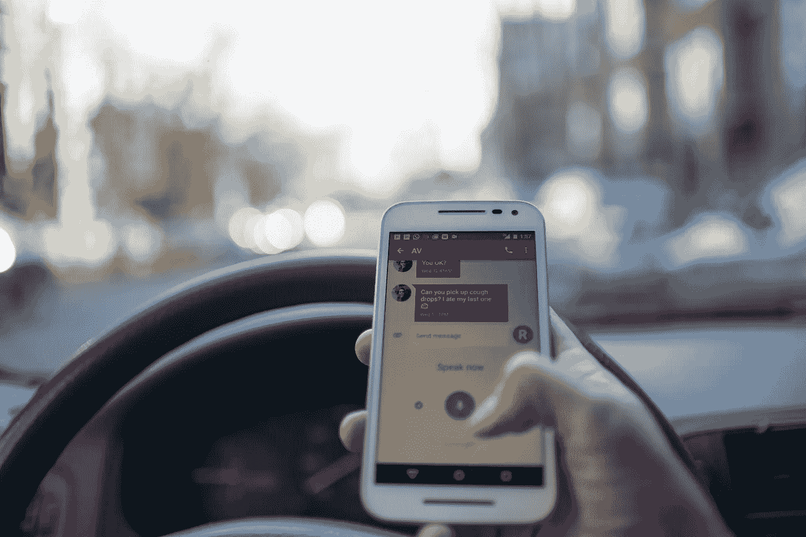
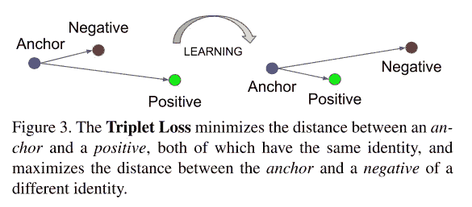
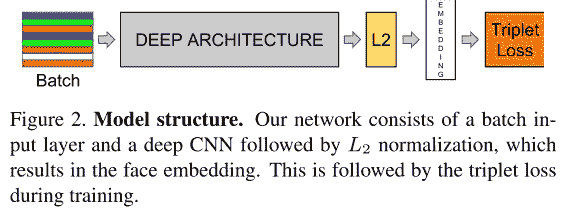
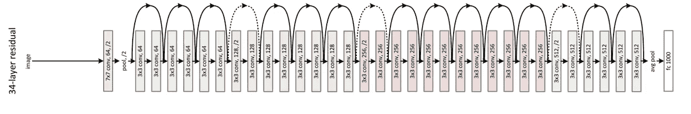
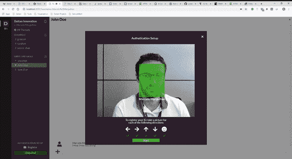

# 在浏览器上利用深度学习进行人脸识别

> 原文：<https://betterprogramming.pub/leveraging-deep-learning-on-the-browser-for-face-recognition-db4b10ad8a4d>

## 了解现代人脸识别算法是如何工作的，以及如何在 JavaScript 中使用它们

*由戴坦的创新团队*

人脸识别可能是近几十年来人们期待已久的技术之一。从好莱坞电影和电视科幻系列到实际的手机解决方案，面部似乎是完美的认证者。但是，尽管大肆宣传，这项技术看起来并没有准备好很长一段时间。

然而，机器学习的最新进展似乎值得等待。为了有个概念，让我们来看看四大科技公司在这方面都做了些什么。

[*AWS re:Invent 2017 —引入亚马逊认知*](https://www.youtube.com/watch?time_continue=3&v=D1gj_9aKRJU)

微软、亚马逊和谷歌都有现成的人脸应用解决方案。另一方面，苹果公司最近刚刚通过其新的 Face ID 技术改变了我们访问智能手机的方式。

[苹果在 iPhone X 上解释 Face ID(CNET 新闻)](https://www.youtube.com/watch?v=z-t1h0Y8vuM)

它无处不在。

面部技术现在是自动驾驶汽车承诺的核心组成部分。在这种情况下，它可以用来检测司机的注意力分散程度，从司机在路上偷看手机到在十字路口向旁边看。

来自 [Pexels](https://www.pexels.com/photo/adult-blur-bokeh-car-230557/?utm_content=attributionCopyText&utm_medium=referral&utm_source=pexels) 的 [Roman Pohorecki](https://www.pexels.com/@romanp?utm_content=attributionCopyText&utm_medium=referral&utm_source=pexels) 的照片

此外，商业支付服务正在各地涌现，其中大多数基于人脸认证系统。Apple Pay、Samsung Pay 和 MasterCard Selfie Pay 就是一些例子。

医疗保健、广告和安全等领域要么正在进行实验，要么已经为其用户部署了人脸技术。

如果你想更广泛地看看，这里有一个 2018 年十大面部识别 API 的总结。请注意，大多数这些服务提供的不仅仅是面部识别功能。例如，性别和年龄预测、情感信息和相似性分数对大多数人来说都是常见的。

在这篇文章中，我们提出了一个运行在 Skype 或 Slack 等即时通讯软件上的人脸识别系统。我们的系统被设计成使用来自原始 VGA 相机的图像来注册新人的脸。然后，我们设置了一个锁定系统，阻止非注册用户使用该应用程序，所有这些都以近乎实时的速度在浏览器上运行。

# 问题是

人脸检测和识别是计算机视觉领域的一个经典课题。使用支持向量机的[哈尔级联](https://docs.opencv.org/3.4.3/d7/d8b/tutorial_py_face_detection.html)和[特征脸等方法是这两个问题的流行解决方案。这些算法的主要问题是，它们似乎不能很好地推广到现实世界的应用。虽然他们开始显示出良好的效果，但在精确度方面，这项技术似乎还没有达到生产水平。](https://scikit-learn.org/stable/auto_examples/applications/plot_face_recognition.html)

然而，自从深度学习革命以来，事情开始发生变化。这一切都始于大型标记数据集和并行硬件的可用性。突然间，相对旧的算法(结合新技术)被用来解决许多困难的问题——更具体地说，像图像分类、对象检测和分割这样的感知问题。在很短的时间内，这些经典解决方案中的大部分对于新一代算法来说变得过时了。

与人脸相关的应用程序也是如此。现在，大多数人脸识别的解决方案都基于一个非常相似的想法:在大数据集上训练深度卷积网络。让我们进入细节。

# 用于人脸识别的深度学习

真正为现实世界应用定下基调的论文是 [FaceNet:人脸识别和聚类的统一嵌入](https://arxiv.org/abs/1503.03832)。

FaceNet 在野生(LFW)数据集上非常流行的标记人脸上取得了 99.63%的准确率。给你一些视角，这是一个**比上一个最先进的系统提高了近 30%** 的系统。

为了做到这一点，FaceNet 的作者提出了三个组件的有效组合:模型架构、目标函数和训练过程。

简而言之，FaceNet 用一个解决方案解决了三个相关的计算机视觉问题。

首先，核查问题。这里，给定两张人脸图像，目的是验证它们是否是同一个人。二、识别问题回答问题:这个人是谁？最后，聚类问题涉及在人脸集合中寻找共同人脸的问题。

核心思想是学习从图像到嵌入空间的映射。也就是说，系统将图像作为输入，并输出与面部特征相关联的向量。然后，优化这些向量，使得它们之间的距离与人脸之间的相似度成正比。换句话说，同一个人的脸的距离小，而不同的人的脸的距离大。

提高学习效率的一个关键因素是**三重损失函数**的概念。简而言之，三重态损失做两件事。

*   它最大限度地缩短了锚和正面图像之间的距离。
*   它使锚和负样本之间的距离最大化。

这里，*主播和正样都是同一个人的面孔*。也就是说，他们具有相同的身份。另一方面，负样本可以是不同人的随机面孔。此外，由于每个图像被表示为一个*高维 128 长向量*，在每次迭代中，该算法按照上述两个约束条件改变所有三个向量。

[FaceNet:人脸识别和聚类的统一嵌入](https://arxiv.org/abs/1503.03832)

下图显示了 FaceNet 模型架构。在训练期间，模型接收如上所述的一批三元组。这些三胞胎必须小心选择，以便在阳性和阴性样本之间取得平衡。卷积神经网络接收三元组并输出相应的 128 维向量。然后，它遵循 *L2 归一化*，这产生人脸嵌入向量。最后，嵌入被馈送到三重损失函数。下图描述了这条管道。

[FaceNet:人脸识别和聚类的统一嵌入](https://arxiv.org/abs/1503.03832)

使用嵌入向量表示人脸有一些优点。首先，作为卷积运算的固有特性，这些模型对于平移是不变的。在这种情况下，这意味着系统可以识别同一个人，而不管人脸在帧上的位置。

此外，他们使用一个大的标记人脸数据集来获得姿态和光照的适当不变性，这是计算机视觉应用中最具挑战性的两个问题。

# 个案研究

为了将这些想法落实到位，我们决定实施一个概念验证。想法很简单。我们构建了一个类似 Slack 的 messenger 应用程序，它使用 VGA 摄像头来跟踪谁在电脑屏幕前。如果应用程序感觉到之前注册的用户不在摄像头前，messenger 应用程序会锁定自己。相反，如果一个注册用户出现在摄像头上，应用程序就会解锁并授予他访问权限。

为了使这个演示更简单、更容易展示，我们有两个约束。首先，我们希望使用最先进的算法进行人脸检测和识别。换句话说，这意味着使用基于 ConvNet 的模型，将图像转换为嵌入向量。

其次，我们希望我们的应用程序在浏览器上以接近实时的速度运行。这意味着以接近每秒 30 帧(FPS)的速度处理帧。

经过一些基础研究，我们发现了这个名为 [face-api.js](https://github.com/justadudewhohacks/face-api.js?files=1) 的不错的 JavaScript 库。在`Tensorflow.js`、`face-api.js`之上实现的，是浏览器中人脸检测和识别的库。

简而言之，`face-api.js`为以下任务提供预训练模型:

*   人脸检测
*   人脸识别
*   人脸跟踪
*   人脸相似度
*   人脸表情识别
*   人脸标志检测

对于这个例子，我们关注前两种情况:人脸检测和识别。我们鼓励你去看看他们的 [GitHub](https://github.com/justadudewhohacks/face-api.js?files=1) 了解更多细节。

对于人脸识别，他们训练了一个类似 *ResNet-34-* 的架构来计算 *128 维向量描述符*。如上所述，该模型接收人脸图像并输出表征人脸的向量。一旦我们有了两张脸的矢量描述符，我们就可以通过计算它们之间的*欧几里德距离*来衡量它们有多相似。

改编自:[用于图像识别的深度残差学习](https://arxiv.org/abs/1512.03385)

该模型在人脸识别的 *LFW 基准*上取得了 99.38% 的*预测准确率，接近于原 FaceNet 实现的 99.63%的准确率。API 还提供模型的*量化*版本。这些都是专门针对计算能力匮乏的场景。对于人脸识别，量化后的 ResNet-34 模型大致为 6.2 MB。*

现在，让我们开始我们的演示。

# 示范

我们需要做的第一件事是在 messenger 应用程序中注册一个用户。为此，我们构建了一个用户友好的注册界面。在这里，用户需要遵循一个简单的程序。基本上，我们的注册界面会为用户拍摄多张照片，每张照片对应一个特定的面部方向。这一步是提高模型准确性所必需的。这个想法是，不同的面部方向可以产生稍微不同的表示，这反过来又产生用户身份的更好的整体表示。

注册后，我们在摄像头视频上输出一个视觉提示，以及注册用户的姓名。此时，应用程序发现的任何其他人脸都被归类为“*未知”。*”

我们假设，即使屏幕上出现了其他人脸，我们仍然应该保持屏幕解锁。可能会有任何窥探触发屏幕锁定的情况，但我们认为这不会是最常见的情况。

每当这个人离开视频源，锁定状态就开始改变。然后，如果用户离开超过三秒钟，屏幕就会被锁定。

在这种情况下，其他用户无法解锁应用程序。只有注册用户才能这样做。我们可以在下面的 GIF 上看到。解锁过程只有在原始用户返回并出现在摄像机画面上时才开始。

这个功能非常简单，但是正如我们所解释的，实际上在幕后有很多事情要做！

# 关键要点

人脸识别是一项新兴技术。最近，机器学习的进步提高了这一领域的算法性能。因此，人脸识别应用越来越多地出现在生产级解决方案中。

正如我们所见， *face.api* 提供了一个非常好的起点。然而，如果我们想要部署一个可伸缩的解决方案，我们不仅应该考虑改进安全性方面，还应该考虑改进基于特定用例的模型。这可能包括使用更具代表性的数据集重新训练神经网络，甚至包括来自外部传感器的不同特征，如深度信息。

请注意，在本演示中，我们没有解决演示攻击或欺骗的问题。当然，为了处理这个问题，我们需要一个模型来区分这些情况。这个作品，由[布雷桑等人](https://arxiv.org/abs/1902.02845)完成。例如，使用深度、显著性和光照图等特征来区分视频帧中的攻击和非攻击。

*感谢埃韦尔顿·梅内塞斯在本次概念验证中对 UX/UI 的建议。*