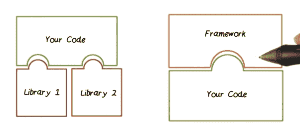
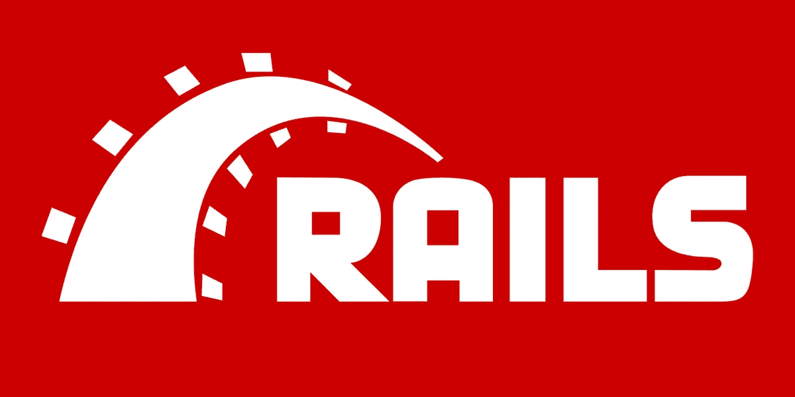
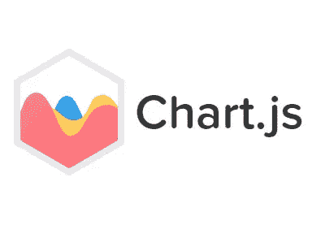
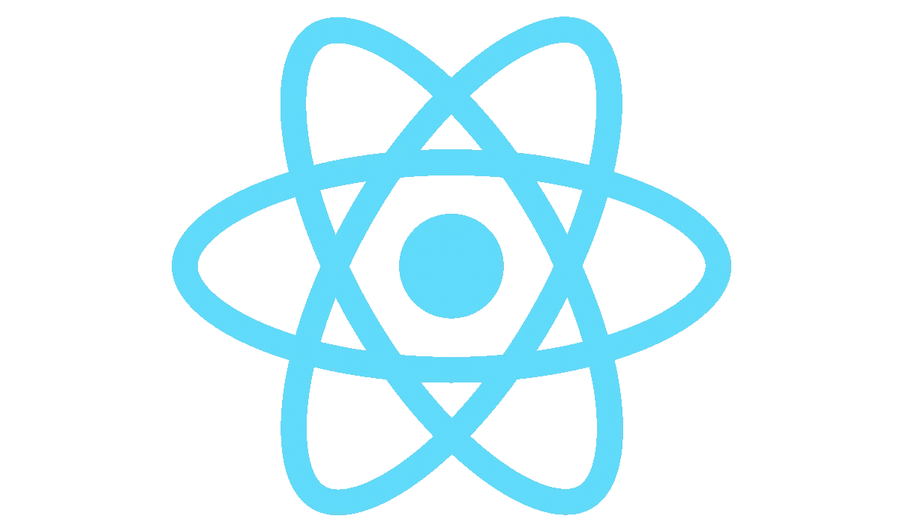
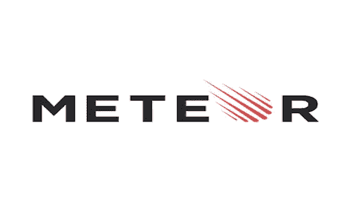
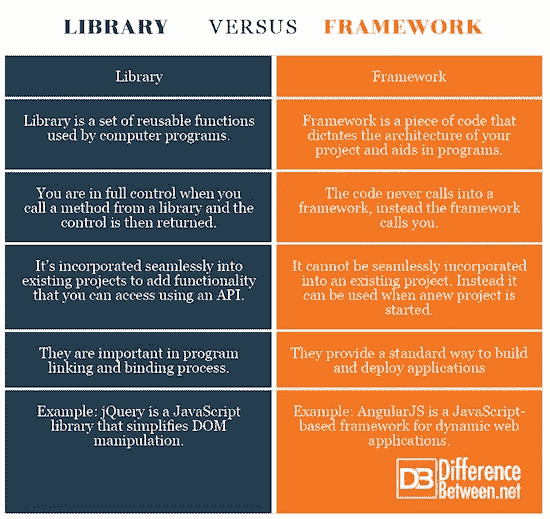

# 库与框架——有什么区别？

> 原文：<https://betterprogramming.pub/libraries-vs-frameworks-whats-the-difference-5f28c53dcffe>

## React 属于哪一类？

照片由[戴恩·托普金](https://unsplash.com/@dtopkin1?utm_source=unsplash&utm_medium=referral&utm_content=creditCopyText)在 [Unsplash](https://unsplash.com/s/photos/framework?utm_source=unsplash&utm_medium=referral&utm_content=creditCopyText) 上拍摄

当我潜伏在我所有的各种社交平台上时，我经常看到人们讨论 React。一些开发人员称之为框架，而其他人则称之为库。虽然一些新开发人员可以互换使用术语库和框架，但它们是非常不同的。

在这里，我将解释框架和库之间的主要区别，React 属于哪一类，以及为什么会有关于 React 的争论。

然而，在此之前，我们应该快速地看一下这两者的定义。

# 库与框架

代码库的[维基百科](https://en.wikipedia.org/wiki/Library_(computing))页面将其定义为:

> 在计算机科学中，库是计算机程序使用的非易失性资源的集合，通常用于软件开发。这些可能包括配置数据、文档、帮助数据、消息模板、预写代码和子例程、类、值或类型规范。”

与[框架的定义](https://en.wikipedia.org/wiki/Software_framework)相比:

> 在计算机编程中，软件框架是一种抽象，其中提供通用功能的软件可以被附加的用户编写的代码选择性地改变，从而提供专用软件。
> 
> 它提供了一种构建和部署应用程序的标准方法，是一种通用的、可重用的软件环境，提供特定的功能作为更大软件平台的一部分，以促进软件应用程序、产品和解决方案的开发。"

有很多东西需要解开，但是如果你使用过这两者，你可能已经看到，一般来说，代码库是用来解决一个特定的问题或者给你的程序增加一个特定的特性。

另一方面，框架为你提供了更加通用和可重用的东西。如果你继续阅读维基百科条目，你会注意到框架和库有三个不同之处。

## 控制反转

库插入到你的代码中，你的代码插入到框架中。

框架和库的第一个主要区别是谁在控制开发过程。

有了代码库，开发人员通常会在他们觉得合适的时候调用这个库。一个框架通常要求开发人员完全沉浸在它的工作流程中。

因此，人们经常感觉好像是框架在控制开发过程，而不是开发人员。这是控制反转！这通常被简化为以下内容的某种变体:

*   图书馆:打电话给我们来完成这项工作。
*   框架:你不叫我们，我们叫你。

正是因为这种控制的反转，框架更加固执己见，这也是为什么它们能够为开发人员做这么多事情。

对于那些想知道的人来说，固执己见意味着框架在如何编写代码、文件的位置，甚至可能是所述文件的名称方面做出了很多决定。

做出这些假设允许使用[约定优于配置](https://en.wikipedia.org/wiki/Convention_over_configuration)的范例，这允许开发者跳过应用配置的过程，以换取遵循某些约定(例如将某些文件放在某些文件夹中，等等)。).

Ruby on Rails 是开发 web 应用程序的流行框架。

看看 Ruby on Rails 这样的框架。它通常被认为是非常固执己见的。当您使用 Ruby on Rails 创建一个新项目时，它会生成许多包含大量预写代码的文件夹和文件。

开发人员的大部分工作可能会在 app 文件夹中完成(这是模型、视图、控制器子文件夹的位置)，但 Rails 项目中还有大量其他代码，旨在让您的应用程序运行起来。

此外，Ruby on Rails 有一个特定的工作流程，它希望您遵循。当您在 Rails 中创建一个`User`模型时，它假设它被绑定到一个`UsersController`。

Rails 希望这些文件以某种方式命名(模型用`user.rb`命名，控制器用`users_controller.rb`命名)，并希望它们位于各自的文件夹中。

偏离 Rails 的工作流程会让你对代码如何以及为什么不能工作感到沮丧。用它工作，一切似乎都神奇地工作。

这种魔力的很大一部分(有些人称之为 Rails 魔力)只是所有预先编写的代码在后台工作。您可以填充模型、视图、控制器，并绘制一些路线，Rails 会负责将所有东西正确地连接起来。

ChartJS 可以让你制作一些非常漂亮的图表。

相比之下， [Chart.js](https://www.chartjs.org/) 是一个 JavaScript 库，用于创建非常漂亮的图表。

您可以选择何时何地调用 Chart.js，并且在制作新图表时确实需要填写字段(您会希望指定图表的类型、标签、颜色等。)它不控制你的工作流程。

Chart.js 只关心绘制图表所必需的信息；它可能不太关心你的代码的其余部分。

## 展开性

面向对象编程中的一个重要概念是[开闭原则](https://en.wikipedia.org/wiki/Open%E2%80%93closed_principle)。开闭原则指出，代码的行为应该可以被改变/扩展，而不必直接改变。

一个简单的例子是类中的继承，它允许子类添加必要的功能和特性，而不需要直接改变父类中的代码。

扩展性允许开发人员在不修改源代码的情况下，向框架中添加新功能或定制现有功能的行为，以满足他们的需求。

好的框架是在考虑可扩展性的情况下构建的。它们提供了开发通用应用程序所需的通用功能，但对特定应用程序所需的特定添加和更改保持开放。

如果一个框架不是可扩展的，它的功能将会非常有限，这将会降低学习的吸引力。

与上面的例子一样，Ruby on Rails 框架有几个扩展来添加额外的特性，比如用户认证。

如果 Rails 缺少这些扩展，将会严重阻碍您使用它所能做的事情。平心而论，Chart.js 也有很多[插件和扩展](https://www.chartjs.org/docs/2.7.2/notes/extensions.html)。这些允许像绘制其他类型的图表。

然而，这里的区别就不那么明显了，因为框架提供了一般的功能，所以在构建它们时应该考虑到可扩展性，这样才能实现特定于应用程序的特性。

构建库时不一定要考虑可扩展性，它的主要目的是完成特定的任务。

## 不可修改的代码

幸运的是，这个概念更容易解释，也更简单。简单明了的答案是，框架会生成一堆代码，而且在大多数情况下，你不会接触到这些代码。

回到 Rails，如前所述，一般来说，开发人员将大部分时间花在 app 文件夹上。开发人员通常不会更改或删除预先编写的代码。

请记住，构建框架的目的是让它们在不修改源代码的情况下可扩展。

# 反应呢？

React 库用于构建用户界面。

据 [React 网站](https://reactjs.org/)介绍，它是*一个用于构建用户界面*的 JavaScript 库。

这回答了我们的问题，但是为什么呢？此外，如果它如此简单，那么为什么我们仍然看到许多人把它称为一个框架？让我们看看上面的一切。

我想大多数人都会同意 React 当然有很多扩展和插件。作为最受欢迎的 JavaScript 库之一，它有很多支持。

此外，我认为可以肯定地说，一般来说，开发人员并没有直接修改源代码，而是在扩展功能。

所有这些都符合框架的运行方式，那么有什么不同呢？

React，正如网站提到的，是用来构建用户界面的。除此之外，它没有太多的功能。它有一些抽象，因为它抽象了视图组件，但仅此而已。

它有点固执己见，例如它的用法 JSX，但远远没有接近像 Rails 这样的东西。与 Rails 不同，它在很大程度上规定了整个应用程序的开发过程，React 只关注应用程序的一个非常具体的部分。

最后一部分对一些人来说可能听起来很奇怪。与另一个库相比，许多人确实将使用 React 的应用程序称为“React 应用程序”。这就把我们带到了问题的关键，那就是人们使用“反应”这个词不仅仅是指图书馆。

# 什么是和不是反应？

Meteor 是一个流行的 JavaScript 框架，与 React 一起使用。

Vanilla React 本身就像其他库一样被引入到 JavaScript 项目中。

然而，我们大多数人并没有单独使用 React，而是将其作为某种框架的一部分，如 [Meteor](https://www.meteor.com/) 或 [create-react-app](https://github.com/facebook/create-react-app) 。这些工具包括为开发者预先配置的 [webpack](https://webpack.js.org/) 和 [Babel](https://babeljs.io/) 等工具。

对于许多开发人员来说，React 不再仅仅意味着单个库，而是整个开发生态系统。对某些人来说，React 和 create-react-app 是可以互换的。

其他人可能会在他们的 React 含义中包含像 Redux 或 MobX 这样的状态管理器。也许你会把反应和通量联系在一起。

React 自问世以来已经走过了漫长的道路。由于 React 的快速发展和支持，今天开发人员使用 React 的意义已经远远超过了单个库。

这导致许多人混淆了 React 是整个框架，而不仅仅是它的一个部分。许多新开发人员不仅将 React 作为一个独立的库来使用，还将其作为某个框架的一部分来使用，这一事实进一步加剧了这个问题。

快速 TL；dr 适用于喜欢图表形式信息的个人。有一个漂亮的小图表，可以用来快速区分一个库和一个框架。

从 DifferenceBetween.net 看图书馆与框架