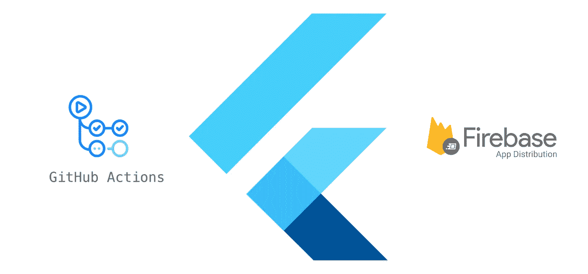
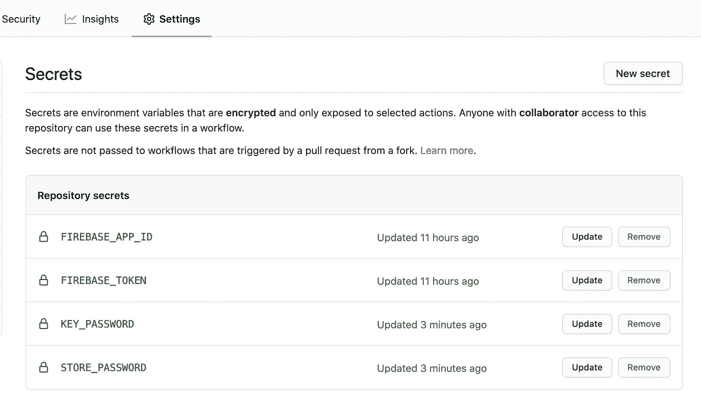

# 用 GitHub 动作实现颤振项目的生命周期自动化

> 原文：<https://betterprogramming.pub/lifecycle-automation-of-a-flutter-project-with-github-actions-e26b8f106467>



在本文中，我将向您展示我如何使用 [GitHub Actions](https://github.com/features/actions) 来自动构建和发布一个 Flutter 应用程序。

首先，我想解释一下 GitHub Actions 是什么。基本上是 GitHub 的一个 CI/CD 工具。它允许我们在 GitHub 中轻松地构建、测试和部署我们的代码。我们的工作流利用称为*动作、*的可重用单元，这些动作由 GitHub 自己或第三方开发，用于执行工作流中的特定任务。因此，我们的工作流程由一系列这些操作组成。

让我们跳到我们需要做什么来自动化我们的 Flutter 项目的生命周期。GitHub Actions 需要一个 YAML 文件来指定与工作流相关的一切。因此，首先，我们在项目下的`.github/workflows`目录中创建一个`xxx.yml`文件。在这里，`xxx`可以是我们想要的任何东西。

我们将在该文件中指定的第一件事是我们工作流的名称:

```
**name:** app workflow
```

之后，我们需要指定在什么情况下应该触发这个工作流。可以按如下方式完成:

```
**on:
  push:
    branches:** - develop
      - master
  **pull_request:
    branches:** - develop
```

在这个例子中，我们希望当对`develop`或`master`分支进行代码推送时，以及对`develop`分支进行拉取请求时，触发我们的工作流。

现在是时候定义我们的工作了。作业基本上指定了一系列操作步骤以及这些操作在哪里运行。一个工作流可能包含多个作业，但是对于我们这个简单的例子，我们只有一个作业:

```
**jobs:
  build_and_deploy:
    runs-on:** ubuntu-latest **steps:** ...
```

对于我们名为`build_and_deploy`的作业，我们首先指定这个作业应该在哪个机器上运行。这里我们用的是最新稳定版的 Ubuntu 机器。

现在让我们在我们工作的`steps`下面列出一个完整的 CI/CD 流程所需的行动。首先，我们需要在设备上准备环境:

```
**steps:
  - uses:** actions/checkout@v2
  **- uses:** actions/setup-java@v1
    **with:
      java-version:** 1.8 **- name:** Install NDK
    **run:** echo "y" | sudo /usr/local/lib/android/sdk/tools/bin/sdkmanager --install "ndk;20.0.5594570" --sdk_root=${ANDROID_SDK_ROOT} **- name:** Set up Flutter environment
 **uses:** subosito/flutter-action@v1.3.2
    **with:
      channel:** stable ...
```

我想一步一步来:

1.  检查我们的存储库，并通过接下来的操作使它准备好在机器中使用。
2.  用 Java 版本 8 设置 Java 环境。
3.  由于我遇到了与找不到所需的 Android NDK 版本相关的错误，我添加了名为“安装 NDK”的步骤，该步骤安装错误日志中指定的所需版本。您可能根本不需要这一步。所以自己试试，如果是这样的话，可以简单的去掉。
4.  用最新的稳定版本设置 Flutter 环境。此步骤使用由第三方开发的操作。阅读更多[此处](https://github.com/subosito/flutter-action)了解详情。

如果我们重新检查上面给出的初始步骤，我们只为其中一些步骤设置`name`。如果某个步骤/行动对我们来说不够清楚，我们可以提供一个名称来清楚地解释该步骤的目的。

环境设置现在已经完成。在步骤 4 中，我们在设备上安装了`flutter`工具。现在，我们可以使用颤振命令来构建 APK:

```
 ** - run:** flutter pub get
 ** - run:** flutter test
 **- run:** flutter build apk --release --build-number=${GITHUB_RUN_NUMBER}
  **  env:**
   **   KEY_PASSWORD:** ${{ secrets.KEY_PASSWORD }}
     ** STORE_PASSWORD:** ${{ secrets.STORE_PASSWORD }}
  ...
```

在这里，我们首先安装软件包依赖项。然后，我们运行测试(如果有的话)。最后，我们构建一个发布版 APK，编译号设置为`GITHBU_RUN_NUMBER`，这是 GitHub 提供的一个环境变量。GitHub 将其定义为:“存储库中特定工作流每次运行的唯一编号。对于工作流的第一次运行，该数字从 1 开始，并随着每次新的运行而递增。如果您重新运行工作流，该数字不会改变。

此外，我们需要提供另外两个环境变量，`KEY_PASSWORD`和`STORE_PASSWORD`，在签署 APK 时使用。更具体地说，它们在 Android 端的`app/build.gradle`文件中使用如下:

```
...
**signingConfigs** {
  **release** {
    **storeFile** file("../keystore.jks")
    **storePassword** = "$System.env.STORE_PASSWORD"
    **keyAlias** = "myapp"
    **keyPassword** = "$System.env.KEY_PASSWORD"
  }
}**buildTypes** {
    **release** {
        **signingConfig** signingConfigs.release
    }
}...
```

这两个变量都应该作为秘密添加到我们的 GitHub 库的“设置/秘密”页面下。这些秘密(环境变量)在运行时会自动传递给我们的工作流。

在这些步骤之后，我们应该有了一个发布 APK，可以使用下面的文件路径进行部署:`build/app/outputs/apk/release/app-release.apk`。我们将这个文件部署到 Firebase，并使用它的应用程序分发服务，将它分发给我们的测试人员。为此，我们还剩下最后一步:

```
 **- name:** Upload artifact to Firebase App Distribution
 **uses**: wzieba/Firebase-Distribution-Github-Action@v1.2.2
 **with:**
    **  appId:** ${{ secrets.FIREBASE_APP_ID }}
 **token:** ${{ secrets.FIREBASE_TOKEN }}
  **    groups:** testers
  **file:** build/app/outputs/apk/release/app-release.apk
```

这里，我们再次使用第三方操作，这次是为了 Firebase 应用程序分发。行动详情可在[这里](https://github.com/wzieba/Firebase-Distribution-Github-Action)找到。基本上，要使这个操作成功运行，我们需要提供几个输入:

1.  `**appId**` 可以在 Firebase 仪表盘的项目设置页面的“你的应用”部分下找到。
2.  `**token**` 可以在本地机器上使用以下命令生成:`firebase login:ci`。然而，首先我们需要在我们的机器上安装 Firebase CLI。见[此处](https://firebase.google.com/docs/cli)。
3.  `**groups**`是我们在 Firebase App Distribution 上创建并希望将我们的应用分发到的测试人员组的名称。
4.  `**file**`是我们的 APK 被分发的路径。

与我们在上面构建应用程序时看到的类似，`FIREBASE_APP_ID`和`FIREBASE_TOKEN`也需要设置为存储库机密，因为它们被这个动作使用。所以我们的秘密页面最后看起来像这样:



GitHub 上我们知识库的秘密页面

为了使文章简短，我没有深入讨论 Firebase 应用程序分发的细节，但它基本上是 Firebase 的另一项服务，允许我们轻松地向测试组分发我们应用程序的预发布版本，并通过电子邮件通知他们。如果你想了解更多，请点击阅读更多[。](https://firebase.google.com/docs/app-distribution)

# 完整的 YAML

最后，我想提供完整的 YAML 文件，看看所有的位在一起:

```
**name:** app workflow**on:
  push:
    branches:** - develop
      - master
  **pull_request:
    branches:** - develop**jobs:
  build_and_deploy:
    runs-on:** ubuntu-latest **steps:
    - uses:** actions/checkout@v2
    **- uses:** actions/setup-java@v1
      **with:
        java-version:** 1.8 **- name:** Install NDK
      **run:** echo "y" | sudo /usr/local/lib/android/sdk/tools/bin/sdkmanager --install "ndk;20.0.5594570" --sdk_root=${ANDROID_SDK_ROOT} **- name:** Set up Flutter environment
 **uses:** subosito/flutter-action@v1.3.2
      **with:
        channel:** stable **- run:** flutter pub get
   ** - run:** flutter test
 **- run:** flutter build apk --release --build-number=${GITHUB_RUN_NUMBER}
  **    env:**
   **     KEY_PASSWORD:** ${{ secrets.KEY_PASSWORD }}
        **STORE_PASSWORD:** ${{ secrets.STORE_PASSWORD }} **- name:** Upload artifact to Firebase App Distribution
 **uses**: wzieba/Firebase-Distribution-Github-Action@v1.2.2
 **with:**
    **    appId:** ${{ secrets.FIREBASE_APP_ID }}
 **token:** ${{ secrets.FIREBASE_TOKEN }}
  **      groups:** testers
  **file:** build/app/outputs/apk/release/app-release.apk
```

这个特殊的例子只是为了构建和分发一个 APK。通过更改几个部分，我们也可以轻松地为 iOS 版本创建工作流。

如果你使用 GitHub 作为代码库，我强烈建议你尝试一下 GitHub Actions 作为你的 CI/CD 工具。它有一个不断增长的行动市场，其中许多是由社区开发的。

下次再见吧！