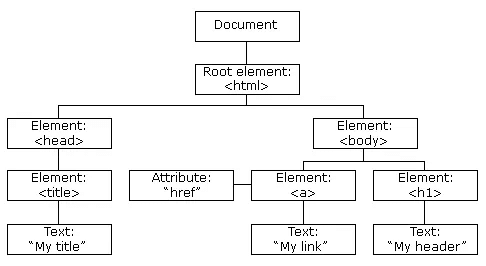
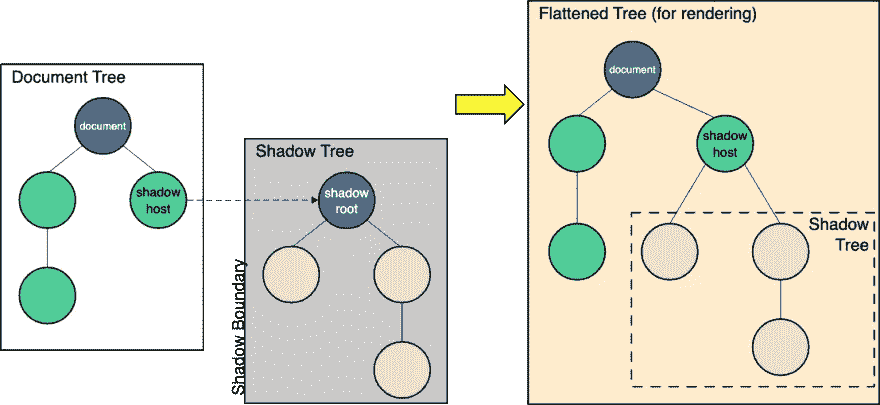

# Salesforce 中的 Light DOM 和 Lightning Web 组件

> 原文：<https://betterprogramming.pub/light-dom-and-lightning-web-components-in-salesforce-ce03b2103c7c>

这些奇妙功能的简要指南


马克斯·萨林在 [Unsplash](https://unsplash.com?utm_source=medium&utm_medium=referral) 上的照片

来自 Salesforce 的 [Lightning Web 组件](https://lwc.dev/) (LWC)基于使用 HTML 和 JavaScript 构建的标准 [Web 组件](https://developer.mozilla.org/en-US/docs/Web/Web_Components)。它们是轻量级的，易于构建，并且在现代浏览器中运行良好。当构建 LWC 时，您将熟悉[组合](https://developer.salesforce.com/docs/component-library/documentation/en/lwc/lwc.create_components_compose_intro)的概念，它允许您在更复杂的组件主体内拼凑简单的构建块组件。

关于组合，LWC 利用了[影子文档对象模型](https://developer.mozilla.org/en-US/docs/Web/Web_Components/Using_shadow_DOM) (DOM) web 标准，该标准封装了 web 组件的内部结构，使得组件外部的代码和组件无法访问它。这种方法的替代方法是 [Light DOM](https://developer.salesforce.com/docs/component-library/documentation/en/lwc/lwc.create_light_dom) ，Salesforce 在测试版中提供了这种方法。

在本文中，我们将探讨 Salesforce 开发中的轻型 DOM 概念。我们将从 DOM 概念的概述开始，然后是阴影 DOM 和光 DOM 之间的区别。最后，我们将看看这在 LWC 是如何进行的，以及如何在 LWC 实现 Light DOM。

# 什么是 DOM？

根据 [MDN](https://developer.mozilla.org/en-US/docs/Web/API/Document_Object_Model/Introduction) 的定义，DOM 是*“组成 web 上文档的结构和内容的对象的数据表示*”这意味着:DOM 提供了一种在树状结构中将网页表示为节点和对象的方法。这使得开发人员更容易根据需要操作和构建任何逻辑。



[图像来源](https://www.w3schools.com/whatis/whatis_htmldom.asp)

值得注意的是，DOM 独立于任何编程语言。使用任何语言或框架构建的 web 应用程序通常会以某种方式提供对 DOM 及其组件的访问。

# 影子王国

也许您遇到过“影子 DOM”，它是 DOM 的一个扩展，允许隐藏的 DOM 树作为元素附加到常规 DOM 树中。MDN 使用这个图形来表示阴影 DOM:



[图片来源](https://developer.mozilla.org/en-US/docs/Web/Web_Components/Using_shadow_DOM)

影子 DOM 旨在为 DOM 中的单个组件提供封装，保持该组件的标记结构、样式和行为是隐藏的，并与页面上的其他代码分开。开发人员可以将该组件作为一个完整的 DOM 树(“影子树”)来共享，确保没有外部代码可以操纵该树。这有助于保持代码的良好分离，避免冲突。

# 光明世界对阴影世界

术语“光 DOM”只是普通或常规 DOM 的另一个名称，以区别于阴影 DOM。“阴影边界”将光域和阴影域分开。LWC，就像任何 Web 组件一样，在每个组件上强制执行[影子 DOM](https://developer.salesforce.com/docs/component-library/documentation/en/lwc/lwc.create_dom) 。通过使用 [Light DOM](https://developer.salesforce.com/docs/component-library/documentation/en/lwc/lwc.create_light_dom) 方法，该方法目前是 beta 服务中的一项功能，通常仅适用于 Salesforce Experience Builder 站点，组件被附加到主机元素而不是其影像树。

让我们更详细地看看这意味着什么。

# LWC 的影子王国

因为阴影 DOM web 标准并未在 Salesforce 支持的所有浏览器中实现，所以 LWC 使用了一个名为合成阴影 DOM 的阴影 DOM 聚合填充。以下标记显示了一个影像树结构示例:

```
<c-my-app>
  #shadow-root
    <div>
        <p>My Tasks</p>
    </div>
    <c-my-item>
      #shadow-root
        <div>
            <p>Item 1</p>
        </div>
    </c-my-item>
</c-my-app>
```

影子 DOM 阻止我们通过使用对`document`或`document.body`的引用来提取 DOM 元素。相反，LWC 组件需要通过使用`this.template.querySelector()`来访问树。

CSS 也受到影子 DOM 封装的影响。组件外部的样式只能影响组件的顶层，而不能影响父级、子级或同级 CSS。

LWC 架构利用 Lightning Locker 服务来实施 DOM 访问控制。组件通过使用名称空间相互隔离，每个组件只能遍历其 DOM 并访问同一名称空间中的元素。这是一个重大的(尽管是有意的)限制，使得组件无法被编程代码访问。这种方法可以防止脚本注入和样式泄漏。轻量级 DOM 允许开发人员规避这种安全限制。

# LWC 的光明王国

为了解除影子 DOM 带来的 DOM 访问限制，Salesforce 在 LWC 引入了使用光 DOM 的概念。尽管该特性目前还处于测试阶段，但它是 for DOM 操作的发展方向。

想法是这样的:因为 LWC 驻留在影子 DOM 之外，所以影子 DOM 的任何限制都不适用于该组件。

下面是阴影和光照对 LWC 影响的简单比较。

亮 DOM 与阴影 DOM 的特征

*   带有主样式表的全局 CSS 主题。
*   全力支持与不支持。
*   CSS 是在组件级别定义的，不会级联。

第三方工具

*   对 DOM 遍历的完全支持和有限支持，因为第三方工具只能访问它们的父组件。
*   编程 DOM 访问。
*   不受名称空间限制与受名称空间限制。
*   便携性。便携式，但会导致重大变化，而便携式则具有安全访问功能。
*   高度可定制的用户界面。合适与不合适

# LWC 的光 DOM:一个例子

让我们看一个简单的例子，看看 Light DOM 如何与 LWC 组件一起工作。这个简单的 MyApp LWC 模板指令默认使用影子 DOM。

```
<template>
    <my-header>
        <p>My Tasks</p>
    </my-header>
</template>
```

要启用 light DOM，我们需要如下设置`renderMode`属性:

```
import { LightningElement } from 'lwc';export default class MyApp extends LightningElement {
    static renderMode = 'light';
}
```

接下来，我们更改模板指令，使用光线 DOM 代替阴影 DOM:

```
<template lwc:render-mode='light'>
    <my-header>
        <p>My Tasks</p>
    </my-header>
</template>
```

# 在 LWC 使用 Light DOM 访问元素

可以使用`document.querySelector()`方法在 Light DOM 中访问元素。这是开发人员根据需要访问和操作元素的一种强大方式。

在 Light DOM 中，我们会使用`this.querySelector`。在 Shadow DOM 中，我们需要使用`this.template.QuerySelector`。

# 在 LWC 使用光 DOM 的事件传播

关于事件传播，Light DOM 对开发人员来说是一个很大的提升。阴影 DOM 重定向任何跨越阴影边界的事件。在 Light DOM 中没有这样的事件重定向，开发人员很容易识别触发事件的确切 UI 元素，而不是获得对底层组件的引用。

# 在 LWC 使用 Light DOM 的指南

Salesforce 为使用 Light DOM 的开发者提供了指南和限制，你可以在这里找到。

# 结论

LWC 为制作复杂的 web 组件提供了一种简单而强大的方法。到目前为止，虽然 Salesforce 已经使用了 LWC 的影子 DOM 标准进行封装和安全访问，但是开发人员可能会遇到许多适合使用轻量 DOM 方法的场景。有了现在测试版中提供的 Light DOM，Salesforce 开发人员可以基于他们的用例为自己选择。