# Lighthouse:网页性能和优化工具

> 原文：<https://betterprogramming.pub/lighthouse-a-performance-and-optimization-tool-for-webpages-e0b4eeaef3e4>

## 提高网页质量的有用工具

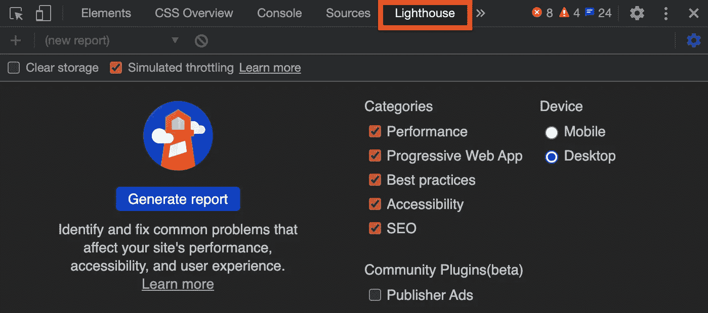

图片来源:作者截图

当打开 [Chrome DevTools](https://developers.google.com/web/tools/chrome-devtools) 时，你会看到上图中这个高亮的标签。这是什么？它是[灯塔](https://github.com/GoogleChrome/lighthouse)，一个用于提高网页质量的开源自动化工具。

默认情况下，它衡量性能、渐进式 web 应用程序、最佳实践、可访问性和搜索引擎优化(SEO)，尽管您可以通过检查和取消检查类别中的项目来适应您的需求。

对于我们的使用案例，我们选择了桌面设备类型。

左上角还有“清除存储”按钮。一直隐藏的很好，但是我们发现右上角有设置按钮可以取消隐藏。它已被取消检查。否则，它将测试带有要清除的用户信息的登录页面。

Lighthouse 易于使用，并且它产生相当精确的测量数据。按照报告卡中的建议，我们可以改进网页的性能、可访问性和其他方面。对于 web 开发人员来说，这是一个非常值得推荐的工具。

# 衡量一个网站

让我们用灯塔来测量一下[灯塔网站](https://developers.google.com/web/tools/lighthouse):

点击“生成报告”按钮后，它会为所选网页生成以下报告卡:

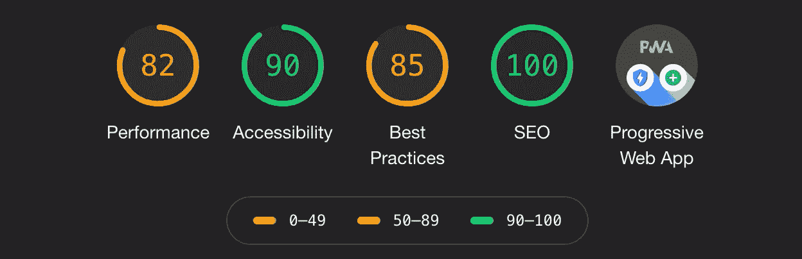

分数根据这些范围进行着色:

*   0 - 49 岁(红色):差
*   50 - 89(橙色):需要改进
*   90 - 100(绿色):好

为了提供良好的用户体验，网站应该努力达到 90 分以上。

我们浏览每一部分，看看如何解释这些分数。

## 绩效得分

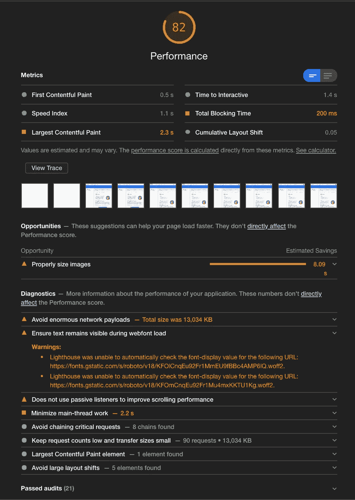

以上是绩效记分卡，由六个指标组成:

*   第一次内容丰富的绘画:它标志着第一个文本或图像被绘制的时间。
*   速度指数:它显示了一个页面的内容被可视化填充的速度。
*   最大内容绘画:它标记最大文本或图像被绘画的时间。
*   交互时间:这是页面完全交互所需的时间。
*   总阻塞时间:它是从第一次有内容的绘画到交互之间的所有时间段的总和。
*   累积布局移动:它测量视口内可见元素的移动。

在 Metrics 部分下，有许多快照显示该网页是如何加载的。单击查看跟踪按钮将转到跟踪加载详细信息的性能选项卡:

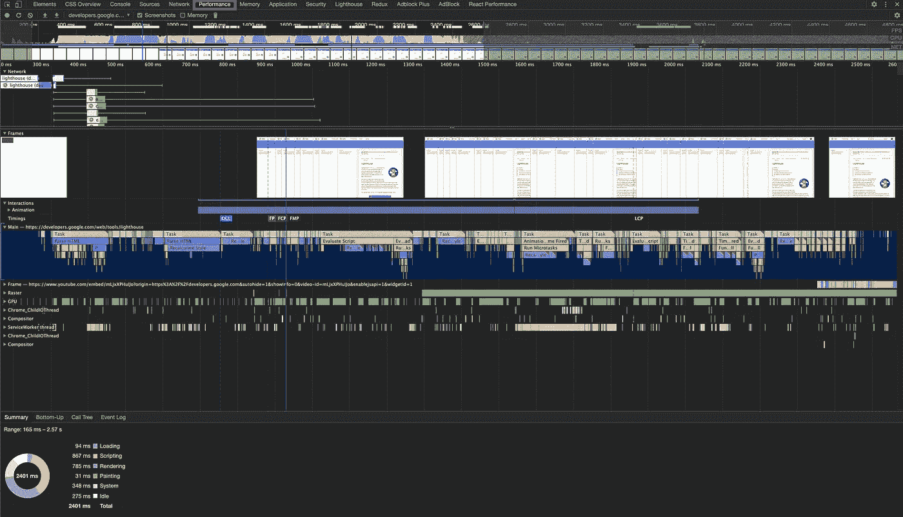

上表包含了丰富的信息。例如，如果我们去最大的内容丰富的油漆区，我们可以放大，找出动画加载时间。

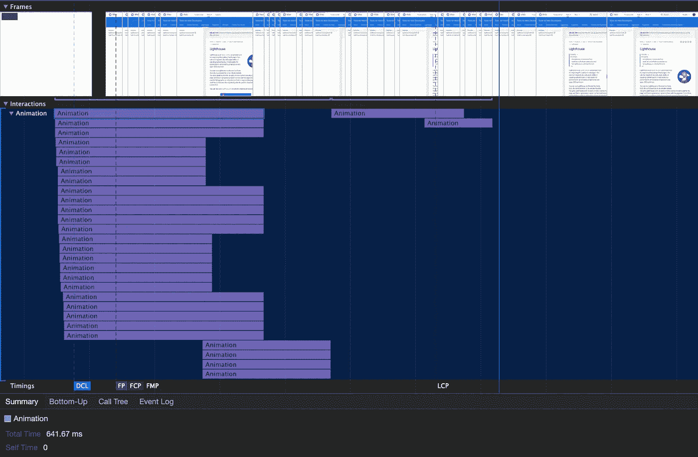

记分卡中的“机会”是帮助页面更快加载的建议。其中一个建议是关于适当地调整图像的大小。打开这个项目，我们看到五个最大的图像:

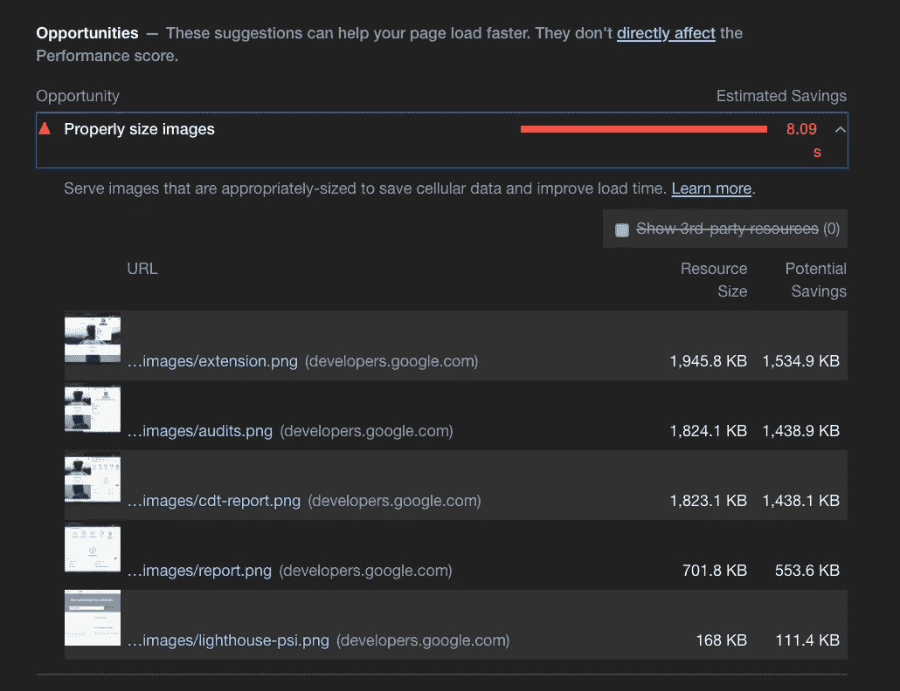

点击最大图片的链接。发现男士外衣广告，很惊喜。

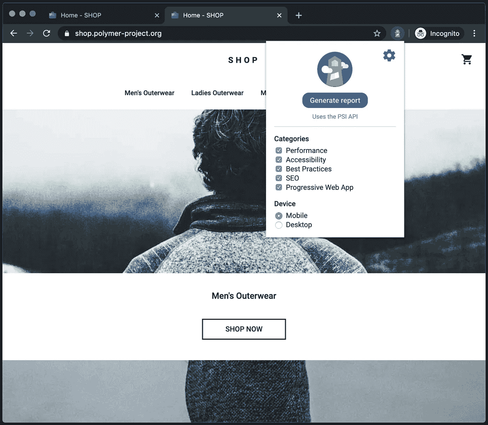

令人惊讶的是，重新运行报告，我们得到了 100 的性能分数。再运行一次，分数回到 82 左右。

发生了什么事？

影响分数的因素有很多。这可能是由 A/B 测试、所提供广告的变化、互联网流量路由变化等引起的。

## 可访问性得分

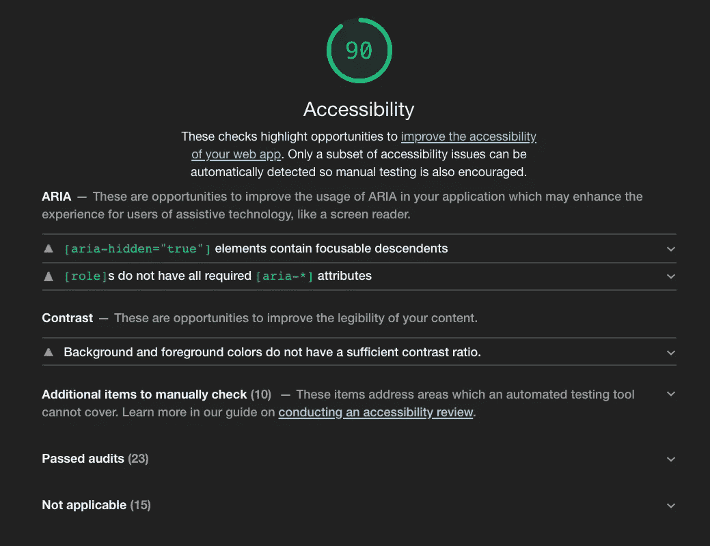

上面是可访问性记分卡，它显示了可访问性机会。这里显示了两个 ARIA 改进建议和一个对比色建议。

这是通过审核的列表:

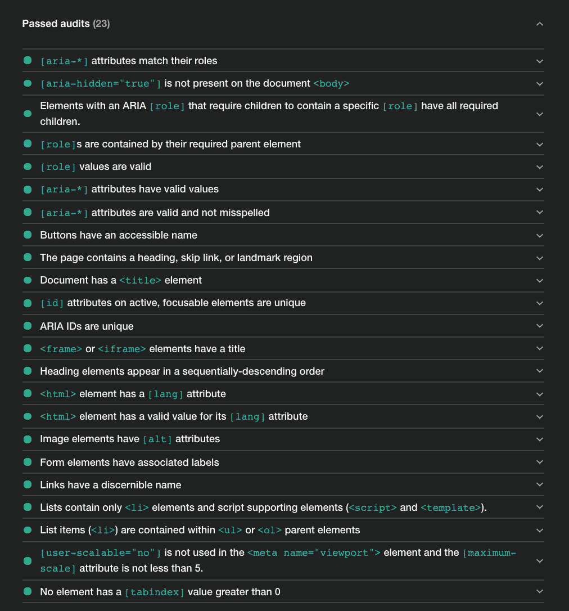

不适用项目的另一个列表:

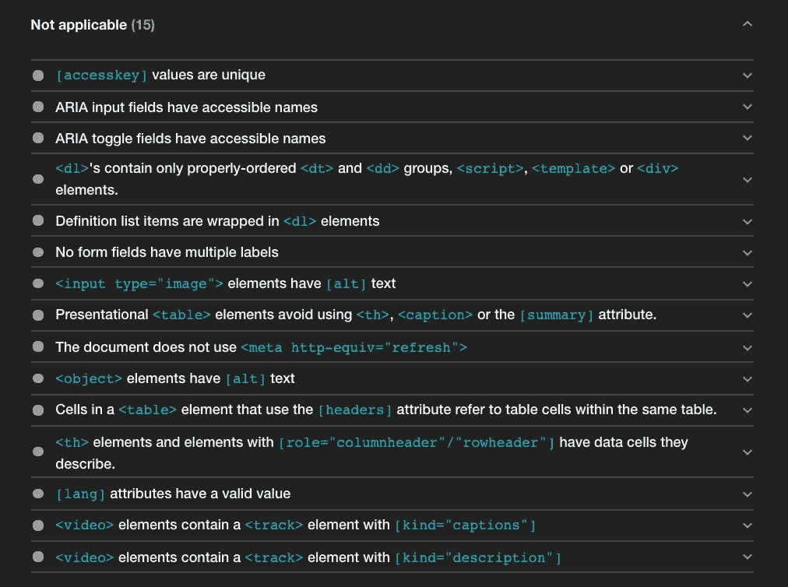

总之，它展示了 Lighthouse 使用的所有可访问性标准。它包含了[构建具有可访问性的 Web 应用程序的 10 个步骤(a11y)](https://medium.com/better-programming/10-steps-to-building-web-applications-with-accessibility-a11y-81cd2c1dd499) 中提到的大多数度量。

## 最佳实践得分

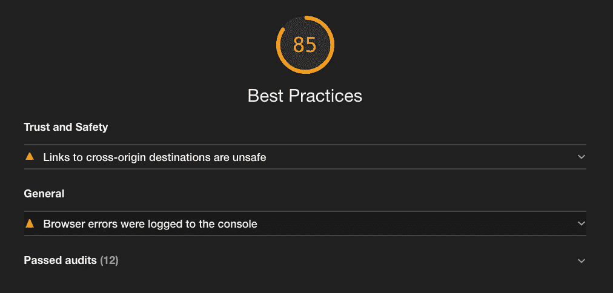

以上是最佳实践记分卡，检查提高网页整体代码健康性的机会。

它指出了两个问题:一些跨来源的目的地是不安全的，并且有许多浏览器错误。

通过的审核显示了根据最佳实践验证的其他内容:

*   使用 HTTPS
*   避免在页面加载时请求地理位置权限
*   避免在页面加载时请求通知权限
*   避免具有已知安全漏洞的前端 JavaScript 库
*   允许用户粘贴到密码字段中
*   以正确的纵横比显示图像
*   以适当的尺寸显示图像
*   页面具有 HTML 文档类型
*   正确定义字符集
*   避免应用程序缓存
*   检测到的 JavaScript 库
*   避免废弃的 API

## 搜索引擎优化得分


以上是搜索引擎优化记分卡，检查页面是否针对搜索引擎结果排名进行了优化。

Lighthouse 使用的标准如下:

*   具有带宽度或初始比例的`<meta name=”viewport”>`标签(移动友好)
*   文档有一个`<title>`元素
*   文档有元描述
*   页面有成功的 HTTP 状态代码
*   链接有描述性文本
*   页面未被阻止索引
*   `robots.txt`，一个告诉搜索引擎哪些页面可以被抓取的文件是有效的
*   图像元素具有`[alt]`属性
*   文档具有有效的`hreflang`
*   文档有一个有效的`rel=canonical`，它告诉搜索引擎它与规范的 URL 相同
*   文档避免插件
*   文档使用清晰的字体大小
*   点击目标的大小适当

## PWA 分数

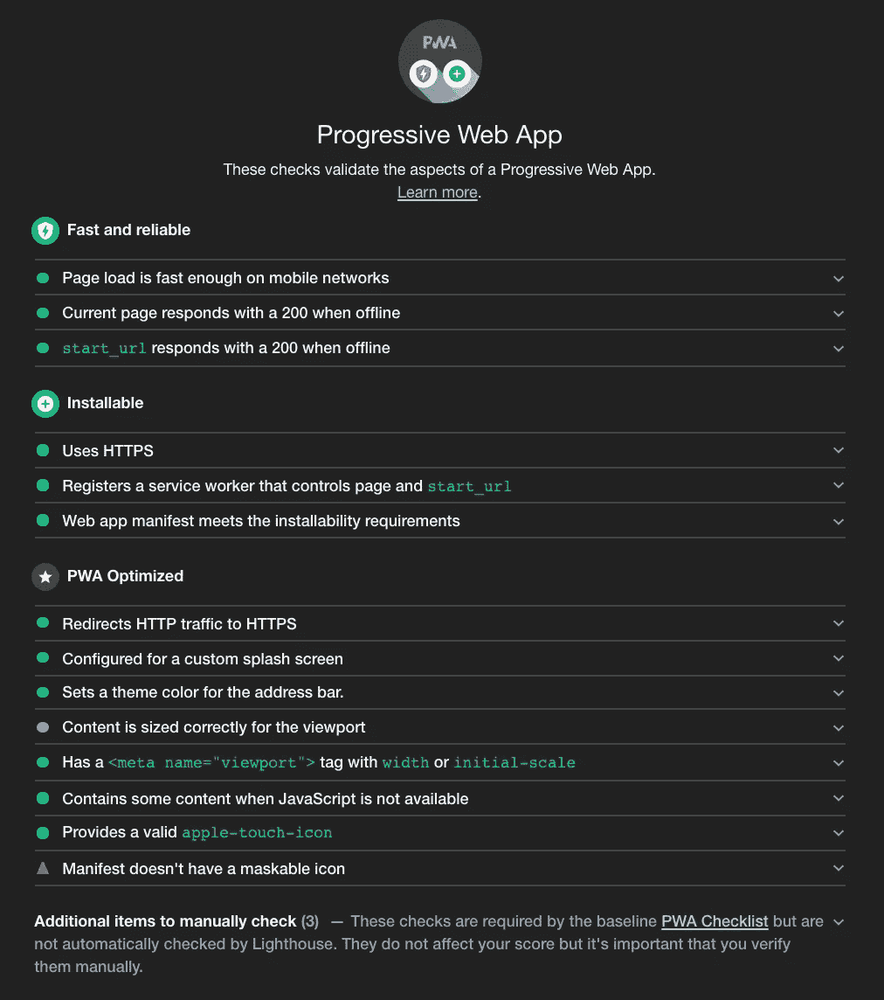

以上是渐进式 web 应用记分卡，它提供了关于 PWA 功能的 web 应用的见解和反馈。它提供了一组指标来帮助构建 PWA，以获得完整的类似应用程序的体验。

灯塔测试适用的 PWA 标准:

*   快速启动并保持快速
*   可安装
*   适用于任何浏览器
*   响应任何屏幕尺寸
*   提供自定义脱机页
*   完全可以访问
*   可以通过搜索发现
*   适用于任何输入类型，如鼠标、键盘、手写笔或触摸
*   为权限请求提供上下文
*   遵循健康代码的最佳实践

# 结论

Lighthouse 是衡量和优化我们产品的有用工具。使用 Chrome DevTools 只需点击一下鼠标。

它也可以作为命令行工具或节点模块使用:

```
npm install -g lighthouse
lighthouse --help 
or npm install --save-dev lighthouse
```

此外， [Lighthouse CI](https://github.com/GoogleChrome/lighthouse-ci) 是一套工具，支持持续运行、保存、检索和断言 Lighthouse 结果。

你准备好尝试了吗？

感谢阅读。我希望这有所帮助。你可以在这里看到我的其他媒体出版物。