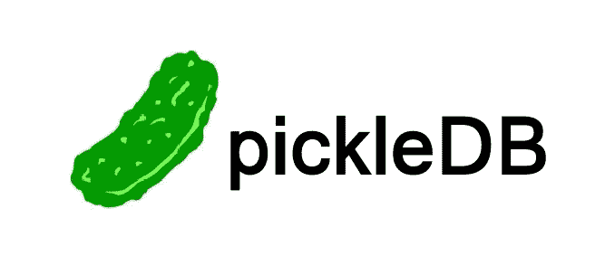

# Python 的轻量级高效数据库替代方案

> 原文：<https://betterprogramming.pub/lightweight-efficient-database-alternatives-for-python-bb990eee752>

## 你并不总是需要一个庞大的关系数据库


照片由[叶小开·克里斯托弗·古特瓦尔德](https://unsplash.com/@project2204?utm_source=unsplash&utm_medium=referral&utm_content=creditCopyText)在 [Unsplash](https://unsplash.com/s/photos/database?utm_source=unsplash&utm_medium=referral&utm_content=creditCopyText) 上拍摄

不管你喜不喜欢，在你作为软件开发人员的职业生涯中，总有一天你会不得不写一些 SQL。无论您使用的是 MySQL、Postgres 还是任何其他类型的数据库，管理这些解决方案的开销可能会高得令人难以置信。如果您需要的只是存储一些基本值，那么您可能会想，您是否真的需要这个又大又坏的数据库。

*你可能不知道。*

从事需要从磁盘读写数据的项目并不一定需要传统的数据库。如果数据复杂性相对较低，并且不需要复制之类的高级特性，那么对于成熟的关系数据库有很多替代方案。

让我们探索其中一些简单的替代方案，看看它们如何帮助您快速启动并运行数据存储，同时减少管理开销。

# 罢免


[来源](https://www.python.org/community/logos/)。

如果您正在寻找用 Python 存储一些持久数据的最简单的方法，这可能就是您要找的。使用 Shelve，您可以以简单、高效的方式存储简单的 Python 对象。Shelve 最棒的地方在于它已经默认包含在 Python 标准库中。你甚至不需要安装任何东西。

在引擎盖下，Shelve 利用了古老的 Unix 数据库系统 DBM。尽管如此，搁置与 DBM 仍然是足够快的简单项目。如果您希望简单地使用低复杂度的纯 Python 对象，这是一个很好的选择。

下面是一个在搁板内存放简单词典的简单例子:

```
#!/usr/bin/env python3import shelvestore = shelve.open('store')store['data'] = {'one':1, 'two': 2}print(store['data']['one'])store.close()
```

查看[官方 Python 文档](https://docs.python.org/3/library/shelve.html)了解更多货架使用和配置选项。

# PickleDB



[来源](https://pythonhosted.org/pickleDB/)。

谁不爱吃咸菜！谁知道它们也是绝佳的储物选择。虽然从技术上讲，pickleDB 的名称中确实有“数据库”这个词，但它还远远不是一个成熟的数据库。这个 Python 模块实际上被认为是一个[键值存储](https://en.wikipedia.org/wiki/Key%E2%80%93value_database)。

使用 pickleDB，您可以存储类似于散列表的简单数据。这种超轻量存储解决方案的好处是配置非常少。您将不会与权限或冗长的配置文件发生冲突。

下面是一个使用 pickleDB 快速启动和运行的例子:

```
import pickledbstore = pickledb.load('store.db', auto_dump=False)store.set('name', 'bob')name = store.get('name')print(name)
```

在官方 pickleDB 网站查看更多信息。

# TinyDB


[来源](https://tinydb.readthedocs.io/en/latest/)。

与 pickleDB 和 Shelve 类似，TinyDB 是另一种快速、轻量级的键值存储。TinyDB 以其超薄、速度快和使用简单而自豪。TinyDB 的接口类似于许多键值存储，但是提供了许多额外的特性，比如编写自己的存储中间件的能力。

与 pickleDB 之类的东西相比，TinyDB 有更健壮的 API 和更活跃的开发社区。

下面是 TinyDB 入门的一个片段:

```
import tinydbstore = tinydb.TinyDB('store.json')store.insert({'name':'bob'})results = store.all()print(results)
```

查看 [TinyDB 文档](https://tinydb.readthedocs.io)获取使用说明和精彩的入门指南。

# H5py


[来源](https://www.hdfgroup.org)。

分层数据格式(或 [HDF5](https://en.wikipedia.org/wiki/Hierarchical_Data_Format) )是一种存储大量数据的高性能方式。这最初是作为一种标准化大量科学数据的分发和共享的方式而开发的。

不过，使用这种方法在 Python 中存储数据，你不必是超级计算机科学家。事实上，h5py 项目让开始变得非常简单。

查看以下代码，了解在 Python 中快速存储和读取 HDF5 数据的方法:

```
#!/usr/bin/python3import h5pystore = h5py.File("store.hdf5", "w")
dataset = store.create_dataset("test", (10,), dtype='i')dataset[0] = 1
dataset[1] = 2
dataset[2] = 3print(dataset[0])
print(dataset[1])
print(dataset[2])
```

如果您使用 Numpy 并处理大量数字，那么这个快速高效的数据存储是一个更好的选择。您也可以直接在存储中设置 Numpy 数据类型。

开发和参与 HDF 项目的官方组织 HDF 小组写了一篇精彩的博客文章，标题为: [*HDF5 作为一个用于 Python*](https://www.hdfgroup.org/2015/03/hdf5-as-a-zero-configuration-ad-hoc-scientific-database-for-python/) 的零配置、专用科学数据库。这篇文章展示了 HDF5 和 h5py 项目对于运行一个简单的数据存储是多么有用。

官方的 h5py GitHub 也有丰富的信息。

# ZODB


[来源](https://zodb-docs.readthedocs.io/en/latest/_static/zodb.png)。

ZODB 是一个稍微复杂一些的面向对象的存储选项。这个项目是 [Zope](https://en.wikipedia.org/wiki/Zope) 家族的一部分，该家族提供许多开源 web 应用服务器。

使用 ZODB，您可以利用多种存储类型和配置选项。该系统的模块化程度令人难以置信，允许您轻松更换不同的存储后端，以适应不断发展的应用程序。您还可以非常快速地启动像内存数据库这样的东西。

尽管 ZODB 总体上是一个更复杂的选项，但它提供了很大的灵活性，如果您希望您的项目在未来增长更多，它会是一个很好的选项。拥有一个库解决许多不同数据库问题的能力确实可以简化大型项目的开发。

ZODB 的设置和配置有点复杂，因此需要更多的步骤才能起步。前往[官方文档](https://zodb-docs.readthedocs.io/en/latest/)，那里有很棒的入门教程。

还可以查看 [ZODB GitHub](https://github.com/zopefoundation/ZODB) 了解更多信息。

感谢阅读！如果你喜欢这篇文章，请浏览我的其他帖子:

*   [*9 免费公共 API 和数据库你应该试试*](/10-free-public-apis-and-databases-you-should-try-acab88bdbfee)
*   [*5 种晦涩难懂的 Python 语法你应该试试*](/obscure-python-syntax-you-should-try-831dbc96777e)