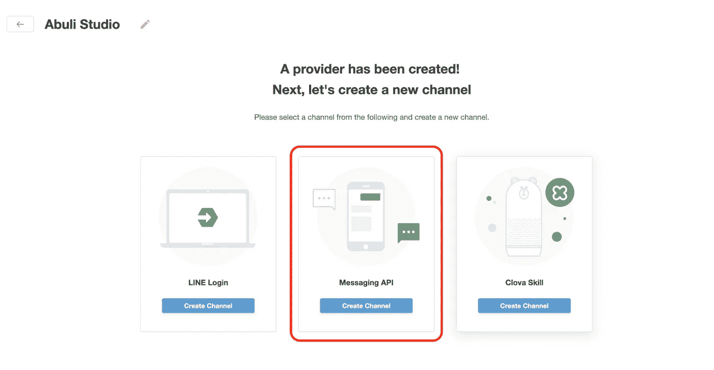
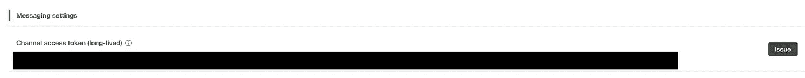
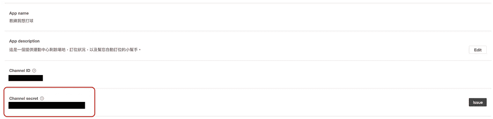
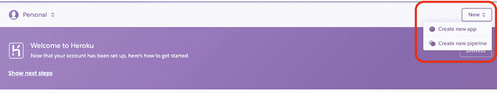
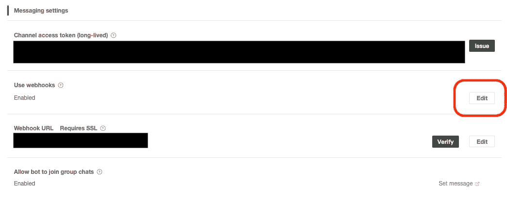
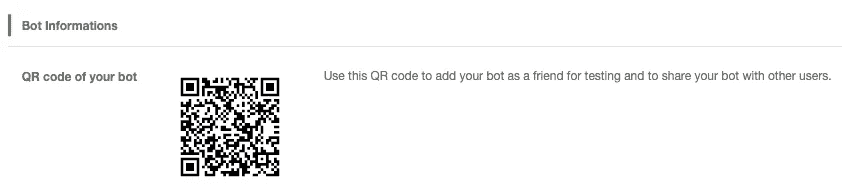

# 教程:使用 Python 和 Heroku 的 LINE Bot

> 原文：<https://betterprogramming.pub/line-bot-with-python-and-heroku-tutorial-e8c296f3816f>

## 从头开始，建立你的线机器人


图片来自 https://zh.m.wikipedia.org/zh/File:LINE_logo.svg

今天要介绍的是如何实现 [LINE Bot](https://developers.line.biz/en/services/messaging-api/https://developers.line.biz/en/services/messaging-api/) 。最近写了一个服务，查询体育中心还有没有羽毛球场，它会通过 LINE Bot 通知我结果。

此外，我还可以进行预订场地等操作。对于用户来说，获取一些有用的信息或者做出一个快速的动作是非常方便的。另一方面，开发者在短时间内搭建一个类似 app 的工具也很快。

# 步骤概述

1.  注册 [LINE bot(消息传递 API)。](https://developers.line.biz/console/register/messaging-api/provider/)
2.  用`Channel Access Token`和`Channel Secret`写 Python 代码构建一个 [Flask 服务](https://en.wikipedia.org/wiki/Flask_(web_framework))。
3.  注册 [Heroku](http://dashboard.heroku.com) 。
4.  安装 Heroku CLI (Heroku 命令行界面)并将代码推送到 Heroku repo。
5.  用 Heroku 服务钩住你的线机器人。
6.  使用您的 Bot 的二维码添加您的 LINE bot 为新朋友，并进行测试。
7.  编码和调试愉快。

# 第一步。注册线路机器人(消息传递 API)

[这里是关于如何创建频道的官方教程](https://developers.line.biz/en/docs/messaging-api/getting-started/)。请按照它来创建消息传递 API 通道。



我们可以创建三种渠道，在线登录、消息 API 和 Clova 技能。为 LINE Bot 选择消息传递 API。

# 第二步。编写 Python 代码，使用通道访问令牌和通道秘密构建 Flask 服务

1.  创建通道后，我们可以在控制台中发出我们的`Channel Access Token`和`Channel Secret`。



通道访问令牌



频道秘密

2.下载[Python 示例](https://github.com/yaoandy107/line-bot-tutorial/archive/master.zip)。

## 可视化工作室

这是可以帮助你编辑代码的 IDE。

 [## Visual Studio 代码的文档

### 了解如何设置并充分利用 Visual Studio 代码。针对构建和调试现代 web 和…

code.visualstudio.com](https://code.visualstudio.com/docs?dv=osx&wt.mc_id=DX_841432&sku=codemac) 

3.解压样本并打开文件`app.py`。将`YOUR_CHANNEL_ACCESS_TOKEN`和`YOUR_CHANNEL_SECRET`换成你的。

```
*# Channel Access Token*line_bot_api = LineBotApi('YOUR_CHANNEL_ACCESS_TOKEN')*# Channel Secret*handler = WebhookHandler('YOUR_CHANNEL_SECRET')
```

# 第三步。注册 Heroku

Heroku 是一个平台即服务(PaaS ),使开发人员能够完全在云中构建、运行和操作应用程序。

注册 Heroku 并创建一个新的应用程序来建立您的服务。

 [## 赫罗库

### 点击此链接进行注册

dashboard.heroku.com](https://dashboard.heroku.com/) 

创建新应用程序

# 第四步。安装 Heroku CLI 并将代码推送到 Heroku Repo

在 Heroku 中创建新应用后，我们将看到如何使用 Heroku CLI 的教程。我把内容复制粘贴在这里供参考。

1.下载并安装 [Heroku CLI](https://devcenter.heroku.com/articles/heroku-command-line) 对于 Mac 用户，您可以使用以下命令:

```
$ brew tap heroku/brew && brew install heroku
```

如果您还没有，请登录您的 Heroku 帐户，按照提示创建一个新的 SSH 公共密钥。

```
$ heroku login
```

2.创建新的 Git 存储库。在新的或现有的目录中初始化 Git 存储库。

```
$ cd [my-project/path]
$ git init
$ heroku git:remote -a [your heroku app name]
```

3.部署应用程序。将您的代码提交到存储库，并使用 Git 将其部署到 Heroku。

```
$ git add .
$ git commit -am "make it better"
$ git push heroku master
```

## 现有 Git 仓库

对于现有的存储库，只需添加`heroku`遥控器:

```
$ heroku git:remote -a [your heroku app name]
```

# 第五步。用 Heroku 服务钩住你的线机器人

1.  启用 webhook。



2.输入并验证您的 Heroku webhook URL。使用以下 URL 格式在[控制台](https://developers.line.biz/console/)中输入 web hook URL:`https://{HEROKU_APP_NAME}.herokuapp.com/callback`。


# 第六步。使用机器人的二维码将您的 LINE Bot 添加为新朋友，然后进行测试

现在，您可以将您的 LINE Bot 添加为新朋友。



在聊天室里输入一些东西，确保它会用你刚才输入的同样的信息回复你。

# 第七步。快乐的编码和调试

基本上，我们只需要修改`handle_message`方法中的代码。

```
# Listen to all the POST request from /callback, no need to change this part.
@app.route("/callback", methods=['POST'])
def callback():
    ...# Handle the messages and do the responding actions here.
@handler.add(MessageEvent, message=TextMessage)
def handle_message(event):
   msg_from_user = event.message.text
   if msg_from_user == 'a':
        # Send message to user.
   else msg_from_user == 'b':
        # Send another message to user.
```

以下是关于不同消息类型的官方文档。你可以选择你的线机器人需要什么。

[](https://developers.line.biz/en/docs/messaging-api/message-types/) [## 生产线开发人员

### 您可以发送以下类型的消息。通过定义动作，您可以使这些消息具有交互性。更多信息…

开发者. line.biz](https://developers.line.biz/en/docs/messaging-api/message-types/) 

## 如何调试

要显示调试日志，请使用以下命令:

```
heroku logs --tail --app [your heroku app name]
```

这些命令的含义如下:

```
--tail                     # print log continuously
--app {HEROKU_APP_NAME}    # specify your app
```

今天就到这里，希望这篇帖子能帮助你开发自己的 LINE Bot。

如有疑问，请在下方评论。此外，如果有任何酷线机器人的实现，欢迎你离开机器人链接，我会给它一个尝试。

# 参考

[](https://developers.line.biz/en/docs/messaging-api/overview/) [## 生产线开发人员

### 消息传递 API 允许数据在您的 bot 服务器和 LINE 平台之间传递。请求通过以下方式发送…

开发者. line.biz](https://developers.line.biz/en/docs/messaging-api/overview/) [](https://github.com/line/line-bot-sdk-python) [## line/line-bot-sdk-python

### Python 的行消息 API 的 SDK。Python 的 LINE Messaging API SDK 使得使用……开发机器人变得很容易

github.com](https://github.com/line/line-bot-sdk-python) [](https://yaoandy107.github.io/line-bot-tutorial/) [## LineBot+Python，輕鬆建立聊天機器人

### 本教學由 北科程式設計研究社 所屬喜歡這篇教學，可以到我的 Github 上面給我一顆 Star[name=姚韋辰] 本教程介紹如何使用 Python LINE Bot SDK 在 Heroku 上架設一個簡單的回話機器人。…

yaoandy107.github.io](https://yaoandy107.github.io/line-bot-tutorial/)