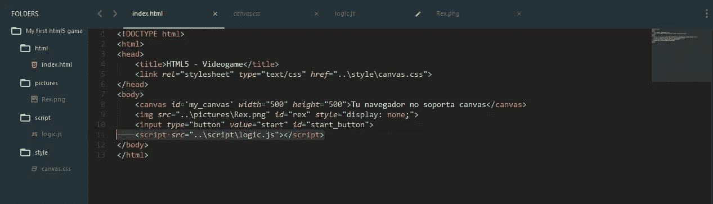

# 用 HTML 文件链接 CSS 和 Js 文件

> 原文：<https://betterprogramming.pub/link-css-and-js-files-with-html-file-f848d00b42e8>

当你在处理 HTML、样式和脚本时，并且你正在处理一个大项目时，我真的建议把文件分开放在不同的文件夹中。将所有的 CSS 文件放在一个文件夹中，将所有的 JavaScript 文件放在另一个文件夹中。对你的 HTML 文件做同样的事情。

要链接一个 CSS 文件和你的 HTML 文件，你必须在你的 HTML 文件的 **head 标签中写下一个脚本。**

`<link rel=¨stylesheet¨ type=¨text/css¨ href=¨..\[folder_name]\[file_name].css¨>`

如果你把 CSS 文件和 HTML 文件放在同一个文件夹中，你只需要写下 CSS 文件的名字，就像这样(我建议把不同文件夹中的文件按照类型关联起来):

`<link rel=¨stylesheet¨ type=¨text/css¨ href=¨[file_name].css¨>`

如果您正在使用引导主题，您可以添加文件的链接:

`<link rel=¨stylesheet¨ type=¨text/css¨ href=¨[url_bootstrap_theme]¨>`

要链接一个 Js 文件和你的 HTML，你只需要在 **body 标签**里面或者外面添加脚本的源代码；没关系。

``

如果 Js 文件和 HTML 文件在同一个文件夹中，你只需要写下 Js 文件的名字，就像这样(我建议把不同文件夹中的文件按照类型关联起来):

``

如果您正在使用库，如 [jQuery](https://jquery.com/) ，您可以在源代码中添加库的 URL。

``

希望这篇帖子对你有帮助。