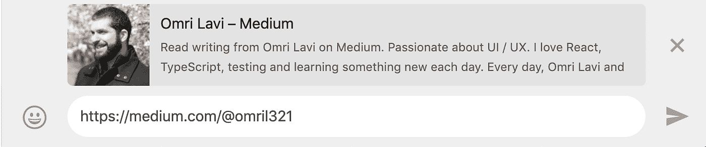
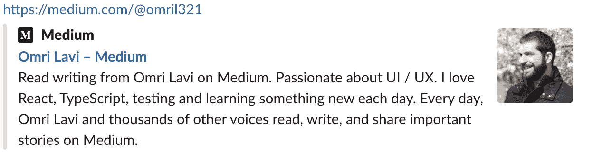
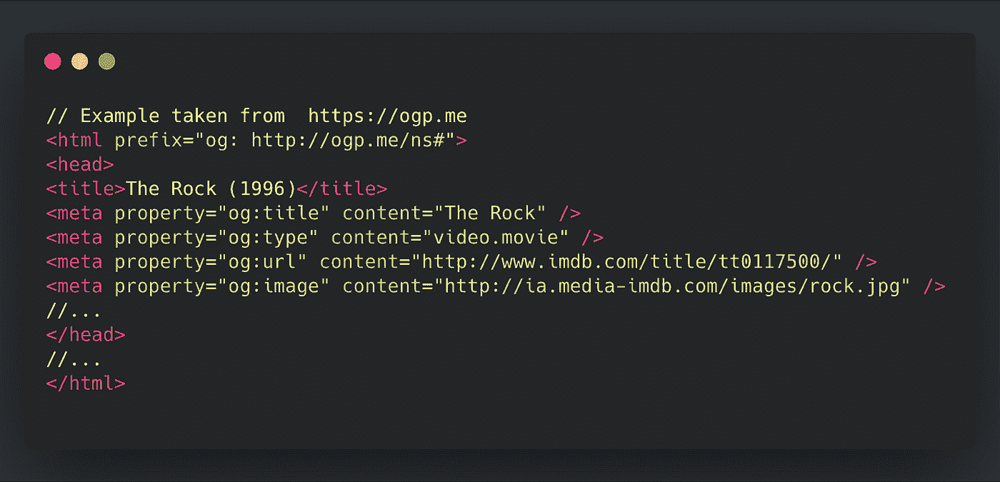
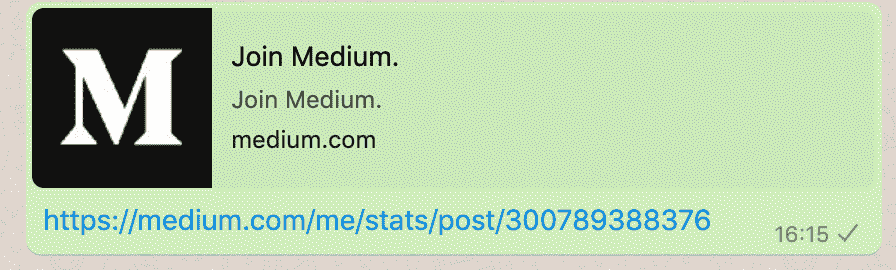

# 链接预览——不仅仅是看上去那么简单

> 原文：<https://betterprogramming.pub/link-previews-more-than-meets-the-eye-aa13c77c6d69>

## 想知道这个预览是如何生成的吗？

由[保罗·斯科鲁普斯卡斯](https://unsplash.com/@pawelskor?utm_source=unsplash&utm_medium=referral&utm_content=creditCopyText)在 [Unsplash](https://unsplash.com/?utm_source=unsplash&utm_medium=referral&utm_content=creditCopyText) 上拍摄

很有可能你是通过一些链接分享得到这篇文章的。

链接很有可能有一些预览:文章标题、简短摘要和图片。

更大的可能性是，这不是你第一次看到这样的预览。

有没有想过是什么产生了这些预览，或者如何开始使用它们？我希望我会在帖子里回答你的一些问题。

# 链接预览？那是什么？

对于那些仍然想知道我指的是什么预览的人，这里有一些例子:

由 [WhatsApp](https://www.whatsapp.com/) 生成的链接预览

由[松弛](https://slack.com)生成的链接预览

这些预览通过让我们一瞥相关的网站每天帮助我们。

通常，预览包含标题、描述、预览图像、图标和可选的应用程序名称。

WhatsApp 和 Slack 怎么知道哪部分内容是描述？如果页面上有许多图像，哪一个是主要的？
每页的数据存储在哪里？

# 元标签

Meta 标签描述了页面的内容。它们位于`<head>`元素内部。

元标签可以定义广泛的属性。这些是一些:

*   声明应用程序名称和图标
*   指定描述
*   配置视口
*   设置每 10 秒刷新一次文档
*   声明字符集

[布雷特·乔丹](https://unsplash.com/@brett_jordan?utm_source=unsplash&utm_medium=referral&utm_content=creditCopyText)在 [Unsplash](https://unsplash.com/search/photos/tag?utm_source=unsplash&utm_medium=referral&utm_content=creditCopyText) 上的照片

web 服务可以通过获取
链接的 HTML 来使用 meta 标签生成链接预览，对吗？

令人惊讶的是，使用纯 HTML meta 标签只支持基本功能。例如，meta 标签本身不能指定预览图像。

那么它们来自哪里呢？

# 开放图协议

[开放图协议](https://ogp.me)用于描述一个拥有丰富对象的网站，比如图像、音频文件等等。为此，OGP(开放图协议的简称)使用了`<meta>`标签。OGP 是脸书专门为社交网络打造的。

使用 OGP 非常简单。

从官方网站看下面的例子。它描述了 IMDB 网站上的电影“The Rock ”:

即使不阅读协议的文档，大多数开发人员也能理解这种标记。

通过查看`<meta>`标签，我们可以看到网站的标题是 The Rock，指的是一部电影。我们也有一个图像链接和一个网址，这导致同一个网站。

OGP 如此简单并非巧合——从一开始[到](https://www.scribd.com/doc/30715288/The-Open-Graph-Protocol-Design-Decisions)这就是设计师的目标之一:

开发人员的简单性是开放图协议的一个关键目标，它已经通知了许多技术设计决策。

开放图协议有许多高级功能。你可以在官方文件中找到更多关于他们的信息。

# 我应该使用开放图协议吗？为什么？

尽管 OGP 是专门为脸书设计的，但许多其他网络服务也支持它。Linkedin、Twitter 和 Pinterest 只是支持 OGP 的一些社交网络。

此外，许多消息工具将链接预览嵌入到消息中。提到 OGP 会影响你的搜索引擎优化也很重要。

一般来说，任何公共 web 应用程序所有者都应该关心链接预览。它通过向用户提供关于内容的提示，使 web 应用程序更容易访问。
OGP 简单易用，好处多多。如果可以，就用吧。

主要的例外是需要任何种类的认证的内容。

链接预览生成器通常执行匿名请求来获取链接的数据。如果页面需要身份验证，则生成的链接将会断开。
我们都分享了至少一个预览为“请登录”页面的链接。

链接预览在媒体上的个人页面，如在 Whatsapp 上看到的

如果你想开始使用 OGP 但不确定如何使用，我推荐你阅读这篇优秀的短文。

# 其他解决方案

除了 OGP，还有其他方法可以生成链接预览。 [oEmbed](https://oembed.com/) 是最受欢迎的一款。它给用户一个描述资源的 JSON，而不是必须解析资源的 meta 标签。

oEmbed JSON 非常简单，包含类似于`image`、`title`和其他有用数据的信息。

这里的问题是每个受支持的网站必须在 oEmbed 上有一个提供者，这需要[做一点工作](https://oembed.com/#section2)。

这意味着虽然 oEmbed 可能更容易使用，但与 OGP 相比，初始设置要复杂得多。

如果你想知道，如果你是通过点击链接预览来看这篇文章的，那不是通过 oEmbed。

Medium 没有被列为 [oEmbed provider](https://oembed.com/providers.json) ，它仍然对链接预览有很大的支持。

# 结论

即时消息、搜索引擎和社交网络是我们生活的一部分。
我们每天都在不知不觉中使用链接预览。这些都是强大的工具，极大地影响了网站的社交流量。

当我开始阅读它的时候，我不知道这个主题是如此的深奥。这个帖子只涵盖了你能学到的一小部分东西。好奇的读者可以在下面找到进一步的阅读部分。

我希望，如果你和我一样对链接预览感到疑惑，那么现在你的生活中就没有那么多未解之谜了。

# 进一步阅读

*   开放图协议开发人员指南—[https://thetrevorharmon . com/blog/a—开发人员指南—开放图协议](https://thetrevorharmon.com/blog/a-developers-guide-to-the-open-graph-protocol)
*   打开图形检查器—[https://opengraphcheck.com/](https://opengraphcheck.com/)
*   开放图协议举例说明—[https://www . optimize smart . com/how-to-use-open-Graph-Protocol/](https://www.optimizesmart.com/how-to-use-open-graph-protocol/)
*   Slack 如何生成链接预览—[https://medium . com/Slack-developer-blog/everything-you-everything-everything-you-everything-want-to-know-on-unfurling-but wave-to-quest-or-how-make-your-e 64 B4 bb 9254](https://medium.com/slack-developer-blog/everything-you-ever-wanted-to-know-about-unfurling-but-were-afraid-to-ask-or-how-to-make-your-e64b4bb9254)

🕵️‍♂️ *Psst…* 如果你喜欢这个*，*在 Twitter 上关注我([@ omril 321](https://twitter.com/omril321))——我定期在 Twitter 上发布我学到的很酷的东西。