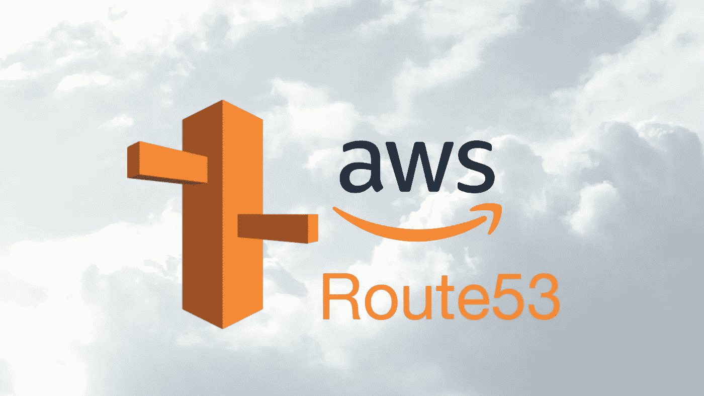
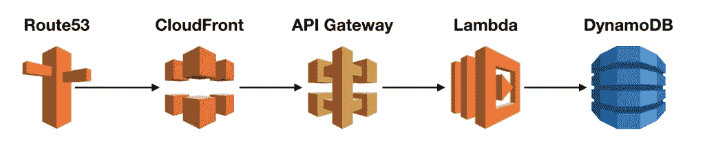
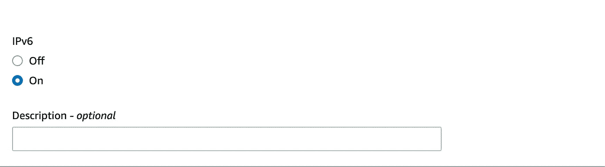
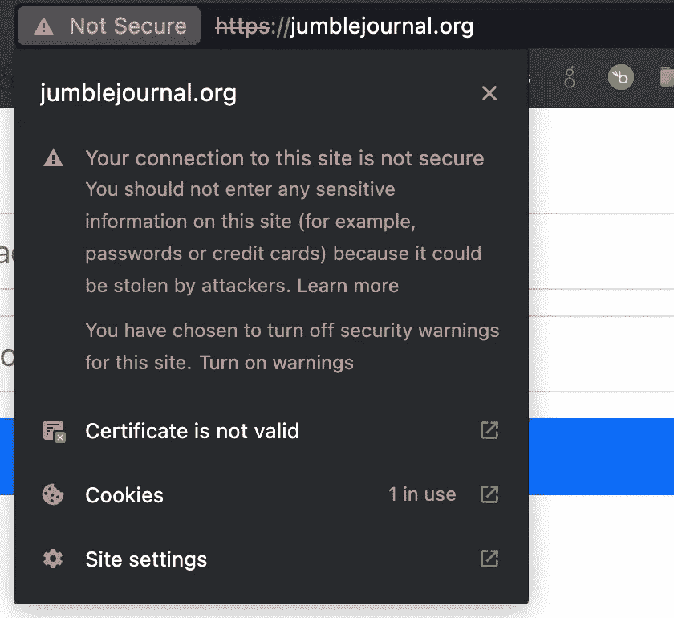

# 使用 AWS SAM 将 Route53 域链接到 CloudFront 发行版

> 原文：<https://betterprogramming.pub/link-route53-domain-to-cloudfront-distribution-with-aws-sam-47f3b05afbe0>

## 这一惊人功能的深入指南



由 [Neil Shah](https://shahneil.medium.com/) 使用 Canva Pro 创建

下图显示了 AWS 上典型的无服务器堆栈。Route53 是 DNS 提供商，CloudFront 是边缘分发，API Gateway 公开了符合 HTTPS/CORS 的 API，Lambda 处理后端逻辑，DynamoDB 处理存储。这个无服务器堆栈是可扩展的，可以完全用 [AWS SAM](https://docs.aws.amazon.com/serverless-application-model/latest/developerguide/sam-specification.html) 编码。



AWS 无服务器堆栈

本文展示了如何使用 SAM 模板将 Route53 域链接到现有的 CloudFront 发行版。我不负责在 Route53 上购买域名。参见[本指南](https://seed.run/blog/how-to-buy-a-domain-name-on-amazon-route-53-for-my-serverless-api.html)了解更多相关信息。

# 第一步—先决条件

一旦您拥有了一个域，第一步就是让它解析一个现有的 CloudFront 发行版。

AWS 文档(总是一个好的起点！)这样建议道:

> 如果您想使用自己的域名，使用 Amazon Route 53 创建一个指向您的 [CloudFront](http://127.0.0.1:8080/#CloudFront) 发行版*的别名记录。*

别名记录类似于其他 DNS 记录类型(例如，像 [CNAME](https://en.wikipedia.org/wiki/CNAME_record) )，但是它对于 Route53 是唯一的。其他标准 DNS 提供商不提供别名记录类型。

来自[AWS 文件](https://docs.aws.amazon.com/Route53/latest/DeveloperGuide/resource-record-sets-choosing-alias-non-alias.html):

> 别名记录是 DNS 的路由 53 扩展。
> 
> 别名记录让您可以将流量路由到选定的 AWS 资源，如 [CloudFront](http://127.0.0.1:8080/#CloudFront) 发行版和亚马逊 S3 桶。
> 
> 与 CNAME 记录不同，您可以在 DNS 名称空间的顶层节点(也称为区域顶点)创建别名记录。例如，如果您注册 DNS 名称 example.com，区域顶点是 example.com。

这个先决条件列表准确地指定了将域名链接到 CloudFront 所需的信息:

## 先决条件

1.  注册的域名。您可以使用 Amazon Route53 作为您的域名注册商，也可以使用不同的注册商
2.  Route53 必须是该域的 DNS 服务。如果域名注册到 Route53，它将自动配置为该域的 DNS 服务
3.  一个 CloudFront 发行版，它有一个与预期域名相匹配的备用域名

如果域是在 Route53 上购买的，则满足前两个先决条件。

第三个先决条件是更新 CloudFront 分发备用域名设置。要了解如何在 SAM 模板中做到这一点， [CloudFront 分发模板文档](https://docs.aws.amazon.com/AWSCloudFormation/latest/UserGuide/aws-resource-cloudfront-distribution.html)很有帮助。似乎 [DistributionConfig](https://docs.aws.amazon.com/AWSCloudFormation/latest/UserGuide/aws-properties-cloudfront-distribution-distributionconfig.html) 属性支持使用别名属性设置备用域名，描述如下:

> 一种复杂类型，包含有关此分发的 CNAMEs(备用域名)的信息(如果有)。

下面是在 SAM 模板的 CloudFront Distribution 部分的 DistributionConfig 部分下添加别名记录的 SAM 模板格式:

```
Aliases:
  - superWebHacker.org
```

# 第二步—创建 Route53 记录

三个先决条件完成后，接下来的一些步骤，同样来自[的 AWS 文档](https://docs.aws.amazon.com/Route53/latest/DeveloperGuide/routing-to-cloudfront-distribution.html)，展示了如何使用 AWS 用户界面链接域。因为我们的目标是在 SAM 模板中实现这一点，所以必须将 UI 指导转换为 SAM 模板配置中的等效操作。

首先，它要求检查目标 Cloudfront 发行版是否支持 IPv6。这可以在 CloudFront 发行版设置中看到。例如，如果启用了 IPV6，它看起来像这样:



AWS CloudFront 分发设置 UI

接下来，指南建议使用以下值创建新的 Route53 记录(一个用于 IPV4，一个用于 IPV6，如果启用了 IPV6 ):

1.  路由策略
    因为我有一个为网站服务的 web 服务器，所以我可以使用简单路由策略，这是应用 SAM 模板时的默认值。
2.  记录名称:输入您想要用来将流量路由到您的 CloudFront 发行版的域名
3.  价值/路由流量到
    在此选择“CloudFront 分发的别名”和域名
4.  第一条记录中的记录类型
    A(用于 IPv4 ),第二条记录中的记录类型为 AAAA(对应于 IPv6)

在 AWS SAM 中实现这一点，我发现 [RecordSetGroup](https://docs.aws.amazon.com/AWSCloudFormation/latest/UserGuide/aws-resource-route53-recordsetgroup.html) 可以方便地为给定的 Route53 托管区域启用多个记录。

要在 AWS Sam 模板中实现`RecordSetGroup`，UI 指令必须映射到 AWS SAM 模板值。

下面是从 UI 指令到 SAM 模板`AWS::Route53::RecordSetGroup`配置的映射

AWS UI 值到 AWS SAM 模板配置的映射

重要又容易错过！:在`HostedZoneId`下的`AliasTarget`值是一个静态值。参见[此处的文档](https://docs.aws.amazon.com/AWSCloudFormation/latest/UserGuide/aws-properties-route53-aliastarget-1.html):

> 指定`Z2FDTNDATAQYW2`。当您创建将流量路由到 [CloudFront](http://127.0.0.1:8080/#CloudFront) 分发的别名记录时，这始终是托管区域 ID。

我第一次尝试配置 SAM 记录集组:

应用此配置时，您可能会看到一个错误:

```
message: “”Invalid request provided: To add an alternate domain name (CNAME) to a [CloudFront](http://127.0.0.1:8080/#CloudFront) distribution, you must attach a trusted certificate that validates your authorization to use the domain name. For more details, see: [https://docs.aws.amazon.com/AmazonCloudFront/latest/DeveloperGuide/CNAMEs.html#alternate-domain-names-requirements](https://docs.aws.amazon.com/AmazonCloudFront/latest/DeveloperGuide/CNAMEs.html#alternate-domain-names-requirements) (Service: [CloudFront](http://127.0.0.1:8080/#CloudFront), Status Code: 400, Request ID: 7ed1586f-f604–4083–9448–850cb45ebf3b)” ([RequestToken](http://127.0.0.1:8080/#RequestToken): e6875d48–2515-a6f3–92f7–7ebd0b1b5d31, [HandlerErrorCode](http://127.0.0.1:8080/#HandlerErrorCode): [InvalidRequest](http://127.0.0.1:8080/#InvalidRequest))”
```

好的，这个错误直接引用了文档[中的](https://docs.aws.amazon.com/AmazonCloudFront/latest/DeveloperGuide/CNAMEs.html#alternate-domain-names-requirements),它说:

> 备用域名必须由有效的 SSL/TLS 证书覆盖

哦，对了，SSL 需要一个证书，这个证书还没有创建，这就把我们带到了第三步。

# 第三步—创建 SSL 证书

`[CertificateManager::Certificate](https://docs.aws.amazon.com/AWSCloudFormation/latest/UserGuide/aws-resource-certificatemanager-certificate.html)` SAM 类型可用于创建 SSL 证书。证书可以附加到 SAM 模板 CloudFront 配置中。

方便的是，AWS 自动处理证书 DNS 验证(仅当以下条件成立时):

1.  证书域托管在 Amazon Route53 中
2.  该域位于我的 AWS 帐户中
3.  Cert 是为 DNS 验证配置的(与电子邮件验证或其他方法相反)

以下是完整的 SSL 证书配置:

# 第四步—将 SSL 证书附加到 CloudFront 发行版

现在可以通过 SAM [DistributionConfig](https://docs.aws.amazon.com/AWSCloudFormation/latest/UserGuide/aws-properties-cloudfront-distribution-distributionconfig.html) 类型将证书附加到`[AWS::CloudFront::Distribution](https://docs.aws.amazon.com/AWSCloudFormation/latest/UserGuide/aws-resource-cloudfront-distribution.html)`上。

根据文档，`ViewerCertificate`是添加它的地方。`ViewerCertificate`是:

> 一种复杂类型，用于确定分发的 SSL/TLS 配置，以便与查看器进行通信。

此外，它还说:

> 如果分发使用别名(备用域名或 CNAMEs)，请使用此类型中的字段指定以下设置:

1.  建议将 SSLSupportMethod 设置为`sni-only`
2.  SSL/TLS 证书的位置，即`ACMCertificateArn`

对于`ACMCertificateArn`，需要 AWS ARN 证书。[AWS 文档](https://docs.aws.amazon.com/AWSCloudFormation/latest/UserGuide/aws-resource-certificatemanager-certificate.html#cfn-certificatemanager-certificate-certificateauthorityarn)称从引用 ARN 的`AWS::CertificateManager::Certificate`类型自动导出一个`Ref`值。

从[参考文档](https://docs.aws.amazon.com/AWSCloudFormation/latest/UserGuide/intrinsic-function-reference-ref.html)中，我可以看到使用它的语法很简单:`!Ref logicalName`

下面是来自`AWS::CloudFront::Distribution`配置的片段(注意 DNS 证书的`!Ref`)

证书 DNS 验证是动态完成的，这很好，因此它也同时附加到了 CloudFront 发行版中。

# 步骤五—更新 TLS *最低协议版本*

我打了最后一路颠簸后，应用上述。当我访问该网站时，证书仍然显示为无效:



这是因为我将`MinimumProtocolVersion`设置为 TLSv1，这是大多数浏览器不再支持的。这里见解释[。](https://chromestatus.com/feature/5759116003770368)

将`MinimumProtocolVersion`更新为`TLSv1.2_2021`，并重新应用以修复错误。该域名现已开通。更新后的`ViewerCertificate`配置如下:

这里是完整的最终配置，包含了所有内容(以及一些超出本文范围的其他细节):

仅此而已。我希望这篇文章对你有所帮助！

# 资源

*   [https://docs . AWS . Amazon . com/server less-application-model/latest/developer guide/Sam-specification . html](https://docs.aws.amazon.com/serverless-application-model/latest/developerguide/sam-specification.html)
*   [https://docs . AWS . Amazon . com/route 53/latest/developer guide/routing-to-cloudfront-distribution . html](https://docs.aws.amazon.com/Route53/latest/DeveloperGuide/routing-to-cloudfront-distribution.html)
*   [https://docs . AWS . Amazon . com/AWS cloudformation/latest/user guide/AWS-resource-route 53-recordset group . html](https://docs.aws.amazon.com/AWSCloudFormation/latest/UserGuide/aws-resource-route53-recordsetgroup.html)
*   [https://docs . AWS . Amazon . com/AWS cloudformation/latest/user guide/intrinsic-function-reference-ref . html](https://docs.aws.amazon.com/AWSCloudFormation/latest/UserGuide/intrinsic-function-reference-ref.html)
*   [https://docs . AWS . Amazon . com/AWS cloudformation/latest/user guide/AWS-resource-certificate manager-certificate . html # cfn-certificate manager-certificate-certificate authority yarn](https://docs.aws.amazon.com/AWSCloudFormation/latest/UserGuide/aws-resource-certificatemanager-certificate.html#cfn-certificatemanager-certificate-certificateauthorityarn)
*   [https://docs . AWS . Amazon . com/AWS cloudformation/latest/user guide/AWS-properties-cloudfront-distribution-distribution config . html](https://docs.aws.amazon.com/AWSCloudFormation/latest/UserGuide/aws-properties-cloudfront-distribution-distributionconfig.html)
*   [https://docs . AWS . Amazon . com/AWS cloudformation/latest/user guide/AWS-resource-certificate manager-certificate . html](https://docs.aws.amazon.com/AWSCloudFormation/latest/UserGuide/aws-resource-certificatemanager-certificate.html)
*   [https://docs . AWS . Amazon . com/AWS cloudformation/latest/user guide/AWS-properties-route 53-alias target-1 . html](https://docs.aws.amazon.com/AWSCloudFormation/latest/UserGuide/aws-properties-route53-aliastarget-1.html)

```
**Want to Connect?**

[Subscribe](https://tony-oreglia.medium.com/subscribe) to my newsletter or connect on [Twitter](https://twitter.com/tony_oreglia) or [LinkedIn](https://www.linkedin.com/in/tony-oreglia/).
```