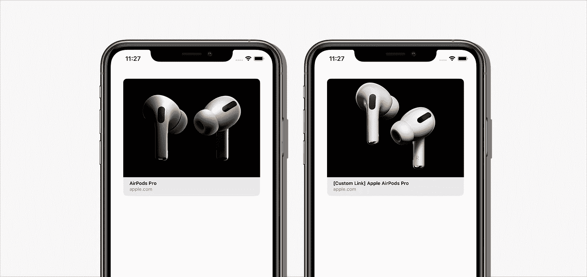
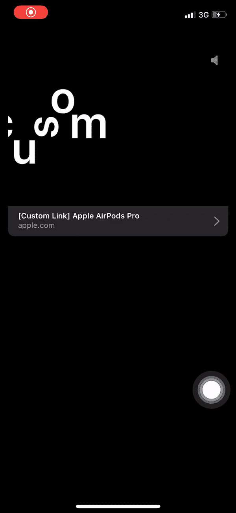

# iOS 13 中的链接展示

> 原文：<https://betterprogramming.pub/linkpresentation-in-ios-13-bbb6007818c6>

## 向链接添加元数据

图片来源:Apple.com

难度:**容易** |中等|困难

苹果发布 iOS 10 的时候，苹果的 Messages 应用更新到了支持消息中丰富链接的新版本。在 iOS 13 中，苹果支持在我们自己的应用程序中使用丰富的链接。这里有一些步骤来帮助你实现添加元数据到你的链接。

# 第一步。获取您的元数据

创建一个丰富的链接预览首先需要的是`[LPLinkMetadata](https://developer.apple.com/documentation/linkpresentation/lplinkmetadata)`。

`LPLinkMetadata`是一个对象，存储关于 URL 的元数据，包括链接的标题、图标、图像和视频。

## 自动获取元数据

因为您没有链接的元数据，所以您必须有另一个进程来获取它。为此，我们可以使用`[LPMetadataProvider](https://developer.apple.com/documentation/linkpresentation/lpmetadataprovider)`。

`LPMetadataProvider`是一个检索 URL 元数据的对象。在它完成获取之后，它会将元数据映射到`LPLinkMetadata` 对象。

`LPMetadataProvider` 支持一个功能叫做`[startFetchingMetadata](https://developer.apple.com/documentation/linkpresentation/lpmetadataprovider/3143321-startfetchingmetadata)`。

下面是一个例子。

## 自定义元数据

如果您的链接不支持元数据，或者您想要更改为另一个 URL、标题、图标、图像或视频，只需创建`LPLinkMetadata` 并输入必要的数据。

下面是一个标题的例子(链接的标题)。

# 第二步。创建一个包含 **LPLinkMetadata** 的视图

有了`LPLinkMetadata`之后，下一步是创建一个视图并将元数据放入其中。叫`[LPLinkView](https://developer.apple.com/documentation/linkpresentation/lplinkview)`。

`LPLinkView`是一个链接的丰富的可视化表示。

为方便起见，我想将所有必要的函数放在一个文件中:

这是两种情况下的结果:自动(左)和自定义(右)。

自动(左)和自定义(右)

# 用视频试试

实现视频和实现图像是一样的，但是请注意输入视频的直接链接。

结果如下:

感谢阅读。希望这篇文章对你有用。