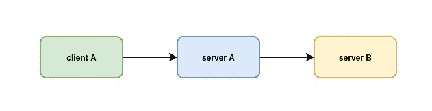
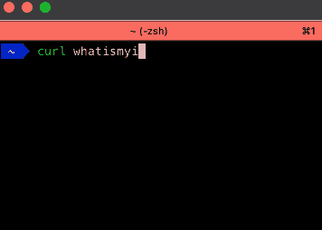
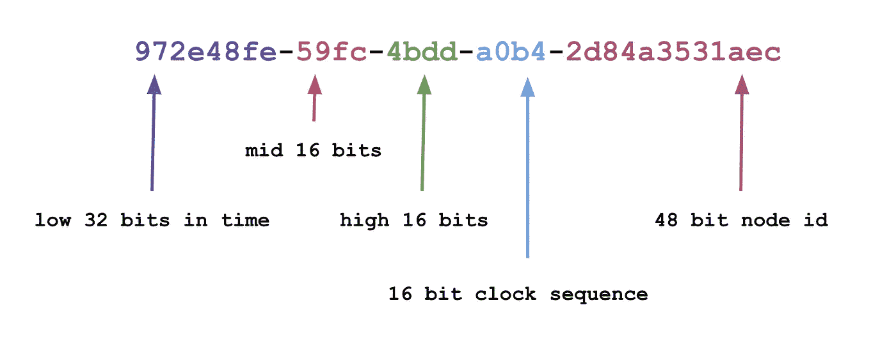

# 如果你管理服务器，你应该记住 5 个 Linux 命令

> 原文：<https://betterprogramming.pub/linux-commands-you-should-memorize-if-you-manage-servers-1b7d371237ac>

## 跟踪系统日志中的错误，获取设备的 UUID，等等


照片由[爆裂](https://unsplash.com/@burst?utm_source=unsplash&utm_medium=referral&utm_content=creditCopyText)上[未飞溅](https://unsplash.com/s/photos/typing?utm_source=unsplash&utm_medium=referral&utm_content=creditCopyText)

在当今点击式云服务器的环境中，没有什么可以替代老式的命令行方式。你可以访问 GUI 只能梦想的机器部件，更快地完成编程任务，最重要的是:*解决问题*。

当火警响起时，知道一些常用的导航和调试命令可以节省宝贵的时间。

在本文中，我们将探究其中的一些命令，并解释它们对于 Linux 服务器上的日常命令行工作是如何重要的。

# 查找正在使用/打开的端口

创建一个新的服务，却发现可怕的“*地址正在使用*”消息，这让人抓狂。尤其是你不知道谁在用的时候。幸运的是，有几种方法可以查看 Linux 系统上当前正在使用的端口。最流行的工具之一是`netstat`。

为了按进程查看所有打开的端口，您可以发出以下命令:

```
sudo netstat -nltp
```

这将显示所有打开的端口，它们的详细信息，如协议和状态以及调用它们的程序。使用这个你应该可以追踪到谁占用了你迫切需要的那个端口。


覆盆子 Pi 上的 Netstat 输出。

如果您想显示程序名和 PID，记得使用`sudo`来运行。

# 转发您的 SSH 代理

如果您在管理服务器时频繁地从一台主机跳到另一台主机，确保您转发了您的密钥会非常有帮助。使用 SSH 转发可以很容易地实现这一点，并且您可以在使用自己的公钥保持访问的同时四处跳跃。



服务器之间的连接。

假设您想连接到`server A`，然后立即从那里 SSH 到`server B`。如果您没有转发您的 SSH 代理(包含您的 SSH 密钥),那么您将会止步不前。

为了将您的代理转发到您的下一个主机，您必须通过`-A`标志。完整的命令可能如下所示:

```
ssh -A serverA
```

`-A`标志获取本地正在运行的任何东西`ssh-agent`,并将附属于它的密钥转发给你的目标主机。您还可以使用主机条目中的`ForwardAgent yes`指令将它添加到您的 SSH 配置文件中。

如果您的 SSH 代理没有运行，您需要启动它并添加所需的密钥:

```
eval $(ssh-agent)
ssh-add
```

现在，当你需要在几个服务器之间跳跃时，你可以确定你的密钥会跟着你。

# 错误的尾部系统日志

你如何知道服务器内部发生了什么？您首先在哪里寻找错误消息？是否有一个包罗万象的记录设施？

Syslog 通常是最好的地方。这个实用程序已经存在了 30 多年，并继续被许多应用程序定期用于消息传递和日志记录。

默认情况下，大多数运行在 Linux 上的程序都会登录到`syslog`。即使某个程序不支持，您也很有可能可以轻松地将其配置为支持。您可以像查看任何其他日志文件一样查看`syslog`:

```
# Debian
less /var/log/syslog# RHEL/CentOS
less /var/log/messages
```

或者你也可以`tail`这个文件，跟着它去关注新邮件:

```
# Debian
tail -f /var/log/syslog# RHEL/CentOS
tail -f /var/log/messages
```

每条`syslog`消息都包含丰富的信息，并提供了一种简单的方法来快速排除服务故障。

你也可以很容易地把它传送到`grep`，过滤出你想要的设备或程序名。只需在命令末尾添加`| grep <name>`。

下一次出现错误时，这里应该是第一个查看的地方。

# 查找服务器的当前公共 IP

如果你使用的是带有 GUI 的桌面发行版，你可以很容易地打开浏览器，算出你的公共 IP。有很多像 whatismyipaddress.com 这样的网站可以向你展示你的公共 IP 地址。但是，如果您在一个无头服务器上，并且您只能访问 CLI，会发生什么呢？

当然，你可以打开 AWS 或 GCP 控制台搜索它。您也可以打开一个像 VMware 这样的内部解决方案，甚至是一个电子表格来找到它，但是这些解决方案需要时间。当遇到麻烦时，您最不想做的事情就是寻找一个实例 ID，并将其与一个巨大的其他 ID 列表进行匹配。

如果你想快速找到你连接的机器的公共 IP，你可以卷曲公共网页使用的相同端点。有许多免费的纯文本公共 API 可供使用。我个人最喜欢的是:

```
curl whatismyip.akamai.com
```

这将向您显示一行包含您的反射公共 IP 地址。这是一个快速、简单的命令，可以快速提供您需要的信息(无需离开 CLI)。



为你的公共 IP 冰壶。

还有一个[高级端点](http://whatismyip.akamai.com/advanced)提供关于你的 IP 的更多细节，比如位置和网络。

另一个额外的好处是，由于它是纯文本，您可以在脚本或其他需要 IP 信息的编程服务中轻松使用它。不过要记住的一点是，这些公共端点对您可以发出的请求数量有限制。试图将它添加到数千个服务器上的 cron 作业中是不明智的。

# 获取设备的 UUID

如果您在一个有很多附加磁盘或其他存储的服务器上工作，那么您可能会遇到一些使用临时设备名的陷阱。根据发行版本的不同，设备名称可能会有很大差异。在一台服务器上使用一个设备名称可能无法同等地转换到下一台服务器。这就是 UUIDs 发挥作用的地方。



Arctype 的 UUID 格式。[来源](https://arctype.com/blog/postgres-uuid/)。

如果您想要装载磁盘或其他媒体，使用设备的 UUID 通常是个好主意。这可以防止任何混淆，并确保您想要安装的设备每次都能以正确的方式安装。

为了找到块级设备的 UUIDs，您可以使用以下命令:

```
sudo blkid
```

这将显示磁盘列表及其相关的 UUID 值。您可以使用这些值来挂载磁盘或将它们添加到`/etc/fstab`。现在，当你想参考一个设备时，你可以*确定*它是正确的。

感谢您的阅读！你有哪些保持系统正常运行的关键命令？

寻找更多文章？看看我下面的一些其他帖子:

*   [*使用这些命令*](/become-a-better-apt-user-with-these-commands-ecd7b13fd502) 成为更好的“apt”用户
*   [*你应该知道的 5 个基本地形命令*](/5-basic-terraform-commands-you-should-know-d613f539fb9b)