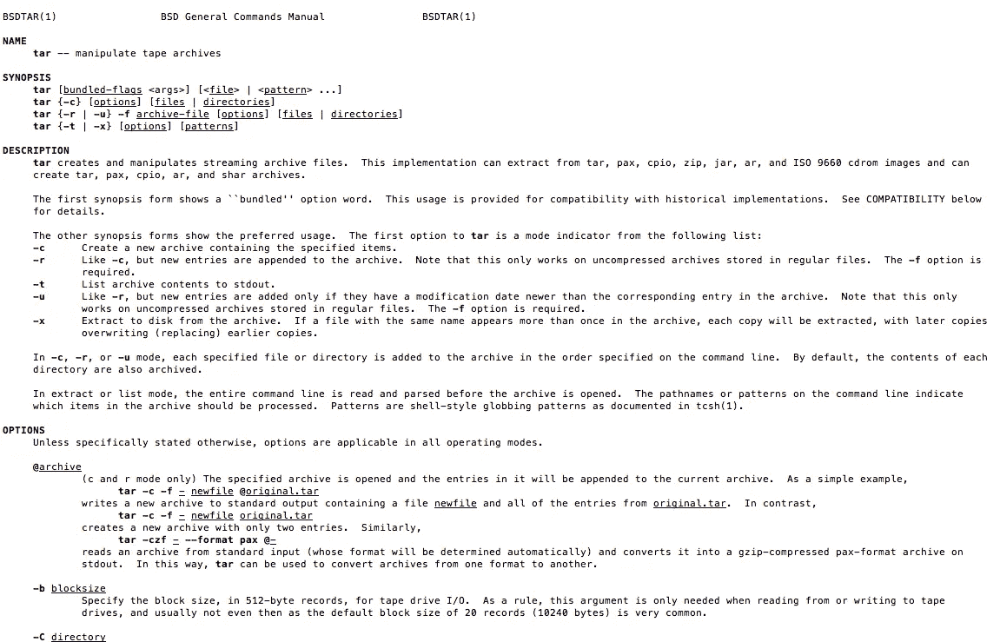
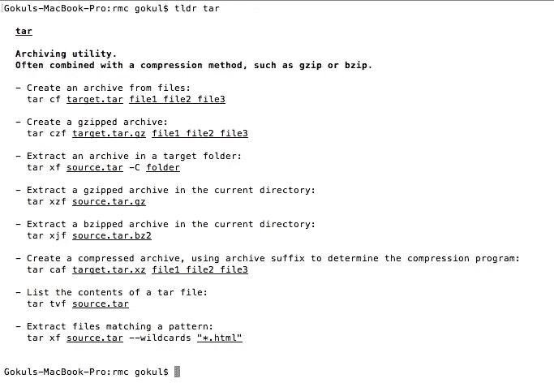

# Linux:初学者生存指南

> 原文：<https://betterprogramming.pub/linux-survival-guide-for-beginners-c18bfd982036>

## 我挺过了向 Linux 的过渡——你也可以


照片由[克里斯里德](https://unsplash.com/@cdr6934?utm_source=unsplash&utm_medium=referral&utm_content=creditCopyText)在 [Unsplash](https://unsplash.com/search/photos/code?utm_source=unsplash&utm_medium=referral&utm_content=creditCopyText) 上拍摄

从 Windows 切换到 Linux 真的很可怕。但是如果你能熬过最初的几个月，最终的回报将是指数级的。我是这样活下来的。

# TLDR

1.  虽然我只是一个 Linux 的业余爱好者，但我能够在这个转变中生存下来，并从中受益。这些是我写给面临类似情况的人的笔记。
2.  选择 Ubuntu 开始。一旦你更了解并能自己决定，就选择其他口味。
3.  熟悉以下命令`ssh, pwd, ls, cd, mv, cp, scp, grep, find, rm`。提示:您可以使用[https://tldr.ostera.io/cp](https://tldr.ostera.io/cp)来获得这些命令最常用选项的列表。
4.  学会使用`|`符号。使用这个符号，您可以将一个命令的输出作为输入传递给下一个命令。

# 长篇版本

在我的第一家公司，我们广泛使用 Windows，无论是用于开发的台式机还是部署代码的服务器。但是当我转到我的第二家公司时，所有的一切都在操作系统上，因此在那里使用 Linux 是必须的。对我来说，这成了一项艰巨的任务。在最初的一个月左右，这是一场噩梦。

经历了那场噩梦并幸存下来后，我列出这个清单来帮助像我一样试图进行这种转变的人。

# 新环境

一般来说，转变是困难的。新环境可能会让人害怕。如果你是一个从未使用过命令行的 Windows 用户，那么过渡到 Linux 可能会非常可怕。不要烦恼，因为这通常是许多正在进行这种转变的人的经历。知道别人也发现这很难，有时真的是一种安慰。

据我所知，造成过渡困难的两个主要原因是:**缺乏熟悉度**和**害怕搞砸。**

## 不熟悉

为了解决熟悉度的问题，我开始在我的办公室笔记本电脑和个人笔记本电脑上使用 Linux。我开始阅读关于 Linux 的博客，并在 Twitter 上关注一些有趣的 Linux 相关账户。我联系了擅长 Linux 的人。我会走到他们的隔间，让他们给我看他们的指挥历史。我从中学到的比看博客多得多。大多数时候，由于它只是肌肉记忆，程序员无法解释它。但是他们的历史是一个宝库。

我建议运行以下命令。你将会对你的 Linux 英雄们经常使用的命令有更多的了解。

`history | awk ‘{ $1=””; print $0 }’ | sort | uniq -c | sort -nr | head -20`

在您办公室的 Linux 专家的终端上运行该命令。向他们询问你不熟悉的命令，你应该能学到比几本书能教你的更多的东西。不要忘记，这些都是久经考验的命令，因此比博客中的标准例子更有价值。如果您不明白上面的命令是做什么的，不要担心——我将在本文的后面解释它。

## 害怕搞砸

我已经使用 Linux 好几年了，但是我仍然有这种恐惧。当我开始的时候，这种恐惧是多重的。对我帮助很大的一件事是，我和我公司的 Linux 专家谈了谈，做了一个黑名单——一个我永远不应该使用或谨慎使用的命令列表。`sudo rm -rf`名列榜首。如果你像我一样焦虑，你可以在你的本地机器上使用 https://github.com/nivekuil/rip 的 T2。

当我正在经历害怕搞砸的阶段时，两个推特用户给了我很大的帮助:[查克里 _ iiith 思](https://twitter.com/chakri_iiith)和[图克斯纳尼](https://twitter.com/tuxnani)。我希望我花更多的时间和他们在一起，多学一些他们的技巧。找到你的天使，他们会帮助你面对恐惧。

既然你的恐惧已经消除，让我们开始吧。

# 为什么你应该学习 Linux

你应该学习 Linux 的理由数不胜数。一次谷歌搜索会给你带来成千上万篇关于你为什么应该学习 Linux 的文章，比如“[学习 Linux 的好处是什么](https://www.quora.com/What-are-the-benefits-of-learning-Linux)”、“[你为什么应该转到 Linux](https://fossbytes.com/10-reasons-switch-linux-os-right-now/) ”和“[在学习编程的同时学习 Linux 是否值得我花费时间](https://www.reddit.com/r/learnprogramming/comments/38zytg/is_it_worth_my_time_to_learn_linux_while_learning/)”这三篇文章值得一读，但这里是我认为你应该学习的两大理由:

1.  **Linux 无处不在** : Linux 无处不在。因此，不管你是否了解，很有可能你已经在使用或受益于 Linux 了。因此，理解 Linux 的基础知识在很多情况下都会派上用场。如果你是一名程序员，那么这个机会是相当高的。相当多的应用程序部署在 Linux 服务器上。所以学习它可以拯救生命。
2.  **Linux 是通用的**:[Linux 和 MAC 都是在 UNIX 上构建的。](https://askubuntu.com/a/11396/217036)因此，如果你熟悉 Linux 终端，你应该也能使用 MAC 终端中的大多数命令。[安卓使用 Linux 内核。](https://unix.stackexchange.com/questions/25463/does-android-really-use-the-same-kernel-as-linux) [树莓派用的是 Linux。](https://www.raspberrypi.org/documentation/linux/kernel/building.md) [很多嵌入式设备都使用 Linux。](https://en.wikipedia.org/wiki/Linux#Embedded_devices)

# 你为什么开始学习 Linux？

正如我们已经看到的，学习 Linux 有很多原因。但是如果你是一名程序员，你很有可能属于以下两种类型之一:

1.  你读到过 Linux 可以做的很酷的事情，或者你从一个不停地对 Linux 赞不绝口的朋友那里听说过。
2.  您的笔记本电脑或台式机安装了非 Unix 操作系统。但是您的应用程序或网站部署在 Linux 服务器上。

如果你属于第一类，你拥有世界上所有的时间。所以慢慢享受你的甜蜜时光吧。如果你属于第二类，那么很有可能你正在赶时间。所以完成接下来的部分，把手弄脏。

# 人类指挥部是你的朋友。或者是？

当你想学习 Linux 时，你得到的第一个提示是“使用 man 命令，它是你的朋友。”虽然它有一定的真实性，但对于许多第一次使用它的人来说，它可能会让人不知所措。您通常需要的只是该命令最常用场景的选项——这正是手册页中所缺少的。幸运的是，有一个名为 [TLDR](https://tldr.sh/) 的项目正试图解决这个问题。

只要比较一下这两个命令的输出就明白我的意思了。

**首先，来自手册页的输出。**



现在 TLDR 项目的输出。



你看出区别了吗？

TLDR 就像我为自己写的关于命令的笔记。我发现它非常方便。我使用 [nodejs](https://nodejs.org/) 命令`sudo npm i -g tldr`安装 TLDR。如果你还没有安装 nodejs，我建议你安装，因为有很多非常方便的节点包。您可以使用 Digitial Ocean 的本安装手册[安装 nodejs。](https://www.digitalocean.com/community/tutorials/how-to-install-node-js-on-ubuntu-18-04)

我想在这篇文章中分享我对所有命令的笔记，但是后来我看到了 Andrew 的一篇文章，他在文章中介绍了 101 个 bash 命令:

[](https://dev.to/awwsmm/101-bash-commands-and-tips-for-beginners-to-experts-30je#whereis-which-whatis) [## 从初学者到专家的 101 个 Bash 命令和提示

### Andrew Jan 1339min read 下面的命令是以或多或少的叙述风格排列的，所以如果你只是…

开发到](https://dev.to/awwsmm/101-bash-commands-and-tips-for-beginners-to-experts-30je#whereis-which-whatis) 

他对所有的命令进行了分类，并且有很好的例子，我不能做得比这更好了。

# 了解 Bash 概要文件

我发现 bash 配置文件或 bash 概要文件很方便，所以它有助于[了解它们的区别以及它们是如何工作的](https://stackoverflow.com/a/415444/493742)。

我遵循的一条经验法则是将我的所有配置添加到`.bash_profile`中，并确保将`.bashrc`加载到`.bash_profile`文件中。我将我最喜欢的别名添加到这个文件中。我在我的私人 gist 中保存了我的`.bash_profile`的一个基本版本，并在我需要的服务器上下载原始版本。

# 学习使用 Emacs

这些天我寻找的一件事是共性。这帮助我在多种情况下利用我所知道的东西。例如，我们正在我们的团队中推广大量的 Javascript，因为我们可以在多种场景中使用它，比如我们的网站前端，在浏览器控制台中快速抓取东西，调试我们的前端或从其他网站学习，在 mongodb 中加入集合，在 nodejs 中用于服务器端。

强调通用性有助于我们“一次学习，多次受益”——更大的投资回报。

回到 Linux，我想决定一个命令行编辑器。我可以选择 Nano、Vim 或 Emacs。我选择了 [Emacs](https://www.gnu.org/software/emacs/emacs.html) 。

Emacs 中使用的大多数命令也可以在 Linux shell 中使用。例如，您可以在 shell 和 Emacs 上使用 CTRL/CMD+A 转到行首。有许多这样的命令在 shell 和 Emacs 中都可以使用。我认为这是一个巨大的优势。

由于它是一个命令行编辑器，您可以很容易地在任何服务器上安装它。在我作为 root 用户的每台服务器上，我通常安装 Emacs。我不确定这是否是一个好的做法，但我总的来说觉得很方便。是的，我决定不学 Nano 或 Vim。如果你想的话，可以烤了我。

# 吹笛子

Linux 中的 Pipe 命令允许您使用一个命令的输出作为下一个命令的输入。一旦你掌握了一些 Linux 命令，比如`grep`、`sort`、`awk`、`uniq`、`head`和`tail`，这将非常有用。这些命令的管道功能非常强大。例如，我从来不记得`ls`中只显示文本文件的选项是什么(我想你也不应该记得)。我只是运行下面的命令。

```
ls -l | grep txt
```

我知道这是快速和肮脏的，但它在大多数情况下工作。

例如，如果我们看一下我们在第一部分中使用的历史处理命令:

```
history | awk ‘{ $1=””; print $0 }’ | sort | uniq -c | sort -nr | head -20
```

我们获取 history 命令的输出，并将其传递给`awk`以从输出中删除每行开头的行号。然后，我们将输出传递给`sort`命令，以便对其进行排序。然后我们传递 output `uniq`命令，只保留唯一的行以及出现的次数。然后我们将它传递给`sort`命令，以逆序排序。然后我们将它传递给`head`命令，只列出我们历史中最常用的 20 个命令。

多酷啊。

# GREP 它

如果你习惯于 SDK 和 GUI 编辑器，GREP 可能看起来没什么限制。但是大多数时候，区别在于您可以链接`grep`命令的输出。这很方便。大多数时候，我并不真正担心 grep 查询的性能。差别不大。只有当 grep 查询的性能很重要时，我才会花时间检查选项并进行微调。在所有其他情况下，我发现更好的办法是全力以赴去得到我想要的。

因此，例如，当我想检查已加载的服务列表时，我快速查看模式并使用以下命令。

```
systemctl list-units --all | **grep** service | **grep** loaded
```

我在这里所做的是，我已经将结果集减少到包含单词`service`的那些行，并且从该结果集中再次过滤也包含单词`loaded`的行。假设除此之外，您还想删除包含`exited`的行，那么您可以将查询修改为:

```
systemctl list-units --all | grep service | grep loaded | grep -v exited
```

用 grep 管道 grep 大多数时候可以得到你想要的东西，而不需要记住任何其他选项。

像这样的把戏还有很多。但是我觉得这些应该足以让你迷上 Linux，并激励你开始进一步探索它。

# 四行 Linux 代码能做什么？

简而言之:很多。我的朋友for i in {10000..11500}
do
wget -O — [http://](http://racetime.in/2019nebwdr/?bibNo=)[resultsite.com](http://racetime.in/2019nebwdr/?bibNo=11019\&submit=SUBMIT)[/2019nebwdr/?bibNo=](http://racetime.in/2019nebwdr/?bibNo=)"$i"\&submit=SUBMIT | grep “10 KM” | sed -E ‘s/<tbody>|<\/tb\
ody>|<\/table>//g’ >> output.html
done

如果你想了解上面的脚本是如何工作的，[看看他的帖子。](https://medium.com/@chakri_iiith/scraping-the-results-of-a-10k-run-for-fun-28144bb2dc93)

# 在我们关门之前

对我来说，在 Linux 上工作的主要目标是不要被命令行和学习曲线弄得不知所措。我设计了我的学习路径来适应我的要求。如果这对你有用，一定要让我知道。如果你也是一个成功地从另一个操作系统过渡到 Linux 的用户，请分享你的笔记。

# 无耻的插头

当我们学习的时候，我们会在网上阅读很多东西，并且需要记录下来。为此，我们建立了学习路径，帮助您在互联网上突出显示、做笔记和添加标签。你可以把它想象成一种媒介，但是是通过互联网。

如果你觉得对你有用，就装这些吧。

1.  [http://bit.ly/use-highlights](http://bit.ly/use-highlights)
2.  [http://bit.ly/highlights-android-app](http://bit.ly/highlights-android-app)
3.  在我的公共亮点中搜索— [公共亮点](https://alpha.app.learningpaths.io/#/highlights/public/5bb5bb5fa3664d73e323afdf)

[](https://writingcooperative.com/)

# 理解系列

本文是我学习系列 [**了解 X**](https://medium.com/@gokulnk/declaration-of-intent-2018-f222ce76b6c8) 的一部分。

**了解 Linux**

[](https://hackernoon.com/linux-survival-guide-for-beginners-c18bfd982036) [## 新手 Linux 生存指南

### Linux 初学者生存指南

hackernoon.com](https://hackernoon.com/linux-survival-guide-for-beginners-c18bfd982036) [](https://hackernoon.com/understanding-zabbix-f2a83eeb1221) [## 了解 Zabbix

### 监控您的所有服务器基础架构

hackernoon.com](https://hackernoon.com/understanding-zabbix-f2a83eeb1221) [](https://hackernoon.com/understanding-ufw-8d70d5d8f9d2) [## 了解 UFW

### 面向人类的 Ubuntu 防火墙

hackernoon.com](https://hackernoon.com/understanding-ufw-8d70d5d8f9d2) [](https://hackernoon.com/linux-systemctl-46bd0a11e27b) [## Linux 系统 ctl

### 监控服务并在引导时启动它们

hackernoon.com](https://hackernoon.com/linux-systemctl-46bd0a11e27b)