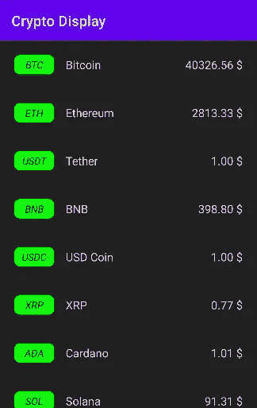
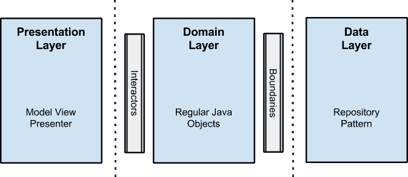

# 使用 Paging 3 库和 Jetpack Compose 显示加密货币价格

> 原文：<https://betterprogramming.pub/list-of-cryptocurrencies-using-paging-3-library-with-jetpack-compose-bd502e18ba4>

## 构建基于干净架构的 Android 应用


照片由 [Kanchanara](https://unsplash.com/@kanchanara?utm_source=medium&utm_medium=referral) 在 [Unsplash](https://unsplash.com?utm_source=medium&utm_medium=referral) 上拍摄

这是一个示例应用程序，演示了使用[分页 3 库](https://developer.android.com/topic/libraries/architecture/paging/v3-overview)和 [Jetpack 编写](https://developer.android.com/jetpack/compose)。该应用程序基于 Bob 叔叔的干净架构方法。还有，我用过科特林(当然)，流，MVVM，匕首刀柄。

GitHub 上知识库的链接:[https://github.com/mrvictorr/cryptopagingapp](https://github.com/mrvictorr/cryptopagingapp)

## **关于什么应用**

我选择了目前最热门的话题之一。我的应用程序显示了加密货币的列表。作为一个加密价格提供商，我使用过 [Messari api](https://messari.io/api/docs) 。这是它的样子:



加密货币列表

# **项目设置**

向`build.gradle`文件添加合成和分页所需的依赖关系。

匕首柄的依赖(依赖注入):

通过添加 *HiltAndroidApp* 注释来设置刀柄的应用文件

## 架构概述

应用程序分为数据层、域层和表示层。干净架构的主要思想是通过保持业务规则对外部世界一无所知来分离关注点。如果你不熟悉这个概念，我强烈建议你深入研究一下。



在这一节中，我将解释这个应用程序的实现。
让我们从**数据**层开始。我们从服务器上加载数据。下面是函数:

再来看`AssetsDataSource` *。这个类负责加载数据并缓存在变量中。在数据源中，我们只有一个函数加载下一页并保存在缓存中。*

`getAssets` 函数是从`AssetsRepositoryImpl`**类中调用的。*界面位于`AssetsRepository` 域中。这是我们如何对领域层隐藏存储库实现的最重要的技巧。*

*在域层中，我们有`GetAssetsSource` 类，它取代了我们架构中的交互器。
**层基本上是 MVVM 模式。***

***接下来，我将详细解释表示层和领域层。***

## ***分页源***

***[从某个来源提取可分页静态数据的基类，其中加载数据页通常是一项开销很大的操作。](https://developer.android.com/reference/kotlin/androidx/paging/PagingSource)***

***我们应该创建一个`PagingSource`类的子类来传递数据给我们的列表。有两个函数必须被覆盖***

```
***fun load (params: PagingSource.LoadParams<Int>)***
```

***和***

```
***fun getRefreshKey(state: PagingState<Int, AssetDomain>)***
```

***所有的神奇都发生在`load` 函数中，在这里我们从`AssetsRepository` 类中调用我们的`getAssets`函数。***

## ***在表示层设置分页***

***首先，我们转到`AssetsListViewModel`。在`getAssets()`函数中，我们从`GetAssetsSource` 中创建一个页面对象，并将其转换成流。在`init`中，函数将`PagingData`对象流传递给状态。***

***然后，在`AssetsListScreen` 中，我们可以从 ViewModel 中收集状态作为`PagingItems`，并在我们的列表中使用它。***

## ***使用 Jetpack 撰写的用户界面***

***我们就从`AssetListItem`开始吧*。在这里，我们可以找到绿色形状、名称和价格的符号。****

***在`AssetsListScreen` 中，我们仅使用`LazyColumn`显示项目:***

***希望这个故事能帮到你。***

***感谢您的阅读，祝您有美好的一天:)***