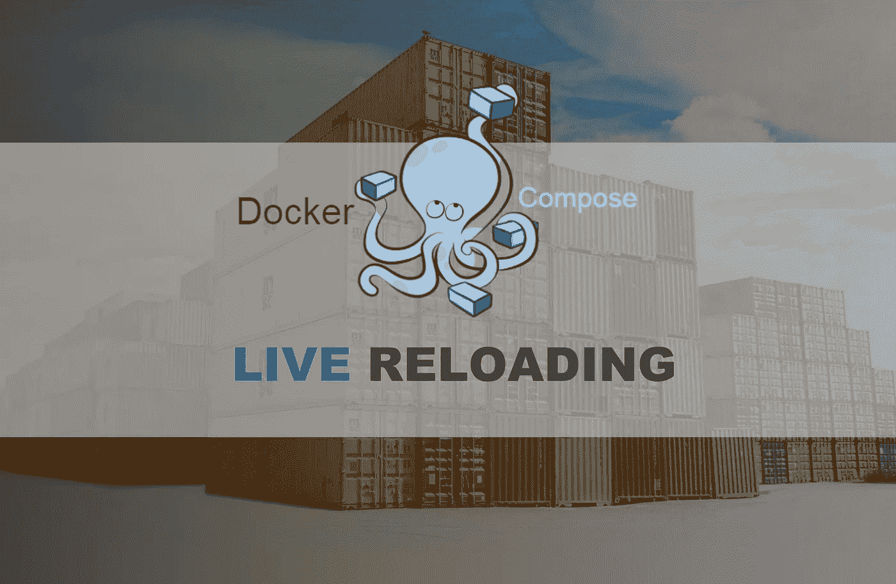

# 使用 Docker Compose 进行实时重新加载，以提高开发效率

> 原文：<https://betterprogramming.pub/live-reloading-with-docker-compose-for-efficient-development-356d50e91e39>

## 即插即用现场重装在 docker-组成与 docker-看门狗



由[弗兰克·麦肯纳](https://unsplash.com/@frankiefoto?utm_source=unsplash&utm_medium=referral&utm_content=creditCopyText)在 [Unsplash](https://unsplash.com/s/photos/containers?utm_source=unsplash&utm_medium=referral&utm_content=creditCopyText) 上拍摄的原始照片

# 介绍

毫无疑问，Docker 容器已经变得无处不在。考虑到集装箱化提供的灵活性和好处。这自然是意料之中的。

更重要的是，有了这些新的软件架构范例。例如微服务和无服务器，对独立的、隔离的软件组件的需求是突出的。即使事情变得更加复杂和相互关联，也有像 docker-compose 这样的补充工具，通过管理和链接许多容器使开发人员的生活变得更容易。

然而，随着这种情况的发展以及新技术的采用和部署，软件开发方法、实践和过程也必须跟上。否则，大量的时间会浪费在开发上，最终会与目的背道而驰。当我甚至不能一键本地测试时，一键部署有什么意义？

也就是说，这篇文章旨在通过演示如何配置一个`docker-compose`模板栈来允许在文件被修改时实时重新加载服务——而无需修改您现有的代码，来涵盖这个论点的一小部分。

只是澄清一下，这篇文章假设你熟悉 Docker 和`docker-compose`。

# 到底有什么问题？

这个`docker-compose`设计模式背后的灵感来源于我在本地运行`docker-compose`栈时的挫败感，每次修改代码都需要重启。

想象一下下面的场景:你正在使用一个 web 框架开发一个 web 应用程序，比如说一个 Django 应用程序(可以是任何语言的任何 web 框架)。

通常，您可以使用 Django 的命令行工具轻松开发应用程序，这些工具提供了开箱即用的自动加载功能。然而，随着项目的进展，您决定使用 Postgres，而不是 Django 默认的后端 SQLite。您还添加了芹菜工人的芹菜任务，为不同的应用程序功能添加了另一个 Flask 服务，最后，添加了一个 nginx web 代理。

如果没有容器，这将要求每个开发人员在他们的开发环境中分别运行 Postgres 服务器、celery workers、Flask 应用程序和 Django 应用程序，这样整个工作才能正常进行。除此之外，为一个新的开发人员设置开发环境来开始这个项目将是一场噩梦。而这一切都会污染你的个人机器。

那么解决这个问题的办法是什么呢？码头工人作曲。

所有这些都可以划分到 Docker 容器中，不同的服务可以在一个`docker-compose.yml`模板中定义，该模板允许开发人员只需一个命令就可以运行和链接整个堆栈。然后，一切都部署在它自己的隔离环境中，不再需要担心您的工作环境和依赖性。但是现在还有另一个问题。

每次你修改代码，你都必须重启`docker-compose`栈。这包括切换到终端，通常终止已经运行的`docker-compose`服务，因为它们是附加的。然后你等到它们被关闭并重新运行时，才发现你在代码中有一个打字错误。也许总共需要 15 秒钟。

我知道，我知道。十五秒听起来不算多。但是如果你要一遍又一遍地做这件事，那么浪费的努力会累积到你想都不敢想的程度。这是在考虑你的大脑在执行所有这些步骤时所遭受的环境转换之前。

很多时候，如果您使用开箱即用的框架开发工具进行实时重装(从而将源代码安装到容器上)，您就可以开始了，但是我已经看到并经历了很多容器的入口点非常复杂并且不支持实时重装的情况。这是一个确切的使用案例，其中这一块可以来拯救。

# 解决方案

为了实现上述功能，我可以使用一个名为 [watchdog、](https://pythonhosted.org/watchdog/)的文件监视工具，但是我想创建一个方法:

*   语言不可知
*   平台无关的
*   不需要修改现有的代码
*   没有任何依赖关系

考虑到这些，我想出了以下解决方案:

一个公共 Docker 映像，本质上是 Docker 中的 Docker (dind)映像，安装了 Python 和 watchdog，后者被用作重载服务。因为这是一个 dind 映像，所以它可以访问运行在主机上的容器，从而能够重新启动它们。它只需要通过环境变量正确安装和配置源代码目录。

回到前面定义的需求，一个单独的 Docker 图像标记了所有的框。它将是与语言和平台无关的，不需要任何依赖，并且它可以作为现有`docker-compose`文件的扩展，不需要修改。

以下是该项目的相关存储库:

[](https://github.com/apogiatzis/docker-compose-livereloader) [## apogiatzis/docker-compose-liver loader

### 这个 docker-compose 模式旨在为 docker-compose 栈提供即插即用的实时重载功能。一个…

github.com](https://github.com/apogiatzis/docker-compose-livereloader) 

# 入门指南

使用`docker-compose`直播重装器非常简单。首先，你需要有一份`docker-compose`文件。这个想法是创建一个新的本地`docker-compose`文件，扩展您现有的文件，并在您的堆栈中添加 reloader 服务。

按照以下步骤为您的项目启用实时重装:

## 1.创建一个新的 docker-compose yml 文件— `docker-compose-with-reloading.yml —` ，并添加以下内容:

```
version: '3'

services:

    service-name:
        container_name: <SERVICE_CONTAINER_NAME>
        volumes:
            - "<SOURCE CODE DIR>:<DIRECTORY_TO_MOUNT_CODE>" 
```

这将覆盖您想要自动重新加载的服务。

`service-name`应与现有名称的名称相匹配。此外，`volumes`标记是可选的，只有在您现有的`docker-compose`服务还没有安装源代码目录时才应该添加。

## 2.将实时重载图像添加到新创建的 docker-compose 文件中，使其与以下内容相匹配:

```
version: '3'

services:

    service-name:
        container_name: <SERVICE_CONTAINER_NAME>
        volumes:
            - "<SOURCE CODE DIR>:<DIRECTORY_TO_MOUNT_CODE>"

    live-reloader:
        image: apogiatzis/livereloading
        container_name: livereloader
        privileged: true
        environment:
          - RELOAD_DELAY=1.5              # seconds
          - RELOAD_CONTAINER=<SERVICE_CONTAINER_NAME>
        volumes:
          - "/var/run/docker.sock:/var/run/docker.sock"
          - "<SOURCE CODE DIR>:<DIRECTORY_TO_MOUNT_CODE>"
```

这里有几点需要强调。首先。请注意配置参数。

`RELOAD_DELAY`指定执行重新启动之前的时间，以便多次连续文件更改仅导致一次重新启动。默认值为 1.5 秒。

`RELOAD_CONTAINER`是应该在文件改变时重启的容器名。这应该与上面服务的`container_name`中指定的名称相匹配。

`RELOAD_DIR`可选参数，用于显式设置需要关注的目录。如果未提供，映像将使用在`volumes`部分中指定的挂载点的根文件夹。

## 3.运行 docker-撰写

要运行带实时重装的`docker-compose`，使用以下命令:

```
docker-compose -f docker-compose.yml -f docker-compose-with-reloading.yml up
```

相应地修改命令以匹配您的`docker-compose`文件。

# 例子

如果说明不够清楚，您可以查看相关 GitHub 资源库中提供的示例:

[](https://github.com/apogiatzis/docker-compose-livereloader) [## apogiatzis/docker-compose-liver loader

### 这个 docker-compose 模式旨在为 docker-compose 栈提供即插即用的实时重载功能。一个…

github.com](https://github.com/apogiatzis/docker-compose-livereloader)