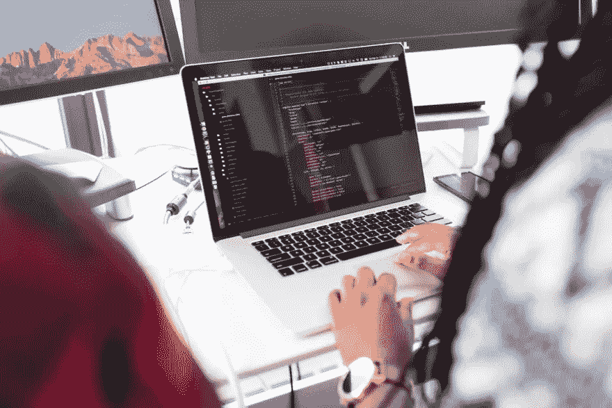

# 作为一名软件开发人员，生活在冒名顶替综合症中

> 原文：<https://betterprogramming.pub/living-with-imposter-syndrome-as-a-software-developer-ff93c055db38>

## 4.认识到人们对你工作的评价不是个人的


菲利普·德尔加多摄于[Pexels.com](https://www.pexels.com/photo/worms-eyeview-of-well-1601495/)

像许多其他人一样，我亲身经历了冒名顶替综合症。在我实习期间，我经常觉得自己很“幸运”,或者分配给我的任务会失败。

我的第一个任务是开发 Flask API，并将其与 Azure 服务集成。我以前有过使用 Flask 的经验，但是 Azure 的东西对我来说很新。

然而，这项服务有很好的文档记录，也有许多相关的文章。它只需要一点研究，整个任务不应该超过 2-3 天的开发时间。在此基础上，我估算了任务的故事点。但是，我没有考虑到的是冒名顶替综合症。

这花费了我两倍的时间，在最初的两天里，我几乎没有写任何代码。我希望我的代码是完美的，并且害怕写出糟糕的代码。我做了过多的研究，在文档上花费了过多的时间。

我害怕不能完成我的任务会让我成为一个糟糕的开发人员，以及那些像“我够好吗？”，“我配得上这个职位吗”开始悄悄出现。

我的大部分实际开发工作是在两天内完成的，尽管我认为我的代码是完美的，但我仍然需要多次修改来合并它。

虽然随着时间的推移，我感觉更舒服了，但我仍然感到到处都是骗子综合症。当我以实习生的身份加入另一家公司时，我的第一份公关文件花了我大约 10 次修改才得以合并。这使我再次陷入了冒名顶替综合征问题的陷阱。同样，随着时间的推移，我感觉更舒服。

我并不是说我已经成功地找到了一种对付冒名顶替综合症的方法，也不是说这篇文章会对你的冒名顶替综合症有所帮助，但我希望你知道有人正经历着和你一样的事情后会感觉好一些。

我很确定，当我开始在英国《金融时报》的工作时，我也会经历冒名顶替综合症。这篇文章的内容是根据我的亲身经历和我在经历冒名顶替综合征时看过的各种文章写的。请随意评论任何事情并给予反馈。

# 什么是冒名顶替综合症？

冒名顶替综合症在许多计算机程序员的头脑中是一种有害的模式。它表现在你不够好，而其他人都比你有更好的想法或更有能力的恐惧中。

你可能会觉得你总是处于被发现的边缘，有人看穿你的外表并揭露你的失败只是时间问题。

冒名顶替综合症是一种危险的思维模式，它让你觉得自己在目前的工作或职业道路上不称职。如果你不小心，这可能会导致生产力下降，工作道德低下，以及自卑。这也已经被证明影响了世界上许多软件开发人员。

# 冒名顶替综合症的症状

*   最常见的早期迹象之一是难以做出决定，怀疑主观和客观决策。你可能会觉得自己拿不定主意，或者总会做出错误的决定。通常，这将导致不冒任何风险，这往往使事情变得更糟。当不好的事情发生时，你会很快责备自己，变得更加优柔寡断。
*   你也可能觉得你周围的每个人都比你更聪明或更擅长自己的工作。你不断地将自己与他人进行比较，以此来定义自己的能力。这样做的问题在于，它降低了你自身成就的价值，让你觉得不值得表扬。
*   最后，冒名顶替综合症通常是一种相反的效应，你取得的进步越多，成就越积极，你就越觉得自己是个骗子或失败者。你可能认为这一切都会过去，没有人会再次承认你的成功。这使得享受一份工作或职业变得困难，因为不断的自我怀疑，即使事情进展顺利。

# 如何应对冒名顶替综合症？

虽然没有放之四海而皆准的答案，但这里有一些想法可能会帮助你应对冒名顶替综合症:

*   向某人倾诉你的感受。与理解你经历的人交谈真的会很有帮助。找一个你信任的人，谈谈你的经历、感受和想法。这可以帮助你对形势有所了解。
*   不要拿自己和别人比较。这说起来容易做起来难，但重要的是要记住检查你的自我和从别人的错误中学习的重要性，这样你才能改进你自己的工作。意识到别人在做什么很重要，这样你就可以向他们学习，但是经常拿自己和别人比较是不健康的。
*   把你的成功归功于自己。记住所有你做得好的事情？为他们骄傲！如果你犯了错误，不要老想着它。没有人是完美的。这就是为什么你不应该拿自己和别人比较，因为每个人都会犯错。当你做得好的时候，不要害怕表扬自己。
*   不断学习新技能，即使它们与你的工作或职业道路没有直接关系。你可能会觉得自己对某个话题了如指掌，但总会有更多东西需要学习。永远不要因为你擅长某事就停止学习。不断扩大你的知识面，这样你就能轻松应对新的情况和挑战！

# 作为软件开发人员处理冒名顶替综合症的技巧



克里斯蒂娜·莫里路在 Pexels.com 拍摄的照片

*   作为一名软件开发人员，检查你的自我并从别人的错误中学习是很重要的。当你在团队中工作时，倾听他人的想法并接受建设性的批评是至关重要的。你还需要足够谦虚，从自己的错误中吸取教训。如果你能做到这一点，那么你就能成为一名更好的开发人员，并为你的团队做出更多贡献。
*   它还可以通过在任务之间短暂休息，将任务重新组织成类别，或者做一些与你的工作或职业道路无关的兼职项目来帮助打破一天或一周。这可以让你远离工作压力，而不会牺牲太多时间，因为其他任务与工作无关。
*   设定短期目标，试着想象一旦你实现了这些目标会是什么样子。
*   你也可以试着锻炼、冥想或反思你的一天，来帮助你重新聚焦并找到内心的平静。如果你因为冒名顶替综合症而感到特别紧张，那么在回去工作之前深呼吸几次会有所帮助。
*   最后，重要的是不要不公平地将自己与其他开发人员进行比较。你需要理解建设性批评的价值，并从错误中吸取教训。这样，你将能够作为一名开发人员得到提高，并为你的团队做出更多贡献。

# 作为一名软件开发人员，生活在冒名顶替综合症中

作为一名软件开发人员，患有冒名顶替综合症是很困难的，大多数人并不知道他们正在经历这种情况。你可能认为你不够好，或者其他人都比你有更好的想法。

如果你在一个创造性的领域，你的工作仅仅是你自己的想法和观点，这可能会特别困难。如果你怀疑这是你正在发生的事情，花些时间去了解更多，看看这是否是你不安全感的原因。

知道任何人都可能经历冒名顶替综合症后，你可能会感到安慰——没有人能免于感到无能，即使他们长期以来工作出色。

虽然这种感觉可能需要一段时间才能消失，但如果你遵循下面的步骤，你就有可能不再觉得自己是个骗子。

## 1.迎头解决你的冒名顶替的想法

关于冒名顶替综合症，需要知道的一件重要事情是，它不会自行消失；如果你什么都不做，你很可能会发现自己一直觉得自己是个骗子。对抗这些想法的最好方法之一就是简单地反驳它们。当你发现自己在想“我不够好”，或者“人们会发现我是个骗子”，反驳这些想法，尽可能保持逻辑思维。例如，“我可能不是最有经验的开发人员，但我已经工作两年了，看起来我做得很好。”

## 2.找一个导师

有一个你可以谈论你的感受的外部人士是有帮助的，因为总会有人提醒你，你实际上做得很好，并且当你发现自己在原地打转时，他能够提供洞察力。与导师分享你的感受也有助于他们理解如何帮助你，因为他们会对你的具体问题有更好的了解。

## 3.感谢你迄今为止的工作

试着回顾你过去的工作，找出你做得好的地方。你可能会发现几个月前你比现在做得更好——但这并不意味着你不够好，不能做你今天正在做的事情！

## 4.认识到人们对你工作的评价不是个人的

关于冒名顶替综合症最困难的事情之一是，你可能觉得人们不是在评判你的工作，而是在评判你这个人。然而，这种感觉背后的真相是，当评判到来时，那只是因为有人发现了你工作中的问题——尽管他们可能会指出你的错误，但这与你个人无关。

当你有冒名顶替综合症时，可能很难记住这一点，但如果你记住这一点，那么就更容易克服有人对你的角色提出指控的恐惧。正如我前面提到的，我的一个 PRs 需要大约 10 次修改，但是每次修改都能帮助我学到一些东西。对我的 PR 的评论帮助我减少了未来 PR 所需的修改数量，并且帮助我成为一名更好的开发人员。

# 结论

我希望这篇文章对你有所帮助。请让我知道你是否找到了任何其他方法来处理冒名顶替综合症，如果你觉得舒服，请分享你的冒名顶替综合症的经历。这将使我和其他开发者更有信心。

```
**Want to Connect With the Author?**This article was originally posted on [realpythonproject.com](https://www.realpythonproject.com/living-with-imposter-syndrome-as-a-software-developer/)
```