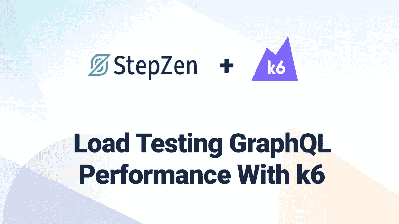
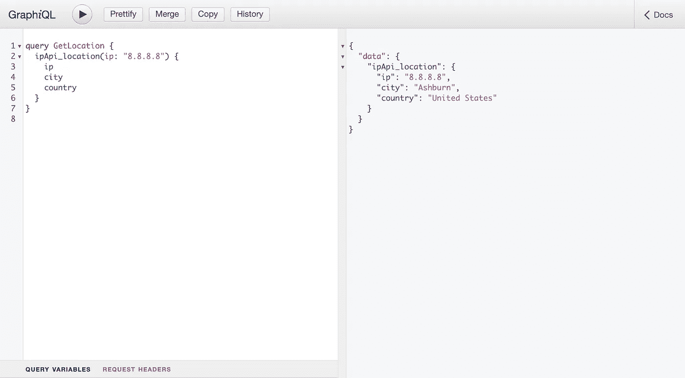
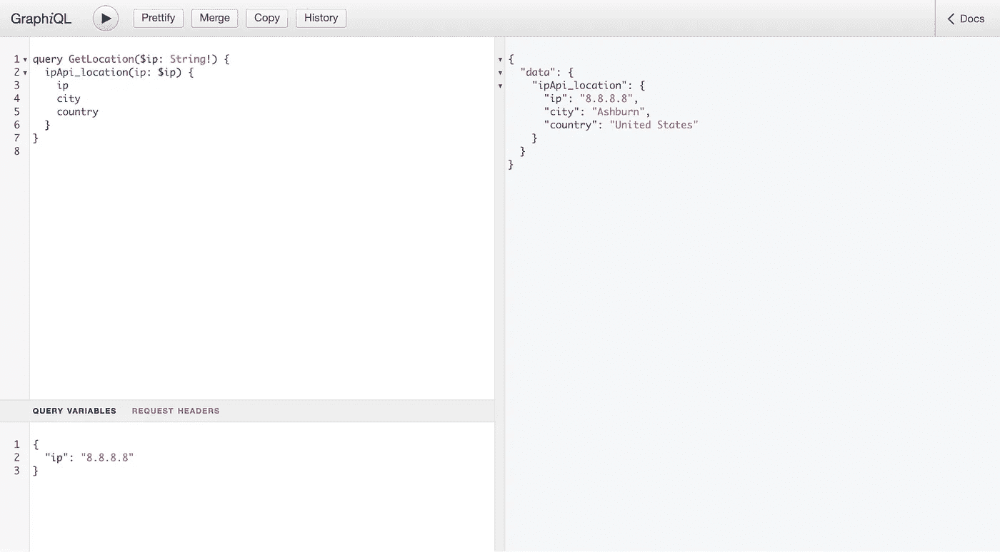
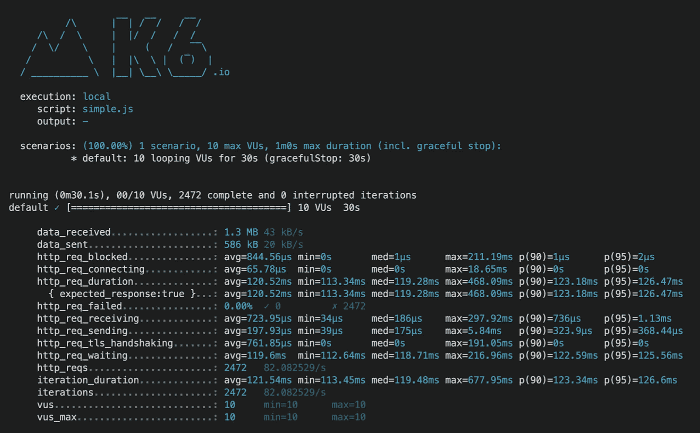
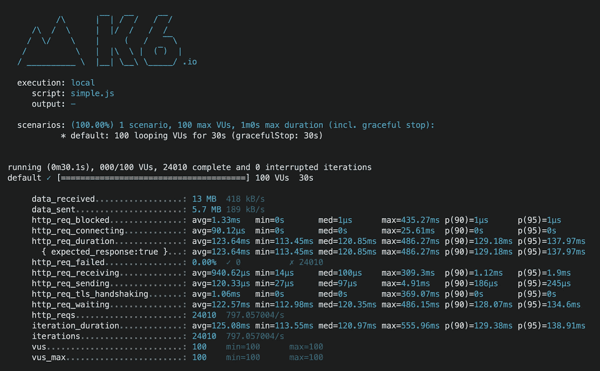
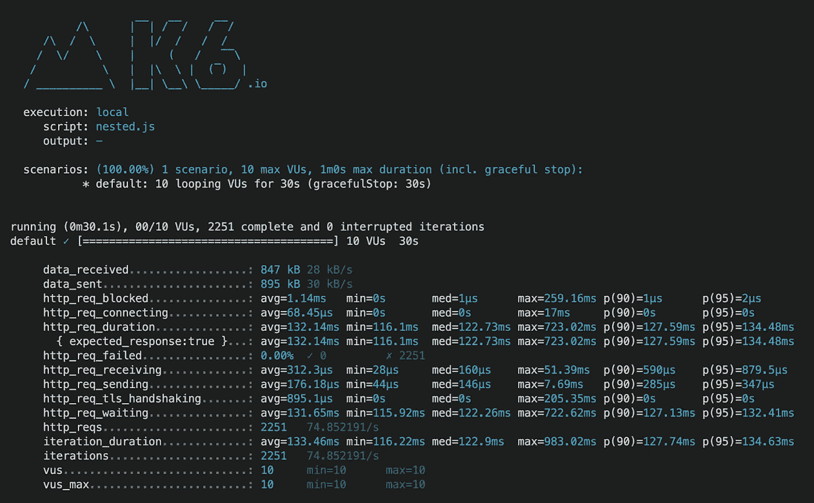
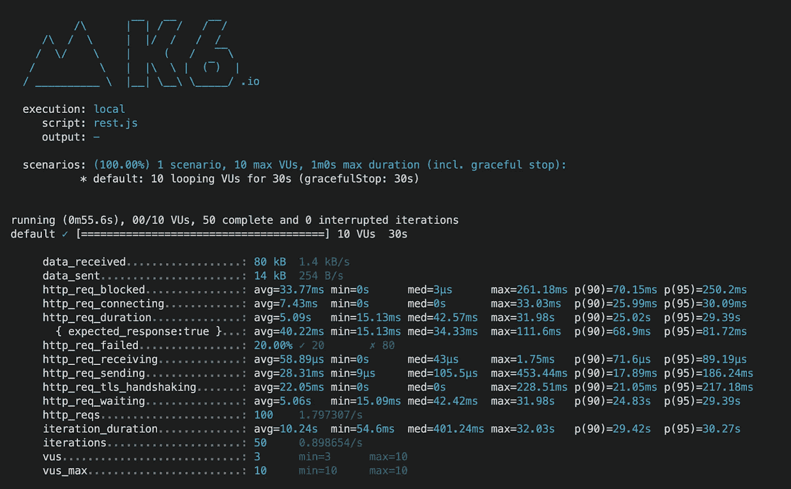

# 使用 k6 和 StepZen 负载测试 GraphQL 性能

> 原文：<https://betterprogramming.pub/load-testing-graphql-performance-with-k6-and-stepzen-949e0e10c328>

## 简化负载测试的简要指南



对于许多公司来说，性能是使用 GraphQL 的主要原因。但这是一个有效的论点吗？开发人员经常将 GraphQL 与 REST APIs 进行比较，并将 N+1 请求(或过度提取)视为选择 GraphQL 的一个重要原因。

让我们来测试一下，看看 GraphQL APIs 是否能超越现有的 REST APIs。为此，我们将采用两个 GraphQL 化的 REST API(IP-API 和 Frankfurter)并对 GraphQL 的性能进行负载测试，将 GraphQL 中的嵌套数据与原始 REST API 进行比较。

我们将使用工具 [k6](https://k6.io/) ，这是当今最流行的负载测试工具之一，来做这个性能测试。

# 探索 GraphQL API

让我们探索一个从 REST API 转换而来的 StepZen GraphQL API。在这种情况下，我使用 StepZen CLI 将 IP-API REST API 转换为 GraphQL，使用文档中的[指令](https://stepzen.com/docs/quick-start/with-rest-import)。这个免费的 REST API 允许您根据 IP 地址搜索位置。我们用 StepZen 图形化了 [IP-API](https://ip-api.com/) REST API，并用 GraphiQL 进行了探索。GraphiQL 接口可以在[这里](https://graphqldd.stepzen.net/api/dd1cf47f51ac830fe21dc00ec80cee65/__graphql?query=query%20GetLocation%20%7B%0A%20%20ipApi_location%28ip%3A%20%228.8.8.8%22%29%20%7B%0A%20%20%20%20ip%0A%20%20%20%20city%0A%20%20%20%20country%0A%20%20%7D%0A%7D%0A)找到，如下所示:



您可以在屏幕的左侧看到发送给 GraphQL API 的查询，而右侧显示响应。它被命名为`GetLocation`。建议命名查询，因为它有助于 GraphQL APIs，例如，缓存。另外，请注意，响应与您请求的查询具有相同的形状。

在研究了这个 GraphQL API 之后，让我们设置 k6，以便在下一节中使用它来测试 GraphQL。

## 将 k6 用于 GraphQL

为了对这个 GraphQL API 进行负载测试，我们将使用一个开源负载测试工具 [k6](https://k6.io/) 。您可以在本地机器上运行 k6，方法是从 GitHub 存储库安装或者使用 k6 的云产品。使用这个工具，您可以测试任何接受 HTTP 请求的 API。您可以运行的最简单的测试是使用 k6 的`[http.post](https://k6.io/docs/javascript-api/k6-http/post)`函数。代码如下:

这个 k6 脚本现在可以使用查询来加载测试 GraphQL API 的性能。因为 IP 地址是静态的，所以 k6 会在你的性能测试中反复提出同样的请求。

此外，由于 GraphQL API 将缓存结果，测试将变得不太现实，因为不同的用户在访问 GraphQL API 时将使用不同的 IP 地址。因此，您应该在 GraphQL 查询中使用动态变量。具有动态值`ip`的相同查询将如下所示:

```
query GetLocation($ip: String!) {
  ipApi_location(ip: $ip) {
    ip
    city
    country
  }
}
```

当发送请求时，您需要在 GraphQL 查询旁边附加一个 JSON 对象，其中包含一个值为`ip`。如果您访问 [GraphiQL 界面](https://graphqldd.stepzen.net/api/dd1cf47f51ac830fe21dc00ec80cee65/__graphql?query=query%20GetLocation%28%24ip%3A%20String%21%29%20%7B%0A%20%20ipApi_location%28ip%3A%20%24ip%29%20%7B%0A%20%20%20%20ip%0A%20%20%20%20city%0A%20%20%20%20country%0A%20%20%7D%0A%7D%0A&variables=%7B%0A%20%20%22ip%22%3A%20%228.8.8.8%22%0A%7D)，您可以使用“查询参数”选项卡:



使用动态查询参数，您可以使用 k6 的`[http.batch](https://k6.io/docs/javascript-api/k6-http/batch/)`函数向 GraphLQ API 发送多个带有不同`ip`值的请求，以模拟更真实的测试场景:

运行这个 k6 脚本将向 GraphQL API 发送一批具有不同 IP 地址的请求。这些请求是并行发送的，这比只发送一个请求更现实。你也可以创建一个 IP 地址数组，然后循环创建一个新的数组，传递给`http.batch`函数。下一节将使用这些脚本用 k6 对这个 GraphQL API 进行性能测试。

## 负载测试 GraphQL 查询

设置好 k6 脚本后，我们现在可以在 GraphQL API 上进行性能测试。我们可以运行两个测试，一个使用静态 IP 地址，另一个使用批量请求和动态 IP 地址。运行这些测试只需要你在本地机器上下载 [k6 并安装](https://k6.io/docs/getting-started/installation/)，或者你应该有一个 k6 云账户。

要运行第一个测试，您需要将脚本保存在一个名为`simple.js`的文件中，这样您就可以使用:

```
k6 run --vus 10 --duration 30s simple.js
```

这个命令用 10 个 vu(虚拟用户)运行 K6 30 秒。要获得更多关于运行 k6 的信息，请点击[这里](https://k6.io/docs/getting-started/running-k6/)。



结果显示，GraphQL API 在 30 秒内被点击了近 2500 次，平均持续时间为 122 毫秒。这非常接近于 95%的所有请求的平均命中持续时间，意味着没有异常值。

通过查看结果，我们还可以测试运行在 StepZen 上的 GraphQL API 的可伸缩性。因此，我们需要仔细看看 GraphQL API 处理的迭代次数:

```
iterations.....................: 2472 82.082529/s
```

当我们用 10 个并发 vu 运行 k6 脚本 30 秒时，您可以看到 k6 命中 GraphQL API 近 2500 次——或每秒 82 次。如果 GraphQL API 是完全可伸缩的，当我们将并发 vu 的数量增加到 100 时，它应该能够处理十倍以上的迭代。让我们试试这个:

```
k6 run --vus 100 --duration 30s simple.js
```

这将导致以下结果:



正如对一个完美的可伸缩服务的预期，迭代次数不是 820 次而是 798 次，只有 3%的差别。GraphQL API 的可伸缩性并不完美，但已经非常接近完美了。

除了用静态 IP 地址测试简单的查询之外，我们还可以通过将动态 IP 地址放在一个名为`batch.js`的文件中来运行这个脚本:

```
k6 run --vus 10 --duration 30s batch.js
```

这个测试中对 GraphQL API 的迭代是成批发送的，这意味着每次迭代都会产生三个 HTTP 请求——这是添加到`http.batch`函数的请求数。正如我们之前所了解的，GraphQL API 几乎是完全可伸缩的。

GraphQL API 在这个测试中可以处理的迭代次数应该大致相同，而 HTTP 请求的数量应该大三倍左右。当我运行测试时，迭代次数导致:

```
http_reqs......................: 7251   240.737555/s
iteration_duration.............: avg=124.43ms min=116.53ms med=121.91ms max=509.1ms  p(90)=126.39ms p(95)=129.13ms
iterations.....................: 2417   80.245852/s
```

对于 2417 个请求和 2500 个请求，迭代次数是相当的，HTTP 请求的数量是迭代次数的三倍。

现在我们知道 k6 可以测试 GraphQL API 的性能，并且 graph QL API 是可伸缩的。让我们在下一节测试一个更重的 GraphQL 查询。

## 负载测试不同的数据源

确定数据形状的能力并不是开发人员采用 GraphQL 作为 API 查询语言的唯一原因。GraphQL APIs 只有一个端点，查询(或其他操作)也可以处理嵌套数据。您可以在一个请求中从不同的数据库表(如 SQL 连接)甚至不同的数据源请求数据。这与 REST APIss 不同，在 REST API 中，您通常必须访问多个端点才能从其他来源获取数据。

在我们正在测试的 StepZen GraphQL API 的[graph QL 接口中，您可以探索其他可用的查询。其中一个查询将从](https://graphqldd.stepzen.net/api/dd1cf47f51ac830fe21dc00ec80cee65/__graphql?query=query%20GetConversion%20%7B%0A%20%20frankfurter_latest_rates%28from%3A%20%22EUR%22%2C%20to%3A%20%22USD%22%29%20%7B%0A%20%20%20%20amount%0A%20%20%20%20base%0A%20%20%20%20date%0A%20%20%20%20rates%0A%20%20%7D%20%0A%7D%0A) [Frankfurter](https://www.frankfurter.app/) REST API 获取数据，REST API 是一个包含欧洲央行发布的当前和历史汇率数据的开源 API。

这个 REST API 使用 StepZen 以与 IP-API 相同的方式转换为 GraphQL。要获得欧元对美元的当前兑换率，您可以查询:

```
query GetConversion {
  frankfurter_latest_rates(from: "EUR", to: "USD") {
    amoun
    base
    date
    rates
  }
}
```

上面的查询获得了当前日期从 1 欧元到美元的汇率。因为这个 API 的模式是来自 IP-API 和 Frankfurter 的数据的组合，所以您可以做更多的事情。使用这种组合，您可以根据 IP 地址获得当前位置，并将该位置的本地货币转换为美元。

该货币转换可在字段`priceInCountry`中获得。您可以通过访问 [GraphiQL 接口](https://graphqldd.stepzen.net/api/dd1cf47f51ac830fe21dc00ec80cee65/__graphql?query=query%20GetConversion%28%24ip%3A%20String%21%2C%20%24amount%3A%20Float%21%2C%20%24from%3A%20String%21%29%20%7B%0A%20%20ipApi_location%28ip%3A%20%24ip%29%20%7B%0A%20%20%20%20ip%0A%20%20%20%20city%0A%20%20%20%20country%0A%20%20%20%20currency%0A%20%20%20%20priceInCountry%28amount%3A%20%24amount%2C%20from%3A%20%24from%29%0A%20%20%7D%0A%7D%0A&variables=%7B%22amount%22%3A1%2C%22from%22%3A%22EUR%22%2C%22ip%22%3A%228.8.8.8%22%7D%0A)或下图来查看结果:


除了 IP 地址位置之外，该查询还让 GraphQL API 将欧元转换为该位置的本地货币。在这种情况下，这意味着再次将欧元转换为美元。

为了获得这些数据，GraphQL API 将执行以下操作:

*   向底层 IP-API REST API 发送请求，根据 IP 地址获取位置和货币；
*   使用 Frankfurter REST API 将该地点的货币转换为欧元。

我们可以在 k6 脚本中使用这个嵌套查询来对 GraphQL API 进行另一个性能测试。这个查询的深度与我们在上一节中使用的查询不同，因为数据来自不同的来源，所以现在是嵌套的。您可以将下面的 k6 脚本放在一个名为`nested.js`的新文件中:

并在与之前测试相同的环境下运行它:

```
k6 run --vus 10 --duration 30s nested.js
```

这个性能测试的结果类似于批处理请求的测试结果。批处理不是发生在 k6 脚本中，而是发生在 GraphQL API 中，它处理对底层 REST APIs 的两个请求。

由于 GraphQL API 是为高性能而构建的，所以只获取 IP 地址位置的初始查询与获取 IP 地址位置和货币转换的查询之间的差异很小。您可以在下面的 k6 负载测试的输出中检查一些内容:



我们刚刚运行的测试表明，GraphQL 完全能够在一个请求中从不同来源获取数据。让我们在最后一节将 GraphQL 查询分解为 REST API 请求来证明这一点。

# 将 GraphQL 与 REST 性能进行比较

您已经了解了如何使用 k6 测试 GraphQL 的性能，以及它与测试 REST API 有何不同。我们测试的最后一个 GraphQL 查询调用了两个不同的 REST API 端点。我们可以尝试两种场景来比较 GraphQL 和 REST 的性能。

要么设置两个单独的测试，将各个 REST 端点的性能与其对应的 GraphQL 查询进行比较，要么通过从 k6 测试中直接调用两个 REST API 端点来重新创建 GraphQL API 的完整行为。

后者是最有趣的测试，因为两个 REST 端点都需要为 GraphQL 查询返回数据以进行解析。我们测试的 GraphQL 查询行为是:

```
query GetConversion($ip: String!, $amount: Float!, $from: String!) {
  ipApi_location(ip: $ip) {
    ip
    cit
    country
    currency
    priceInCountry(amount: $amount, from: $from)
  }
}
```

这会向 REST 端点发送请求:

*   从 IP-API: `[http://ip-api.com/json/8.8.8.8?fields=city,country,currency](http://ip-api.com/json/8.8.8.8?fields=city,country,currency)`获取 IP 地址`8.8.8.8`的位置和货币
*   将 IP 地址位置的货币转换为法兰克福的欧元: `[https://api.frankfurter.app/latest?amount=1&from=EUR&to=USD](https://api.frankfurter.app/latest?amount=1&from=EUR&to=USD)`

为了使用 k6 进行测试，您需要在一个新文件中设置以下脚本，我们称之为`rest.js`:

这个 k6 性能测试不仅会调用两个 REST 端点。但是在真实的场景中，如果第一个请求没有返回 IP 地址的本地货币，那么到达第二个端点将位置的货币转换成欧元是没有意义的。

在与其他测试相同的条件下运行上述测试:

```
k6 run --vus 10 --duration 30s rest.js
```

这给出了以下结果:



最突出的一点是，只有 50 次迭代(每次迭代有两个 HTTP 请求)在 30 秒内完成。在这些测试中，只有 3 个 vu 能够发送请求，所有请求中有 20%都失败了。与 GraphQL API 相比，这些测试结果令人失望。两个 REST APIs 的图形化版本可以处理更多的请求并更快地解决它们。这是为什么呢？

使用 StepZen 创建的 GraphQL API 应用了缓存，而 REST API 本身似乎根本没有应用任何缓存。对 IP-API 端点的请求似乎有 20%的时间会失败。此外，GraphQL API 还会在需要时对 N+1 请求进行批处理或优化。例如，您需要两次从 currency REST API 请求相同的数据。

# 结论

GraphQL 的使用一直在增加，特别是在前端开发人员中，他们需要一种更具声明性的方式来处理数据。在这篇文章中，我们探讨了如何使用 k6 对 GraphQL API 进行性能测试。这个 GraphQL API 是用 StepZen 通过转换来自 IP-API 和 Frankfurter 的开源 REST APIs 创建的。测试结果显示，GraphQL API 在所有场景下都接近完美的可伸缩性和高性能。

相比之下，在测试中，单独的 REST API 端点有显著的性能问题。这是由于 StepZen GraphQL API 的性能优化，比如缓存。有关 GraphQL 的完整性能测试脚本，请参见 [this repository](https://github.com/stepzen-dev/stepzen-graphql-benchmark) 中的 StepZen GraphQL 基准测试工具。

```
**Want to connect?**Learn more or ask questions about StepZen on the Discord [here](https://discord.com/invite/9k2VdPn2FR).
```