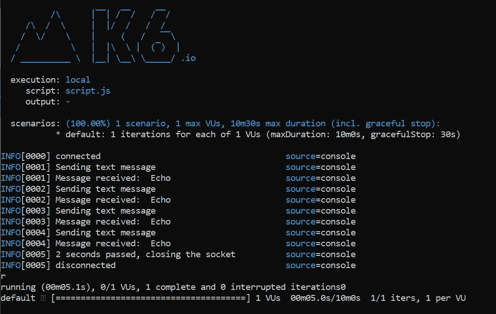
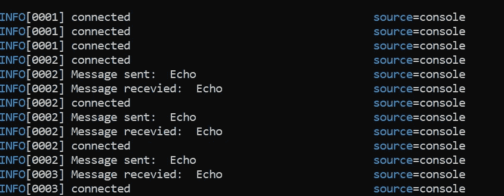
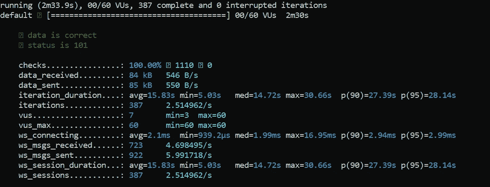

# 用 k6 负载测试 WebSockets

> 原文：<https://betterprogramming.pub/load-testing-websockets-with-k6-feb99bf75798>

## 使用内置的 WebSocket 客户端来测试服务器的性能



作者图片

基于我之前关于 k6 的文章，本文的主题是负载测试 WebSocket。与 HTTP 不同，WebSocket 通过单个 TCP 连接提供全双工通信通道。这使您的服务器能够直接向用户发送推送通知。

幸运的是，k6 提供了自己的基于 WebSocket 协议的`ws`客户端。它与`http`客户端略有不同，因为每个 VU 运行在一个异步事件循环上。

# 设置

## k6 安装

在我们开始之前，确保您已经为 k6 安装了必要的包和模块。请参考[我之前的文章](/an-introduction-to-k6-an-api-load-testing-tool-132a0d87827d)关于如何在你的本地机器上安装 k6。

## 使用自己的 WebSocket 服务器(可选)

本教程假设您已经有一个 WebSocket 服务器。如果您没有，请使用基于 FastAPI 的[脚本](https://gist.github.com/wfng92/7f62108abdbe3680acacd2904e8969a9)。它将回显用户通过 WebSocket 发送的消息。

您可以在以下文档的[中找到安装步骤。](https://fastapi.tiangolo.com/advanced/websockets/)

通过以下命令运行它:

```
uvicorn myapp:app
```

## 使用公共 WebSocket 服务器

如果您在设置 FastAPI 时遇到问题，并且想要测试 k6，只需用任何公共 WebSocket URL 替换 websocket URL。

例如，您可以使用来自 [javascript.info](https://javascript.info/websocket) 的以下链接:

```
wss://javascript.info/article/websocket/demo/hello
```

# 基础知识

为了使用`ws`客户端，你必须如下导入它:

```
import ws from 'k6/ws';
```

然后，您可以调用内置的`connect`函数来建立到您的服务器的连接。

```
const url = 'ws://localhost:8000/ws';
const res = ws.connect(url, null, function (socket) {
    ...
}
```

`connect`功能接受以下输入参数:

*   `url` —请求的字符串 URL
*   `params` —包含附加参数的对象
*   `callback`—web socket 连接发起时将调用的回调函数。它代表`Socket`对象。

`Socket`对象带有以下方法:

*   `close` —关闭连接
*   `on (event, callback)` —以下事件的事件监听器:打开、消息、乒、乓、关闭、错误
*   `ping` —向 WebSocket 服务器发送 ping 请求
*   `send (data)` —向 WebSocket 服务器发送数据
*   `setInterval(callback, interval)` —每隔一段时间重复调用一个函数
*   `setTimeout(callback, timeout)` —延迟后调用函数

让我们用示例代码片段逐一查看它们。

## 关闭

完成后，您需要关闭与 WebSocket 服务器的连接。您可以简单地调用`socket.close()`来完成这项工作。

```
const res = ws.connect(url, null, function (socket) {
  ...
  socket.close();
}
```

## 开(事件，回调)

`on`函数支持创建事件监听器。当连接建立时，您可以使用它来记录消息，甚至检查服务器发送的数据。

```
const res = ws.connect(url, null, function (socket) {
  ...
  socket.on('open', () => console.log('connected'));
  socket.on('message', (data) => console.log('Received: ', data));
  socket.on('close', () => console.log('disconnected'));
}
```

## 砰

发送 ping 请求是检查服务器健康状态的常用方法。您可以通过以下代码来实现:

```
const res = ws.connect(url, null, function (socket) {
  ...
  socket.ping();
}
```

## 发送(数据)

发送数据就像调用`send`函数一样简单。它接受一个输入字符串。对于发送 JavaScript 对象，只需在发送之前通过`JSON.stringify`将其转换成 JSON 字符串。

```
const res = ws.connect(url, null, function (socket) {
  ...
  socket.send('text');
  socket.send(JSON.stringify({ data: 'hello' }));
}
```

## setInterval(回调，间隔)

您可以通过`setInterval`功能以一定的间隔重复执行一个功能。例如，只要连接仍然打开，就可以每秒钟向 WebSocket 服务器重复发送一次数据。

```
const res = ws.connect(url, null, function (socket) {
  ...
  socket.setInterval(function interval() {
    socket.send('Hello');
  }, 1000);
}
```

`interval`以毫秒为单位。对于一秒钟的间隔，您必须使用`1000`作为输入参数。

## setTimeout(回调，超时)

`setTimeout`是另一个有用的功能。它会在延迟后触发一个功能。例如，您可以使用它在几秒钟的延迟后关闭到 WebSocket 服务器的连接。

```
const res = ws.connect(url, null, function (socket) {
  ...
  socket.setTimeout(function () {
    socket.close();
  }, 5000);
}
```

# 履行

让我们结合您所学的所有知识，构建一个简单的负载测试脚本。创建一个名为`k6-websocket-script.js`的新 JavaScript 文件。

## 导入

在文件顶部添加以下 import 语句。

```
import ws from 'k6/ws';
import { check } from 'k6';
```

## 选择

接下来，设置用于测试的选项。测试包括以下几个阶段:

*   从在 10 秒内生成 30 个新 vu 开始
*   保持真空状态 30 秒
*   继续在 20 秒内将 VUs 升至 60
*   保持真空状态 30 秒
*   在 20 秒内将 VUs 缩减至 30
*   保持真空状态 30 秒
*   在 10 秒钟内慢慢将 VUs 降至 0

```
export let options = {
  stages: [
    { duration: '10s', target: 30 },
    { duration: '30s', target: 30 },
    { duration: '20s', target: 60 },
    { duration: '30s', target: 60 },
    { duration: '20s', target: 30 },
    { duration: '30s', target: 30 },
    { duration: '10s', target: 0 },
  ],
};
```

您可以根据自己的喜好随意修改 vu 的数量。

## 主要功能

使用以下变量创建一个新的默认函数:

```
export default function () {
  const text = 'Echo';
  const url = 'ws://localhost:8000/ws';
}
```

继续在它下面添加下面的代码。它将首先建立到 WebSocket 服务器的连接，并设置一个事件监听器。在监听器内部，它包含了`setInterval`函数，这个函数会每秒钟向服务器重复发送一次数据。

```
export default function () {
  ...
  const res = ws.connect(url, null, function (socket) {
    socket.on('open', function open() {
      console.log('connected');
      socket.setInterval(function interval() {
        socket.send(text);
        console.log('Message sent: ', text);
      }, 1000);
    });
  });
}
```

之后，再实现两个事件侦听器:

*   检查从服务器收到的消息的传入数据，并将其记录到控制台
*   套接字关闭时记录到控制台

```
export default function () {
  ...
  const res = ws.connect(url, null, function (socket) {
    ...
    socket.on('message', function message(data) {
      console.log('Message received: ', data);
      check(data, { 'data is correct': (r) => r && r === text });
    }); socket.on('close', () => console.log('disconnected'));
  });
}
```

关闭连接最简单的方法是通过`setTimeout`功能。让我们配置它在五秒钟(`5000`毫秒)后关闭。

```
export default function () {
  ...
  const res = ws.connect(url, null, function (socket) {
    ...
    socket.setTimeout(function () {
      console.log('5 seconds passed, closing the socket');
      socket.close();
    }, 5000);
}
```

最后，添加一个最终检查函数来确定返回的响应对象是否处于状态`101`。它代表 WebSockets 使用的交换协议。

```
check(res, { 'status is 101': (r) => r && r.status === 101 });
```

你可以在下面的链接中找到`[script.js](https://gist.github.com/wfng92/cbeb5e62a3f8ca651c88e10c953463f5)`T7 的完整代码。

# 试验

让我们通过在新的终端中运行以下命令来测试这个脚本。

```
k6 run k6-websocket-script.js
```

您应该在控制台中看到下面的用户界面，它表明测试正在运行，没有错误。



作者图片

在测试结束时，您应该得到下面的输出，指示负载测试的结果。



作者图片

# 结论

让我们回顾一下今天学到的内容。

本教程首先简要解释了 WebSocket 和 HTTP 之间的区别。

下一步是设置和安装必要的包。

稍后，本文将引导您深入探索 k6 提供的 WebSocket 模块背后的基本概念和用法。

之后，我们进入实现部分，在这里您构建了自己的负载测试脚本，它验证了`Response`状态是否为`101`，并检查了 WebSocket 服务器发送的消息。它会在五秒钟后与服务器断开连接。

最后，测试部分介绍了如何运行脚本并分析测试结果。

感谢阅读。希望在下一篇文章中再见到你！

# 参考

1.  [k6 — WebSockets](https://k6.io/docs/using-k6/protocols/websockets) 教程
2.  [k6 — WebSockets API](https://k6.io/docs/javascript-api/k6-ws)
3.  [FastAPI — WebSockets](https://fastapi.tiangolo.com/advanced/websockets/)