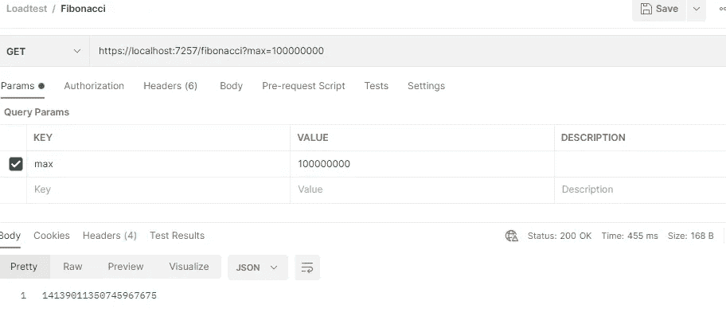
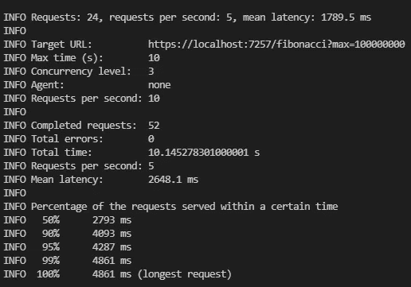
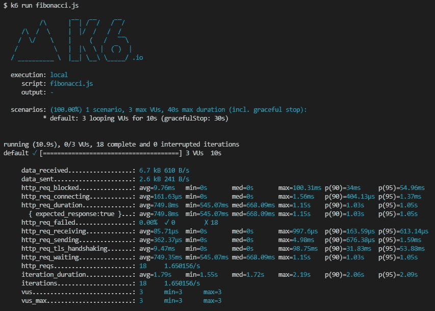

# 了解负载与压力测试

> 原文：<https://betterprogramming.pub/load-vs-stress-tests-ee49ae110b1d>

## 了解差异并开始创造它


数码艺术家在 [Pixabay](https://pixabay.com/pt/) 上拍摄的照片

每个人都知道在我们的应用程序中进行测试是多么重要，大多数开发人员都非常熟悉单元测试、集成测试、冒烟测试、猴子测试等等，但是在没有负载或压力测试的项目中工作并不罕见，同样，听到关于它们到底是什么以及它们之间的差异的不同版本也不罕见。

事实是，负载和压力测试创建起来非常简单，它们之间的区别非常清楚，也很容易理解。

在本文中，我将开始解释它们的区别，然后展示如何使用两个简单的工具实现非常简单的测试。

# 负载测试和压力测试的区别

虽然差别非常细微，但一点也不令人困惑。用一种简单的方式:

> 负载测试显示了应用程序在特定数量的并发请求下的行为。

和

> 压力测试显示了应用程序可以处理的并发请求的极限。

就这么简单，当然，它们有不同的目标和应用，但无论如何，让我们看看如何实现一个简单而容易的测试。

## 重要的事情先来

为了进行测试，我创建了一个非常简单的 ASP.net web API，它只有一个控制器，并根据请求的数字计算斐波那契数列。

这个算法很简单，如果我们提供一个小的数字，它的执行速度会很快，否则提供一个大于一百万的数字(例如)会花费更多的时间来响应

FibonacciController.cs

使用 postman 请求一次并提供 100 万作为值，将在大约 450 毫秒内执行

这对我们的目的来说已经足够了。



斐波那契端点请求

## 可用的测试工具

有许多可用的工具允许我们创建负载和压力测试，其中一些是付费的，另一些是免费的。在接下来的部分中，我将展示如何使用其中的两个，然后我将只提到几个付费的。

# 1.负载测试

[load test NPM 包](https://github.com/alexfernandez/loadtest)是一个非常简单的工具，它有一个很好的有意义的名字，它是一个灵活的工具，除了发出多个请求，还接受许多不同的参数，并在完成执行后在结果中显示有用的信息。

它提供了直接从命令行并使用其 API 来执行测试的方法，为了简单起见，我将只展示如何使用命令行来执行它，有关如何使用 API 设置测试的更多信息，[查看其文档](https://github.com/alexfernandez/loadtest#api)。

在安装之前，您需要在您的计算机上安装 node.js，然后您可以使用以下命令安装 loadtest npm 包。

```
npm install -g loadtest
```

完成安装后，您可以开始创建测试。尽管有许多不同的选项，但对于第一个测试，我将只使用以下选项:

*   `--insecure`:绕过 SSL 验证
*   `-rps`:每秒请求数
*   `-t`:必须执行多长时间
*   `-c`:并发请求数

而且执行命令相当简单，`loadtest [url] [option1 option2 …]`

```
loadtest [https://localhost:7257/fibonacci?max=100000000](https://localhost:7257/fibonacci?max=100000000) --insecure  -rps 10 -t 10 -c 3
```

运行 loadtest - help 命令或直接在文档上[检查所有可用选项](https://github.com/alexfernandez/loadtest#regular-usage)

结果:



执行结果

正如我们在上面看到的，在本地每秒运行 10 个请求，使用 3 的并发度，持续 10 秒，总共产生 52 个请求，假设其中 50%在 2793 ms 内被执行并返回结果，最长的用了 4861 ms 完成。

根据您配置测试的方式，结果会有很大的不同，我建议您阅读文档来检查所有的可能性，并测试许多可能的场景，以便准确地选择您想要的。

# K6

[k6](https://k6.io)是 Grafana Labs 最近购买的开源工具，它是市场上用于负载测试的最佳和最健壮的解决方案之一，使用 K6，您可以在本地或云中运行测试，您可以使用 javascript 来配置您的测试，并且有许多可用的集成。

安装它非常容易，可以在大多数使用的操作系统上使用终端来完成，如用于 MacOS 的[的](https://www.apple.com/macos/monterey/) [HomeBrew](https://brew.sh/) 和用于 Windows 的 chocolate ly:

```
brew install k6
```

安装完成后，让我们创建一个 javascript 文件并用一些选项配置测试。

```
import http from 'k6/http';
import { sleep } from 'k6';export const options = {
  insecureSkipTLSVerify: true,
  rps: 10,
  duration: '10s',
  vus: 3
};export default function () {
  http.get('https://localhost:7257/fibonacci?max=100000000');
  sleep(1);
}
```

上述选项意味着:

*   `--insecureSkipTLSVerify`:绕过 SSL 验证
*   `-rps`:每分钟请求数
*   `-duration`:必须执行多长时间
*   `-vus`:虚拟用户数量

要执行，只需在终端中键入以下命令

```
k6 run script.js
```

k6 也有许多其他选项可用，要检查它们，请访问 [k6 文档](https://k6.io/docs/using-k6/options/)。

结果:



K6 执行结果

k6 结果不同于 loadtest 结果，因为第一个使用并发参数，第二个使用虚拟用户的参数，这意味着测试不相等

k6 结果的结构也有很大不同，我们可以看到许多平均值，统计的最小和最大时间，在这种情况下，18 次交互的平均持续时间为 1.79 秒，最快响应为 1.55 秒，最长为 2.19 秒

您可以免费使用 loadtest 和 k6，尽管 k6 提供了一个付费计划，允许更大的灵活性。

正如我之前提到的，它们是其他可用的付费工具，最知名的是 [Apache JMete](https://jmeter.apache.org/) r 和 [SoapUI](https://www.soapui.org/) ，但也有可能找到新的工具，如 [Loadview](https://www.loadview-testing.com/) 、 [Gatling](https://gatling.io/) 、 [LoadNinja](https://loadninja.com/) 等等。

我建议从免费的开始，然后如果你真的认为值得投资一个付费的，就去做吧。

我希望这篇文章可以帮助您更好地理解并开始实施您的第一个负载和压力测试，感谢您的阅读，下次再见。