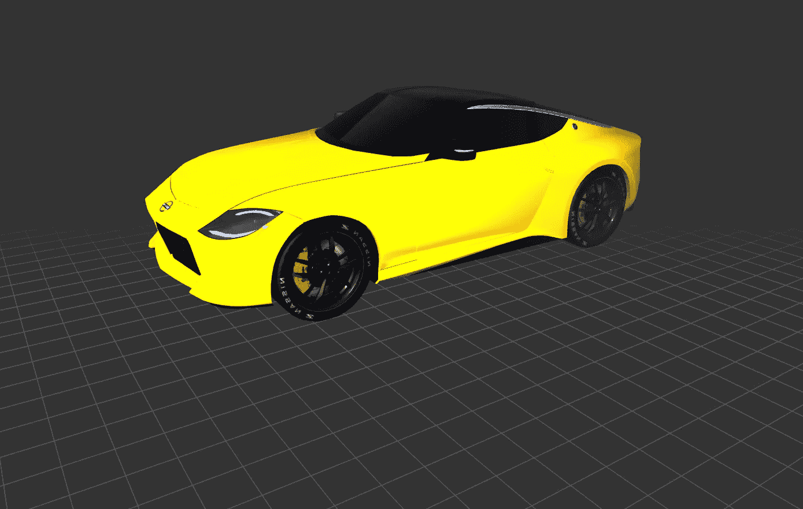
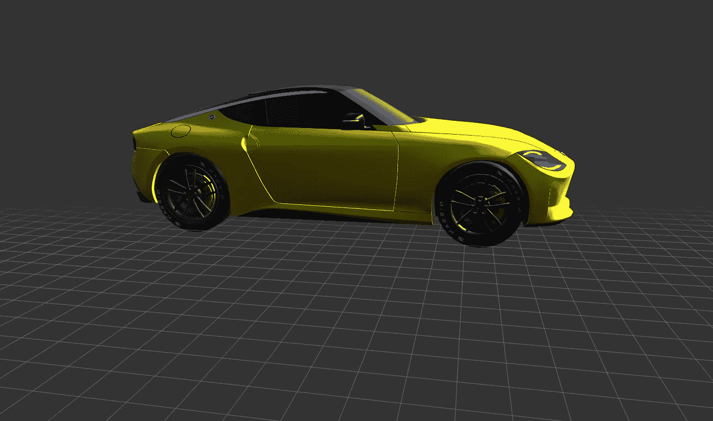

# 使用 PyWeb3D 加载 3D 模型

> 原文：<https://betterprogramming.pub/loading-3d-models-using-pyweb3d-b8c8d84faaf9>

## 使用 python 语法探索 three.js



图片来自作者:使用 [pyweb3d](https://www.pyweb3d.org/) 加载的 3D 汽车模型

在今天的文章中，我们将讨论如何使用 [PyWeb3D](https://www.pyweb3d.org/) 将 3D 模型加载到场景中。如果你错过了上一篇关于如何[创建 3D 文本](/create-3d-text-using-pyweb3d-b4950a437322)的文章，一定要去看看。

3D 模型有数百种文件格式，每种格式都有不同的用途、不同的功能和不同的复杂性。虽然 [three.js 提供了许多加载器](https://github.com/Bruno-Odinukweze/PyWeb3D/tree/main/jsm/loaders)，但是选择正确的格式和工作流程将会节省时间并避免以后的挫折。有些格式很难处理，对于实时体验来说效率很低，或者目前还不完全支持。

我们将使用`glTF`格式(three.js 推荐的格式)。

**注意**:格式的`.GLB`和`.GLTF`版本都支持。

为了将模型加载到我们的场景中，我们将使用 three.js `GLTFLoader`。

PyWeb3D 的修改版本可以在这里[查看。](https://github.com/Bruno-Odinukweze/PyWeb3D/blob/main/jsm/loaders/GLTFLoader.js)

## HTML 样板文件

下面的所有代码都将放入我们的 HTML 文件主体的内联`<script type=”text/python”>`标签中

## 导入必要的模块和功能

[https://gist . github . com/Bruno-Odinukweze/7 ff 0e 893 e 5745 a 701 a 8757 c 184 a 54 e 12](https://gist.github.com/Bruno-Odinukweze/7ff0e893e5745a701a8757c184a54e12)

## 初始化插件

[https://gist . github . com/Bruno-Odinukweze/B3 B2 a51 de 3d 96 cadd 227 A8 E0 db 446 DD 7](https://gist.github.com/Bruno-Odinukweze/b3b2a51de3d96cadd227a8e0db446dd7)

在上面的代码片段中，我们初始化了`GLTFLoader`、`OrbitControls`和`RGBELoader`插件，直接从 javascript 文件到我们的 python 代码中。

## 创建场景并加载模型

[https://gist . github . com/Bruno-Odinukweze/2e0b 30576 a 104d 7 ee 0 DD 80 f 88 bb 90635](https://gist.github.com/Bruno-Odinukweze/2e0b30576a104d7ee0dd80f88bb90635)

让我们一行一行地检查上面代码片段的内容。

*   从第`2 — 5`行开始，我们声明了空变量来保存我们的**相机**、**渲染器**、**场景、**和**汽车**
*   从第`7 — 75`行开始，我们定义了一个名为`init()`的函数，在函数中我们创建了一个场景、摄像机、网格和灯光，并加载了模型。

让我们深入一点:

*   从第`8 — 11`行开始，我们让第`2–5`行的变量可修改。如果您是 python 的新手，那么需要 global 关键字来修改我们在第`2 — 5`行声明的变量的全局副本。
*   从第`14 — 18`行开始，我们创建了一个场景，给场景添加了背景色，添加了纹理和雾。
*   从第`20 — 24`行，我们创建了一个网格，并将其添加到场景中
*   根据线条`26 — 35`，我们创建了一个透视相机，并给它一个视野、长宽比和一个远近剪裁平面。如果你不知道这些是什么，请阅读关于创建场景的[文档。](https://www.pyweb3d.org/docs/docs.html#manual/en/introduction/Creating-a-scene)
*   从线`38 — 39`，我们创建了一个环境光，并将其添加到场景中。
*   从线`41 — 43`，我们创建了一个直射光，并将其添加到场景中。
*   根据线条`45 — 46`，我们创建了一个半球光源，并将其添加到场景中。
*   从第`49 -52`行开始，我们创建了一个 webGL 渲染器，并将其附加到 HTML 文件的主体中
*   在第`54`行，我们创建了轨道控制。`OrbitControl`将目标作为参数(在本例中是摄像机和`renderer.domElement`或画布)。
*   在第`57`行，我们实例化了 GLTFLoader。
*   从第`59 — 70`行开始，我们定义了一个名为`loadGLTF()`的回调函数来处理 gLTF 模型设置。
*   从第`72 — 73`行开始，我们定义了一个回调函数调用`onError()`，用于处理错误消息，并在模型加载失败时帮助我们排除故障。
*   最后，在第`75`行，我们加载了模型，并将回调函数作为参数传递给了`load`方法。

## 处理窗口大小调整和动画

[https://gist . github . com/Bruno-Odinukweze/285 e 58 b 441 db 4 FDA 5371 C4 ce 49 b 27d 07](https://gist.github.com/Bruno-Odinukweze/285e58b441db4fda5371c4ce49b27d07)

在上面的代码片段中，从第`1 — 8`行开始，我们处理窗口大小调整，从第`10 — 12`行开始，我们处理动画循环，最后，在第 14 行，我们调用在前面代码片段的第`7 — 75`行定义的`init()`函数。

# 现在运行代码

在你的浏览器中打开 HTML 文件，你应该会看到一个漂亮的日产 Z 原型车:)

看现场版[这里](https://www.pyweb3d.org/examples/#loading_3d_models_NissanZProto)。



图片来自作者:使用 [pyweb3d](https://www.pyweb3d.org/) 加载的 3D 汽车模型

我希望你喜欢这篇文章。感谢阅读。

```
**Want to contribute?** Would you like to contribute to PyWeb3D? Join me, and let’s create something awesome together. Join me [here](https://github.com/Bruno-Odinukweze/PyWeb3D).
```

源代码:

[](https://github.com/Bruno-Odinukweze/PyWeb3D/blob/main/examples/loading_3d_models_NissanZProto.html) [## pyweb 3d/loading _ 3d _ models _ nissanzproto . html 位于主 Bruno-Odinukweze/PyWeb3D

### 此文件包含双向 Unicode 文本，其解释或编译可能与下面显示的不同…

github.com](https://github.com/Bruno-Odinukweze/PyWeb3D/blob/main/examples/loading_3d_models_NissanZProto.html) 

# 学分和参考

*   受[启发 three.js](https://threejs.org/)
*   [布里森](https://brython.info/)
*   P [ython](https://python.org/)