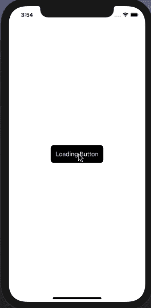
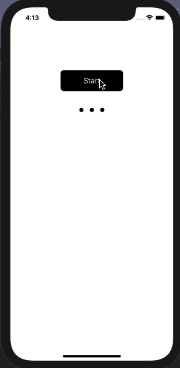

# 如何在 Swift 中创建加载按钮

> 原文：<https://betterprogramming.pub/loading-button-in-swift-566f9ff0d98a>

## 构建简单且可重用的定制装载视图

由 [Maxwell Nelson](https://unsplash.com/@maxcodes?utm_source=unsplash&utm_medium=referral&utm_content=creditCopyText) 在 [Unsplash](https://unsplash.com/) 上拍摄的照片。

每次用户与我们的应用程序交互时，都需要我们做一些工作(例如调用端点或从后端获取数据)。我们必须让他们知道应用程序正在做一些事情。我们不应该让用户处于不知道当前正在发生什么的境地。

这就是为什么加载动画如此重要。他们给用户一个暗示，在那个时刻应用程序中正在发生一些事情。

最常见的场景之一是登录按钮。当用户输入他们的凭证并点击按钮时，您可能必须与后端交互才能让用户登录应用程序。该过程可能需要几秒钟，也可能由于网络问题而失败。向用户展示按钮内部的某种加载是一个很好的做法。

这就是本文的内容。我想向你展示如何用几行代码使用一些[核心动画](https://developer.apple.com/documentation/quartzcore)基础来制作你自己的加载按钮。

作者 GIF。

你可以看到负载由三个圆圈组成，它们按比例增加，然后返回到原来的位置。所以让我们从头开始创建一个自定义的`UIView`类，它包含要制作动画的点。

我们可以通过创建三个自定义`UIViews`来创建点，并将它们的拐角半径设置为其宽度的一半:

接下来要做的是为点配置动画，这是核心动画开始工作的时候。想想动画实际上做了什么:它放大，然后恢复到原始大小。并且这在动画运行时重复。

我们可以通过用`UIview.animate…` API 递归动画视图来实现这一点，但是我总是尽量避免递归函数，除非它们真的很有必要。有了核心动画，我们可以很容易地设置这个动画。

首先，让我们定义三个不同的`CABasicAnimation`属性(每个点一个)，然后做一些初始设置:

您应该仔细查看的设置的最重要属性是:

*   `autoreverses`:当这个设置为`true`时，我们告诉动画一旦完成就恢复到原来的大小。
*   这是我们希望动画达到的比例因子。
*   因为我们想重复播放动画直到它停止，我们必须将重复次数设置为无穷大。

现在，为了开始动画，我们需要添加我们的`CABasicAnimations`到点的层。为了将事情分开，让我们创建两个函数:`startAnimation()`和`stopAnimation()`。

我们已经准备好将我们的`DotsAnimationView`添加到我们的`ViewController`视图中，并调用`startAnimation()`来看看会发生什么。

我们将动画添加到图层后，它们就开始了，所以所有的动画都是同时开始的。幸运的是，我们有`beginTime`属性来设置动画的起点。设置此属性可以延迟动画以产生序列效果。

*注意:根据动画持续时间的不同，动画的延迟可能会有所变化，但是您可以调整一些值，直到它符合您的需要。*

我们只需要创建一个自定义按钮并添加我们刚刚创建的`DotsAnimationView`:

就是这样！我们只需要调用我们按钮的`startAnimation()`和`stopAnimation()`函数。

在一个单独的视图中获得动画的酷之处在于，你可以在一个按钮或任何其他视图中使用它。例如，您可以在从后端获取一些数据以显示在集合视图中时使用它。

# 结论

我希望这能作为一个起点帮助你。你可以随心所欲地发挥创造力。也许你的加载不包括缩放变换，而是一个平移或不透明度。无论你想做什么，你都可以自己做。只要记住我们在这里使用的分离和可重用原则，这样你就可以不仅在你的按钮中使用你的加载动画。

如果您有任何问题，请随时发表评论。我很乐意帮忙。你可以在 GitHub 上查看完整代码[。](https://github.com/blorenzo10/loading-button)