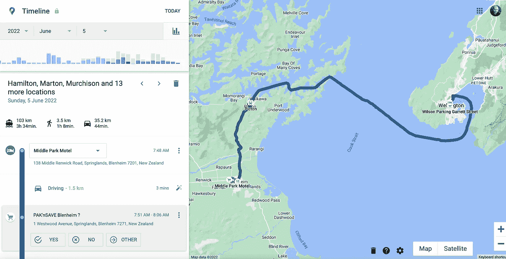
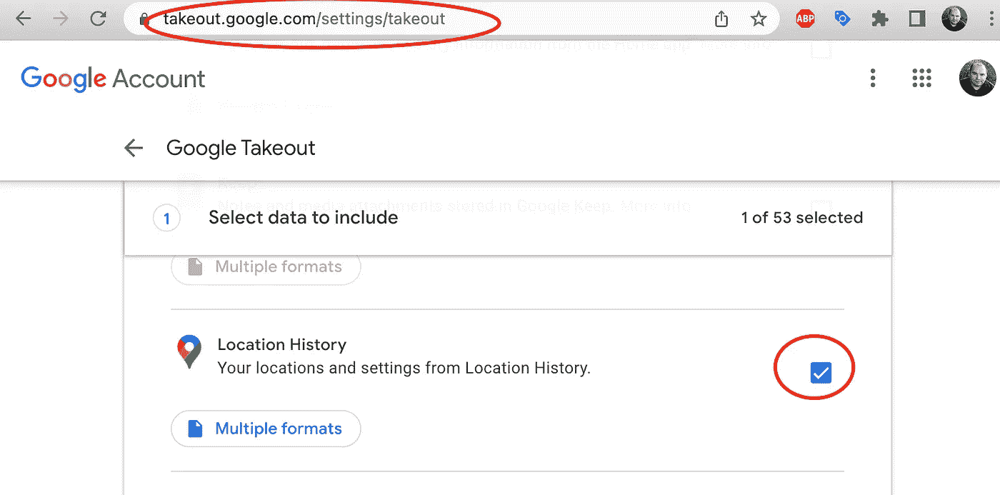
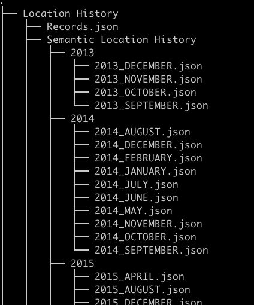
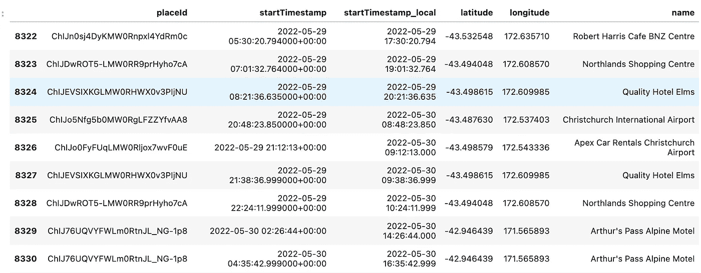
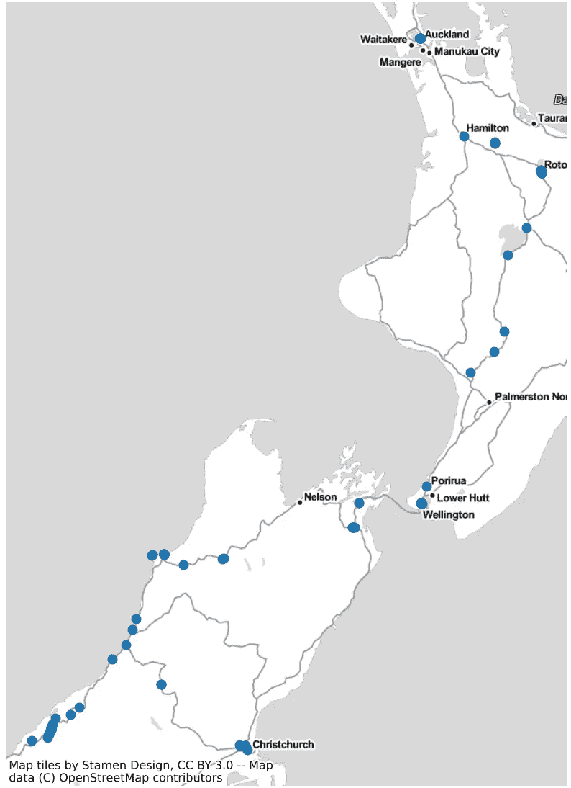

# 从谷歌时间线加载位置历史地点到熊猫和 CSV

> 原文：<https://betterprogramming.pub/loading-location-history-places-from-google-timeline-into-pandas-and-csv-c26cb0ac5e89>

## 知道你去超市喝咖啡的频率，你上下班的时间，以及需要多长时间。


索尔·阿尔维斯在 Unsplash[上的照片](https://unsplash.com?utm_source=medium&utm_medium=referral)

如果你在智能手机上启用了谷歌时间线位置历史，你就可以获得特定日期你去了哪里，你开车、步行或乘坐公共交通工具多长时间的信息。

我从 2013 年就戴着它，所以我可以在谷歌地图上使用谷歌时间轴工具访问我 9 年的位置历史。例如，这是我 2022 年 6 月 5 日的时间表。正如你所看到的，那天我正开车，逛超市，走路，乘渡船从新西兰南到北岛。



虽然 Google Timeline 提供了一个直观易用的界面，但作为一个对分析这些数据感兴趣的人，我希望以熊猫数据帧和 CSV 文件的形式获得一个我访问过的所有地方的列表。有了这些数据，我可以对自己这些年的旅行进行一些有趣的可视化。

让我来演示一下如何做到这一点。

# 第一步。使用谷歌外卖下载位置历史

谷歌外卖允许你将谷歌账户中的所有数据作为一个文件加载。包括你的邮件、照片、视频等。位置历史也可以作为 ZIP 文件下载。

要获取它，请转到[https://takeout.google.com/settings/takeout](https://takeout.google.com/settings/takeout)，检查“位置历史记录”并点击“下一步”按钮。



d

选择 ZIP 作为文件格式，然后点击“创建导出”


Google 将创建一个新文件，并在可以下载时通知您。文件挺小的，9 年才 59 MB。

在 ZIP 文件中，位置历史存储在以下文件中。我们需要从位于“语义位置历史”目录的 JSON 文件中加载数据



谷歌位置历史外卖压缩文件内容

# 第二步。正在处理位置历史 ZIP 文件

我们需要安装以下库来处理该文件:

```
pip install timezonefinder
pip install numba
```

进口:

```
from zipfile import ZipFile
import pandas as pd
import json
from timezonefinder import TimezoneFinder
```

现在我们可以打开每个 JSON 文件并将数据追加到 place _ visits 数组中:

结果将如下所示:

该条目包含以下信息:

*   Google Place ID。使用这个 ID，您可以通过调用 Google Place API 来加载关于一个地方的附加信息。[更多详情](https://developers.google.com/maps/documentation/places/web-service/place-id)
*   `locationConfidence`。在某些情况下，坐标可能不太精确，附近可能还有其他地方。那样的话，`locationConfidence`会更低
*   `startTimestamp`和`endTimestamp`当你到达和离开这个地方的时候。UTC 时区的日期和时间。
*   `latitudeE7`和`longitudeE7`处的地理坐标乘以 100 万。所以纬度值-338656941 转换成-33.8656941。对南半球来说是负面的。

现在，这个数组可以转换成熊猫数据框:

```
place_visits_df = pd.DataFrame(place_visits)
```

为了更方便地处理数据，我想:

*   将日期时间转换为当地时区
*   将年、月、日、小时和分钟作为单独的列
*   添加访问持续时间列
*   将坐标转换成十进制值



放置数据帧

最后一步，让我们将这些数据保存为 CSV 文件:

```
place_visits_df.to_csv("place_visits.csv", index=False)
```

# 第三步。浏览访问过的地点数据

在地图上显示给定日期范围内所有去过的地方:



```
# To find most northern place I’ve visited 
# (Berlin Tegel airport for me)
place_visits_df[place_visits_df.latitude == place_visits_df.latitude.max()]# To find most southern place I’ve visited place_visits_df[place_visits_df.latitude == place_visits_df.latitude.min()]
```

现在使用这个数据集，你可以知道你去超市买咖啡的频率，你通常上下班的交通时间，以及需要多长时间。

想知道这是怎么做到的吗？我将在下一篇文章中添加一些如何可视化这些数据的例子。