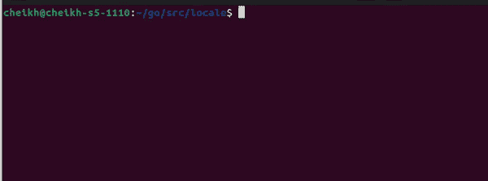

# 使用包文本本地化您的 Go 应用程序

> 原文：<https://betterprogramming.pub/localise-your-go-app-with-package-text-4a78a641fafc>

## 构建您的应用程序，走向世界


作者图片

从本质上说，本地化使一个应用程序能够到达多个全球市场。“本地化”是使软件适应最终用户的文化和语言的过程这包括设计和 UX 的变化，以吸引最终用户。这包括适当的文本翻译，甚至删除潜在的攻击性内容。

例如，阿拉伯国家从右向左书写，而大多数西方国家从左向右书写。Go 有一个本地化库；它是其子存储库的一部分。这个模块有一个路径`golang.org/x/text`。在这篇文章中，我将它称为`text`包。包`text`使开发人员能够按照功能或面向对象编程模型添加本地化。它支持打印格式化字符串，这是一个游戏改变者。

它还能识别单个单词并翻译它们。在这篇文章中，我将详细介绍我实现本地化程序的方法。

# 基本示例

对于我的用例，我将编写将英语翻译成法语的 Go 代码。作为两种语言的母语使用者，我理解机器翻译的文本有时会不连贯。这将是显而易见的，因为你读了这篇文章。下面是初始代码:

```
package mainimport (
 "golang.org/x/text/message"
 "golang.org/x/text/language""fmt"
)func main(){ message.SetString(
    language.French,
    "The %m car",
    "La voiture %m",
  )
}
```

对于这个例子，我采用功能方法来添加本地化。我调用 message 的`SetString`函数来教程序如何翻译一个特定的字符串。动词`%m`将显示翻译后的文本。如果你注意到动词`%m`转换了法语翻译的位置。这说明了一个简单的句子在另一种语言中是如何重组的。我想要一个动词`%m`来显示一种颜色，但是这个程序不知道法国的颜色。为了教授该程序，我将添加以下几行:

```
message.SetString(
  language.French,
  "green",
  "vert",
)
```

与我之前对`SetString`的调用不同，我只添加了一个单词。这展示了这个包的威力，因为我不需要添加句子`The %m car`的多个变体。为了显示本地化的文本，我将运行下面的代码:

```
p := message.NewPrinter(language.French)
fmt.Println( p.Sprintf("The %m car", "green") ) // prints La voiture vert
fmt.Println( p.Sprintf("The %m car", "red")  ) // prints La voiture red
```

这是终端的输出:



如果您注意到第二行打印为`La voiture red`。我还没有教程序翻译红色这个词。我还可以毫不费力地管理句子结构，这是这个软件包的另一个好处。这是基本的例子。这是一个复杂的问题。

# 跟踪复数形式

我经常构建和看到“错误生成文本”的程序例如，我曾经构建了一个警报组件，该组件的标题有时会显示为`You have 1 notifications left`。这个句子不正确，因为 notification 是复数形式。`text`有一个专门的特性，这将是我的下一个例子。代替调用`SetString`，我将使用函数`Set`来纠正上述的多数问题。这个例子不涉及任何翻译。下面是`Set`的函数签名:

```
func Set(tag [language](https://pkg.go.dev/golang.org/x/text@v0.3.7/language).[Tag](https://pkg.go.dev/golang.org/x/text@v0.3.7/language#Tag), key [string](https://pkg.go.dev/builtin#string), msg ...[catalog](https://pkg.go.dev/golang.org/x/text@v0.3.7/message/catalog).[Message](https://pkg.go.dev/golang.org/x/text@v0.3.7/message/catalog#Message)) [error](https://pkg.go.dev/builtin#error)
```

该函数与`SetString`非常相似，除了`msg`参数。这就是我如何告诉程序如何处理复数单词。这是初始代码:

```
package mainimport (
 "golang.org/x/text/message"
 "golang.org/x/text/feature/plural"
 "golang.org/x/text/language""fmt"
)func main(){

    message.Set(language.English, "You are %d minute(s) late.",
    plural.Selectf(1, "",
        plural.One, "You are 1 minute late.",
        plural.Other, "You are %d minutes late."),
    ) p2 := message.NewPrinter(language.English)
    fmt.Println( p2.Sprintf("You are %d minute(s) late.", 1 )  )
    fmt.Println( p2.Sprintf("You are %d minute(s) late.", 5 )  )}
```

如果您注意到上面，有一个名为`Selectf`的包函数被调用。"`Selectf`返回其选择器匹配的第一个事例。"在这种情况下，有两个选择器:

*   `plural.One`表示所提供的整数为 1 的情况。
*   `plural.Other`用以表示任何其他整数值。

下面是实际运行的代码:


下面是`Selectf`的函数签名:

```
func Selectf(arg int, format string, cases ...interface{}) catalog.Message
```

在定义事例时，您将定义选择器，下面的参数将是该选择器的文本。例如，当传递整数`1`时，添加文本将是`Selectf(...,plural.One, "Format for one",...)`

# 公用事业

这是这个图书馆的锦上添花。它可以自动提取程序中的所有文本。这消除了手动查找每个应该本地化的文本的需要。它还有一个用本地化文本打印机自动替换所有 fmt 调用的命令。然而，该程序不支持 Go 1.18，所以我不会在这篇文章中演示它。

# 结论

在一个高度全球化的世界里，开发者必须本地化他们的应用程序以渗透特定的市场。本地化您的应用程序将确保运行您的程序的消费者理解它。包`text`是 Go 团队的本地化实现。这个包最近一次发布是在 2021 年 8 月，迫使我去琢磨它的稳定性。

值得注意的是，包`text`有开源的替代方案。这是我为一个有趣而强大的本地化包带来光明的尝试。还有其他方法来实现这个包。这是我对这个问题的看法。你可以在下面找到这个包的链接。

# **附加链接**

[https://www . lionbridge . com/blog/content-transformation/what-is-software-localization-and-who-needs-it](https://www.lionbridge.com/blog/content-transformation/what-is-software-localization-and-who-needs-it/)

[](https://github.com/cheikhshift/medium_examples/tree/main/locale) [## medium _ examples/main cheikh shift/medium _ examples 的区域设置

### 中型文章的代码示例。在 GitHub 上创建一个帐户，为 cheikhshift/medium_examples 开发做贡献。

github.com](https://github.com/cheikhshift/medium_examples/tree/main/locale)  [## 消息

### 包消息实现本地化字符串的格式化 I/O，其功能类似于 fmt 的打印功能…

pkg.go.dev](https://pkg.go.dev/golang.org/x/text@v0.3.7/message#hdr-Translation_Pipeline)