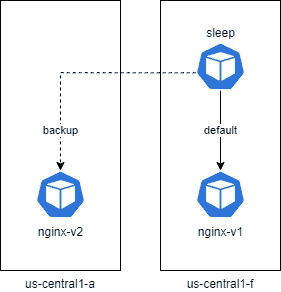

# 使用 Istio 在 Kubernetes 中实现基于位置的负载平衡

> 原文：<https://betterprogramming.pub/locality-based-load-balancing-in-kubernetes-using-istio-a4a9defa05d3>

## 使用地理位置在您的服务网格内路由请求，以提高性能并节省资金


克日什托夫·赫普纳在 [Unsplash](https://unsplash.com?utm_source=medium&utm_medium=referral) 拍摄的照片。

[Istio](https://istio.io/) 是市场上功能最丰富、最强大的 Kubernetes 服务网之一。它是由 Google、Lyft 和 IBM 开发的开源工具，并且正在迅速流行起来。

它的一个显著特点是交通管理。Istio 提供了一个第 7 层代理，帮助您在多个因素上路由流量，如 HTTP 头、源 IP、URL 路径和主机名。

拥有全球业务的组织通常运行一个大规模的全球服务网络，其中包括遍布全球的微服务。微服务需要相互交互才能为客户提供完整的功能。为了确保客户获得最佳性能，有必要将流量路由到最近的微服务，而不是以循环方式进行负载平衡，这是 Kubernetes 默认提供的。

成本是另一个因素，因为如果流量在区域和地区之间移动，大多数云提供商都会收取出口费。同一区域内的流量被视为内部流量，因此不收费。

如果使用 Istio 构建网格，将流量路由到同一区域内的服务将为您节省大量出口费用。

Istio 提供基于位置的路由，这有助于您将流量路由到离始发 pod 最近的 pod。这可确保您的客户体验到低延迟，您也能从节省的出口费用中获益。大家双赢！

本文是使用 Istio 在 Kubernetes 中进行[流量镜像的后续文章。今天，我们来讨论一下 Istio 中基于位置的路由。](https://medium.com/better-programming/traffic-mirroring-in-kubernetes-using-istio-dad0976b4e1)

# 先决条件

确保您有一个区域性或多区域性的 Kubernetes 集群。在这个演示中，我使用了一个区域性的 Google Kubernetes 引擎，在`us-central`区域中每个区域有一个节点。您还需要对 Istio 有所了解。查看[如何使用 Istio](https://medium.com/better-programming/how-to-manage-microservices-on-kubernetes-with-istio-c25e97a60a59) 管理 Kubernetes 上的微服务，了解简要介绍。

# 安装 Istio

按照[Kubernetes 上的 Istio 入门指南](https://medium.com/better-programming/getting-started-with-istio-on-kubernetes-e582800121ea)在您的 Kubernetes 集群中安装 Istio。对于此演示，您不需要安装图书信息应用程序。

Istio 使用节点标签来了解源流量的区域。如果您在云上使用托管的 Kubernetes 集群，您的云提供商会负责标记节点。

如果您运行的是内部部署或自定义设置，请用区域和分区适当标记您的节点。详见[区域知名标签](https://kubernetes.io/docs/reference/kubernetes-api/labels-annotations-taints/#failure-domainbetakubernetesioregion)。

因为我们正在云上运行一个托管的 Kubernetes 服务，所以让我们从列出节点和标签开始。我们需要这个来了解哪个节点属于哪个区域。

我们看到:

*   节点`gke-cluster-1-default-pool-527dc04e-kzgp`属于`us-central1-f`。
*   节点`gke-cluster-1-default-pool-5cfcdb08–282p`属于`us-central1-a`。
*   节点`gke-cluster-1-default-pool-97820a63-mfmq`属于`us-central1-c`。

创建两个名称空间，`frontend`和`backend`:

```
$ kubectl create ns frontend
namespace/frontend created
$ kubectl create ns backend
namespace/backend created
```

标记名称空间以启用 Istio 的自动边车注入:

```
$ kubectl label namespace frontend istio-injection=enabled
namespace/frontend labeled
$ kubectl label namespace backend istio-injection=enabled
namespace/backend labeled
```

# 部署后端 Nginx 服务

在 Kubernetes 上部署 [NGINX](https://www.nginx.com/) 的两个版本(`v1`和`v2`)。在`nginx-v1`上为`us-central1-a`和`nginx-v2`添加一个节点选择器。

展开`nginx-v1`:

展开`nginx-v2`:

创建一个 NGINX 服务来公开 pod:

列出窗格以检查它们是否在正确的区域中运行:

# 部署前端睡眠微服务

在每个节点上创建一个带有副本的`sleep`部署。我们用它来生成到后端 NGINX pods 的流量:

我们还需要为睡眠舱创建一个服务。这是 Istio 的服务发现允许基于位置的负载平衡所必需的:

列出窗格，查看它们是否在所有节点上运行:

他们就是！让我们导出一些变量:

```
$ export SLEEP_ZONE_1=sleep-bb596f69d-85s6d
$ export SLEEP_ZONE_2=sleep-bb596f69d-c7gxr
```

现在让我们在`us-central1-a`上执行一个`sleep` pod，并调用 NGINX 服务:

它们现在完全以循环方式进行负载平衡。

# 基于位置优先级的负载平衡

基于位置的负载平衡的默认行为称为位置优先负载平衡。

基于位置优先级的负载平衡使用以下算法:



为了实现基于位置的负载平衡，我们需要一个虚拟服务和一个带有异常策略的目标规则。异常策略检查 pod 是否正常，并做出路由决策:

运行从`us-central1-a`上的`sleep`盒到 NGINX 服务的测试:

正如我们所看到的，所有的请求都将发往`nginx-v1`。

从`us-central1-f`上的`sleep`盒对 NGINX 服务进行测试:

我们看到所有的请求都发送到`nginx-v2`。这表明基于位置优先级的负载平衡工作正常！

让我们尝试一些不同的东西。打开一个重复的终端并运行以下命令:

```
$ for i in {1..100}; do   kubectl exec -it $SLEEP_ZONE_2 -c sleep -n frontend -- sh -c 'curl  [http://nginx.backend:8000'](http://nginx.backend:8000'); done
```

当上面的命令运行时，删除另一个终端中的`nginx-v2`部署:

```
$ kubectl delete deployment nginx-v2 -n backend
deployment.apps "nginx-v2" deleted
```

切换回第一个终端，在我们删除了`nginx-v2`部署后，您应该会看到流向`nginx-v1`的流量:

# 局部加权负载平衡

大多数用例都能很好地处理基于位置的负载平衡。但是，在某些情况下，您可能希望将流量分成多个区域。如果所有请求都来自单个区域，您可能不想让一个区域过载。一个典型的用例可以是位于特定城市的重要用户群。对于这样的用例，您可以使用本地加权负载平衡。


局部加权负载平衡

通过应用相关的 YAML，重新创建我们在上一节中删除的`nginx-v2`部署。

然后将下面的 YAML 应用于:

*   将 80%的流量从`us-central1-a`路由到`us-central1-a`，将 20%的流量路由到`us-central1-f`。
*   将 20%的流量从`us-central1-f`发送到`us-central1-a`，将 80%的流量发送到`us-central1-f`。

运行从`us-central1-a`上的`sleep`盒到 NGINX 服务的测试:

我们看到 20%的流量流向`nginx-v2`，80%流向`nginx-v1`。

现在让我们反过来。运行从`us-central1-f`上的`sleep`盒到 NGINX 服务的测试:

十次中有两次，我们得到来自`nginx-v1`的响应。

如果我们在运行测试时删除了`nginx-v2`部署，会发生什么？让我们找出答案。

打开一个重复的终端窗口，并运行以下命令:

```
$ for i in {1..100}; do   kubectl exec -it $SLEEP_ZONE_2 -c sleep -n frontend -- sh -c 'curl  [http://nginx.backend:8000'](http://nginx.backend:8000'); done
```

当上面的命令运行时，在另一个窗口中删除`nginx-v2`部署:

```
$ kubectl delete deployment nginx-v2 -n backend
deployment.apps "nginx-v2" deleted
```

切换回终端，您会看到在我们删除了`nginx-v2`部署后，所有流量现在都流向了`nginx-v1`:

# 结论

感谢阅读！我希望你喜欢这篇文章。

如果运行多区域 Kubernetes 集群，Istio 还提供了故障转移设置。但是，这不在本文的讨论范围之内。

Istio 彻底改变了我们看待微服务的方式，它为您提供了组织对传统基础架构的强大控制。

接下来的故事是“[如何在 Kubernetes](https://medium.com/better-programming/how-to-use-istio-to-inject-faults-to-troubleshoot-microservices-in-kubernetes-108250a85abc) 中使用 Istio 注入故障排查微服务”，所以到时见！