# 如何本地化您的 iOS 应用程序

> 原文：<https://betterprogramming.pub/localization-in-ios-applications-46df5959a588>

## 无论你想在故事板或代码中使用字符串来翻译你的应用程序，并保持它的组织性，以下是方法:


图片来源: [Shutterstock](http://shutterstock.com/image-vector/people-say-hi-hello-on-different-1456013504)

大多数 iOS 应用程序都希望支持尽可能多的语言，但是我们如何才能以最有组织性和最有效的方式做到这一点呢？

在这篇文章中，我将向您展示我构建一个支持至少两种语言的本地化 iOS 应用程序的方法。

# 我们开始吧

首先在 Xcode 中创建新的单视图应用程序。命名为`MyLocalizedApp`，想存哪存哪。


现在，当项目编辑器出现时，在项目编辑器的左上角选择您的项目，单击+按钮，并选择您想要的语言。既然这样，我就选法语。

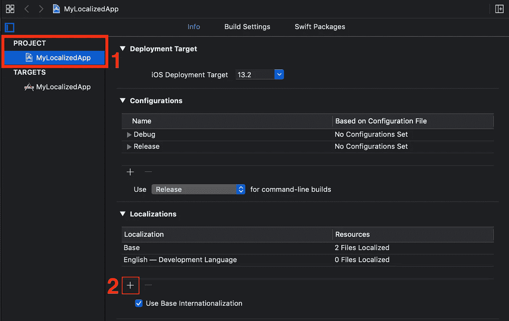

随着弹出窗口的出现，我们在这里应该关注的主要内容将是文件类型列。不同的选项有:

*   可本地化的字符串:该选项为选中的每个界面构建器文件添加一个特定语言的`.strings`文件。
*   Interface Builder Storyboard:此选项创建一个特定的 Interface Builder Storyboard 文件，以支持您为同一资源文件选择的相同语言。

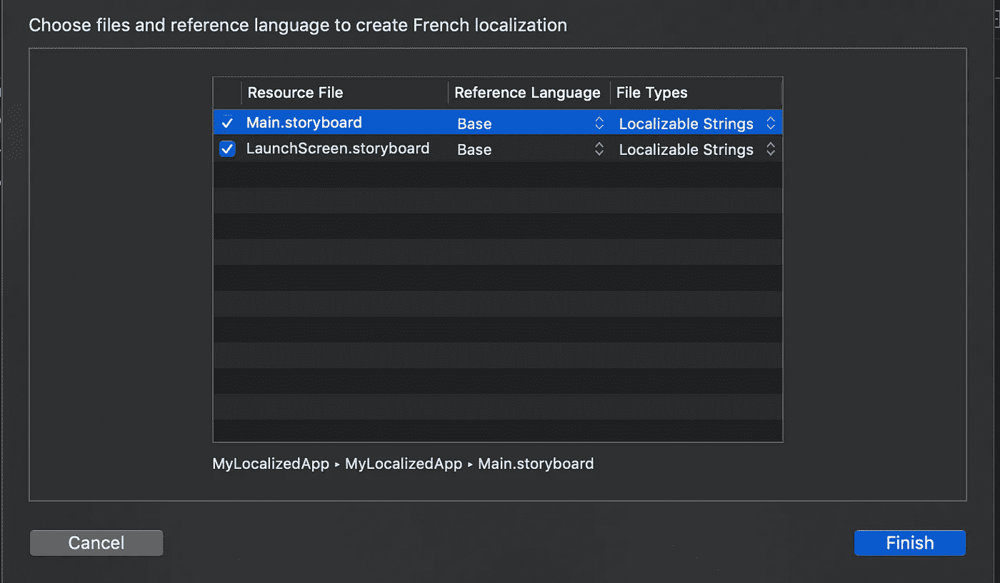

在这种情况下，请确保您的设置与我相同，然后点击“完成”。

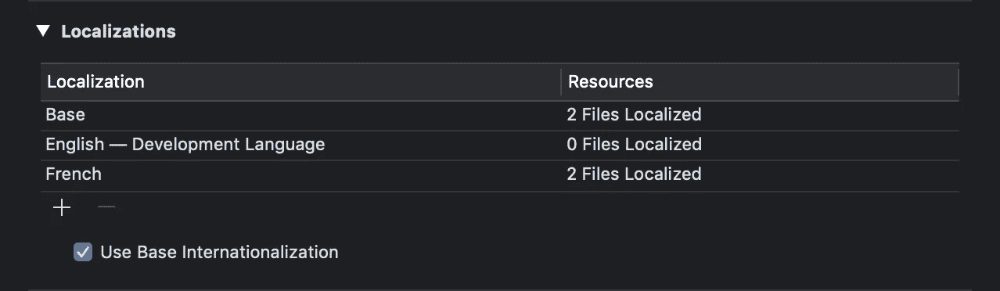

如您所见，我们刚刚添加的法语有两个本地化文件，但是英语没有本地化文件。

这两个缺失的文件本质上是基本文件的一部分，它们在我们的界面构建器字符串中提供了开发语言的默认布局。因为基本界面构建器文件将包含默认英语语言的 UI，所以英语语言没有任何本地化文件。

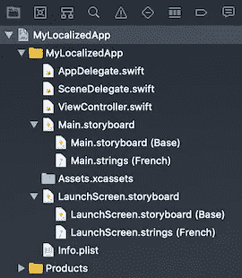

在右边的文件栏，你会看到我们的`Main.storyboard`文件和`LaunchScreen.storyboard`文件。添加到他们的目录中的是一个基本的故事板文件，它将包含默认的布局和一个法语。字符串文件，它将包含 Interface Builder 情节提要中每个元素的字符串。

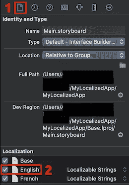

选择`Main.storyboard`文件，然后点击“显示文件检查器”选项。在本地化部分。检查英语语言。对`LaunchScreen.storyboard`文件做同样的事情。

之后，在文件浏览器中，你会看到`English.strings`文件被添加到`Main.storyboard`和`LaunchScreen.storyboards`中。

# 界面构建器中的本地化

现在让我们打开`Main.storyboard`文件并添加一个 UILabel 到我们的主 ViewController 和一个按钮，它将在将来改变我们的语言。

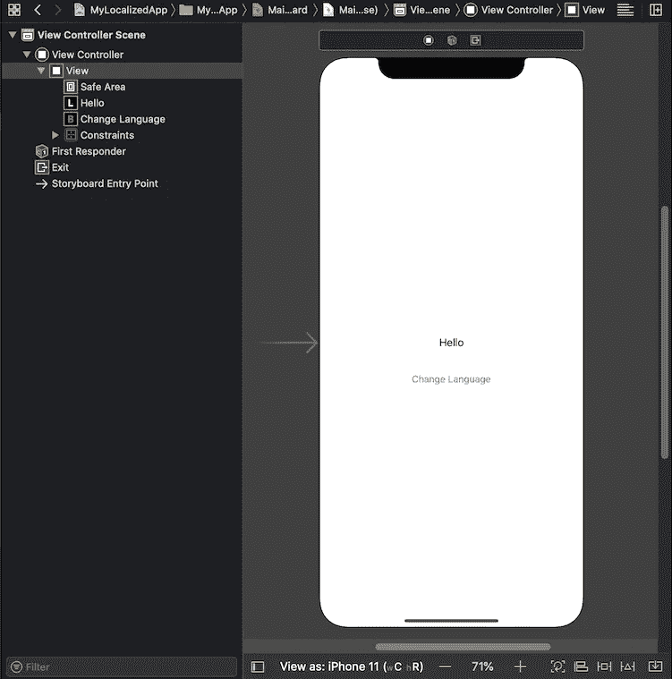

选择标签。去找身份检查员。在那里，您将看到元素的对象 ID，这将帮助我们控制来自我们的`Main.strings`文件的 UILabel 元素的文本。

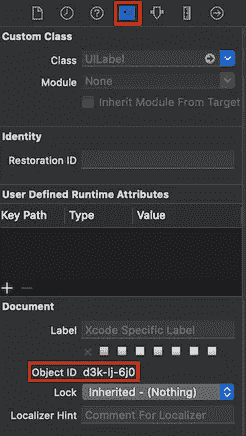

打开英语的`Main.strings`文件。并键入以下行:

```
"d3k-lj-6j0.text" = "Hello";
```

打开法语语言的`Main.strings`文件，并键入以下行:

```
"d3k-lj-6j0.text" = "Bonjour";
```

> **注意:**中的每一行。字符串文件应该以分号结尾——否则它不会翻译您的应用程序，并且会在您的控制台上打印一条错误消息，指出哪一行缺少分号。

在我的例子中，UILabel 的对象 ID 是`d3k-lj-6j0`，您应该用您的对象 ID 替换它。出于本教程的目的，我们暂时不翻译该按钮，以编程方式进行翻译。

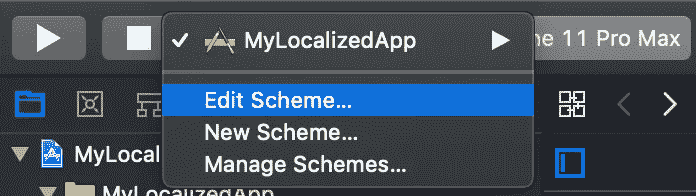

您可以从项目方案中调试您的翻译。这将有助于您在不改变设备语言的情况下观看翻译。

为此，选择编辑方案→选项→应用程序语言，然后选择您想要的语言(在我们的例子中是法语)。然后点击关闭按钮。

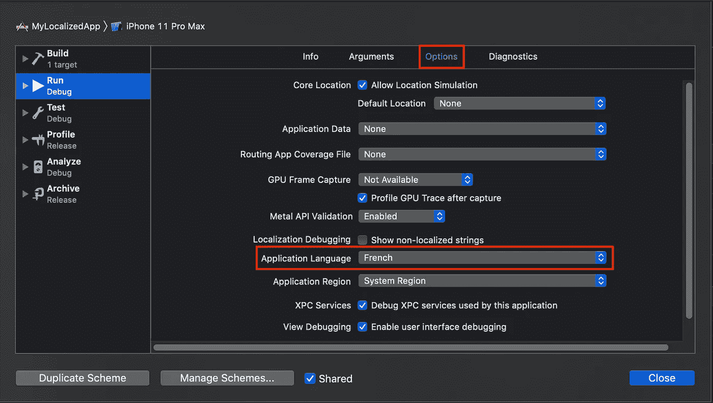

现在运行您的应用程序，您会看到我们的标签写着`Bonjour`。

# 以编程方式本地化

在我们使用界面构建器翻译了我们的标签之后。字符串文件，让我们将 UIButton 翻译成法语——但现在让我们以编程方式完成。

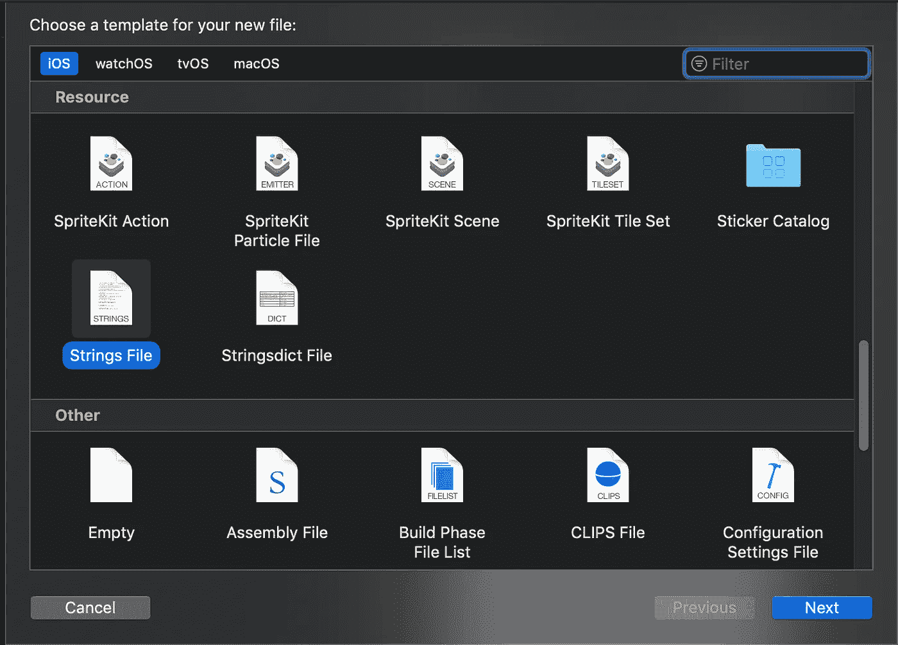

在我们的项目中创建新文件，并在 Resource 下选择 Strings File。命名为`Localizable`(否则无法正常工作)。并删除其默认内容。

这个文件允许我们稍后通过键访问我们的字符串。我们将通过密码来获取这些钥匙。应用程序将为我们检索与应用程序语言相匹配的值。

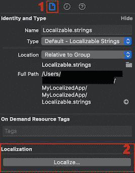

确保您已经打开了`Localizable.strings`文件，并在文件检查器中点击 Localize…按钮。然后，在弹出窗口中，选择您正在使用的主要语言(在我的例子中是英语)。然后，在 Localize…按钮所在的位置，将会出现一个您的应用程序支持的语言列表以及一个复选框。现在检查所有的语言。

基础不应该在列表中，因为它与默认的界面构建器布局相关，现在我们不处理任何界面构建器。

打开英语语言的`Localizable.strings`文件，并键入以下行:

```
"btn_choose_language" = "Choose Language";
```

打开法语语言的`Localization.strings`文件，并键入以下行:

```
"btn_choose_language" = "Choisissez la langue";
```

> **注意:**如您所见，我们的键是`*“btn_choose_language”*`，稍后我们将使用它来访问它，并用匹配的语言获取值。

在我们为按钮设置了所有的翻译之后，让我们以编程的方式来设置它。

将 UIButton 中的一个`IBOutlet`连接到`ViewController`类，并将副本添加到`viewDidLoad()`函数的内容中。

```
**import** UIKit**class** ViewController: UIViewController {
    **@IBOutlet private var** button: UIButton!
    **override func** viewDidLoad() {
        **super**.viewDidLoad()
        // Do any additional setup after loading the view.
        **let** btn_choose_language = NSLocalizedString("btn_choose_language", comment: "Title for the change language button")
        button.setTitle(btn_choose_language, for: .normal)
    }
}
```

方法`NSLocalizedString(_ key: **String**, comment: **String**) → **String**`是基础库的一部分，所以你可以从任何地方访问它。

`key`参数的作用是从与我们的应用程序语言相匹配的`Localizable.string`文件中获取所需的字符串值。

`comment`参数角色是一个字符串，它为其他翻译器描述从 key 参数返回的值的内容。在大多数情况下，我们不需要它，所以我们可以让它为空。

```
NSLocalizedString("btn_choose_language", comment: "")
```

在我的项目中，我不打算评论每一个翻译，所以我将为`String`类做一个扩展，这将使我的编码更容易。

我将创建一个名为`String+Localization.swift`的新 Swift 文件，并粘贴它:

```
**import** Foundation**extension** String {
    **var** localized: String { NSLocalizedString(**self**, comment: "") }
}
```

有了这个扩展，我可以通过本地化的 computed 属性访问本地化的字符串，如下所示:

```
**import** UIKit**class** ViewController: UIViewController {
    **@IBOutlet private var** button: UIButton!
    **override func** viewDidLoad() {
        **super**.viewDidLoad()
        // Do any additional setup after loading the view.
        **let** btn_choose_language = "btn_choose_language".localized
        button.setTitle(btn_choose_language, for: .normal)
    }
}
```

这给了我一个更清晰、更易读的代码。

# 更改应用程序语言

在文章的这一部分，您应该让所有的翻译工作，以查看您的应用程序语言中的任何变化。

Apple 为我们提供了匹配我们设备语言的自动语言更改。但是，我们如何让用户自定义应用程序的语言，而不改变所有设备的语言呢？

我将向您展示两种方法。第一种方式是 iOS 12 及以下版本的设备，第二种方式是 iOS 13 及以上版本。

## iOS 12 及以下版本

在应用程序的`UserDefaults` **，** Apple 将应用程序的设置保存在用户默认设置中，包括应用程序的当前语言。

如果我们覆盖它，我们将设法改变应用程序的当前语言，而不改变所有设备的语言。

首先，我们希望将应用程序语言更改为我们的应用程序支持的语言之一(在我们的例子中，是英语和法语)。

下面一行将检索我们的应用程序支持的可用语言:

```
Bundle.main.localizations
```

注意它返回支持的本地化数组，包括我们不想包含的`Base`。

因此，我们将编写一个计算属性，为我们移除`Base`本地化。

```
**var** availableLanguages: [String] {
    **var** availableLanguages = Bundle.main.localizations
    **if** **let** indexOfBase = availableLanguages.firstIndex(of: "Base") {
        availableLanguages.remove(at: indexOfBase)
    }
    **return** availableLanguages
}
```

那些可用的语言本质上是标准语言代码，我们可以从中选择一种来改变我们的应用程序语言。

我们可以通过将这些语言代码映射到用户的语言中，以用户的当前语言向用户呈现这些可用的语言，从而让用户使用以下代码选择他们喜欢的语言:

```
availableLanguages.map {
    Locale.current.localizedString(forLanguageCode: $0)!
}
```

> **注意:**我们可以强制展开它，因为我们知道任何输入都不会返回零；否则就是逻辑错误。

在我们让用户选择一种语言之后，我们将获取他们选择的语言代码，并用它来设置应用程序语言。

```
**@discardableResult
class** **func** setApplicationLanguage(languageCode: String) -> Bool {
    **guard** availableLanguages.contains(where: {
        $0.hasPrefix(languageCode)
    }) **else** { **return** **false** }
    UserDefaults.standard.set([languageCode],
                              forKey: "AppleLanguages")
    **return** **true** }
```

如果应用程序不支持`languageCode`，该函数将返回`false`，并且不会改变应用程序的语言。

如果应用程序支持`languageCode`，它会将它设置在`UserDefaults`中，作为键`**AppleLanguages**` **下的字符串数组。**

为了使更改生效，我们应该重新启动应用程序。一个好的做法是通知用户我们应该关闭应用程序以使更改生效，然后通过调用`exit(0)`关闭它。

## iOS 13 及以上版本

在 2019 年 WWDC 上，苹果与 iOS 13 一起展示了他们改变应用程序语言的新方法。

只需使用以下代码打开我们应用程序的设置应用程序:

```
**let** url = URL(string: UIApplication.openSettingsURLString)!
UIApplication.shared.open(url)
```

将有一个部分供用户选择应用程序支持的语言之一。

# 格式化程序

你应该在你的应用程序中包含许多格式化程序，例如:

*   `NumberFormatter`
*   `DateFormatter`
*   `ListFormatter`
*   `PersonNameComponentsFormatter`
*   `MeasurementFormatter`
*   `LengthFormatter`

你可以在这里找到更多种类的格式化器。

这些格式器将帮助你增加用户体验特性，你也应该阅读它们，让你的用户感觉你在和他们用同一种语言交谈。

# 贡献翻译

Xcode 提供了使用文件类型`.xliff`导入翻译的能力，这使我们能够将项目中的最后一个字符串与新字符串进行比较，并向我们显示我们所做的更改。

有了一个名为[Poe editor](https://poeditor.com/)的在线工具，你可以免费翻译多达 1000 个字符串，并将其导出为`.xliff`文件类型，以导入到你的 Xcode 项目中。

要了解如何从`.xliff`文件导入字符串，我强烈推荐观看[苹果公司关于本地化的 WWDC 2018 主题演讲](https://developer.apple.com/videos/play/wwdc2018/404)。

# 包裹

这就是如何开始本地化 iOS 应用程序的方法。你应该在你的项目中包含更多的东西，让用户觉得你在用他的语言和他交流。

我希望这篇文章对你有所帮助。

感谢阅读！