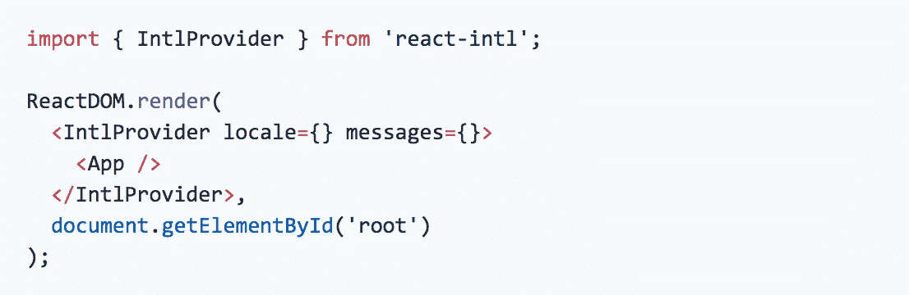
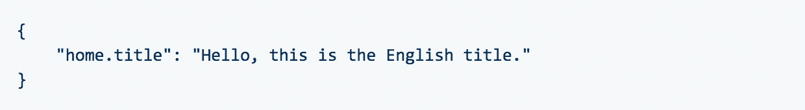
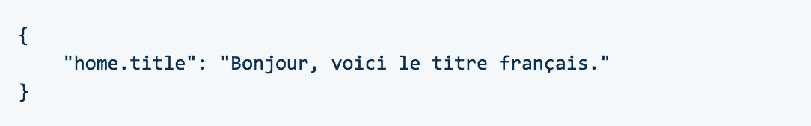
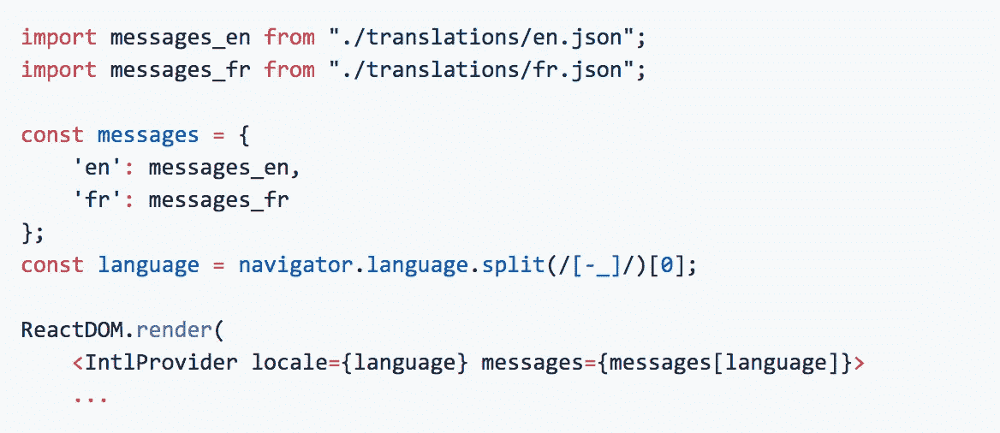
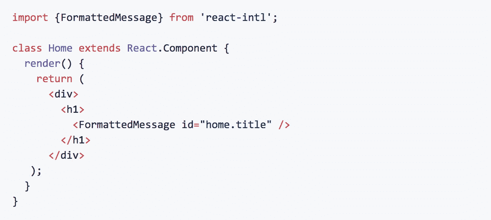
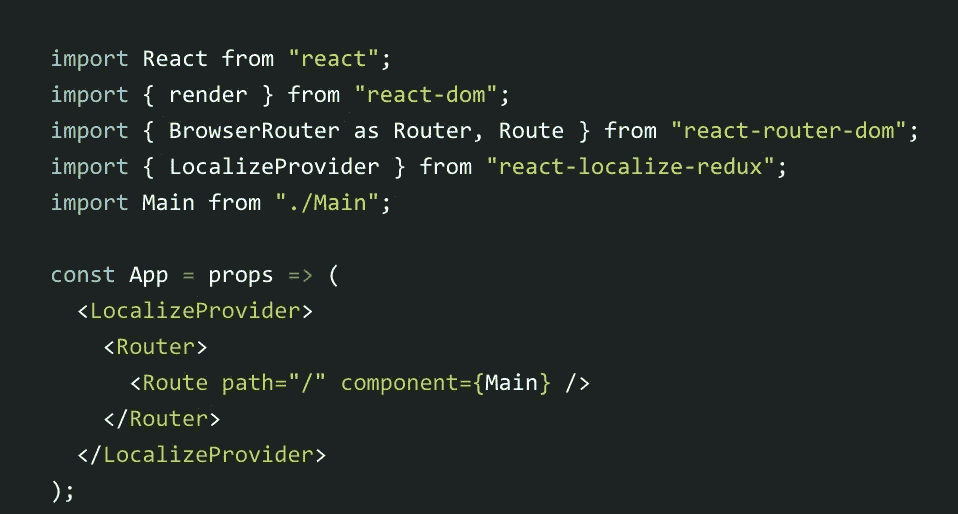
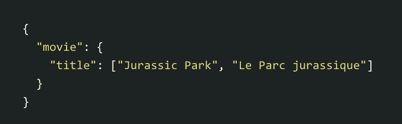
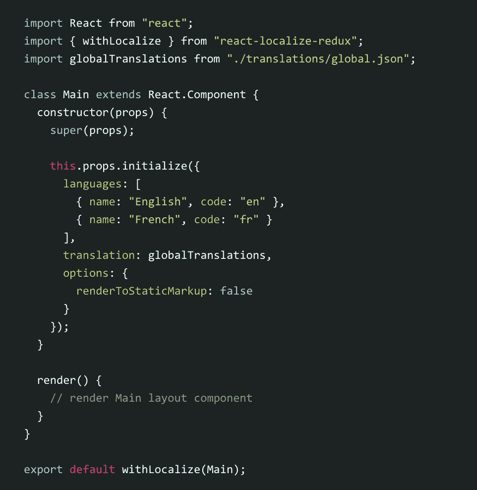
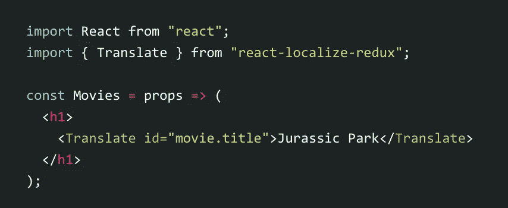

# 使用 React Intl 本地化您的应用程序

> 原文：<https://betterprogramming.pub/localization-with-react-dc26fb013028>

## 如何设置您的应用程序以前往世界任何地方

由[尼古拉·纳托尔](https://unsplash.com/@nicnut?utm_source=medium&utm_medium=referral)在 [Unsplash](https://unsplash.com?utm_source=medium&utm_medium=referral) 上拍摄的照片

在开发中，本地化指的是使网页或应用程序在特性上符合浏览者的语言环境的过程。这可能涉及翻译页面上的语言、转换货币以及更改数字和单位系统。

React 非常适合本地化，因为可以在虚拟 DOM 上进行本地化更改，只允许页面的本地化部分进行更改，而不必重新呈现整个不同的页面(或者路由到完全不同的本地化 URL)。

用 React 进行本地化最常用的包是 React Intl，它本身是 FormatJS 包套件的一部分。FormatJS 套件不仅提供跨语言的语言、数字、单位和日期转换，还提供语言内部的转换(“您有十条新消息”更改为“您有一条新消息”)。在本文中，我将介绍 FormatJS 套件，特别关注 React Intl，然后介绍一个越来越流行的轻量级、更容易配置的本地化包 React Localize Redux。

# 用 React Intl 格式化

FormatJS 是一套提供与各种 JavaScript 框架和库集成的包，React 就是其中之一。它还提供了与余烬，车把和灰尘的集成。FormatJS 中处理本地化的特定包是`intl`包，或者是 React 特定集成的`react-intl`。

React Intl 是目前最全面的 React 本地化包，不仅提供语言转换，还提供数字格式、复数和日期转换。React Intl 和类似本地化包的基本设置结构包括将应用程序导入并包装在包的提供程序中，创建一个单独的翻译文件，在其中写入所有翻译数据，然后将该文件与组件一起导入，以本地化页面内容。

React Intl 是一个庞大而强大的软件包，因此，它的设置和使用会变得非常复杂。虽然我将在这里为您介绍一个简单的普通消息(即页面上的文本)的翻译设置，但我强烈建议您查看官方文档，其中将更详细地介绍该软件包的全部功能。

## 游戏攻略

首先，安装软件包(`npm i react-intl --save`)，然后导入`<IntlProvider>`并把你的应用包在里面:

索引. js

这里需要注意的重要部分是提供者的`locale`和`messages`属性。这些将在以后设置，以便告诉提供者我们在哪个地区操作，并将我们翻译的消息传递给它。

创建单独的 JSON 翻译文件。下面的 JSON 对象中的键是一个参考点，稍后将调用它，而值指的是将在页面上显示的实际消息:

src/translations/en.json

src/translations/fr.json

回到我们的 index.js，我们现在可以导入翻译文件并设置消息属性来包含它们。

索引. js

现在，您可以使用 React Intl 的组件在页面上呈现不同的本地化材料。例如，`<FormattedMessage>`组件用于翻译普通消息:

您可以在上面的代码片段中看到，`<FormattedMessage>`包含一个 ID 属性，该属性引用了我们之前创建的 JSON 文件中的键。

其他组件包括`<FormattedHTMLMessage>`、`<FormattedDate>`、`<FormattedTime>`和`<FormattedNumber>`等。每个组件用于不同类型的本地化/格式化，必须单独导入。

听起来太复杂了，无法翻译？你并不孤单。这就是为什么许多只本地化语言的开发者现在转向另一个包。

# 反应-定位-还原

另一个本地化选项 React Localize Redux 只为一种类型的转换创建:语言本地化。因为该包不处理其他本地化，如货币、日期、数字等。，它体积更小，重量更轻。因此，设置和实现相对来说比 React Intl 更简单、更快。

`react-localize-redux`的一个定义特性是它对 Redux 的开箱即用支持。只需将 react-localize-redux 作为`localize`添加到您的根 reducer，用`<LocalizeProvider>`包装您的应用程序，并将其传递到您的 redux 存储。

使用`react-localize-redux`有两种翻译方法:单语翻译(如英语-法语)或多语言翻译(如英语-法语-西班牙语)。对于本文，我将演示如何实现单一语言翻译。多语言翻译并不难，可以在官方文档[这里](https://ryandrewjohnson.github.io/react-localize-redux-docs/)阅读。

## 游戏攻略

这个过程与 React Intl 非常相似。首先，安装带有`npm i react-localize-redux --save,`的包，然后导入`<LocalizeProvider>`，将你的应用程序的内容包装在里面:

App.js

然后在单独的文件中创建翻译，可以是 JSON 文件，也可以是普通的 JavaScript 对象:

src/translations/global.json

在你的顶层组件中初始化本地化，确保导入`renderToStaticMarkup`、`withLocalize`和你的翻译文件(不要忘记使用`withLocalize`导出组件:

main . js(App 的子组件)

关于我们为什么使用`renderToStaticMarkup`功能的更多信息，请查看文档中的[部分](https://ryandrewjohnson.github.io/react-localize-redux-docs/#why-do-i-need-to-pass-rendertostaticmarkup-to-initialize)。简而言之，Translate 处理 HTML 中的默认翻译是必要的，但不包括在`react-localize-redux`包中，因为它会导致 React Native 不支持`react-dom`的问题。

现在，您可以通过从`react-localize-redux`导入`<Translation>`组件来将本地化文本添加到您的组件中:

movies . js(Main 的子组件)

在上面的例子中，“侏罗纪公园”是默认的`<h1>`文本，将在没有任何本地化动作的情况下出现。如果不需要缺省文本，只需用引用翻译文件中相应翻译的 ID 属性自动关闭`<Translate />`组件。

React Intl 是一个更加全面的包，它不仅支持语言本地化，还支持货币、日期、数字系统等等。因此，它是一个更大的包，需要更多的初始设置。React Intl 也不包含对 Redux 的开箱即用支持，这对`react-localize-redux`是一个很大的吸引。虽然`react-localize-redux`是一个更小的包，并且只处理语言翻译，但是它对 Redux 的现成支持使它成为一个快速简单的工具，如果你只是想通过语言来本地化你的网页和应用程序的话。