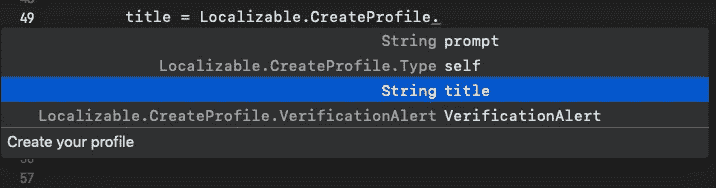
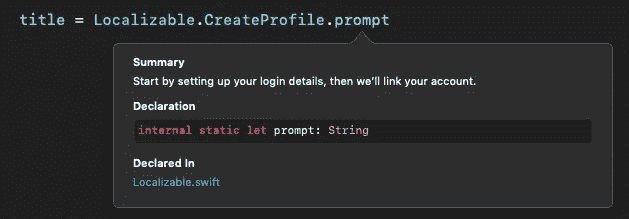

# 使用 SwiftGen 改进可本地化的字符串

> 原文：<https://betterprogramming.pub/localized-strings-using-swiftgen-55422974eb44>

## iOS 应用程序在屏幕上显示文本的基础


*可本地化的字符串*是 iOS 应用程序在屏幕上显示文本的基础。这些通常存储在`.strings`文件中，这些文件根据用户的语言环境进行切换。

让我们来看看你通常会怎么做。对于您支持的每种语言，您都有一个`.strings`文件。每个文件可能如下所示:

```
"action.cancel"="Cancel";
"action.logout"="Log out";
"action.ok"="Ok";"welcome.title"="Welcome!";
```

通常，您可以通过一个本地化的字符串使用这个键来查找它。

```
let localizedTitle = NSLocalizedString("welcome.title", comment: "")
```

然而，每当您想要一个本地化的字符串时，这是一件相当冗长的事情。我们也不需要使用 comment 参数，所以我们可以添加一个字符串扩展来使它读起来更清晰，如下所示:

```
// MARK: String extensionextension String {
  var localized: String {
    return NSLocalizedString(self, comment: “”)
  }
}// Usage:let localizedTitle = "welcome.title".localized
```

这是一个更干净的解决方案，尽管仍然存在一些问题。让我们更深入地看看它们。

首先，你可以写任何你喜欢的键，因为它只是一个字符串，不能保证它会出现在本地化的`.strings`文件中。如果它不存在，就会导致键显示为值，给最终用户留下不愉快的体验。

其次，它需要不断地在本地化的`.strings`文件之间切换视图，以找到您要复制并粘贴到所需视图或视图控制器中的键。

肯定有更好的方法。

# 介绍静态编译的本地化字符串

下一步将需要一个名为 [SwiftGen](https://github.com/SwiftGen/SwiftGen) 的依赖项。它可以通过 [Cocoapods](https://cocoapods.org) 、 [Carthage](https://github.com/Carthage/Carthage) 或 [Swift package manager](https://swift.org/package-manager/) 添加到您的项目中。

SwiftGen 是一个 [Swift](https://developer.apple.com/swift/) 代码生成器工具，可以在 [Xcode](https://developer.apple.com/xcode/) 的构建阶段生成代码。我们希望在应用程序的主目标上，或者在包含可本地化的`.strings`文件的目标上，添加以下代码作为新的运行脚本阶段。

```
TargetName=YourAppsMainTargetName
SourcePath=$SOURCE_ROOT/$TargetName/PathToLocalizableStringsFile.strings
Output=$SOURCE_ROOT/$TargetName/PathToOutputFileIncludingName.swift$PODS_ROOT/SwiftGen/bin/swiftgen strings -p $PODS_ROOT/SwiftGen/templates/strings/structured-swift4.stencil $SourcePath — output $Output — param enumName=Localizable
```

请确保替换以下变量:

```
YourAppsMainTargetName
PathToLocalizableStringsFile.strings
PathToOutputFile.swift
```

构建完成后，它将生成包含枚举的文件，这些枚举具有表示所有本地化字符串的静态常数。记得将生成的文件添加到 Xcode 的`.project`文件中。

现在，您可以使用 Xcode 的自动完成功能来访问本地化字符串。



使用 Xcode 中新创建的对象自动完成

利用 option 键点击变量名来访问 Xcode 的快速帮助，查看本地化的`.strings`值。



描述本地化字符串值的 Xcode 快速帮助

希望这已经教会了你一些新的东西，可以帮助你改进在 iOS 和 Mac OS 开发中使用本地化字符串的方式。