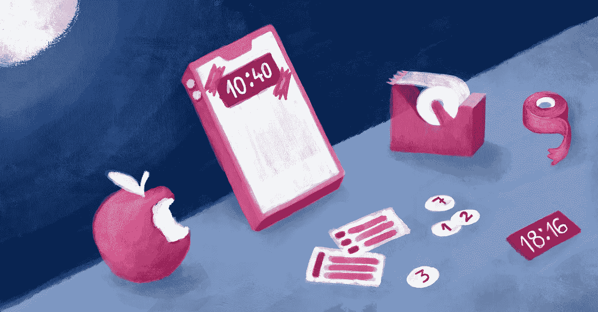
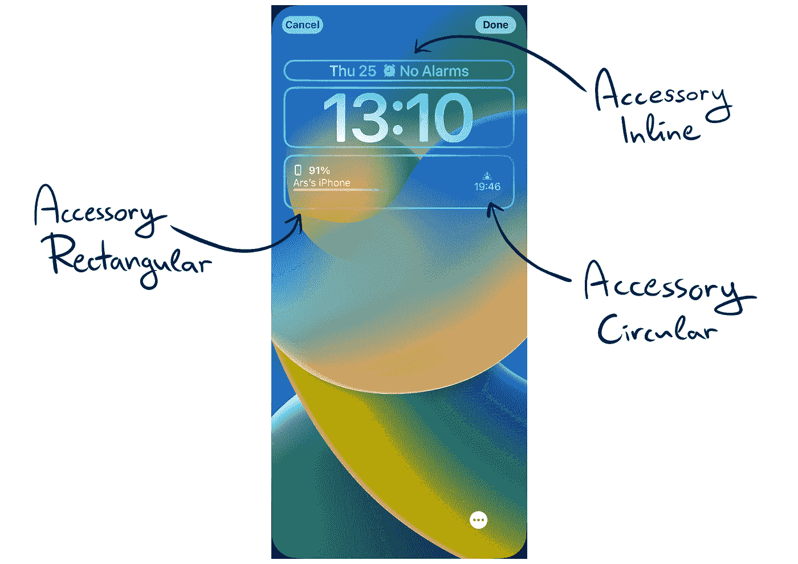
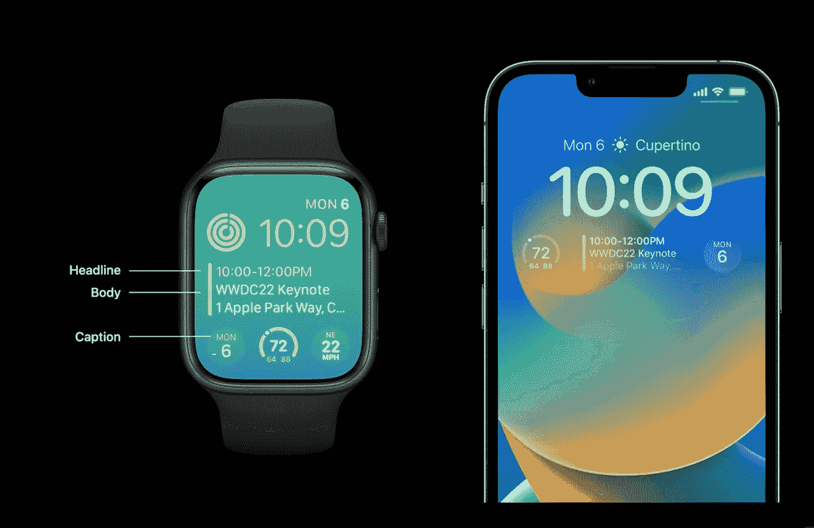
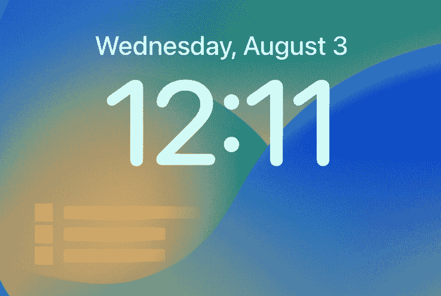
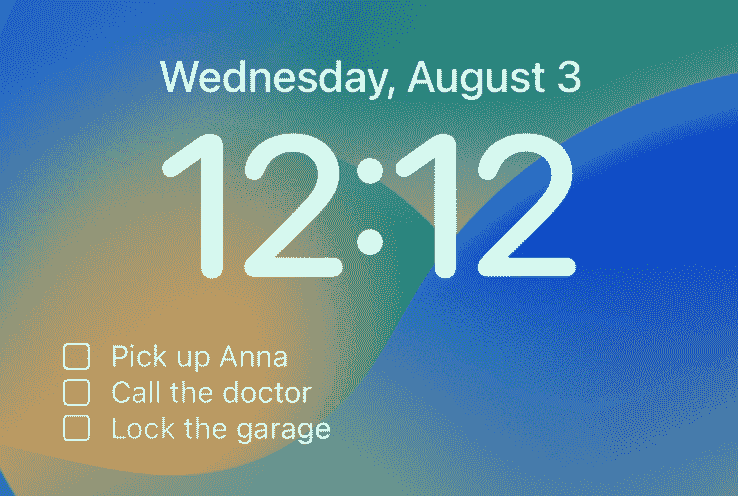
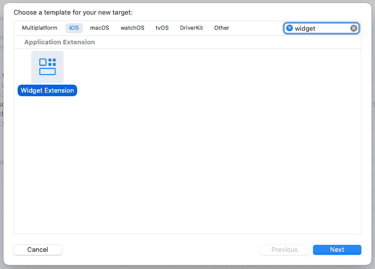
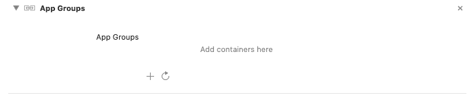
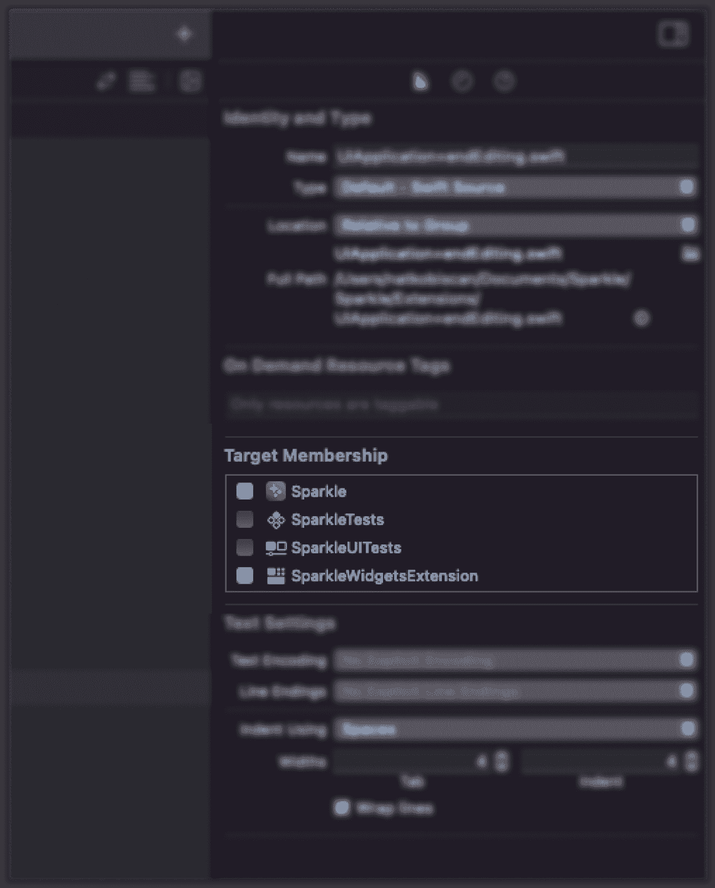
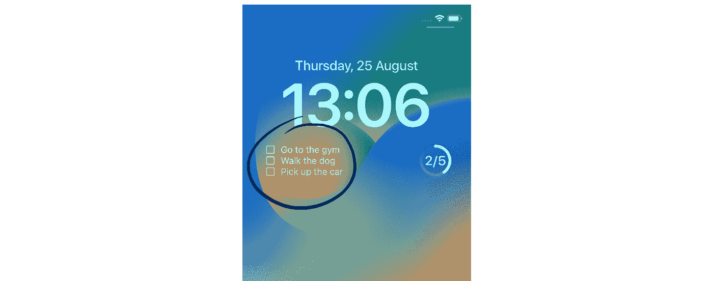
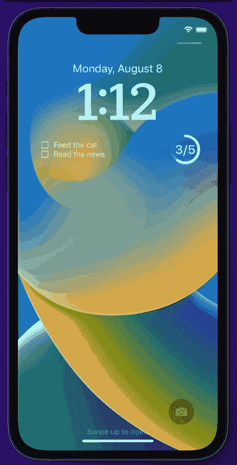

# SwiftUI 中的锁屏小工具

> 原文：<https://betterprogramming.pub/lock-screen-widgets-in-swiftui-1585aaa93ed4>

## 通过这个锁屏小工具教程，为 iOS 16 和 watchOS 9 的新版本做好准备。



# 介绍

随着许多令人兴奋的新功能在今年秋天进入 iOS，作为一名 iOS 开发人员，我一直坚持的一个功能是将小部件带到锁定屏幕。主屏幕小工具让用户更容易看到及时的数据，现在 iOS 更进一步，让用户进入锁定屏幕。我总觉得这是 iOS 设备上缺失的部分——只需要扫一眼锁屏，就能更新你最喜欢的应用程序。

因此，让我们看看如何用一些闪亮的新部件来扩展我们的应用程序。

# 锁定屏幕 Widgets

好吧，这到底是怎么回事？watchOS 的复杂性以新的锁屏小工具的形式出现在了 iOS 上。这也意味着，如果我们遵循一组样式规则，我们可以为我们的小部件编写一次代码，并在不同的设备上使用它。用于在 SwiftUI 中创建小部件的框架被称为`WidgetKit`。你可能很熟悉它，它从 2020 年就有了，还有 iOS 14 的发布。但是现在，最初的 widget 家族(苹果称之为 widget)得到了扩展，有了新的细微差别。

原始小部件系列中增加了 3 种新的小部件类型:

*   `accessoryRectangular`，显示多行文本或更小的图形
*   `accessoryCircular`，用于显示进度视图和量表
*   `accessoryInline`，仅显示文本，对于较长的内容很有用



`accessoryCorner`也是存在的，但是由于那个是在 watchOS 上单独使用的，我们就留到下次吧。

它们可以被渲染成 3 种不同的颜色。但在 iOS 上，为了适应锁屏的吸引力，只能在我们的锁屏小工具上使用去饱和版本。我们可以在 Xcode 的实时视图中检查小部件的外观和可见性，或者直接在模拟器上构建它们。因为小部件存在于一个单独的方案中，所以很容易节省时间，只在处理它们的时候重新构建它们，但是我们将在稍后的教程部分讨论这个问题。

我们已经提到了一些规则，所以让我们来讨论一下。嗯，它们并不是真正的规则，只是在设计小部件时需要记住的一些事情，以使它们更有吸引力和易于使用。

## **言简意赅**

我们为小部件获得的空间非常有限。我们应该简明扼要，只展示必要的信息。把它当成一件好事。你不需要展示太多，比如应用程序的标题或任何相关的文字。以苹果的健身小工具为例。它只显示 3 个同心圆，没有文字或数字，但是用户确切地知道哪个圆显示什么数据。

此外，将小部件的内容包装在`ViewThatFits{ ... }`中会很有用，尤其是在避免较长文本的自动省略时。

## **牢记设计**

用户会在他们的锁屏上组合不同应用的小工具，所以你应该在设计小工具时坚持苹果的风格规则。当看到粗体文本或内容旁边的竖线时，他们希望获得特定信息，因此请进行研究并利用 SwiftUI 提供的默认字体参数和样式的优势。



来源:[developer.apple.com](http://developer.apple.com)

为了应用这些样式，我们使用如下修饰符:

用彩色背景测试你的小部件，这可以使内容不那么明显。我们可以利用这里的`AccessortWidgetBackground()`，它给了我们漂亮的自然不透明背景。

## **连接您的小工具和应用**

锁屏小工具的行为与 watchOS 的复杂功能非常相似，因此它们不可交互。它们旨在显示你的应用程序中的简略内容，而不是可点击的元素。当点击时，他们在当前打开的屏幕上进入应用程序，或者，如果实现，深入链接到应用程序内的特定视图。我不会深入讨论深度链接的细节，因为那是另外一篇博文，但是一旦你为你的应用程序配置了深度链接，你只需将`.widgetURL(entry.url)`添加到你的小部件的视图中，它就会像魔法一样工作。

## 隐私

因为我们在锁定屏幕上显示数据，所以我们需要对显示的内容保持谨慎。默认情况下，微件在锁定的屏幕上显示未编辑的数据，这有暴露用户个人和敏感数据的危险。

你可能会问，当屏幕被锁定时，我们如何实现敏感数据的编辑？假设我们在一个矩形小部件中显示一些敏感数据。我们可以在屏幕锁定时显示占位符，反之亦然:



这也适用于其他小部件格式。要在 SwiftUI 中实现这一点，只需在视图中添加`.privacySensitive()`修饰符。您可以只标记敏感数据，如文本，并保留图标显示。加载数据时，该屏蔽视图也可以用作骨架视图。

留下来看看如何在⌨️.代码中实现这一点

# 辅导的📚

## 设置🔧

给你的项目添加一个新目标，然后找到`Widget Extension`。



给小部件目标命名。比如我的 app 叫 Sparkle，那么我的目标就会被命名为`SparkleWidgets`。

现在打开`SparkleWidgets.swift`文件。在这里可以找到所有与小部件相关的代码。

为了简要解释文件中自动生成的代码，我们可以看到:

*   **时间线提供者**，负责小部件的刷新时间
*   **入口视图**，用于呈现小部件的 UI，类似于您可能已经熟悉的 SwiftUI 视图
*   **widget Configuration** ，连接提供者配置和视图，为 Widget 设置一些配置，比如我们支持的 Widget 类型，显示名称等。
*   **预览提供者**，Xcode 的实时预览工具

如果您愿意，您可以将这些结构提取到单独的文件中，使项目更加清晰。

## 履行

有 3 种类型的锁屏窗口小部件，我们想决定每个小部件如何呈现以及它显示什么数据。实现这一点的最常见选项是在视图主体中使用 switch case 语句，如下所示:

你将需要`widgetFamily` [环境值](https://developer.apple.com/documentation/swiftui/environmentvalues)来完成这项工作。您可能注意到了`Gauge`视图，这是 iOS 小部件的新视图。它有一系列风格可供选择，通常会显示我们应用程序中某样东西的范围或进度。

## 在应用程序之间传递数据

理想情况下，我们希望在小部件上显示某种动态数据，而不特别使用静态文本。

因此，让我们在这个组合中添加一个新的元素:让我们将主应用程序中的数据与小部件本身共享。这可以通过多种方式完成，但建议使用应用程序组和用户默认设置。

应用程序组为单个开发团队创建共享存储，在我们的应用程序之间使用。

方法如下:

选择你的主要目标并导航到`Signing & Capabilities`标签。然后按左上角的`+ Capability`按钮，搜索`App Groups`选项。这应该出现在您的 Xcode 窗口中:



使用加号按钮添加新容器。您必须使用以下格式命名它:`group.your_app's_bundle_id`。您可以通过快速切换到`General`选项卡找到您的捆绑包 id。回到`Signing & Capabilities`选项卡，选择应用程序组部分的复选框，设置完成。

让我们完成编码吧🚀。在您的主应用程序中，只要业务逻辑方便，就将数据保存到我们新创建的共享数据容器中:

我使用了一个字符串数组，因为我的 widget 显示了我的 todo 应用程序中前 3 个最紧急的未完成任务，但这里可以使用任何类型的数据，这取决于您的逻辑。

另一方面——小部件的时间到了。同样，无论代码中的哪个位置有意义，您都可以使用下面的代码行来检索从主应用程序发送的数据:

我将一个空数组作为默认值，因为它允许我在锁屏界面上方便地处理空状态。

免责声明:如果您使用自定义类型传递数据，它在小部件的方案中是不可见的。要使该类可见，请在 Xcode 中打开 class/struct 文件，并打开右侧边栏。然后导航到名为`Identity and Type`的第一个选项卡，确保选中`Target Membership`部分下小部件目标旁边的框。假设我决定使用自定义的`Todo`类型，而不是字符串。那么我的`Todo.swift`文件将具有以下成员资格:



在应用了修饰之后，我的`accessoryRectangular`小部件代码现在看起来像这样:

这个小部件看起来像这样:



让我们也实现这个圆形小部件。我将使用前面提到的`Gauge`视图来显示我的“完成所有待办事项”比率。我们必须将完成的待办事项除以待办事项的总数。因为我们的标尺被用作进度循环，所以结果将是标尺的值。对于文本部分，我们将显示为一个分数。代码应该是这样的:


如果你想要，比方说一个线性进度条，你可以使用`accessoryLinearCapacity`。

## 刷新小部件🔄

因此，我们可以在应用程序之间传递数据，太棒了🏅。但是我们如何触发重载小部件上的数据来保持数据最新呢？

就我而言，每当我的待办事项列表以任何方式改变时，我都喜欢进行更新:编辑、删除，等等。

这就是 WidgetKit 中的`WidgetCenter`类的用武之地，更准确地说，是`WidgetCenter.shared.reloadAllTimelines()`函数。执行这一行将完全如其名。或者，您可以使用`reloadTimelines(ofKind: String)`指定重新加载哪个时间轴。

让我们在设备上运行这个东西，看看我们得到了什么:



这就是🪄.

您可以看到当应用程序中的数据被修改时，小部件是如何变化的。

# 从这里去哪里？

接下来有几件事要尝试。例如，您可以尝试将我们新创建的小部件构建为 Apple Watch complications。或者实现第三种小部件类型，`accessoryInline`。

我也鼓励你去看看新的锁屏[现场活动](https://developer.apple.com/documentation/ActivityKit)。它们将我们刚刚使用的 WidgetKit 与 ActivityKit 框架相结合，并且可以与我们的锁屏小部件进行逻辑组合。

感谢阅读。玩得开心！

```
Want to Connect?This story was originally published [here](https://arsfutura.com/magazine/lock-screen-widgets-in-swiftui/). Also, I'd be happy to connect on [GitHub](https://github.com/nbiscan) and [LinkedIn](https://www.linkedin.com/in/natkobiscan).
```