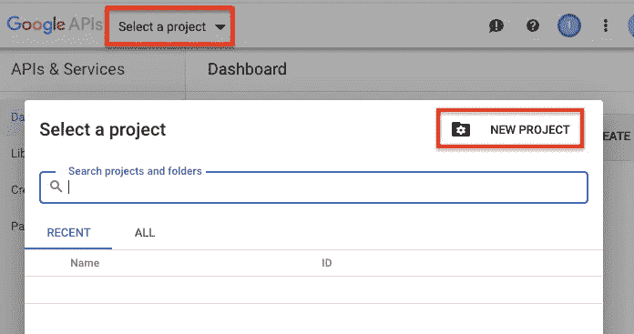
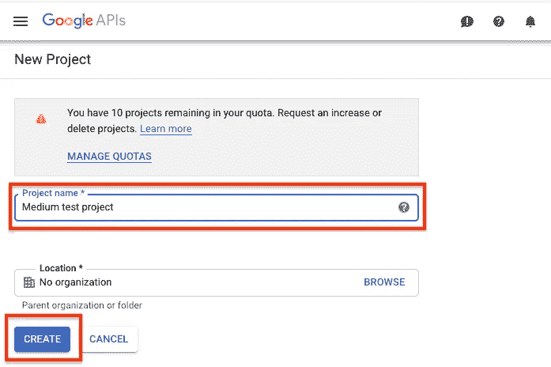
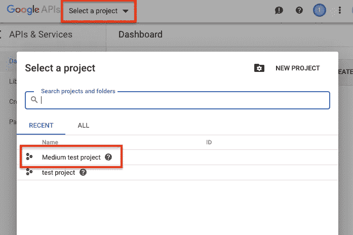
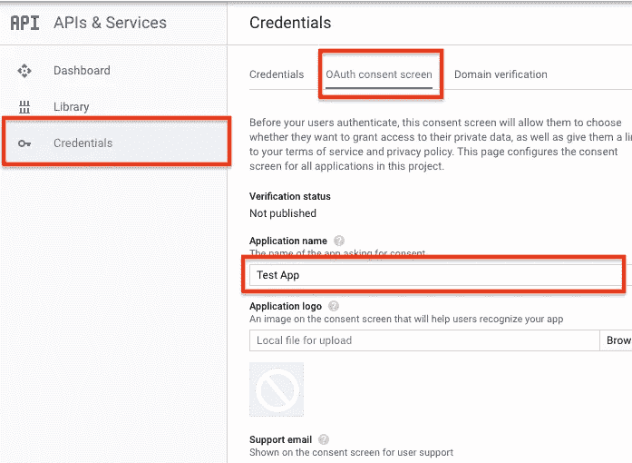
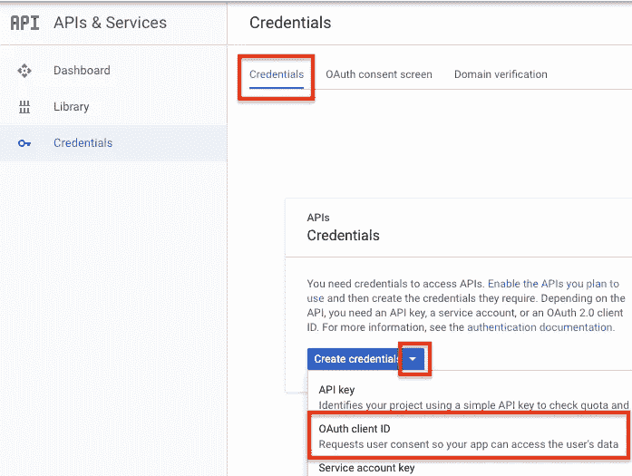
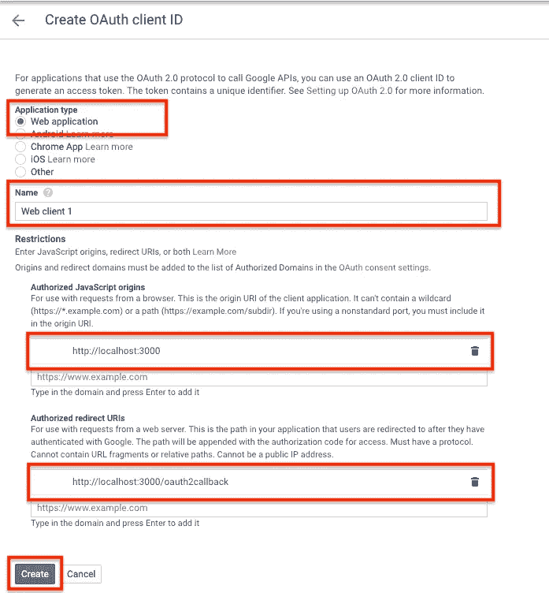

# 使用 Google OAuth 演示应用程序登录

> 原文：<https://betterprogramming.pub/log-in-with-the-google-oauth-demo-app-9e7d0e801c29>

## Google OAuth 2.0 的逐步实现

[迈卡·威廉姆斯](https://unsplash.com/@mr_williams_photography)上[下](https://unsplash.com/photos/lmFJOx7hPc4)

[OAuth](https://oauth.net/) 是一种授权开放标准，规定了互联网用户授权第三方访问其存储在其他网站上的资源的流程。

它被谷歌、脸书、推特等公司广泛使用。像谷歌这样的公司可以授权第三方应用程序或网站访问其用户的数据:姓名、电子邮件地址、个人资料图片、电子邮件等。

用户必须同意，但他们只会向谷歌提供他们的凭证，而不是第三方。

这里的关键术语是*授权*，因为我经常看到它被误认为*认证*。

这是因为 OAuth 通常被用作“使用谷歌”(或脸书，或 Twitter 等)登录网站的一种方式。).但是在这样做的时候，用户实际上并没有对那个网站进行认证。

他们授权它访问他们的谷歌信息，并且只将他们的凭证传递给谷歌，而不会传递给网站或应用程序。

注意:在这个过程中，用户可能必须向 Google 认证(如果他们之前没有这样做的话)，但是认证本身与 OAuth 无关，这只是 Google 的正常认证过程。

# 角色

OAuth 实现中通常涉及三个角色:

*   资源所有者:授权访问其数据(或部分数据)的用户。
*   第三方应用程序:希望访问资源所有者数据的网站或应用程序。
*   资源服务器:保存资源所有者数据的服务器，这些数据通过 API 公开。

# 分步示例

OAuth 的具体实现可能取决于想要访问数据的应用程序的类型。

在这个特殊的例子中，它将是一个 web 应用程序，既有服务器端又有前端，请求它的用户授权访问他们在 Google 服务器上的数据。

然而，对于移动应用程序、纯服务器应用程序或纯前端应用程序来说，这些步骤是非常相似的。

假设您正在构建一个 web 应用程序，您希望为您的用户提供登录功能，但您不想让他们填写注册表单并管理他们的所有密码，因此，您使用 Google 的 OAuth 服务来访问他们的个人资料信息。

要调用 Google 的 API 并获得有关其用户的信息，您需要一个访问令牌，然后将它包含在每个请求中，以便 Google 知道您已经被授权访问。

下面的步骤以随意对话的形式描述了如何获得这样的访问令牌，这样我们就不会迷失在技术术语中。

1.  **你:“嘿，谷歌，我想给我的应用程序的访问者允许它访问他们的谷歌数据的选项。”** 你登录谷歌(你将需要一个谷歌账户)并设置 OAuth，在这里你提供应用程序的名称，指定你想要从其用户那里访问的确切信息，以及其他一些事情。
2.  **谷歌:“好吧，但我需要他们的同意。”然后，谷歌会给你提供一个 URL，你需要在那里重定向你的用户以获得同意。它还提供了一个客户端 ID，您需要将这个 ID 附加到这个 URL 上，这样它就知道用户授权访问哪个应用程序以及可以访问的确切信息。它还提供了一个客户端密钥，您稍后会需要它。**
3.  **访问你的应用程序的用户:“我想登录谷歌。”**
    当你的应用程序的用户选择这个选项时，你把他们重定向到谷歌在第二步提供的网址。
4.  **谷歌(对用户):“你要允许这个应用程序从你的谷歌账户访问这些数据吗？”**
    如果还没有登录，Google 会先显示登录表单。如果用户已经同意这一点，它将跳转到步骤 6。
5.  **用户:“是。”**
    Google 确认用户同意，并将客户端 ID 标记为“可以使用”，这样下次就不会再要求许可了。
6.  **谷歌:“知道了！现在回到应用程序。”**
    谷歌将用户重定向回你的应用，到你在第一步提供的 URL，并附加一个授权码。
    注意:此 URL 可以呈现一个 HTML 页面，但这意味着您在该页面中可能拥有的任何第三方脚本(分析、广告等)。)可以访问授权码，因为它是一个`query`参数。因此，建议首先由您的服务器处理这个问题，然后将用户重定向到一个不包含任何响应参数的 HTML 页面。
7.  你的应用程序:“好的，谷歌，用户同意了，我有授权码可以证明。现在可以给我我的访问令牌了吗？”
    然后，你的应用程序调用另一个 Google URL，并提供第 6 步中的授权码，以及第 2 步中的客户端 ID 和客户端密码。
8.  谷歌:“好的，在这里。”Google 在响应中向您的应用程序提供访问令牌。
9.  **你的 app:“终于！谷歌，给我这个访问令牌的配置文件信息。”使用访问令牌，应用程序调用 Google 的 API 端点，该端点提供用户的姓名、电子邮件地址和个人资料图片。根据您在步骤 1 中的选择，您可以呼叫其他端点并获取用户的电子邮件、删除它们、发送电子邮件等。**
10.  **你的 app:“嗨用户！谷歌给了我你的个人资料。”**
    这个应用程序现在有了用户的姓名、电子邮件地址和个人资料图片。它可以在其数据库中创建一个记录，以保存它需要的关于该用户的任何信息，并在将来的访问中识别它们。

虽然我在这个特定的例子中使用了谷歌，但它也适用于其他服务提供商，如亚马逊、脸书或 Twitter。

他们通常还提供各种编程语言的库来帮助您实现。

各个服务提供商的步骤可能会有所不同，不同类型的应用程序有不同的流程。这可能有点混乱，但总体过程应该是相似的。

# 构建一个演示 Web 应用程序

## 获取 OAuth 客户端 ID 和客户端密码

我们首先需要的是客户 ID 和客户密码。

你可以通过进入 [Google API 控制台](https://console.developers.google.com/projectselector2/apis/dashboard?organizationId=0&supportedpurview=project)然后按照下面的步骤来获得它们。

1.创建新项目。

2.为项目选择一个名称。

3.选择您刚刚创建的项目。

4.为您的应用程序命名。你也可以上传你的应用程序的标志，它将出现在谷歌的同意屏幕上。

5.创建 OAuth 客户端 ID 和密码。

6.填写高亮显示的详细信息。

7.您现在有了一个客户端 ID 和一个客户端密码。稍后您会需要它们(它们在您的 API 控制台中总是可用的)。

# 应用程序

这是一个简单的演示应用程序。它由两个文件组成:一个 HTML 页面和一个 [Node.js](https://nodejs.org/) 服务器文件。

HTML 文件是一个简单的网页。它有一些 JS 逻辑来显示“使用 Google 登录”按钮或基于一些`query`参数的用户详细信息。

`getClientId()`从服务器获取客户端 ID，因为它通常不存储在客户端。

服务器文件获取客户机 ID 和客户机秘密命令行参数(在启动服务器时必须提供)，并从`public`文件夹(上面的 HTML 文件)提供静态数据。

它有一个用于 HTML 页面获取客户端 ID 的`/clientId`端点的处理程序。

`/oauth2callback`端点的处理程序是我们之前在获取客户端 ID 和密码时设置的。

这是 Google 在用户同意后重定向用户的地方，并在代码查询参数中传递一个授权`code`。有了这些信息、客户机秘密和客户机 ID，这个处理程序就调用`[https://www.googleapis.com/oauth2/v4/token](https://www.googleapis.com/oauth2/v4/token)`来获取访问令牌。

然后，它将令牌传递给`getUserInfo()`，后者获取用户详细信息，并将用户详细信息作为查询参数重定向到本地主机，HTML 页面将呈现这些信息。

请记住，这是一个演示应用程序。当你为现实世界构建一个时，仔细考虑一下架构。

你可以从 [GitHub](https://github.com/ionelh/google-oauth-demo-app) 克隆这个应用。

# 参考

[将 OAuth 2.0 用于网络服务器应用](https://developers.google.com/identity/protocols/OAuth2WebServer)