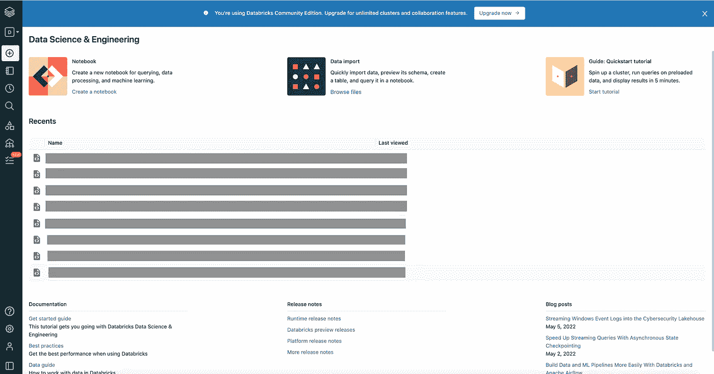
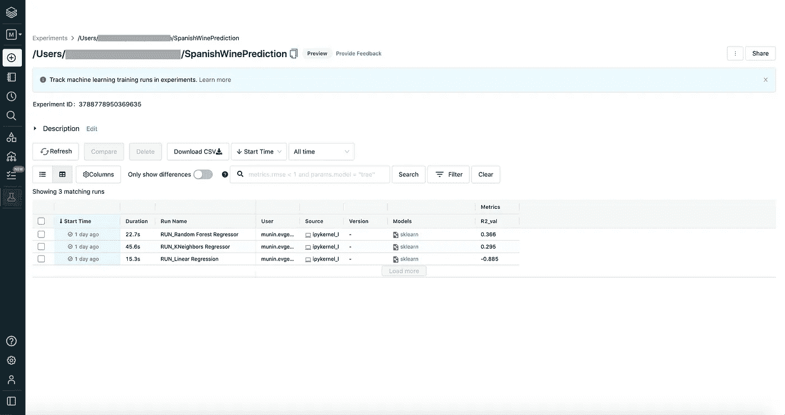
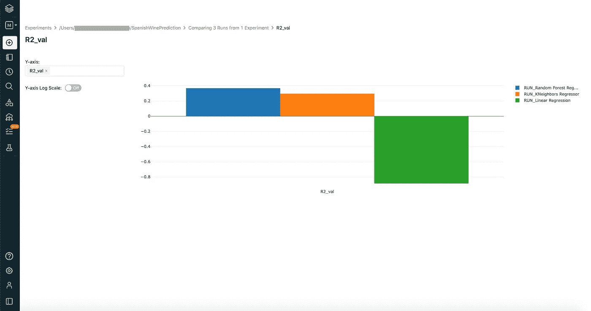

# 用 MLflow 在 Azure Databricks 上进行日志机器学习实验

> 原文：<https://betterprogramming.pub/log-machine-learning-experiments-with-mlflow-on-azure-databricks-5a85955c9d3a>

## 在 Databricks 中获取远程 MLflow tracking 服务器上记录的模型、指标和工件


由[麦斯威尔·尼尔森](https://unsplash.com/@maxcodes?utm_source=medium&utm_medium=referral)在 [Unsplash](https://unsplash.com?utm_source=medium&utm_medium=referral) 上拍摄的照片

在上一篇文章中:[“用 MLflow 自动化你的机器学习实验”](https://medium.com/@evgeniimunin47/automate-your-machine-learning-experiments-with-mlflow-8c9e42df421)我们对[葡萄酒价格预测数据集](https://www.kaggle.com/datasets/fedesoriano/spanish-wine-quality-dataset)进行了几次运行。

我们已经在本地跟踪服务器中记录了结果、工件和模型参数。但是，当我们在一个团队中工作，并且想要比较我们的同事在本地机器之外制作的日志时，我们应该做什么呢？

在这种情况下，我们应该设置一个远程跟踪服务器，工件驻留在远程主机上。为此，我们将使用 Azure Databricks 上的实例。

首先，我们应该登录到 Databricks 工作区。出于演示的目的，我登录了社区云数据块，因为它为简单的 ML 实验免费提供了足够的功能。我们注册并填写表格来创建一个账户[https://databricks.com/try-databricks](https://databricks.com/try-databricks)。在这之后，主页应该看起来像这样:



当我们能够访问我们的工作区时，我们应该安装 CLI 工具来与远程工作区交互。为了安装 CLI，我使用了 Python 版本 3.8.8 和以下 pip 命令:

```
pip install databricks-cli
```

安装 CLI 后，我们可以使用以下命令检查其版本

```
databricks --version
```

那么我们应该设置身份验证。有两种方法可以做到这一点

*   通过提供用户名和密码
*   通过生成和提供数据块个人访问令牌。推荐使用这种方法，但是在写这篇文章的时候，我没有在用户设置中找到可用的令牌生成，可能是因为我正在使用社区云。

所以我们将进行第一个选项。要设置身份验证，请编写以下命令

```
databricks configure
```

然后在提示中，我们需要提供

*   主机名。一般来说，您应该以`https://<instance name>.cloud.databricks.com`的格式输入您的工作区 URL。在社区云的情况下，我们进入[https://community.cloud.databricks.com/](https://community.cloud.databricks.com/)。
*   用户名(您的电子邮件)
*   密码

完成提示后，您的凭证将存储在`~/.databrickscfg`文件中，以便您可以检查它们。

```
cat .databrickscfg
```

现在，我们可以检查 CLI 是否可以与远程工作区交互。运行以下命令查看工作区文件夹内容。

```
databricks workspace ls /[Users/](mailto:Users/munin.evgenii@gmail.com)<your username>
```

关于如何设置更多高级访问的更详细说明，如多个配置文件和命令组，您可以在 [Databricks CLI 文档](https://docs.databricks.com/dev-tools/cli/index.html#set-up-authentication)中找到。

导入 MLflow 后，立即在 Databricks 工作区中设置跟踪 URI 和实验文件夹。

```
import mlflow
mlflow.set_tracking_uri("databricks")
mlflow.set_experiment("/[Users/](mailto:Users/munin.evgenii@gmail.com)<your username>/SpanishWinePrediction")
```

然后，我们用逻辑回归、随机森林和 KNN 回归模型进行了与在[之前的文章](https://medium.com/@evgeniimunin47/automate-your-machine-learning-experiments-with-mlflow-8c9e42df421)中所做的相同的实验。运行应该直接上传到远程工作区。MLflow UI 主页应如下所示:



同样，我们可以对每次运行的验证指标进行并排比较。



在本文中，我们设置了远程跟踪服务器，并记录了实验运行的结果。感谢您的阅读，我将感谢您在下面评论区的反馈！

## 链接

*   【https://docs.databricks.com/dev-tools/cli/index.html 
*   [https://github.com/databricks/databricks-cli#installation](https://github.com/databricks/databricks-cli#installation)
*   [https://docs . databricks . com/applications/ml flow/tracking . html](https://docs.databricks.com/applications/mlflow/tracking.html)