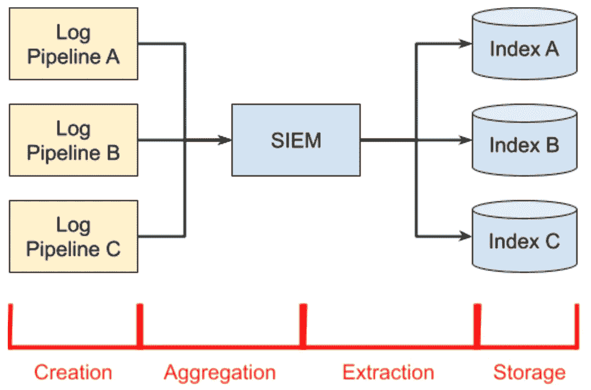
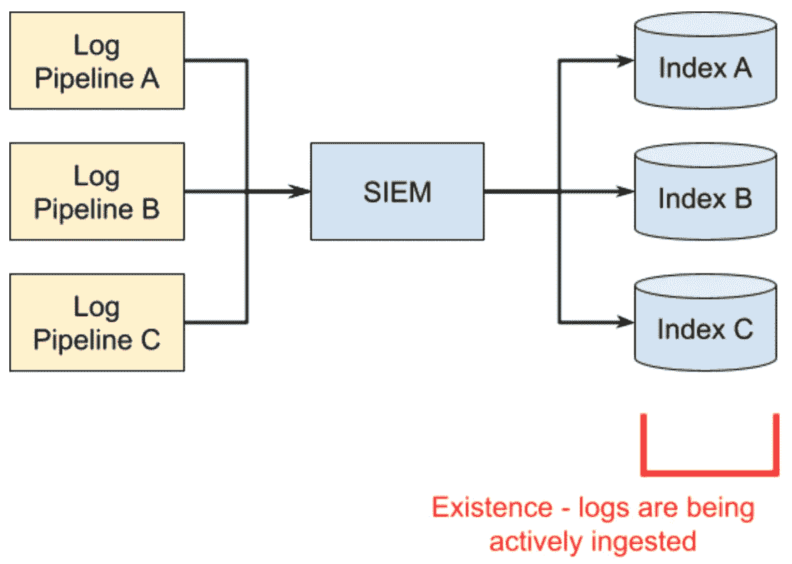
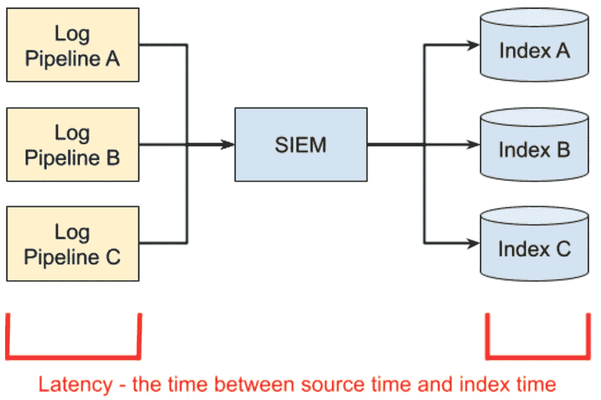
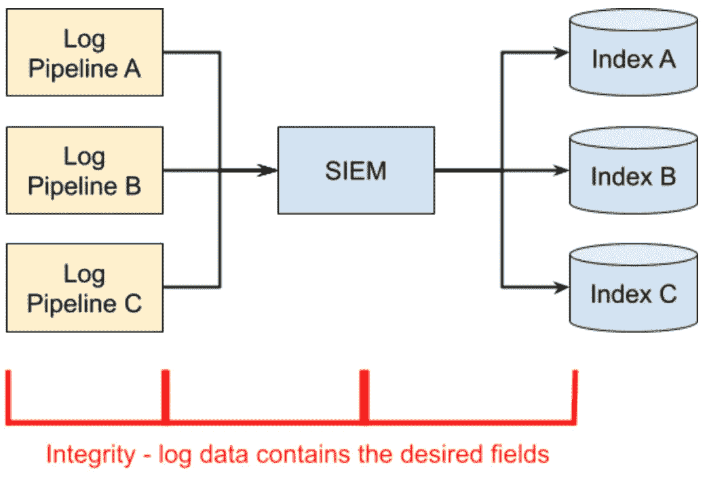
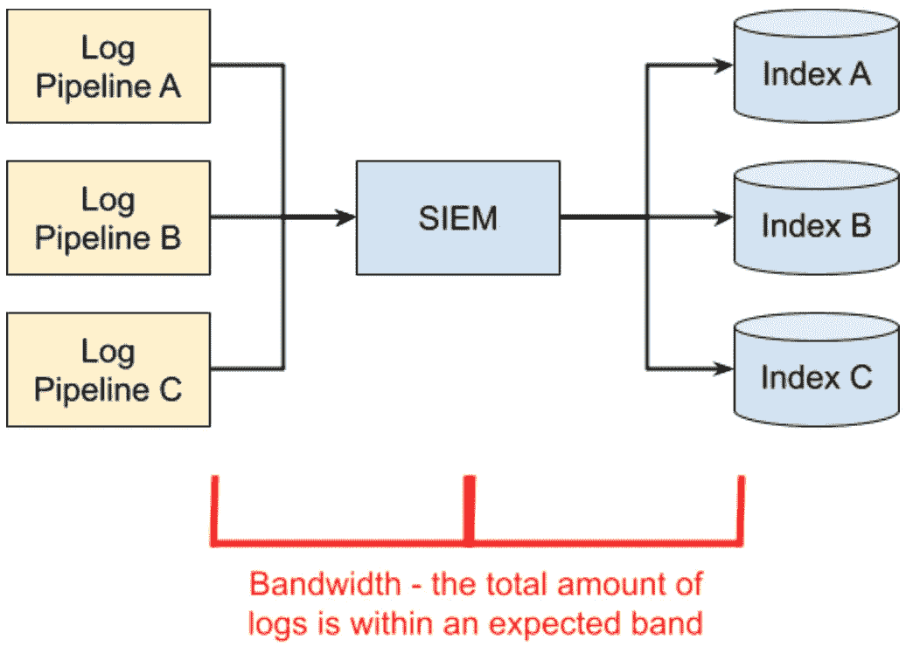
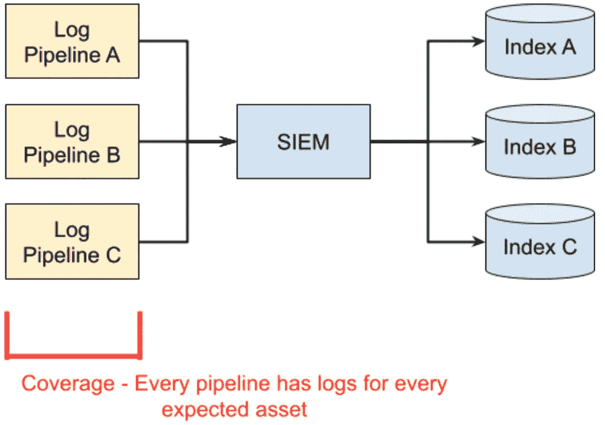
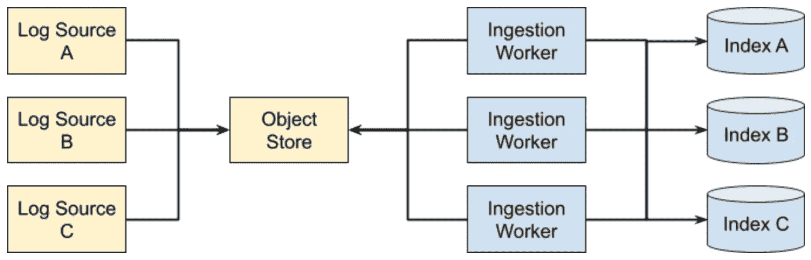

# 关键日志流的日志监控

> 原文：<https://betterprogramming.pub/log-monitoring-for-critical-log-streams-1a68d50395a6>

## SIEM 管理概览

由 [Ales Krivec](https://unsplash.com/@aleskrivec?utm_source=unsplash&utm_medium=referral&utm_content=creditCopyText) 在 [Unsplash](https://unsplash.com/s/photos/logging?utm_source=unsplash&utm_medium=referral&utm_content=creditCopyText) 上拍摄的照片

日志监控讨论得不够频繁。这可能是因为大多数人认为这很简单——只需编写一个警报来查看日志是否在流动，对吗？如果这对您的运营有效，那很好，但是当安全团队需要真正了解我们必须管理的攻击面时，这就不够了。

我管理过一个 SIEM (Splunk、Graylog、ELK 等。)已经很多年了，这些只是我遇到的一些日志记录中断。

*   部分主机日志记录中断→只有一小部分设备停止日志记录
*   罕见的日志流→一个一周只输出一次的日志流已经两周没有记录任何东西了。
*   日志格式改变→日志的数据格式改变，因此当日志仍在流动时，它们不会触发安全警报。
*   潜在日志→时间提取问题导致日志被安全警报过滤掉。
*   指示失败的日志流→一个关键进程重复打印错误，但是日志以正确的格式到达。
*   日志数量激增→应用程序中的一个打字错误导致日志膨胀到原来的十倍。
*   上游聚合器中断→上游日志收集器出现错误，导致日志流失败。

通常感觉修复日志管道错误就像玩打地鼠游戏，尤其是在一个不断添加和删除服务的大型组织中。此外，该组织的员工分布在不同的地理位置，在新产品部署方面没有紧密的协调。

一路走来，我学到了很多东西。这些课程可以分为两类:日志警报策略和日志管理课程。

我的日志警报公式(从简单到复杂):

*   日志存在→确保每个索引和日志类型的日志都在流动。
*   日志延迟→确保在适当的时间窗口内收到的最后一批日志带有时间戳。
*   日志完整性→确保日志是可解析的，有您需要的字段，并且没有被截断。
*   日志带宽→检查事件计数或日志的总大小没有显著变化。这适用于日志的下降或增长(异常检测)。
*   日志覆盖范围→通过检查每个资产是否已报告，确保捕捉到部分中断。

我学到的重要经验是:

*   定义标准日志摄取模式。
*   记住资产管理的重要性。
*   促进开发运维团队和安全团队之间的协作，以实施高保真监控。

# 日志管道的阶段

管道的阶段如下:

*   创造是指原始事件的产生。
*   聚合是在将日志发送到 SIEM 之前对其进行收集、批处理和丰富的过程。
*   提取是 SIEM 用来将日志数据转换为结构化事件的过程。
*   存储是获取结构化事件并将其放入各自索引中的过程。

一切最终都会失败，这意味着在这些阶段中的任何一个阶段都可能发生日志记录中断。就个人而言，我发现使用这四个阶段作为划分调试过程的一种方式来建模日志工作流是很有用的。

如果您是负责 SIEM 的 DevOps 工程师，您通常负责提取和存储。提取通常是一系列的正则表达式，将非结构化的日志转换成具有可搜索字段的结构化对象(例如，从 shell 命令中提取用户名)。管道的这一部分对于在创建和聚集阶段所做的更改来说非常脆弱。如果你的大部分精力都花在拔牙上，不要惊讶。

大规模存储变得复杂。当您每天接收数 TB 的数据时，您会在许多不同的组件上遇到扩展问题。成本成为一个主要因素，因为由于日志的存储和搜索数据所需的必要计算，SIEMs 很容易变成数百万美元的问题。

如果您是产品的 DevOps 工程师，您通常负责创建和聚合，但不负责提取和存储。创建过程中的一个常见问题是记录太多或太少。即使是一个简单的打字错误也可能导致日志失控，并导致管道其余部分的级联故障。聚合有时是本地的(例如，批量抓取日志的主机进程)，但也可以通过日志服务器来完成(例如， [logbuf](https://pkg.go.dev/github.com/cloud-foundations/dominator/lib/logbuf) ， [logstash](https://www.elastic.co/logstash/) ， [WEF](https://docs.microsoft.com/en-us/windows/security/threat-protection/use-windows-event-forwarding-to-assist-in-intrusion-detection) )。

# 日志监控公式

拥有一套准确完整的 SIEM 日志对于安全团队所需的可见性至关重要。如果安全团队缺乏可见性，整个系统的安全性就岌岌可危。因此，需要投入额外的精力来监控这些日志。我建议构建一组警报来涵盖以下四个方面:存在性、延迟、完整性、带宽和覆盖范围。

接下来的几节将对其中的每一个进行更深入的讨论。

## 日志监控:存在

存在是最简单的监控形式。这里的想法只是确保日志是流动的。对于每个指标，你只需要`<Index>`、`<Type>`、`<Time Frame>`、`<Alert Mechanism>`即可。

用英语来说，应该是这样的:“检查最后一个`<Time Frame>`中`<Index>`、`<Type>`的新日志，如果没有发现任何东西，那么发送一个`<Alert>`”

这种格式非常适合从 CSV 到监控平台的自动化。将这些警报或阈值编码为 CSV 的优点是它使配置民主化，更好地支持跨团队协作。然而，如果你要实现下面的所有检查，我建议你迁移到一个 Terraform 模块。

## 日志监控:延迟

在事件生成和事件在 SIEM 中被索引(即事件可搜索)之间总会有延迟。

理想情况下，这个时间应该尽可能短(不到一分钟)，以便能够对对手的行动做出快速反应。然而，有许多原因可能并非如此。

例如:

*   日志源根据时间将日志分组。
*   日志源出现某种形式的中断。
*   日志源上的主机时间已关闭。
*   SIEM 摄取超载并被备份。
*   来自烘焙映像或容器的旧日志文件被拾取。

SIEM 中的大多数搜索都是有时间限制的(即检查过去 30 分钟的所有日志)，源时间用作默认时间。如果搜索参数小于延迟时间，则事件可能无法被检测到。

例如:一个应用程序每 30 分钟汇总一次日志，并将其发送到 SIEM。您编写一个搜索，使用源时间查找过去 15 分钟内的所有事件。当新一批日志进来时，其中一半发生在 15 分钟前，并被您的搜索参数过滤掉。如果那个窗口发生了可疑事件，它将不会被发现。

延迟检查更难的部分是确定使用什么指标来发出警报。您可以选择以下任何一项(或全部使用这三项):

*   最新事件的年代(这批日志离现在有多近？)
*   最早事件的年龄(这批日志记录了过去多长时间？)
*   事件的中值、平均值或 99%年龄(日志的平均年龄是多少？).

其中要检查的最重要的是最新事件的年龄(即，您是否仍在接收最近生成的日志？).此检查失败意味着系统的某个部分无法跟上最新的日志。如果这个检查通过了，而其他两个没有通过，则表明出现了更细微的故障情况，很可能只是部分故障。

如果需要，您可以将这三项检查添加到 CSV 格式的日志监视:存在检查中。同样，这在地形上会更好看。

## 日志监控:完整性

随着时间的推移，日志格式可能会改变。这可能导致在 SIEM 中运行的搜索返回过多或过少的数据。由于日志数据和 SIEMs 的性质，如果没有专门针对此目的的策略，这些类型的错误通常很难检测到。

即使日志创建阶段保持不变，在聚合或转换过程中也会发生错误。日志行可能会变得太长并被截断，消息可能会被错误地过滤，丰富步骤可能会失败。所有这些都会删除重要字段，安全团队会对他们的检测搜索为什么不起作用感到困惑。

这里的技巧是实施监控，检查安全团队所依赖的特定字段的日志消息，并在这些字段不再显示时发送警报。此警报可以在创建、聚合或提取阶段编写，但最重要的是这些字段在安全警报中是可用的。因此，我建议将完整性检查实现为对实际数据的搜索。

## 日志监控:带宽

我最初并不认为带宽警报是一个高优先级。只要我们在正确的时间范围内接收日志和正确的数据，一切都很好，对吗？不对。

有一天，我们的产品出现了一个打印错误，导致调试日志被发送到 SIEM。生成了如此多的事件，以至于我们轻松地拥有了十倍于传入数据量的数据。这个数据规模如此之大，以至于在一天之内几乎无法搜索到这些数据。出于法律原因，我们不得不将数据再保留三年。

带宽是一个很好的衡量指标:每种类型的传入日志的大小和速率是多少，达到什么阈值时应该发出警报。虽然简单的度量阈值警报会起作用，但我建议将[异常警报](https://docs.datadoghq.com/monitors/create/types/anomaly/)作为更全面的警报来研究。

还有一个问题是，这种性质的事件属于高优先还是低优先。你能在营业时间处理它吗？还是应该是可分页的事件？这是法规遵从性、安全性和财务都需要发表意见的地方。如果你在三年内不能删除数据，并且预算紧张，那么一个页面是有保证的。然而，如果你可以明天清除日志，那么一个晚上的存储可能是好的。

## 日志监控:覆盖率

覆盖率检查本质上是存在性检查的高级版本。您不是检查是否有任何数据到达索引 A，而是进行搜索以确认您期望在索引 A 中的所有数据都在那里。举个例子，如果您在团队中的每台主机上运行类似于`OSQuery`的工具，您如何知道每台主机都成功地发送了`OSQuery`日志数据？您需要某种方法来识别现有的所有主机，并将其与 SIEM 中的数据进行比较。

这就是资产管理变得重要的地方。在这篇文章的后面，我将会更详细地介绍资产管理，但是重要的是你有一个应该存在的所有资产的列表。为存在的事物找出真相的来源是最具挑战性的部分。

值得注意的是，这种方法并不能保证每台主机的所有日志都可以在 SIEM 中搜索到，只能保证每台主机至少有一些数据。要获得更高级的性能，需要在主机上生成遥测指标，记录生成了多少个事件。您可以使用这些来确认每个消息都正确到达。这是非常先进的，似乎很容易产生噪音，所以尝试这一点要自担风险。

# 将所有警报放在一起

如果您想要涵盖上述所有警报，那么您可能已经超出了 CSV 最适合的范围。您还需要编写自己的 CSV-to-alert 自动化，这是另一个您可能不必花费的智能芯片。我推荐使用像 Terraform 这样的基础设施即代码工具来创建所需的抽象和自动化。下面是一个 Terraform 测井监视器的示例:

这只是伪代码，但我希望它能给你一些关于如何设置 SIEM 监控的启发。我是不是忽略了另一个角度？你有更简单的监控技术吗？请联系我！我一直在寻求了解更多。

# 监控 SIEM 时获得的重要经验

## 定义标准日志摄取模式

我犯的一个主要的基础设施错误是允许不同的团队自己选择如何将他们的日志记录到 SIEM 中。我们的解决方案不是规定性的，我们想给每个团队提供一个选项菜单供选择。

我们为每个团队提供了代理、API、第三方集成或者将文件放入 S3 桶的模式的选项。这种方法有许多缺点。

**供应商提供的 API/代理**

我们的想法是分发一个代理或凭证，使人们能够将日志直接推送到 SIEM。这是供应商推荐的。怎么可能会出错呢？

*   第一个问题是，这个模型不适合我们任何更复杂的网络需求(不是所有东西都有直接访问 SIEM 的 API)。它也不适用于任何 SAAS。
*   第二个问题是，在每次重大的基础设施升级或改善期间，我们必须进行协调升级，以确保人们的管道不会中断。在一个拥有数千名工程师的公司里，这是一项艰巨的任务。
*   第三个问题是，如果 SIEM 本身发生故障，我们无法控制人们如何设计冗余和恢复。一些人编写了自动重试日志传送的程序，直到成功为止。其他实现只是丢弃数据，导致部分日志中断。

**供应商提供的集成**

该供应商为许多不同的服务提供了集成。不幸的是，集成可靠性不是服务合同的一部分。如果微软改变了它的 API，供应商不提供任何保证。底层的集成代码很差，我们经常面临错误或限制。

不幸的是，当我们发现集成的麻烦比它们的价值更大时，我们已经陷得很深了。取代它们的唯一途径是编写我们自己的管道，这在当时是一项重大任务。这也意味着每当上游服务发生变化时，我们将负责更新我们的管道代码。两种选择都很糟糕。

## **在 Blob 存储中删除数据**

**这是目前为止最好的解决方案**。

Blob stores([Azure Blob Storage](https://azure.microsoft.com/en-us/services/storage/blobs/)、 [AWS S3](https://aws.amazon.com/pm/serv-s3/?trk=fecf68c9-3874-4ae2-a7ed-72b6d19c8034&sc_channel=ps&sc_campaign=acquisition&sc_medium=ACQ-P%7CPS-GO%7CBrand%7CDesktop%7CSU%7CStorage%7CS3%7CUS%7CEN%7CText&s_kwcid=AL!4422!3!488982706722!e!!g!!aws%20s3&ef_id=CjwKCAjwj42UBhAAEiwACIhADlGtXGJRlk-bSIE9tqJqEcvy3TRU8GeNEgGl3TQMtF1XRIIVtFl5oBoC618QAvD_BwE:G:s&s_kwcid=AL!4422!3!488982706722!e!!g!!aws%20s3) 、 [Google Storage Bucket](https://cloud.google.com/storage/docs/creating-buckets) )是水平可扩展的，并且具有非常好的冗余性。此外，这些工具还有用各种语言编写的客户端。它易于描述，易于维护，并且很难丢失数据。

下面是架构:

日志源使用任何适合用例的语言、框架或应用程序将数据传输到云对象存储。对象存储与通知系统(即发布者和订阅者模式)集成，以便在存放新的日志文件时生成事件。摄取工作人员(例如 Filebeat)订阅提要并下载日志文件，以进行提取、丰富或最后过滤。然后，日志被推送到 SIEM 中相应的索引中。

实际上，这种模式运行得很好，原因如下。

1.  日志传送被推到了边缘。将日志存储在像 AWS S3 这样的对象存储中是日志所有者的责任。可用的工具非常多，云提供的对象存储可以水平扩展到非常合理的水平。
2.  日志接收很简单，并且可以水平扩展。用户可以不断添加工作人员来下拉日志交付事件，并执行最后一分钟的过滤、提取或浓缩。这可以很容易地实现为原始计算中的一组自动扩展的工作线程或一个容器。
3.  生产者和消费者之间的契约是明确的。如果日志没有被传送到对象存储，则是生成器出了问题。如果日志已经到达对象存储，但没有到达 SIEM，则消费者有问题。如果对日志的完整性有争议，可以查看对象存储中的原始日志进行诊断。
4.  与供应商无关。由于对象存储提供了抽象层，因此无需重建所有管道就可以更改底层 SIEM。在比较或迁移阶段，您甚至可以并行运行这两项。

如前所述，如果我们从第一天开始就采用这种模式，我们就可以省去一大堆痛苦。

# 资产管理在 SIEMs 中的重要性

当我们第一次部署 SIEM 时，我们并没有强烈考虑将资产管理和日志可见性结合在一起。我们非常关注提取、转换、存储和可搜索性。尽管这些都很重要，但缺乏对资产管理的关注最终导致了一种不可持续的模式，这种模式的修复时间远远超出了预期。

资产的示例包括以下列表:

*   每个虚拟机、端点、防火墙、VPN 设备等等。
*   与您集成的第三方 SAAS 应用程序和上游存储库。
*   正在使用的公共 IP 地址列表。
*   正在使用的域列表。

本质上，我们没有考虑将数据集构建到 SIEM 中。由于 AWS Commercial 与 AWS Govcloud 的配置错误，当我们的日志部分中断时，这就成了一个问题。我们的直接问题是询问日志中断的范围有多广，但是我们没有当前或历史主机的简单查找表。如果我们从一开始就构建这些数据，我们就更容易找到停机范围和持续时间的根本原因。

要点:花时间设计整合到 SIEM 中的资产数据集。这些在安全和操作用例中都很有用。

# 日志监控:安全和开发运维的共同努力

将核心基础设施团队与安全团队分开是很常见的，因为他们的成果、技能组合和人员配备水平有很大不同。然而，这一边界在安全敏感的伐木管道周围变得模糊不清。谁负责监控日志管道或完整性中断？

如果整个问题被转移到 DevOps 团队，您将面临一个巨大的挑战，即确定到底要监控什么以及它的优先级是什么。根据经验，我可以告诉你，在大型生态系统中，将每个日志管道都设置为一个页面是站不住脚的(反过来，将所有事情都设置为低优先级也是不合适的)。尤其是在一个足够大的公司中，在管理 SIEM 基础设施的团队和管理生成日志的应用程序的团队之间，通常存在多个业务部门。

如果将整个问题转移给安全团队，安全团队最终会感受到记录停机的大部分痛苦，并且很少有能力修复底层问题。这导致了团队之间的消息传递游戏。

我的提议是:安全团队和 DevOps 团队应该合作，就如何处理日志管道建立一个契约。

该提案应包括以下内容:

*   一起设置警报阈值(存在、延迟和带宽的所有值是什么？).
*   识别关键字段(基于每个管道，安全团队需要哪些字段？).
*   关键程度(哪些管道对于快速响应 ADS 至关重要，应该呼叫工程师，哪些管道可以等待正常的 9-5 支持？).
*   记录团队之间的支持合同(当不可避免地出现问题时，两个团队如何合作找到根本原因并解决问题？).

像这样的合作关系将极大地提高 SIEM 生态系统的整体有效性。停机将根据他们的安全需求划分优先级，基础架构团队将能够更好地识别部分停机或日志记录格式问题，安全部门将有一条清晰的沟通和解决路线

# 总结

SIEM 管理(尤其是围绕管道)对于安全团队的命脉非常重要。随着攻击者变得越来越老练，基础设施变得越来越抽象，安全团队的可见性需求也越来越大。因此，如果想要保护客户的数据或资产，每个大公司都必须解决高质量的 SIEM 监控问题。

我的建议是使用五管齐下的方法来解决监控问题:存在性、延迟、完整性、带宽和总覆盖范围。我认为应该与安全团队合作设置管道阈值和警报严重性。管道本身应该遵循一个简单、可扩展的标准，将特定于应用程序的部分推送给应用程序所有者。最后，将资产数据集构建到 SIEM 中需要成为您策略的一部分，以便简化和改进总覆盖范围监控。