# 简单的逻辑门，第 2 部分

> 原文：<https://betterprogramming.pub/logic-gates-part-2-ff38d7f9752a>

## 继续我们理解基本逻辑门的指南

克里斯·里德在 [Unsplash](https://unsplash.com/photos/bN5XdU-bap4) 上的照片

这是我关于逻辑门的第二篇文章。如果你还没看过第一部，[这里是](https://medium.com/better-programming/easy-peasy-logic-gates-863e62657057)。

在上一篇文章中，我们讨论了基本的“与”、“或”和“非”逻辑门。现在我们要学习 4 种不同的逻辑门，它们是基本逻辑门的派生物。

*   “与非”
*   也不
*   异或运算
*   XNOR

现在我们将分别讨论每个门的基本功能、标准符号及其真值表。

## 与非门

与非门有两个输入和一个输出。它是由非门连接到与门的输出信号。在这个逻辑门中，只有当两个门输入信号为高时，输出信号才为低，否则，输出为高。

正因为如此，我们可以说 ***与非门的操作就是与门的反相信号。***

这个逻辑门的推导可以如下图所示。

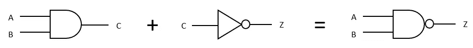

用与门和非门推导与非门

因此，标准 NAND 逻辑门符号可以表示如下:

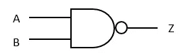

标准与非门符号

根据图表，A 和 B 表示输入信号，Z 表示输出信号。因此，真值表可以这样写:

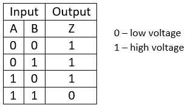

与非门的真值表

## 或非门

与与非门相似，或非门也有两个输入和一个输出。它由非门和或门的输出信号连接而成。在这个逻辑门中，如果任一输入信号为高，输出将为低。

正因为如此，我们可以明确的说 ***或非门的运行就是或门的反相信号。***

所以这个逻辑门的推导可以简单的表示成这样:

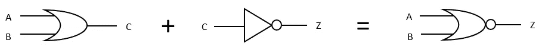

用或门和非门推导或非门

因此，标准 NOR 逻辑门符号可以表示如下:

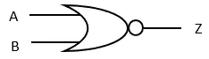

标准或非门符号

根据图表，A 和 B 表示输入信号，Z 表示输出信号。因此，真值表可以这样写:

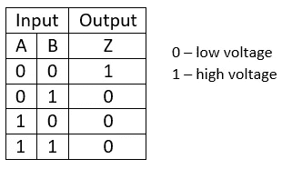

或非门的真值表

## 异或门

XOR 实际上是 ***异或的简称。*** 这个逻辑门也有两个输入和一个输出。在这个逻辑门中，如果两个输入信号都为高或低，输出将为低。如果逻辑门有两个以上的输入和一个输出，奇数个高输入导致高输出。

标准 XOR 逻辑门符号可以表示如下:

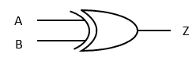

标准异或门符号

根据图表，A 和 B 表示输入信号，Z 表示输出信号。因此，真值表可以这样写:

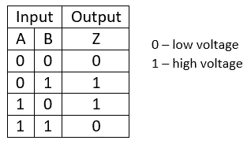

异或门的真值表

如果 XOR 有 3 个输入，则绘制如下:

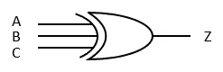

具有 3 个输入的异或门符号

a、B 和 C 表示输入信号，其中 Z 是输出信号。因此，真值表可以这样写:

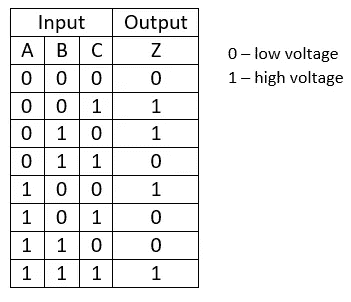

三输入异或门的真值表

## XNOR 门

XNOR 门是异或门的 ***反相。*** 类似于 XOR，这个逻辑门也有两个输入和一个输出。在这个逻辑门中，如果两个输入信号都为高或低，输出将为高。如果逻辑门有两个以上的输入和一个输出，奇数个高输入导致低输出。

这个逻辑门的推导可以简单的显示在下图中。

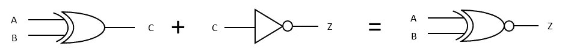

用或门和非门推导或非门

所以，标准的 XNOR 逻辑门符号可以这样表示:

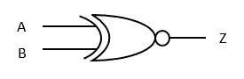

标准异或门符号

根据图表，A 和 B 表示输入信号，Z 表示输出信号。因此，真值表可以这样写:

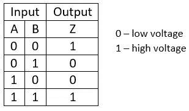

XNOR 门的真值表

如果 XNOR 有 3 个输入，则绘制如下:

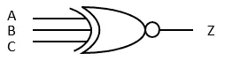

具有 3 个输入的 XNOR 门符号

a、B 和 C 表示输入信号，其中 Z 是输出信号。因此，真值表可以这样写:

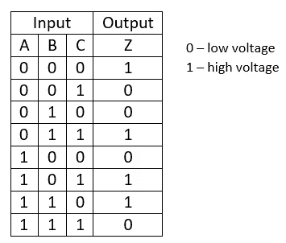

三输入 XNOR 门的真值表

基本逻辑门的系列介绍到此结束。我希望你们喜欢学习基本逻辑门的行为！