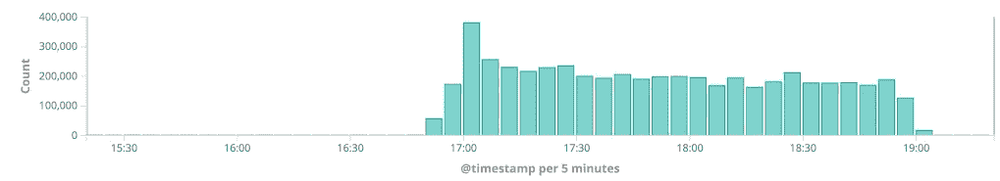
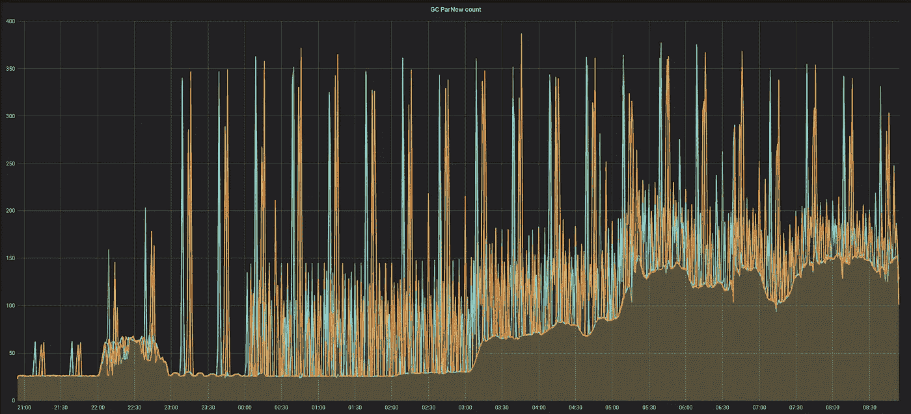
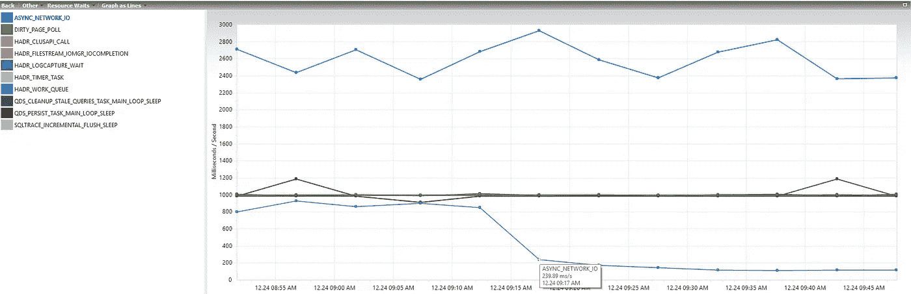

# 日志对稳定性、性能和垃圾收集有很大的影响

> 原文：<https://betterprogramming.pub/logs-can-have-a-strong-impact-on-stability-performance-and-garbage-collection-fc47c600a1e0>

## 分享让系统崩溃的可爱无害日志的经验

## 没有日志和指标，应用程序无法在生产中运行，但它们也可能是有害的


Anton Darius | @theSollers 在 [Unsplash](https://unsplash.com/s/photos/log?utm_source=unsplash&utm_medium=referral&utm_content=creditCopyText) 上拍照

理论对于理解概念很重要，但是实践对于处理稳定性问题更重要。

像许多开发人员一样，我欣赏使用现实例子的书籍或文章——典型的是[迈克尔·尼加德](https://medium.com/u/b1de9e016291?source=post_page-----fc47c600a1e0--------------------------------)在他的名著 [*Release It 中所做的！*](https://www.amazon.com/Release-Design-Deploy-Production-Ready-Software-ebook/dp/B079YWMY2V) *，*(这是一个 dev 必备的)。

下面的每个故事都来自于我的经历，在某些情况下也来自于我的错误。

# 日志可能是无声的有害的

几年前，我们的一个 Java 应用程序负责通过电子邮件向供应商下订单，并附上一个 PDF。有一天，我们被告知，一个供应商仍在等待一份几小时前就应该发出的订单。

应用程序没有在警报系统中报告任何错误。我开始检查日志，但看不到任何错误。

在那一刻，由于日志的聚合，我没有立即注意到应用程序的四个实例之一没有发送任何日志(不可见的日志不容易被怀疑，对吗？).

然后，我检查了度量仪表板，它清楚地显示一个实例有一个阻塞的线程，等待线程的数量在逐渐增加。

毫无疑问，它最终会耗尽所有线程，导致应用程序崩溃并重启。

我回到日志记录系统，只过滤了被阻塞的实例，但是我再次失望地没有看到一个错误。最后的日志消息没什么特别的，但是实例在几个小时前停止了日志记录。

我为该实例打开了一个 SSH，通过几个基本命令，我获得了 Java 应用程序的 PID，获得了进程的当前堆栈，并查找了被阻塞的线程。

```
jps -v
...
jstack <PID> | grep "BLOCKED" -A 30
```

堆栈显示资源 [PrintWriter](https://docs.oracle.com/javase/8/docs/api/java/io/PrintWriter.html) 上有一个锁，用于将邮件内容写入日志文件。当我打开本地日志文件时，我意识到该应用程序试图记录带有附件 PDF 文件的邮件，这是一个二进制文件。

这里我很惊讶，因为代码中没有这样的日志记录指令。我最后检查了启动应用程序的选项，发现了下面可怕的一行:

```
-Dmail.debug=true
```

尽管应用程序在生产环境中运行，但对邮件启用了调试，导致记录应用程序和邮件服务器之间的整个通信协议，包括二进制附件。

但是，由于生产的日志记录配置忽略了级别`DEBUG`的日志，这是不可见的。

这个小错误可能可以通过*仔细检查生产配置来避免。*

# 日志会有副作用

我们再来看另一种情况。在一个星期五的早上，我们被告知我们的预约系统出现了故障，导致容量过载，但这没什么，因为这只是百分之几。

然而，下周一预计是稍微重要的一天，必须更加严格地遵守约束。

一名队友立即开始分析，并很快发现了漏洞。修复看起来很简单，只是在一个循环中移动一条指令来重置一个值。

当他把他的 pull 请求发给我进行审查时，我很高兴地看到他提供了新的测试用例来确保 bug 得到修复。对我来说，他的工作很好，但我注意到他也添加了一些日志语句。

他们中的一些看起来没有必要，因为他们没有带来有趣的信息。因此，我在这里写了一条评论，他回答说是经理要求的，因为*他对代码的逻辑不是很熟悉，而且他觉得有点盲目*。

添加一些日志将有助于在出现问题时进行调试，尤其是在预计周一的时候。开发者不确定它们是否都是相关的，但是随着时间的流逝，我接受了 PR，应用程序发布了。

一天快结束了，开发商和经理都要去度周末。当我在本周接受支持时，我管理了部署并做了通常的健全性检查，其中包括确保日志中没有错误。

好消息，修复看起来不错！我也注意到了新的日志消息，但是日志系统非常慢...然后我意识到有大量的新日志消息。

我检查了他们的日志量，全球日志量大幅增加:该应用程序每分钟生成近 *100，000 条消息*(而不是每分钟 1，000 条)，高峰时段甚至更多。

有太多的日志记录基础设施开始报告问题:缓冲节点几乎满了，很快将不得不丢弃消息(来自所有应用程序，而不仅仅是有补丁的应用程序)以保持存活。

固定方法的伪代码如下所示(为此进行了简化):

```
**FUNCTION** compute() **{**
    ...
    Log that computation is starting
    **FOR EACH** item **IN** list **{**
        Log the description of item
        ...
        **FOR EACH** sub-item **IN** item **{**
            ...
            Log the current status of the computation
            **IF** success criteria **{**
                Log the computed result
                **RETURN** the computed result
            **}**
        **}**
    **}**
    **RETURN** that computation failed
**}**
```

一个简短的算法分析立即显示，上面的代码具有 O(n)的复杂性——一个循环嵌套在另一个循环中，我应该在代码审查期间发现它，因为它很可能产生比必要的更多的日志。

出于许多原因，快速评估一段代码的复杂性是一个很好的实践——通常在代码评审期间。

根据基础设施团队的另一位同事的说法，我们一致认为周末不会没有重大崩溃，所以我们决定再次修复以删除这些日志(回滚不是一个选项，因为在以前的版本中有一个 bug)。

最后，第二个补丁解决了所有的问题，但这不是预期的周五晚上。



应用程序生成的日志—第一次部署在大约下午 4:45，创建大量日志—第二次部署在大约下午 7 点，修复日志

这是一个没有一个人犯错的典型情况:

*   经理迫于业务的压力，把一部分业务转给了开发商，要求技术上的东西“为了安全”。依我看，经理们应该处理商业事务和利益相关者，更重要的是，保护团队免受压力。开发者必须被信任，他们也不喜欢问题。
*   开发人员怀疑添加的日志不是那么相关，他警告经理他们的容量没有被估计，但最终他在交付的代码中保留了它们。*开发者是最了解技术状况和风险的人。他不应该接受压力和/或要求更多时间。*
*   尽管我对日志声明有所怀疑，但我还是批准了 PR。单元测试是必要的，但不足以防止这样的问题。*人情也要听。*
*   (奖励)最初构建这段代码的开发团队本可以实现智能缓存(交易准确性)来保护系统不被过度使用。

# 日志会影响性能

回到圣诞节前几天。像许多零售公司一样，黑色星期五和新年前夕之间的时间段是一年中最关键的部分，客户下了大量订单。

我们已经注意到，我们的一些应用程序正在花费越来越多的时间来做一些操作，但我们认为这只是由于一个异常的负载。受影响最大的应用之一是用于挑选订单的应用，它必须非常快速和稳定，以满足严格的时间限制，按时交付订单。

工作人员开始抱怨他们的扫描仪(与 Java 应用程序对话)经常“冻结”(实际上，等待响应)几秒钟，让他们发疯。

圣诞节前几天，压力增加了，在最关键的时候，我们的系统可能会出现重大故障。我和我的一位技术娴熟的同事 Laurent Prévost 被要求尽快调查这个棘手的问题。

多亏了这些指标，我们能够根据冻结发生的次数，确定冻结与 Java 应用程序中永久缓存的刷新直接相关。

毫不奇怪，垃圾收集器也在这些时间运行，停止一切(著名的*停止世界*暂停)几秒钟，以便它可以完成它的工作。

这是分析的第一个结果:缓慢的性能是由 GC 造成的，它是在从数据库加载一些数据以进行永久缓存刷新之后立即请求的。



GC ParNew 计数(stop-the-world 暂停)—由于缓存刷新限制，特别是晚上 10 点以后的常规和大量暂停

当然，下一步是关注用于缓存刷新的 SQL 查询。我们无法理解这样的数据加载如何能够迫使 GC 立即运行，因为它并不占用太多的内存，并且具有合理的容量。

但事实就是事实，这个问题需要时间。Laurent 加入了数据获取机制，并获得了有趣的信息:当从 SQL 客户端或从调用 DAO 类的单元测试运行时，使用完全相同的 JDBC 驱动程序，查询速度提高了 10 倍。

这怎么可能呢？


类似于交通堵塞，超载的小系统可能会有副作用——照片由[炎亚纶·崔](https://unsplash.com/@arronchoi?utm_source=medium&utm_medium=referral)在 [Unsplash](https://unsplash.com?utm_source=medium&utm_medium=referral) 上拍摄

最后，他研究了驱动程序代码，发现它记录了大量的调试信息，甚至更多的跟踪信息。因此，驱动程序为每行的每个列名实例化了许多字符串，而且是多次实例化。

这导致了数以百万计的字符串对象，这些对象是在获取日志数据的过程中创建的，必须由 GC 来清除。由于日志的框架配置( [logback](http://logback.qos.ch/) )忽略了级别低于 INFO 的日志，所以虽然对象被存储在内存中，但这样的跟踪日志没有被获取。

调查最终证明，web 框架正在以最精细的级别*传播 JUL ( [java.util.logging](https://docs.oracle.com/javase/8/docs/api/java/util/logging/package-summary.html) )，即允许整个应用程序的任何类型的日志。这就是这种行为在单元测试中不可见的原因。*

修复方法是在日志记录配置文件中进行一行更改，以停止 JUL 传播:

```
<contextListener class=”ch.qos.logback.classic.jul.LevelChangePropagator”>
 <resetJUL>true</resetJUL>
</contextListener>
```

然后，查询的执行时间减少了 10 倍:不再有跟踪日志，不再有 GC 暂停。

在 DB stats 中也可以看到，SQL server 报告说`ASYNC_NETWORK_IO`的等待时间大大减少了(这种错误意味着查询的调用者不能足够快地[处理返回的数据](https://www.sqlshack.com/reducing-sql-server-async_network_io-wait-type/)):



在数据库中，部署修复后，ASYNC_NETWORK_IO 等待时间(深蓝色曲线)减少了四分之一

老实说，我不确定我们的经理是否衡量了我的同事刚刚通过他的解决方案提供的全球改进:

*   应用程序执行大型查询的速度提高了 10 倍。
*   数据库中潜在的数据锁略有减少。
*   数据库不太受欢迎。
*   GC 必须运行得更少，并且没有长时间的暂停。
*   间接影响:当一个应用程序在虚拟机上消耗更少的 CPU 和内存时，虚拟机上所有其他正在运行的应用程序都会受到积极影响。
*   最后但同样重要的是:圣诞节得救了！

我不想追求 10 倍开发者的东西，但在这里，我的同事肯定是一个，至少对我来说是这样。

# 摘要

*   花时间*仔细检查配置*，每个环境的选项或设置，并确保每一项都是必要和适当的。
*   当你写日志语句时，一定要考虑到*带来了什么附加值*，以及在什么情况下它可能有用。然后，*尝试根据代码复杂度估计其体积*。拥有太多的日志对基础设施来说是一种危险，并且肯定会使发现 bug 变得更加困难。
*   如果您的应用程序遇到性能问题，请将垃圾收集器作为首选，并尝试分析内存管理。不要小看一句话:*即使是日志也会产生垃圾。*

# 资源

*   [*放开它*！](https://www.amazon.com/Release-Design-Deploy-Production-Ready-Software-ebook/dp/B079YWMY2V) —书
*   [减少 SQL Server ASYNC_NETWORK_IO 等待类型](https://www.sqlshack.com/reducing-sql-server-async_network_io-wait-type/) —博文