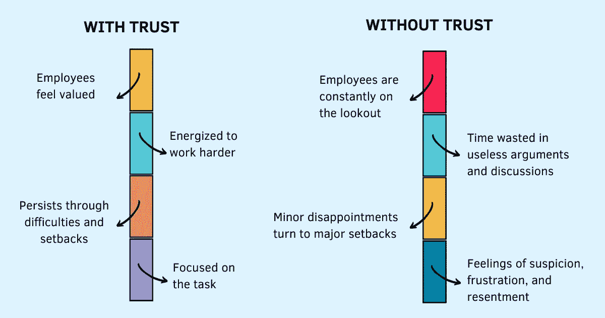

# 作为管理者失去信任？以下是重获它的方法

> 原文：<https://betterprogramming.pub/losing-trust-as-a-manager-heres-how-to-regain-it-74f51092d04>

## 导致失去信任的 8 种行为(以及如何重获信任)



鸣谢:作者

你有没有花时间注意你是如何给别人留下印象的？

影响员工工作动力的最重要因素是什么？他们对经理的信任程度。高度的信任让他们感到被重视，激励他们更加努力地工作，让他们在困难和挫折中坚持下来。

知道有人在照顾他们可以让他们专注于任务，而不会被环境中的不确定性分散注意力。一个错误——错误的决定、糟糕的战略、糟糕的执行——不会被轻视。信任让员工优先考虑意图而不是行动。

低信任级别会逆转这一等式，从而对他们的生产力和绩效产生负面影响。他们时刻保持警惕，留意自己的行为会被人如何看待。

本该用于工作的时间和精力被浪费在无用的争论和讨论中。缺乏信任会让小失望变成大挫折。消极的观点会滋生怀疑、沮丧和怨恨，从而导致工作质量低下。

虽然积极参与促进信任的行为很重要，但摆脱那些扼杀信任的行为同样重要。当你没有花时间去注意你是如何给别人留下印象的时候，很难改变和适应——你的行为让他们开心还是生气？他们对提问或关闭感到舒服吗？他们感到被支持和关心还是被忽视和抛弃？

> 一旦领导者发展了自我意识，他们就创造了转变的可能性，这是有意识的领导者的主要技能。转变是从封闭走向开放，从防御走向好奇，从想要正确走向想要学习，从为个人自我的生存而战走向从一个安全和信任的地方领导——吉姆·戴斯默，有意识领导的 15 个承诺

当你甚至不知道它是一个问题的时候，你不能解决它。警惕这 8 种经常被忽视并导致失去信任的微妙行为。

# 只说不做

"大谈健康工作生活的重要性，然后在深夜发电子邮件。"

“告诉团队成员专注于工作，然后每小时给他们打一次电话，了解他们的状态。”

“期望你的团队掌握沟通信息，却经常忽略需要你注意的信息。”

如果这是你，为自己和他人遵循一套不同的标准会破坏信任。我们根据自己的意图来判断自己，根据他人的行为来判断他人。不一致和不可预测的行为会导致不信任。

不要只是说说而已，把你的话付诸行动吧！

# 承诺过多，兑现不足

“每个人都将很快获得一台新的 MacBook Pro”，但这种情况从未发生过。

“我会处理的”，而你什么都不做，问题依然存在。

“你很快就会得到一次远足，”但那很快永远不会到来。

许下承诺，但一定要坚持到底。如果，不管什么原因，你之前说的不能满足，就不要晾着；重置预期。

没有什么比不履行你的[承诺](https://www.techtello.com/keeping-commitments/)更破坏信任的了；没有做你说过要做的事情。当你说一套做一套，或者许下承诺却没有兑现时，人们开始怀疑你的意图。

不要只是承诺，要坚持这些承诺！

# 扮演受害者

"因为我们没有及时得到要求，交货被推迟了."

“我们已经完成了我们的工作。与另一个团队的整合需要更长的时间。”

“我们的推介非常完美。他们就是不明白。”

将问题归咎于某人或某事是一种缓解，但也是一种麻痹。感觉情况不在你的控制之下会让你纠结于问题，而不是找到解决办法。一旦[受害者心态](https://www.techtello.com/how-to-opt-out-of-the-drama-triangle/)成为你的东西，你就会在你的团队中传播一种无助和绝望的感觉。当你的团队甚至不能依靠你来解决问题时，他们就不能信任你。

不要表现得像个受害者，而是扮演一个创造者的角色。通过有意识地将你的心态从问题转移到你想要的结果来改变你的方向。帮助你的团队渡过难关；向他们展示拥有结果和承担责任的力量。

> 专注于我们力所能及的事情会放大和增强我们的力量。但是，每一盎司的精力都浪费在我们实际上无法影响的事情上——自我放纵和自我毁灭——瑞安·霍利迪，障碍在于方式

不要搞剧，转向赋能！

# 来回摇摆

"让你的团队优先考虑某周的 X 和另一周的 Y，同时让 X 保持开放状态."

"在你的计划中加入太多的项目，因为你不能决定什么更重要。"

“推动您的团队加快交付，然后将目标放在次要位置，为质量腾出空间。”

对你团队的目标犹豫不决，不断改变优先顺序，会给团队带来很多压力、[挫败感](https://www.techtello.com/frustration-at-work/)和焦虑。所有徒劳的努力都变成了痛苦。你不断移动的目标不可信。

不要摇摆不定，要有明确的优先级和期望值！

# 成为唱反调的人

"即使有完美的结果，也不能放过一个小小的反馈."

"传递攻击性的评论，期望它能纠正别人的错误."

“尽管项目成功的可能性很高，但还是要不断强调它会失败。”

当你不断地寻找消极的一面而不突出积极的一面时，就会耗尽别人的精力。在别人面前说别人的坏话也会让他们认为你也会这样说他们。当[消极](https://www.techtello.com/how-to-deal-with-negative-people/)是你寻求的全部时，信任就没有立足之地了。

不要在消极中浪费时间，寻找事物的光明面！

# 充当万事通

"当你不知道某事时，试着假装一下。"

“拒绝说‘我不知道’。”"

“准备分享解决方案，但不认真倾听问题。”

你可能看不到，但每个人都讨厌总是有所有正确答案(或假装无所不知)的人。除非你也愿意分享你的[弱点](https://www.techtello.com/lead-with-vulnerability/)，否则你无法建立有意义的联系。别人能看出你什么时候是装的，什么时候是真的知道。伪装会扼杀信任。

> 在这个世界上，永远正直诚实地行事，即使这意味着要面对难以面对的事情。要真诚。要诚实。不要伪造任何东西。真实和真实性孕育尊重和信任——罗伯特·艾格，一生的旅程

当你不知道一些事情时，不要假装，通过展示你的缺点和弱点来保持真实！

# 避免冲突

“放过团队中的不良行为。”

“避免分享真实的反馈，以挽回他人的感受，即使这会阻碍他人的感受成长。"

"找借口避免面对冲突，希望冲突会自行消失。"

[避免冲突不会建立关系，只会破坏关系。拒绝处理团队中的不良行为，不说别人需要听到的话，让困难的对话长时间开放，不会取悦别人。这让他们很恼火。不要使用反馈三明治或试图粉饰你的信息。毫不犹豫地说出你需要说的话。](https://www.techtello.com/giving-feedback/)

不要回避不适，拥抱它！

# 无边界的自由

“赋予人们权力，却不给他们成功所必需的工具。”

“没有明确说明他们可以自己做出的[决定和需要你参与的](https://www.techtello.com/decision-tree-for-making-better-decisions/)决定。”

"分享太多信息或隐藏他们成功所需的信息."

无论是做决定，分享信息，还是任何其他形式的交流，无边界的自由只会导致分心和困惑。当人们没有获得做好工作所需的背景和清晰度时，信任就会破裂。

不要在极端情况下操作，定义界限并在界限内工作！

# 摘要

1.  如果你不注意自己在他人面前的表现以及他人对你的看法，你将会失去作为管理者的信任。
2.  只告诉你的团队做一些你也可以用行动证明的事情。不要只是说说而已，也要行动起来。
3.  坚持你的承诺。信守承诺并不意味着不惜一切代价去实现。意图比结果更重要。
4.  当事情没有按预期发展时，不要推卸责任，而是要承担责任。积极与你的团队合作，集体讨论解决方案。
5.  在做决定和确定优先顺序时，不要摇摆不定。你的团队需要专注和清晰来做出有意义的贡献。
6.  消极会消耗人们的时间和精力。积极为工作带来快乐和动力。没必要一直唱黑脸。留有娱乐的空间。
7.  向你的团队展示你的缺陷和不完美。这是建立长久关系的唯一途径。
8.  即使不舒服也不要回避冲突。说出你需要说的话，即使这会让对方感到痛苦。他们需要学会面对现实。
9.  良好的沟通和授权不会随着盲目的自由而来。这需要设定界限并坚持。

```
**Want to Connect?**Follow me on [Twitter](https://twitter.com/techtello) for more stories. *This story was originally published at* [*https://www.techtello.com*](https://www.techtello.com/losing-trust/)*.*
```