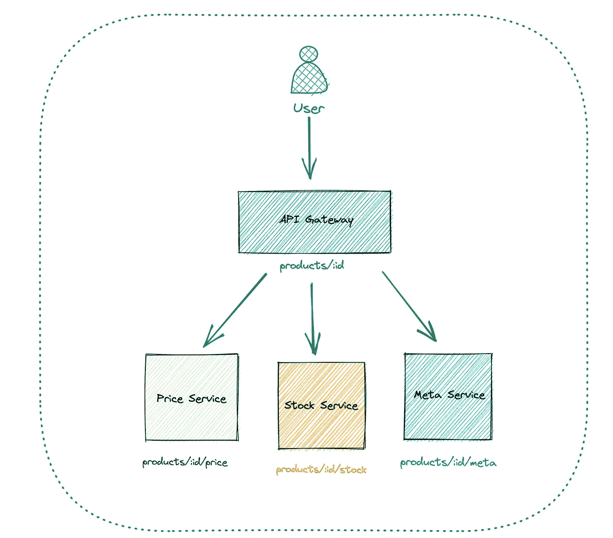
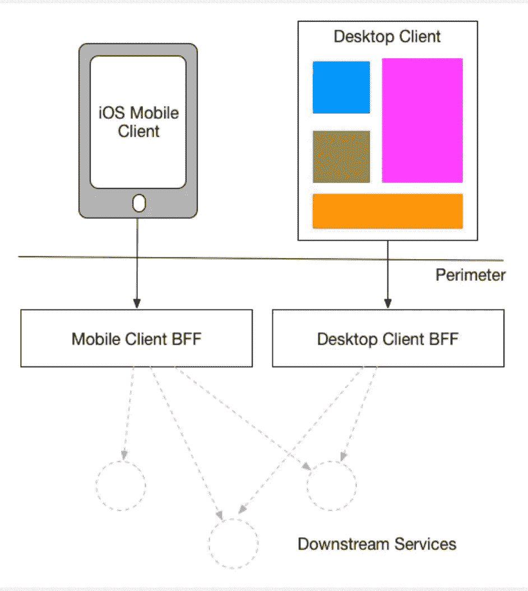
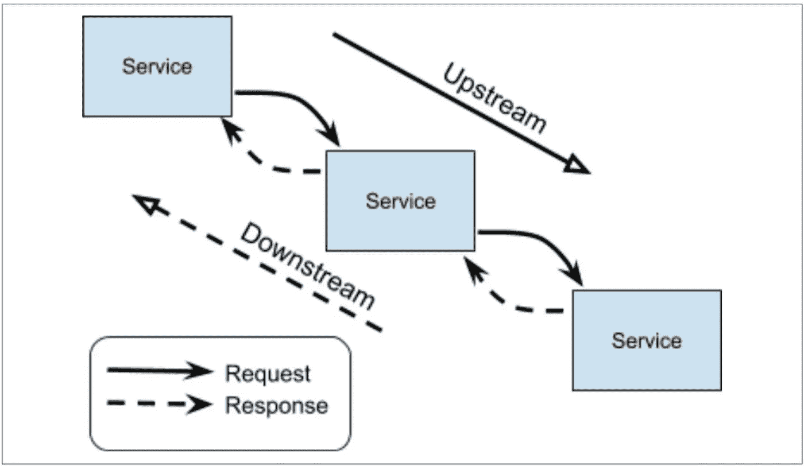

# 这里有一件可爱的衣服，可以和 Golang 一起了解 API Gateway

> 原文：<https://betterprogramming.pub/lovely-dress-to-understand-api-gateway-with-golang-660effb560a1>

## 让我们学习 API 网关

图:梦露风格的地鼠

哇，这么可爱的裙子！在网上冲浪时，如果我们以前搜索过，几乎不可能看不到漂亮衣服的广告。然而，当我们点击这些服装广告时会发生什么呢？我们被引导到购物网站，看到这件衣服的所有细节。这些细节是来自同一个服务，还是被聚合并发送给我们？今天，我将讨论第二个选项，即 API 网关。

# 什么是 API 网关？

API 网关通过将来自客户端的所有 API 调用路由到适当的微服务来处理它们，并调用这些微服务和聚集结果。API 网关对其客户端隐藏内部 API。如果微服务中有任何故障，API 网关可以通过返回缓存或默认数据来屏蔽它们。它简化了客户端实现和微服务应用，因为它是来自客户端的每个请求的入口点。

# 项目概述

我们的客户点击我们可爱的裙子，查看更多细节。当他们点击它，他们可以看到它的 id，名称，描述，股票和价格。但是，没有这样的服务可以提供所有这些细节。这些细节来自不同的服务。我们需要汇总这些信息，并将其发送给我们的客户。我们需要一个英雄来做这件事。在这一点上，API 网关显露出来。

图:整体架构

当客户想看我们漂亮的衣服时，他们向网关发送一个请求，网关有`products/:id`端点。为了汇总所有这些细节，网关向我们的后端微服务发送一个请求，这些服务具有不同的端点。如果没有网关，我们的客户端应该已经向这些微服务发送了请求。

# 深入 API 网关

我们的英雄应该进行三次 API 调用来聚合这些信息。从效率的角度来看，同时运行尽可能多的调用**和**会更加明智。她想回应所有要求查看礼服细节的顾客。虽然她不能同时出现在每个地方，但她可以飞得很快来收集所有的数据。她需要减少总等待时间。这就是为什么我们要帮助她。

我们有不止一个 goroutine，因为我们有三个 API 调用。我们的英雄很忙，所以她需要知道她的工作什么时候完成。因此，我们等待三个 goroutines 完成，然后将聚合数据发送给客户端。

# 奖金:BFF

假设您同时拥有移动服务和 web 服务，这意味着您有不同的用户界面，并且您知道移动体验的本质通常与桌面 web 体验截然不同。您喜欢为每种客户端提供一个 API，还是为每个客户端提供一个 API？

我们所说的差异化是什么意思？移动设备需要更少的呼叫来获得更好的电池寿命，并且在与台式机进行比较时需要显示不同的数据。因此，两种用户界面都需要由具有独特功能的不同 API 来支持，而不是由一个通用 API 来支持。

图:BFF 概念摘自山姆·纽曼的文章

你以前可能听说过下游和上游服务。这些术语用于描述相关服务请求链的方向。

图:客户端在服务器的下游；服务器在客户端的上游

下游服务发起请求并接收响应。

上游服务接收请求并返回响应。

关于 BFF 的更多细节，你可以阅读[这篇文章](https://samnewman.io/patterns/architectural/bff/#general)。

# **源代码**

【https://github.com/dilaragorum/lovely-dress-go 

谢谢你读到这里。我试图保持我的项目简单，以专注于主要概念，即 API 网关。如果你有任何建议和反馈，我会很高兴。

以下是我之前文章的链接:

*   [*用 Go*](https://medium.com/better-programming/build-basic-real-time-competition-app-with-go-96c2ca0d35bf) 搭建一个基本的实时比赛 App
*   [*让我们使用 Go*](https://medium.com/better-programming/lets-build-a-movie-api-with-clean-architecture-ef1f555b563d) 构建一个具有分离分层架构的电影 API
*   [*GoLang 初学单元测试教程*](https://medium.com/towardsdev/golang-beginner-unit-testing-tutorial-98d700d40679)