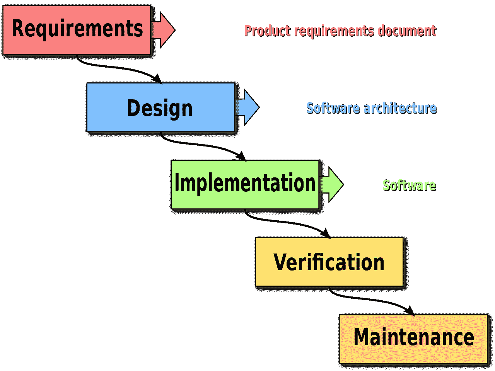
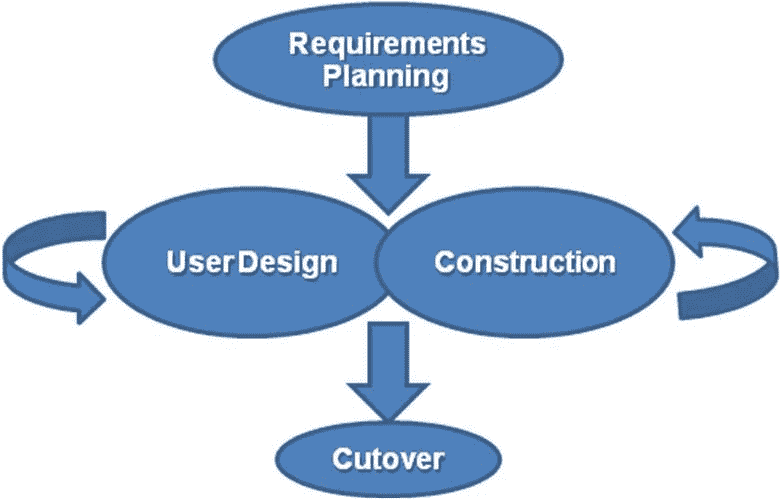
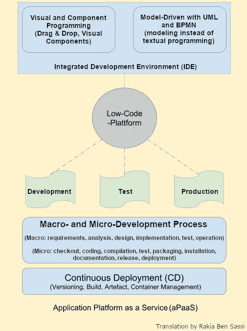

# 低代码开发简史

> 原文：<https://betterprogramming.pub/low-code-history-b756c095494f>

## [软件工程](https://rakiabensassi.medium.com/list/software-engineering-7a179a23ebfd)

## 回到可视化编程的根源


由[岩田良治](https://unsplash.com/@ryoji__iwata?utm_source=medium&utm_medium=referral)在 [Unsplash](https://unsplash.com?utm_source=medium&utm_medium=referral) 上拍摄的照片

“低代码”是一种可视化编程方法，允许公司使用图形界面相对快速地组装软件应用程序，而不必直接编写代码。

尽管“低代码开发”一词是由一家市场研究机构在 2016 年作为许多提供商的通用术语引入的，但低代码背后的想法并不新鲜。在这篇文章中，我们将看到这种范式是如何随着时间的推移而发展的，以及它曾经面临过哪些问题。

```
**Table of Contents**∘ [1970s - 1990s: 4GL](#c552)
∘ [1990s: Rapid Application Development (RAD)](#2949)
∘ [2001: Model-Driven Architecture (MDA)](#377c)
∘ [2007: Mobile Platforms](#3abf)
∘ [2016: Low-Code & LCDP](#5f53)
∘ [2020: An Urgent Need For Digital Transformation](#1988)
∘ [Has Low-Code Learned From History?](#9524)
```

# 20 世纪 70 年代至 90 年代:4GL

低代码开发平台可以追溯到第四代编程语言(4GL)，这是一个从 20 世纪 70 年代到 90 年代开发的概念，与 3GL 的大部分开发重叠。

*   **3GL 示例:** C，C++，Java，Python，PHP，Perl，C#，BASIC，Pascal，Fortran，ALGOL，COBOL
*   **4GL 示例:** ABAP、Unix Shell、SQL、PL/SQL、Oracle Reports、R

在他 1982 年的书《没有程序员的应用程序开发》(没有程序员的应用程序开发)(没有程序员的应用程序开发)(没有程序员的应用程序开发)(没有程序员的应用程序开发)(没有程序员的应用程序开发)(没有程序员的应用程序开发)(没有程序员的应用程序开发)(没有程序员的应用程序开发)(没有程序员的应用程序开发)。

第四代编程语言是指非过程化和高级规范语言，包括对数据库管理、报告生成、数学优化、[图形用户界面(GUI)](/angular-library-dynamic-stepper-2ba05ab40228) 开发和 [web 开发](/programming-buzzwords-9e94a3544eed)的支持。

# 20 世纪 90 年代:快速应用开发

作为对瀑布模型的回应，我们已经看到快速应用程序开发(RAD)在 20 世纪 90 年代获得了发展势头，当时通过使用像 Visual Basic、Delphi 和 Oracle Forms 这样的工具可视化地“组装”桌面应用程序的概念变得流行起来。

瀑布模型是一个计划驱动的过程，被软件开发行业使用了很长时间。它是在 20 世纪 70 年代和 80 年代开发的，基于传统的工程模型:



瀑布模型:进度从上到下流动，就像瀑布一样([来源](https://en.wikipedia.org/wiki/Waterfall_model#/media/File:Waterfall_model.svg)

RAD 工具作为易学的环境脱颖而出:最终用户应该关注 GUI，业务逻辑是逐步添加的。

UI 和逻辑都可以作为组件存储在组件面板中。



詹姆斯·马丁的快速发展方法的各个阶段([来源](https://en.wikipedia.org/wiki/Rapid_application_development#/media/File:RADModel.JPG))

然而，RAD 工具有其局限性:

*   它们通常是专有的。这意味着离开工具的环境是不可能的，或者只能在有限的范围内。目标环境通常是指定的，例如，用于 Visual Basic 和 Delphi 的 Microsoft Windows、Oracle 应用服务器和用于 Oracle Forms 的数据库。
*   在一个应用程序上协同工作是困难的，或者至少是有限制的，因为缺乏模块化。
*   RAD 工具，如 Visual Cafe 和 Borlands JBuilder，在速度和资源需求上苦苦挣扎。它们是用 Java 编写的，这在当时意味着对资源的巨大需求。

# 2001:模型驱动架构(MDA)

为了缩短部门和开发之间的距离，对象管理小组(OMG)在 2021 年推出了模型驱动架构(MDA ),作为一种软件设计方法，提供了一套将规范结构化和表达为模型的指南。

模型支持领域的整体视图，考虑技术和业务需求，并且随后将被转换成可执行代码。生成器和[解释器](/compiler-vs-interpreter-d0a12ca1c1b6)在开发和运行时用于从模型中生成或解释代码。

随着 MDA 和[微软软件工厂](https://en.wikipedia.org/wiki/Software_factory_(Microsoft_.NET))的出现，模型驱动软件开发(MDSD)已经成为使用 UML(统一建模语言)和 BPMN(业务流程建模符号)等工具来应用它的[程序员](https://levelup.gitconnected.com/a-day-in-the-life-of-a-software-engineer-cb817cf13d0)的兴趣中心。

# 2007 年:移动平台

2007 年苹果 iPhone iOS 加入移动设备市场，一年后谷歌 Android 出现，各种移动平台应运而生。

开发人员积极使用 Android Studio 和 Xcode 等可视化编辑器来实现在 Android 和 iOS 上本地运行的应用。

这是移动设备上桌面应用的复兴。

然而，[响应式网页设计](/angular-dynamic-layout-with-ngtemplate-8b6faa995a8f)和进步网络应用(PWA)等技术已经威胁到了移动应用，因为它们能够为小型设备提供网络应用，具有良好的[用户体验](/angular-onpush-change-detection-f629cbce0bfa) (UX)，并且不需要移动开发平台。

# 2016:低码& LCDP

在 2016 年由 Forrester Group 出版后,“低代码”一词变得公开。

我们已经看到了低代码开发平台(LCDP)的出现——其起源可以追溯到 2011 年——目的是在一个屋檐下获得尽可能多的概念，使编写代码变得不必要或至少显著减少。

低代码平台包含了 RAD 和 MDSD 的过程，并考虑了 ALM(应用生命周期管理)以及开发、测试和生产环境的持续集成(CI)或持续部署(CD)。

为了支持整个环境的“拖放”创建，必须提供 PaaS(平台即服务)。为此，有内部提供，如 [OpenShift](https://www.openshift.com/) 容器平台，但通常是相应的[云服务](/serverless-bcc0d2b65b41)。



Lofi Dewanto 和 Manuel Klein 的低代码平台的组件和架构([德文原图](https://www.heise.de/developer/artikel/Low-Code-Low-Quality-4134288.html?seite=2))

aPaaS(应用程序平台即服务)提供了应用程序整个生命周期所需的一切:从第一个规划阶段到开发、验收和运营。

# 2020:迫切需要数字化转型

2020 年，新冠肺炎疫情向许多公司展示了他们在数字化方面的落后。

为了保持业务运营并满足员工和客户的需求，他们被迫升级应用程序并构建新的应用程序来填补现有的流程缺口。

因此，低代码的受欢迎程度有所提高。这一势头将在 2021 年延续。

# Low-Code 有没有吸取历史的教训？

像 4GL 这样的技术，在几十年前很流行，曾承诺快速满足客户需求，但最终因为许多限制而失败，并且自推出以来其受欢迎程度已经下降。

在 21 世纪，许多 RAD 环境从雷达上消失了。像 Swing 和 SWT 这样的“经典”UI 工具包变得越来越没有意义，因为趋势是为 [web](/angular-custom-autocomplete-7ffb479477e7) 编写应用程序。

UI 设计越来越多地使用 HTML、CSS 和 [JavaScript](/javascript-history-and-future-71b0ceb737aa) 来完成，这创造了网页设计师这一额外的职业。不同的 web 浏览器、操作系统(如 Linux、macOS)以及从 PC 到智能手机再到可穿戴设备的设备都被用作目标系统。

当我们看低代码供应商时，我们注意到他们中的大多数都学习过历史。他们知道哪些问题困扰着 4GL 和拉德，并试图修复他们系统中的这些问题。

随着企业将目光投向人工智能、机器人、机器学习和物联网等新技术，低代码解决方案也在不断增长，以提供这些能力。

🧠💡我为一群聪明、好奇的人写关于工程、技术和领导力的文章。 [**加入我的免费电子邮件简讯，独家获取**](https://rakiabensassi.substack.com/) 或在此注册 Medium [。](https://rakiabensassi.medium.com/membership)