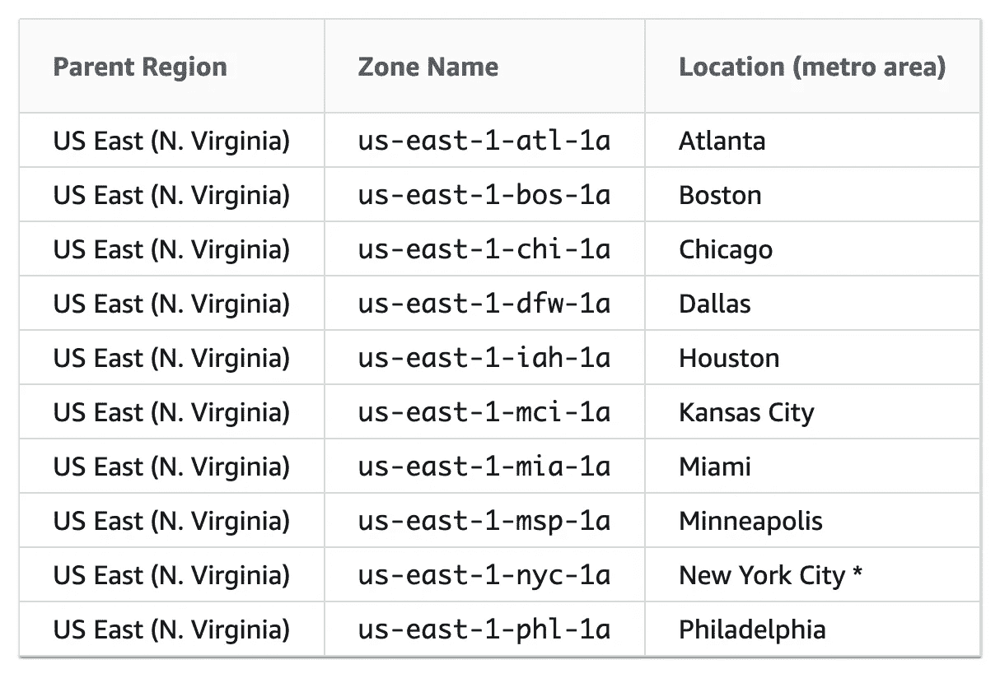
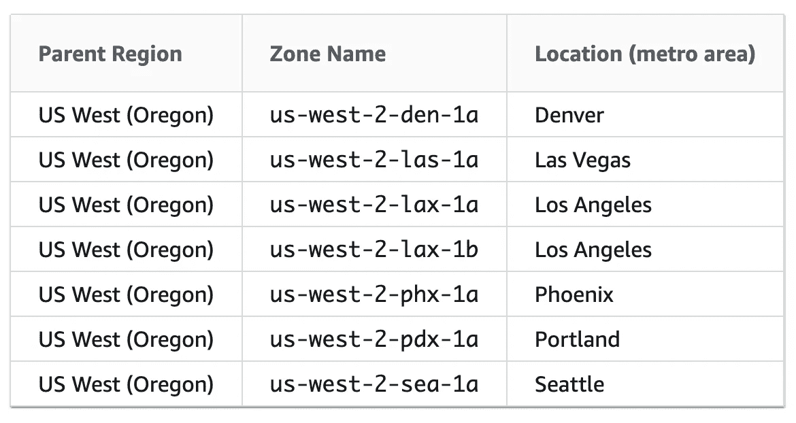
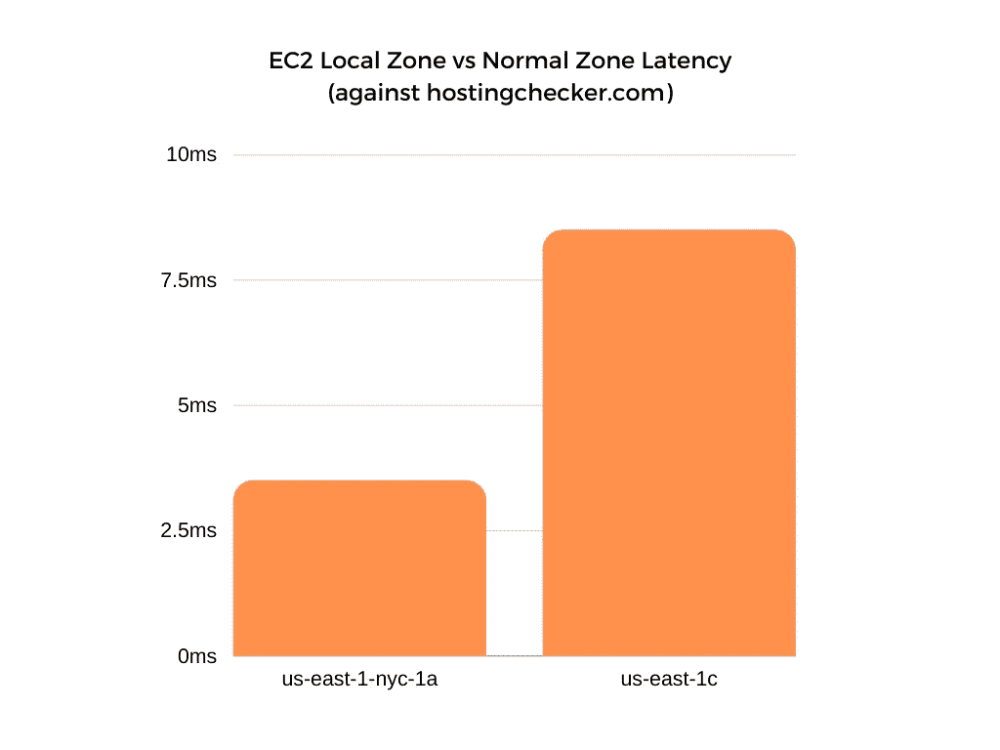

# AWS 本地区域的低延迟性能

> 原文：<https://betterprogramming.pub/low-latency-performance-with-aws-local-zones-e8b805aa7529>

## 在您最需要的地方实现超低延迟


拉斯·金勒在 [Unsplash](https://unsplash.com/s/photos/data-center?utm_source=unsplash&utm_medium=referral&utm_content=creditCopyText) 上拍摄的照片

想象一下:您刚刚设置完一个全新的 EC2 实例。一切都很顺利，直到你开始测试网络。一个大问题就摆在你面前:*潜伏期*。

从历史上看，AWS 只提供少数几个区域和可用性区域进行部署。如果您或您的客户被困在两个区域之间的某个地方，那么在延迟方面，您就没那么幸运了。

大多数时候，如果你托管一些数据或者服务于一个基本的网站，这不是一个真正的问题。然而，如果您试图交付视频或音频等流数据，事情就变得严重了。对于像这样的敏感应用，您需要更快的交付时间和更稳定的网络。

这就是 AWS 本地区域发挥作用的地方。这些是 AWS 在不同大都市地区提供的一组新创建的边缘位置。使用这些区域，您可以实现更低的延迟和对部署位置的更精细控制。

在我们进入新的领域之前，让我们回顾一下 AWS 的一些基础知识。

# 区域与可用性区域

AWS 世界中最大的地理测量单位是区域。区域是包含多个数据中心的大区域。在每个区域内，数据中心被视为一个可用性区域。有多个 az 分布在一个区域中，用于容错。

当您启动一个新实例时，您可以选择您想要的可用性区域，然后您就差不多完成了。尽管亚马逊提供了一个边缘位置的列表，但是每个 AZ 并没有明确地绑定到一个特定的位置(至少你不能很快辨别)。例如，您不能明确地部署到像洛杉矶这样的特定城市。

当您部署到这些区域时，很大程度上是由您来评估哪一个区域具有最适合您的应用程序的延迟。

# 新的区域

随着本地区域的引入，AWS 现在在主要城市提供特定的可用性区域。最棒的是，每个区域都根据它所在的城市进行了明确的标记。现在，您可以随意将一个实例部署到一个特定的城市。

以下是美国东部地区目前可用的本地区域:



美国东部 1 区的 AWS 本地区域。[来源](https://docs.aws.amazon.com/AWSEC2/latest/UserGuide/using-regions-availability-zones.html)。

美国西部地区也有几个本地区域:



美国西部 2 区的 AWS 本地区域。[来源](https://docs.aws.amazon.com/AWSEC2/latest/UserGuide/using-regions-availability-zones.html)。

如您所见，这开启了一个全新的世界，尽可能将实例部署在它们服务的城市附近。如果您向波特兰或丹佛的客户提供视频，那么在这些本地区域创建一个端点可能比普通的 AZ 要快得多。

当然，本地区域有一些限制。

本地区域尚不支持整个 AWS 服务目录。它们也不支持所有的 EC2 实例类型(这对一些人来说可能是一个巨大的陷阱)。要查看服务目录，请参考以下页面:

[](https://aws.amazon.com/about-aws/global-infrastructure/localzones/features/#AWS_Services) [## AWS 本地区域功能-亚马逊网络服务

### AWS 本地区域是一种 AWS 基础架构部署类型，它将计算、存储、数据库和其他选择…

aws.amazon.com](https://aws.amazon.com/about-aws/global-infrastructure/localzones/features/#AWS_Services) 

尽管在该页面上列出了实例类型支持，但在某些区域中仍有一些特定的实例是不允许的。为了找出本地区域中允许的实例，使用下面的`aws-cli`命令(用您自己的命令替换`<zone>`和`<region>`):

```
aws ec2 describe-instance-type-offerings --location-type "availability-zone" --filters Name=location,Values=<zone> --region <region>
```

这应该会输出该特定区域的可用实例类型。

# 数字

这一切都很好，也很有趣，但是延迟数字呢？好了多少？

这个问题不容易回答，因为真正的答案是:*看情况*。测量延迟不是一件静态的事情。链接会变化，值也不总是相同的。另一个关键变量是客户端从哪里访问服务器。如果你在纽约创建一个新的实例，而他们是通过一条降级的路径或远离城市的地方到达的，你可能根本看不到太多的改进。

根据 Amazon 的说法，如果您与部署到本地区域的实例位于同一个城市，那么您可以预期*“个位数毫秒延迟”*



本地和正常 AZ ping 响应时间。

在我对纽约市的一个本地区域实例( *us-east-1-nyc-1a* )执行的基准测试中，我看到位于同一地理区域( [northern New Jersey](https://hostingchecker.com/tools/ping/) )的服务器的平均响应时间为`3.5ms`。对于云托管的实例，这是一个极好的响应时间。

对于对位于标准美国东部地区( *us-east-1c* )的实例执行的相同测试，结果大约为`8.5ms`。使用本地区域可以将延迟减少一半以上。

使用这些新的本地区域似乎是将服务移动到更靠近大都市地区的最快、最简单的方法之一，并且比以往任何时候都更快地为应用程序提供服务。

请始终记住，在部署到新的本地区域时，您的里程可能会有所不同，具体取决于这些区域的位置和链接的当前状态。执行您自己的延迟测试来确定最佳部署区域始终是一个好主意。

感谢阅读！如果您对更多与云和 DevOps 相关的文章感兴趣，请查看:

*   [*devo PS 工程师 7 款有用的 Web 应用*](/useful-web-apps-for-devops-engineers-fb596ad98d20)
*   [*如何排除 Linux 服务器运行缓慢的故障*](/how-to-troubleshoot-slow-linux-servers-20a4e2843131)