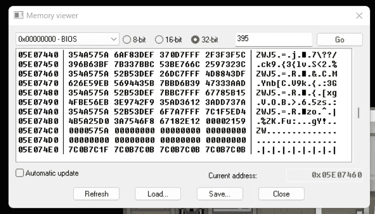
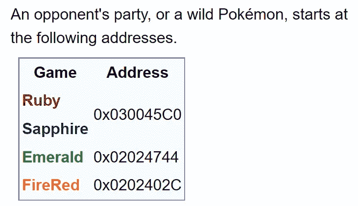
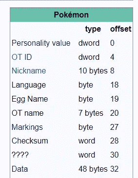
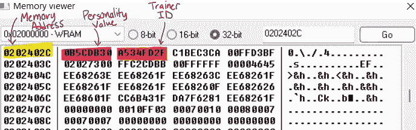
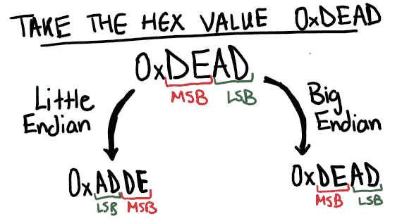
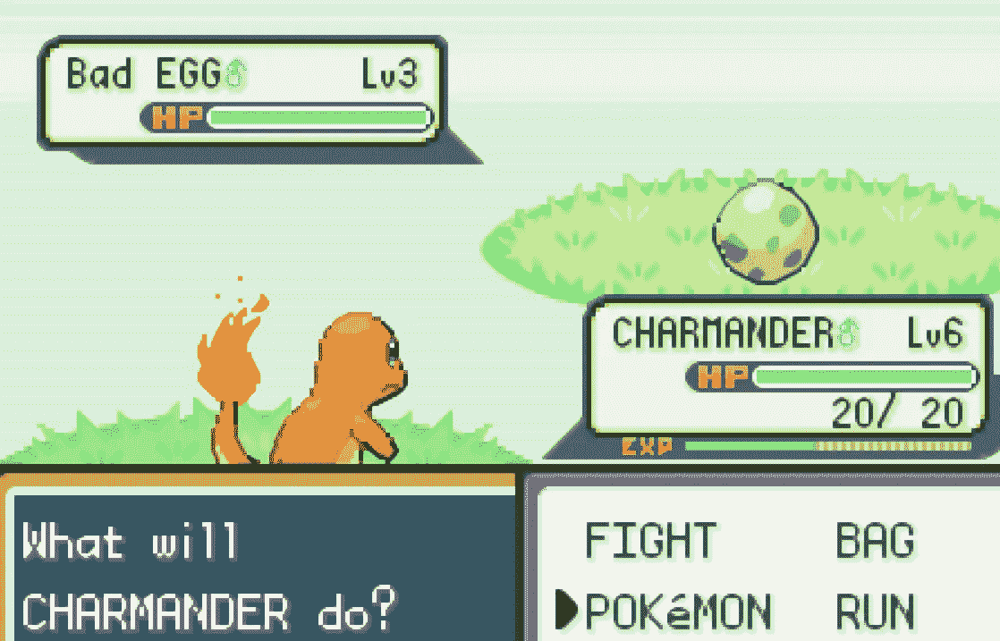
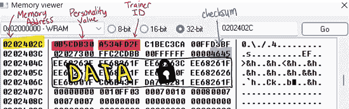
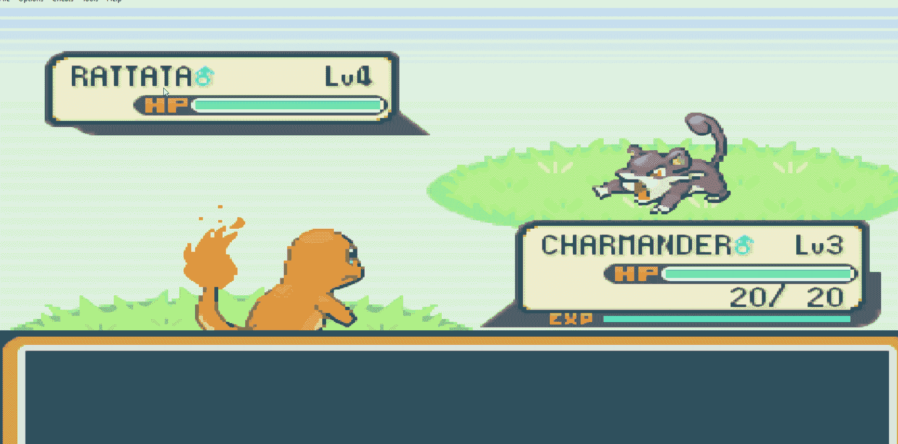

# 逆向工程口袋妖怪通过 ROM 黑客火了

> 原文：<https://betterprogramming.pub/low-level-explorations-reverse-engineering-pokemon-firered-through-rom-hacking-54edfb4426>

## 我第一次进入引擎盖下

带有口袋妖怪 FireRed 的 Gameboy 模拟器|图片由任天堂提供

在计算机科学中，逆向工程是指对一个软件进行反汇编，以分析核心组件并了解其功能。我在这方面的经验有限，所以我决定尝试一个逆向工程项目。我喜欢口袋妖怪，具体来说，我选择破解口袋妖怪 FireRed 是因为在这个主题上存在大量的文档。让我们一起探索吧！

首先，我下载了一个名为“视觉男孩进阶”的 Gameboy 模拟器，并安装了 Pokemon FireRed 的 ROM 文件。

我立即研究了内存，如图 1 所示。我编辑了随机的十六进制值，破坏了控件，并在游戏中创造了刺耳的噪音。厉害！我拥有操纵游戏的能力。

图一。口袋妖怪 FireRed 的记忆“兜帽”下

尝试让你遇到的所有野生口袋妖怪都闪闪发光会很酷。让我们首先了解游戏如何生成闪亮的口袋妖怪来实现这一目标。根据 [Bulbapedia](https://bulbapedia.bulbagarden.net/wiki/Shiny_Pok%C3%A9mon#Generation_III_onward) 的说法，第三代口袋妖怪的闪亮程度取决于以下公式:

图二。从第三代开始，闪亮口袋妖怪的配方

什么是异或？XOR 指的是“异或”逻辑门，其中如果输入位都是 1，输出位将是 0。只有一个输入位可以为 1，输出才能为 1。

要生成一个闪亮的口袋妖怪，这个公式的值必须小于 8。我们需要知道我们必须为教练 ID(包含秘密 ID)和个性值编辑哪些特定的内存地址。 [Bulbapedia](https://bulbapedia.bulbagarden.net/wiki/Pok%C3%A9mon_data_structure_(Generation_III)) 揭示了这一具体信息，如图 3 所示。

图 3。来自 Bulbapedia 的 Gen 3 数据结构信息

如果我们返回到仿真器中的内存查看器，我们可以跳转到这个内存地址(0x0202402C)并识别必要的内核信息。

图 4。存储器地址 0x0202402C 的数据

当你解释多字节内存时，你需要非常小心。例如，个性值是**`NOT0x0B5CD830`——更确切地说，个性值是`0x30DB5C0B`。**

**我们必须了解计算机内存，才能理解字节顺序的这种差异。计算机只理解 0 和 1，我们可以将它们转换成十六进制值，以获得更人性化的视图，如图 4 所示。想象一下，试图用一系列位来破解 ROM 那会很痛苦！**

**每对十六进制数字表示内存中的一个字节。然而，当内存中有多个字节时，我们必须选择读取字节的顺序。从逻辑上看，从左到右阅读英语似乎很直观，但存在从右到左阅读的阿拉伯语或希伯来语等人类文字，因此这些简单的决定没有自动标准化。**

**这就引出了字节序的概念，指的是最高有效字节(MSB)和最低有效字节(LSB)的数据字节的特定顺序。有两种类型的端序，称为小端序和大端序，下面的图表将进一步解释这两种端序:**

****

**图 5。**

**Gameboy Advance 使用 Little Endian，所以这就是为什么我们把自己的人格价值解释为`0x30DB5C0B`。不同的处理器可能使用 Big Endian，因此您应该验证任何关于 endianness 的假设，以防止任何计算机内存相关项目出现大规模错误。这些字节序的设计选择基本上是任意的，并且这两种选择都不存在特定的优势。**

**一旦我们提取了个性值和训练师 ID，我们必须为我们闪亮的公式操纵它们，以总是输出闪亮的口袋妖怪。由于我们对所有这些值进行异或运算，因此实现这一点的一个简单方法可能是将教练 ID 设置为个性值，因为如果我们对相同的字符串进行异或运算，我们将获得所有 0 作为输出，这将小于 8(我们的闪亮阈值)。**

**此外，改变教练 ID 而不是个性值会更好，因为个性值会影响各种内部口袋妖怪统计，如电动汽车。**

**然后，让我们看看当我们在一次野生口袋妖怪遭遇中改变这些值时会发生什么。**

****

**图 6。哎呀！我们的野生口袋妖怪变成了坏蛋！**

**哦不！当我们试图改变 ROM 值时，我们收到了一个坏鸡蛋。经过进一步研究，这是因为我们没有更新校验和。**

## ****什么是校验和？****

**校验和检验数据的完整性，因为数据传输中可能存在错误。在口袋妖怪的情况下，这些校验和可能是反作弊机制。一旦我们编辑了训练者 ID，校验和表明数据中存在错误，并将野生口袋妖怪变成了坏蛋，如图 6 所示。**

**因此，我们需要更新校验和，它是通过对数据子结构求和计算出来的，如图 7 所示。然而，还存在另一个问题——数据是加密的。**

****

**图 7。校验和及加密数据**

**要解密我们的数据并重新计算我们的校验和，我们需要遵循以下步骤(根据 Bulbapedia):**

1.  **通过将教练 ID 与个性值进行异或运算，获得 32 位解密密钥**
2.  **将解密密钥与加密数据的每四个字节进行异或运算，以获得解密数据**
3.  **每次将所有加密值的两个字节相加，以获得新的校验和**
4.  **更新旧的校验和值**

**然而，似乎有这个问题的一个组成部分，我失踪了，因为我无法生成闪亮的口袋妖怪后，重新计算校验和。一个理想的解决方案是删除校验和算法，因为它必须存储在计算机内存中的某个地方，但没有文档存在。**

**虽然我没有达到我最初的目标，但这个探索的过程非常有趣和吸引人。这是我第一次体验 ROM 黑客，我肯定学到了很多。当我为这个项目做研究时，我发现各种论坛都有关于细微差别的 ROM 黑客和人们的汇编脚本的大量教程。这可能是我低级探索的下一个方向。**

****

**不太像我期待的闪闪发光的口袋妖怪…**

**逆向工程远远超出了操纵 Gameboy 游戏的汇编代码。当今最突出的应用之一是网络安全中的恶意软件分析和数字取证。我希望通过更多这样的项目来探索网络安全的不同途径。**

**感谢阅读！如果你对文章有任何想法，你想联系我，我很乐意与你交谈。下次见！**