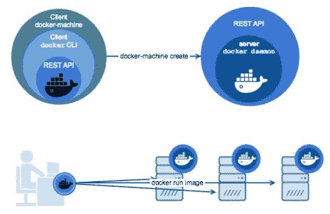
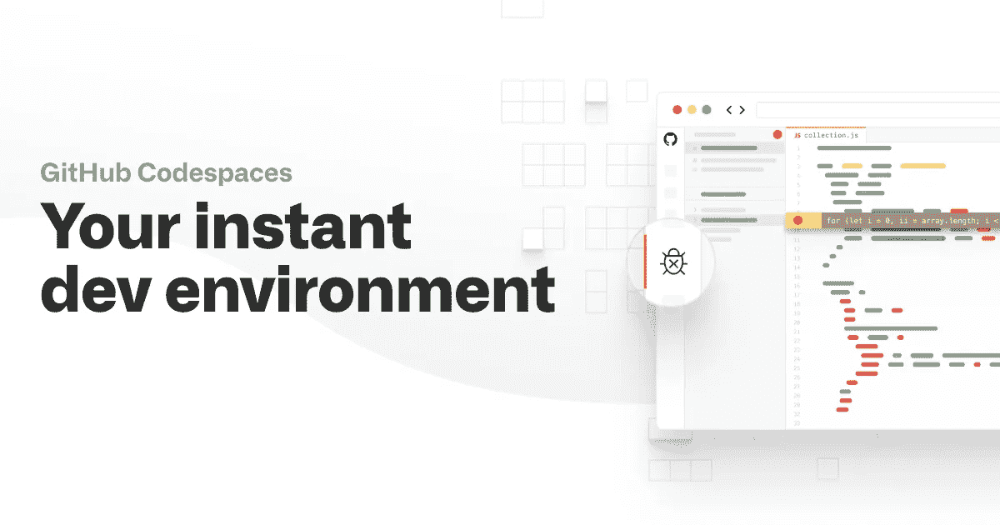
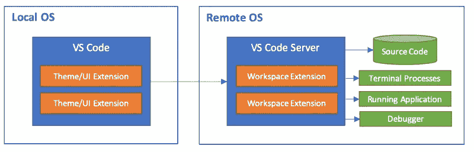

# M1 MacBook 打破了 Docker 开发

> 原文：<https://betterprogramming.pub/macbook-m1-breaks-docker-development-14566ab6fa2e>

## 你应该知道的是，如何在苹果搭载 M1 处理器的新机器上使用 Docker

作者照片。

# 苹果 M1 MacBooks/Mini 不支持 Docker

Docker 基于 Golang，需要虚拟化支持。让 Go 支持新架构不是问题，很快就会得到解决。

最大的问题是虚拟化支持，这一直是 windows 上 Docker 的一个问题，Windows Home 不支持虚拟化，并且不是所有用于 PC 的芯片都有所需的芯片组。

Docker 已经[写了一篇博文](https://www.docker.com/blog/apple-silicon-m1-chips-and-docker/)解释了所有需要解决的问题:

*   迁移到新的虚拟机管理程序框架(在 Big Sur 的公共版本中不存在)
*   多架构构建
*   M1 土著支持的 Golang
*   电子与 M1 本地支持 Docker 桌面(但它的工作基于后的信息)

# 这个路线图的时间框架是什么？

看看博客中[路线图](https://github.com/docker/roadmap)的链接，你会很快发现没有。基于该项目的复杂性和对苹果的依赖性，我预计至少需要 6-8 个月才能解决这个问题。更快解决这个问题的唯一可能是苹果公司的直接介入，这在过去从未发生过。

# M1 MacBook Air/Pro 的中间解决方案

将您的 Docker 开发环境迁移到云中。以下是我个人对可能选项的想法。

## 码头引擎

使用任何本地或云托管的 Linux 主机和[安装 Docker](https://hub.docker.com/search?q=&type=edition&offering=community&operating_system=linux) 。

访问 Docker 引擎的方法:

1.  `ssh`到远程主机并在远程主机上运行所有命令。
2.  从本地`operating_system`访问 Docker API。

我推荐选项 2 和`[Docker Contexts](https://www.docker.com/blog/how-to-deploy-on-remote-docker-hosts-with-docker-compose/)`的用法:

1.  为远程系统创建一个上下文
    `docker context create remote ‐‐docker "host=ssh://user@remotemachine"`
2.  现在你可以用`docker context use remote`切换默认上下文，或者使用`--context`选项(例如`docker-compose ‐‐context remote up -d`)。

优点:

*   不依赖于 M1 架构的任何进展
*   文件系统访问速度提高了三倍
*   任何硬件要求都是可能的

缺点:

*   中断任何依赖于将本地 macOS 文件系统挂载到 Docker 的工作流(参见修复挂载)。

## 码头机器

照片来自[码头工人](https://docs.docker.com/machine/)。

[Docker Machine](https://github.com/docker/machine) 支持在任何本地计算机(英特尔架构)或[云提供商](https://github.com/docker/docker.github.io/blob/master/machine/AVAILABLE_DRIVER_PLUGINS.md)(数字海洋、AWS、KVM 等)上创建 Docker 主机。).

优点:

*   不依赖于 M1 架构的任何进展。
*   文件系统访问速度提高了三倍。
*   任何硬件要求都是可能的。

缺点:

*   中断任何依赖于将本地 macOS 文件系统挂载到 Docker 的工作流(参见修复挂载)。
*   不再支持官方`Docker Machine`，也不会有[的进一步开发](https://github.com/docker/machine/issues/4537)。

## 云容器开发(Blimp)

照片来自[飞艇](https://blimpup.io/)。

[Blimp](https://blimpup.io) 是 Docker Compose 的替代产品，支持在云中开发。

优点:

*   不依赖于 M1 架构的任何进展。
*   文件系统访问速度提高了三倍。
*   任何硬件要求都是可能的。
*   将本地卷装入容器是内置的同步功能。

缺点:

*   对安装、卷驱动程序、DNS 有一些限制。
*   不支持`host.docker.internal`。
*   锁定他们的命令行客户端和主机。

## 基于云的开发环境

图片来自 GitHub。

这是一个浏览器中的完整开发环境，包括 VS 代码、针对 CI/CD 的 GitHub 操作以及一个云托管的虚拟机，该虚拟机会在每次编辑器启动时自动启动和设置。

当 [GitHub 代码空间](https://github.com/features/codespaces)公开时，它们将允许你在云中运行基于 Docker 的环境。

优点:

*   任何带有浏览器的本地硬件或操作系统就足够了。
*   文件系统访问速度提高了三倍。
*   任何硬件要求在微软 Azure 上都有。

缺点:

*   需要持续的互联网接入。没有线下发展。
*   锁定微软主机。

# 修复安装本地 macOS 文件系统的问题

[Visual Studio 代码远程开发](https://code.visualstudio.com/docs/remote/remote-overview)允许你使用 Docker Compose[设置复杂环境](https://code.visualstudio.com/docs/remote/containers-advanced)并与容器连接。

照片来自 [VS 代号](https://code.visualstudio.com/docs/remote/remote-overview)。

VS 代码将在 macOS 上运行，并提供原生的 M1 功能，但是终端和文件是在容器中直接编辑的。这允许您根据运行在另一台主机上的 Docker 引擎来使用现有的开发工作流。

`.devcontainer/`配置增加了对端口转发的支持，这有助于建立一个类似于一切都在本地的环境。

# 我个人的 MacBook 路线图

我目前使用的是 13 英寸 MacBook Pro 2016，英特尔 3.3 GHz i7，并计划改用我在 9 月初订购的新 MacBook Pro i7/32GB。当苹果公司展示采用 M1 芯片的新款 MacBooks 时，我立即取消了订单。

我当前基于 web 的应用程序和服务的开发环境基于:

*   Mac 版 Docker 桌面
*   brew(节点、纱线等。)
*   VirtualBox (Windows 浏览器测试)

硬件:

*   2 台三星显示器(1920x1200)
*   惠普坞站 G5

我目前设置的唯一问题是速度——我的一些较大的 PHP 应用程序消耗了大量内存和 CPU。

在研究了基准和帖子之后，我首先想到我唯一的问题是 VirtualBox。买一个棒型电脑解决了这个问题，给了我一个不到 90€的本地 Windows 硬件。

但缺乏 Docker 支持表明，我将等待下一代内存更大的 MacBook Pro 以及 Big Sur 和 Docker 的更新版本。

与此同时，我将测试在云中开发，这对于没有良好互联网接入的地方不是一个选项。

你和 Docker/kubernetics 有什么发展计划？