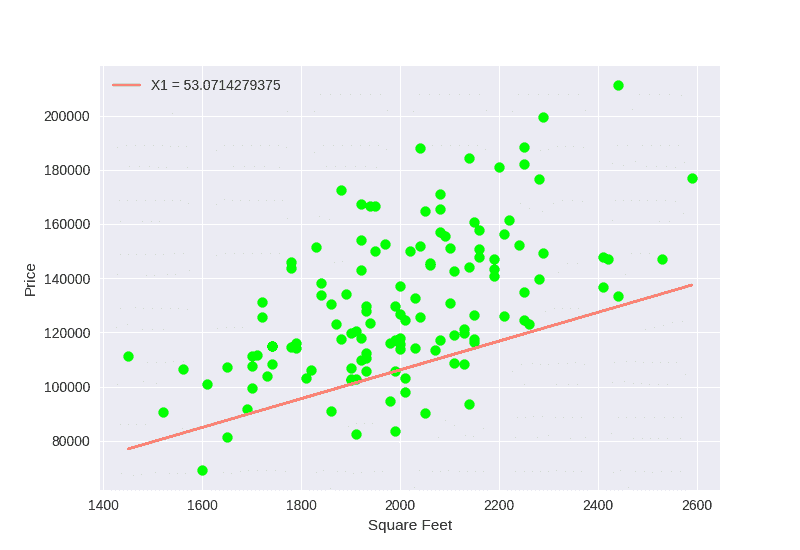
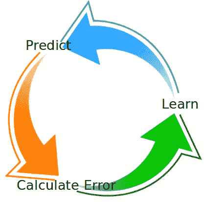

# 机器学习基础:了解线性回归

> 原文：<https://betterprogramming.pub/machine-learning-basics-understanding-linear-regression-9a2bddd21604>

## 任何数据分析师最基本的出发点



1D 的线性回归

# 优势

机器学习可以让你省去为给定问题建立一套复杂规则的麻烦，这可能并不理想，也更难维护。
在正确的指导下，机器学习可以找到更好更快的方法来解决你的问题。

# 我从哪里开始？

首先，我们将从基本概念开始。稍后，我们将做一些图形和编码，以便更容易理解这个问题及其含义。之后，实际的实现将比本文的概念更简单(这部分将在最后)。


[Tumisu](https://www.everypixel.com/search?q=thinking%2Bmachine&stocks_type=free&image_id=11626582366992055773) 在 [Everypixel](https://www.everypixel.com/) 上拍照。

# 机器学习类型

机器学习算法有很多种，你可以把它们分成很多种。有监督学习、无监督学习和强化学习。

机器学习的面包和黄油是监督学习。线性回归肯定也很高。

## 监督学习

在监督学习中，你使用分类(已知)数据来理解背后的算法，每个特征(参数)之间的联系，以及最终的结果。例如，房子的大小和价格之间的关系。

监督学习也常用于分类。如果您对此感兴趣，请在后续文章中发表评论。



机器学习圈的三个步骤——作者摄。

# 完美的例子:住房市场

让我们回顾一下。我们提到了监督学习如何需要数据来学习，以及线性回归如何确定每个参数(特征)对结果的影响程度。

住房市场在销售方面有大量的数据，给你所有你需要的监督数据，并且显然每个特征都有一个相对恒定的权重。它的大小，房间数量等。这些都需要在房价中考虑。

## 2D 的进程

我将从 2D 的过程开始，因为它更容易理解。让我们假设平方英尺是定义房子价格的唯一特征(参数)。我们可以画出图表，得到这个看起来像足球的结果:

现在的想法是，我们可以做一个穿过球的线性函数，它看起来像这样:

```
y = x1*SqFt + x0
```

在不知道其他任何事情的情况下，以房子的价格为起点。

现在，我们开始给`x1`和`x0`完全随机的值，我们从这个等式计算期望的`Y`。

现在我们需要做的是找出我们做得有多差，为了修正它，我们使用一种叫做梯度下降的算法。

## 梯度下降

在不涉及太多数学知识的情况下，我们的想法是对成本函数(我们的误差)进行求导，并向最接近的局部最小值前进一步。

这是我鼓励您研究的 ML 中的主要数学过程，但即使是对前两行的简单理解也足以开始学习 ML。


在 [Unsplash](https://unsplash.com?utm_source=medium&utm_medium=referral) 上 [Waranont (Joe)](https://unsplash.com/@tricell1991?utm_source=medium&utm_medium=referral) 拍摄的照片。

更简单地说，如果成本函数是某种抛物线，你就沿着图表走到最近的谷底。

成本函数越陡，步长越大。

这是在我们的圈子里，代表着失去和学习。该图将显示一段时间内的流程:


ML 在 1D-作者照片

# 波士顿住房市场

波士顿住房市场附带了 Python 的 [scikit-learn](https://scikit-learn.org/stable/) 模块，它拥有标准机器学习算法和实现所需的一切。这将是我们学习经验的数据集。

Scikit-learn 已经为整个过程提供了一个预构建的函数，它看起来像这样:

注意:分成测试和训练数据是很重要的！如果您根据训练数据进行预测，您的结果可能会过度拟合，这意味着该过程仅适用于您的数据，而不适用于新数据。

# 结论

写这篇文章不是为了教你数学或者让你在一天之内成为一个 ML 专家。我只是想在这个问题上给你一个相对较好的起点，以便你理解主要概念。如果你喜欢这个主题，你就会知道要寻找哪些主题(学习、错误、特征、梯度下降等。).

我希望你喜欢它。如果你想看更深的潜水，请评论！