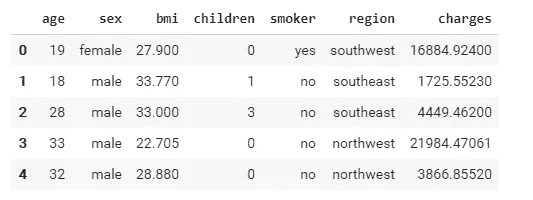
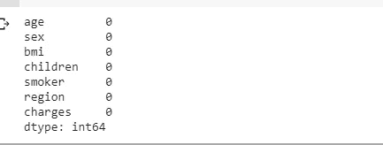
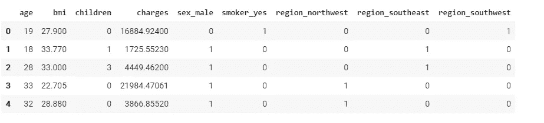

# 面向初学者的机器学习

> 原文：<https://betterprogramming.pub/machine-learning-for-beginners-predicting-insurance-costs-using-linear-regression-40989645dfa3>

## 使用线性回归预测保险成本


亨特·哈里特在 [Unsplash](https://unsplash.com?utm_source=medium&utm_medium=referral) 拍摄的照片。

线性回归适用于我们希望预测某个数值的问题，这与我们使用逻辑回归的“是或否”预测相反。

什么是“是或不是”的预测？

例如，如果一家保险公司想要预测一个人是否可能早死(一个“是或否”的预测)，并获得索赔保险，他们应该使用逻辑回归。

但是在这里，我们想要预测个人的保险成本——我们将使用线性回归来实现这一点。

# 导入数据集

首先，让我们导入必要的库并将 csv 文件中的数据读入 pandas 数据框。

```
import pandas as pdimport numpy as npdf = pd.read_csv(“/content/drive/My Drive/Colab Notebooks/insurance.csv”)
```

让我们看看数据框是什么样的:

```
df.head()
```



我们关于不同背景的人及其保险费用的数据。

下一步是检查数据框中的空值，并移除或均值归一化不可用的值。

```
df.isnull().sum()
```



不同列中 null 值的数量。

正如我们所看到的，数据集中没有空值。

# 将类别转换为数字

现在，在这个数据集中，我们有像“吸烟者”、“地区”和“性别”这样的分类特征

不是用数字而是用范畴来表示的分类特征。

线性回归只能在数字上执行，所以我们应该将这些分类特征转换成数字。为此，我们可以使用一个名为`get_dummies`的函数。

因此，让我们将“性别”、“吸烟者”和“地区”列转换成数字表示的特征。

```
cols = ['sex', 'smoker', 'region']new_df = pd.get_dummies(df, cols, drop_first= True)new_df.head()
```



性别、吸烟者和地区类别现在用数字表示。

# 特征选择

现在，让我们只选择最相关的特性。

特征选择是任何机器学习项目中的重要任务之一。您必须知道哪些特性与目标最相关(在我们的例子中是“charges”列)，并且必须只使用那些与您的目标高度相关的特性。

这可以通过实验来实现。

例如，在这个问题中，我尝试使用“性别”和“地区”功能来预测“费用”，但没有发现模型的预测性能有太大的改进。

所以我决定在模型中省略这些特性。

通过这样的小实验，我发现“年龄”、“bmi”和“吸烟者”列与预测保险费用最相关(数据框中的“费用”列)。

```
X = new_df[[‘age’, ‘bmi’, ‘smoker_yes’]]y = new_df[‘charges’]
```

# 分割数据集

数据预处理现在已经完成，我们准备对我们的数据应用线性回归。

但在此之前，我们需要将数据分成两组:一组训练集和一组测试集。

这意味着我们使用 80%的可用数据创建一个线性回归模型，然后使用剩余的 20%的数据来查看我们的模型在以前没有见过的数据上的表现。

为了进行数据集分割，我们在 Sci-kit learn 中有一个名为`train_test_split`函数。看起来是这样的:

```
X_train, X_test, y_train, y_test = train_test_split(X, y, test_size = 0.2)
```

上面那行代码中`test_size`的值意味着我们需要分别截掉的样本的百分比，以测试我们的线性回归模型。

在我们的例子中， *test_size=0.2* 意味着我们的样本(`X_test`、`y_test`)的 20%将从我们的数据集中剔除，因此我们可以在数据集的剩余 80%( `X_train`、`y_train`)上训练模型。

# 导入和拟合我们的 ML 算法

现在，我们已经准备好根据数据训练我们的模型。

我们应该从 Sci-kit learn 库中导入`LinearRegression`类，并用一个变量实例化它，该变量可以用来适应我们的数据。

```
from sklearn.linear_model import LinearRegression
model = LinearRegression()
```

当我们对数据应用线性回归并试图预测输出时，会发生一些非常复杂的事情。

但我们只需要将预处理过的数据传递到我们的模型中，所有复杂的机器学习计算都会在引擎盖下进行。

接下来，我们需要将数据拟合到我们的线性回归模型中。

```
model.fit(M_train, n_train)
```

我们的模型已经准备好了，我们可以通过计算分数来评估它的性能。

# 我们模型的 R2 分数(误差分数)

使用一种叫做`R2(R square)`的误差计算方法计算分数，给出实际值和预测值之间的误差。

```
model.score(X_test, y_test)
```

当我运行代码时，我得到的 R2 值是 0.7422。

*   R2 = 0 意味着我们有一个糟糕的预测模型，我们的预测保险成本只是数据集中所有个人的平均保险成本。
*   R2 = 1 意味着我们有完美的预测模型，其中每个预测值都等于实际值。

这里我们有 0.74，这对于 R2 值来说是相当不错的。

# 线性方程

接下来，让我们更深入地了解我们的算法创建的用于预测保险成本的线性方程。

让我们找出我们的模型用来计算保险费用预测的公式。

基本上，该等式的形式为 *y = w0 + w1*x1 + w2*x2 + w3*x3* 。

w0 是截距，x1、x2 和 x3 是“年龄”、“bmi”和“吸烟者 _ 是”特征，而 w1、w2 和 w3 是各自的系数。

让我们找出我们模型的截距 w0 是多少:

```
model.intercept_
```

*输出:-12038.54*

现在，让我们看看系数 w1、w2 和 w3 是什么:

```
model.coef_
```

*输出:数组([ 269.75240575，316.68365152，24140.19804267])*

因此，w1、w2 和 w3 的值分别为 269.75、316.68 和 24140.19。

w3 的值大得不成比例，因为它与 x3 成对出现，这是“smoker_yes”特性。

这表明一个人的吸烟状况在决定一个人的保险费用中起着不成比例的作用。这是因为吸烟会增加你的生命风险，从而导致高额的保险费用。

此外，线性方程中与“年龄”特征配对的系数 w1 等于 269.75。这意味着年龄每增加 1 岁，保险费用就会增加 269.75 美元。

现在，使用这个线性方程，我们可以编写一个函数，预测给定年龄、体重指数和吸烟状况的保险费用。

让我们通过我们的值，看看保险成本的预测值。

```
calc_insurance(27, 42.13, “smoker”)
```

输出:36860 . 48686868686

因此，使用我们训练的线性回归模型，上面的函数预测了 27 岁身体质量指数为 42.13 的吸烟者的保险成本。

# 结论

简而言之，线性回归就是计算每个要素在您想要预测的目标值中所占的权重。

在上面的示例中，我们的数据集中有三个相关要素，我们的模型计算了三个唯一的权重 w1、w2 和 w3。

在一些复杂的机器学习问题中，你可能会处理更多的特征。

例如，考虑一个目标值依赖于 40 个特征的机器学习问题。在这种情况下，使用线性回归是为了有效地计算 40 个特征中每个特征的适当权重(即 w1、w2、… w40)。