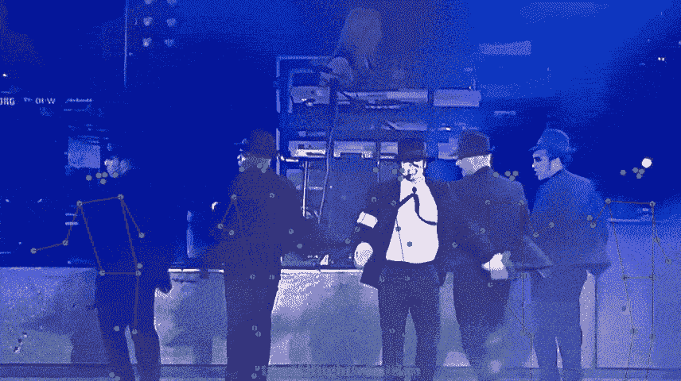
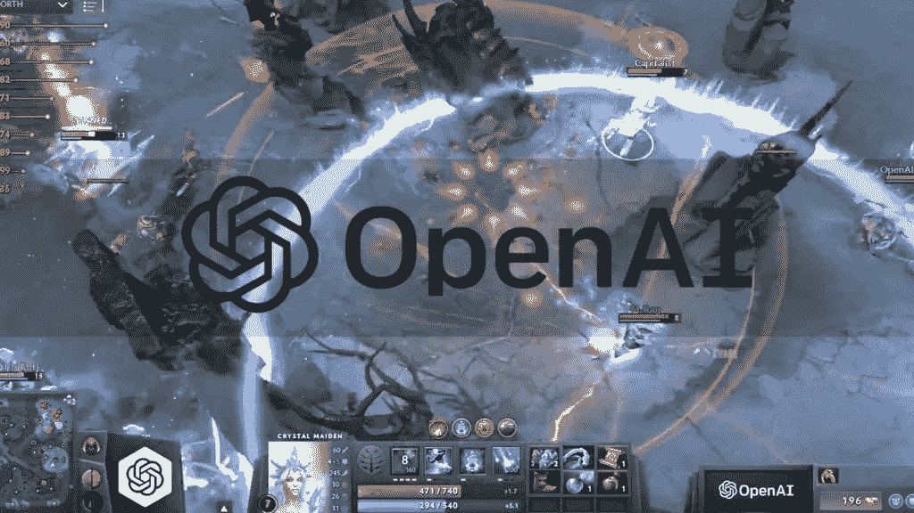
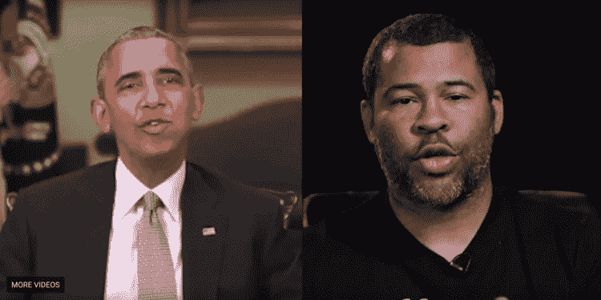
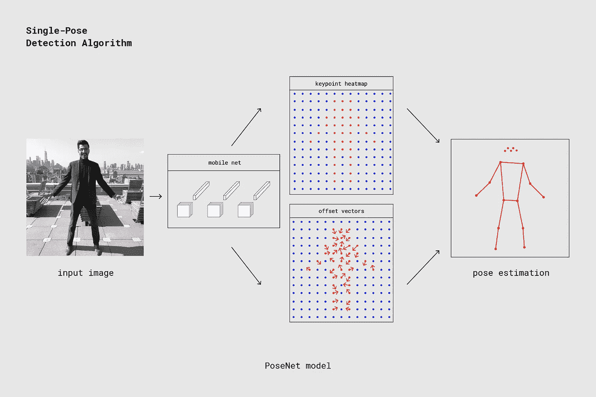
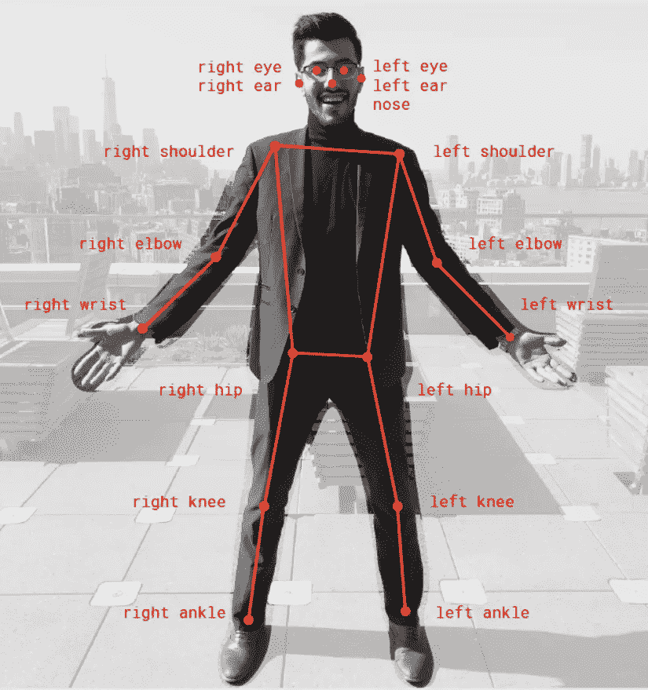
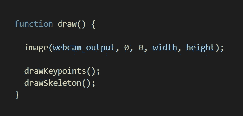
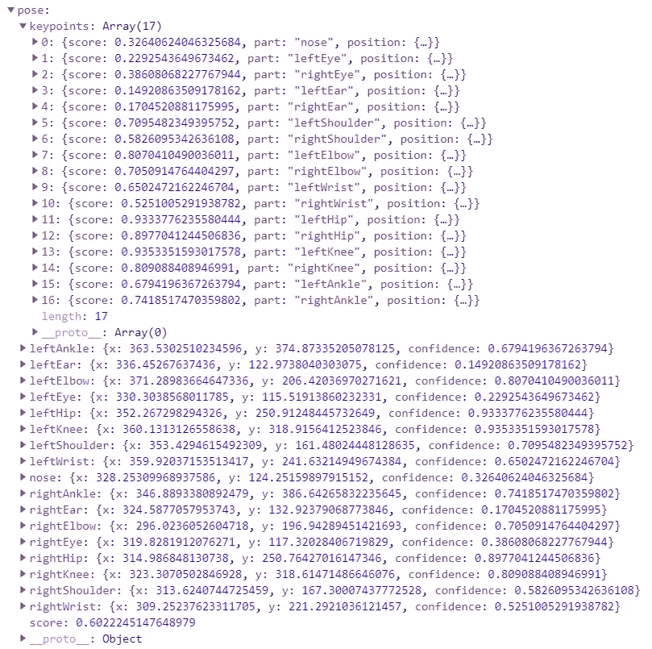
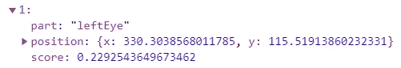
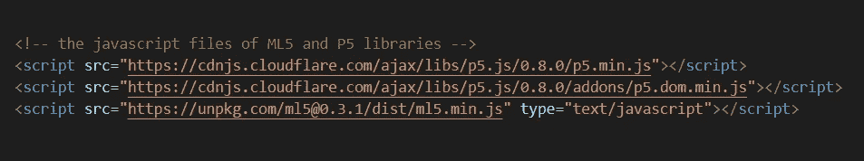
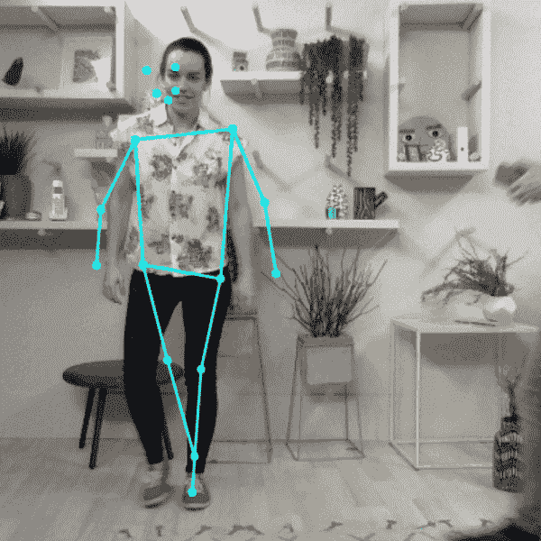

# 面向所有人的机器学习:通过网络摄像头在浏览器中进行姿态估计

> 原文：<https://betterprogramming.pub/machine-learning-for-everyone-pose-estimation-in-a-browser-with-your-webcam-65bb2648c16a>

## 无需任何安装就能在浏览器中使用 ML 的代码友好指南

# 目录

*   [简介](#d1f4)
*   [pose net 模型简介](#ac60)
*   [深度代码演练](#75ef)

# 2k19 中的 ML

AlphaGo、OpenAI 和 Deep fake 在行动。

20 世纪是机器学习领域呈指数增长的时代。科学家们预测的有着 3000 年历史的古老围棋[将再花](https://www.wired.com/2014/05/the-world-of-computer-go/)十年时间来破解，这是由[谷歌大脑团队](https://ai.googleblog.com/2016/01/alphago-mastering-ancient-game-of-go.html) AlphaGo AI、[击败](https://en.wikipedia.org/wiki/AlphaGo_versus_Lee_Sedol#targetText=AlphaGo%20versus%20Lee%20Sedol&targetText=AlphaGo%20won%20all%20but%20the,slated%20to%20win%20%241%20million.)多次世界冠军 Lee Sudol 而实现的。

顺便说一下，这个中国游戏的组合比宇宙中预测的原子还要多，或者简而言之，这个游戏不能像 IBM Blue 在 1997 年那样，通过所有可能的移动来赢得比赛。

然后， [OpenAI 的 bot](https://openai.com/blog/dota-2/) 在 DOTA2 和其他有趣(潜在有害)的东西如 [Deepfake](https://en.wikipedia.org/wiki/Deepfake#targetText=Deepfake%20(a%20portmanteau%20of%20"deep,known%20as%20generative%20adversarial%20network.) 中的崛起。研究社区在 ML 中蓬勃发展，从 10 年前每年提交 100 篇论文，到 2019 年仅在 arXiv 上每天就有 100 篇论文。

但是，抛开一切不谈，重点是 ML 是高度数学密集型的。

虽然像 [TensorFlow](https://www.tensorflow.org/) 和 [PyTorch](https://pytorch.org/) 这样的库在让所有开发人员都可以使用 ML 方面做出了重大贡献，但我们仍然有一个陡峭的学习曲线，需要知道如何创建模型、训练模型并保存它以供以后在我们的任务中使用。

这就是 [ml5.js](https://ml5js.org/) 的用武之地，这是一个基于 TensorFlow.js 的库，它于去年 3 月推出，将愿景推进了更远。

# 为什么选择 ml5.js

> “ml5.js 旨在让艺术家、创意程序员和学生等广大受众能够接触到机器学习。该库提供了在浏览器中访问机器学习算法和模型的途径。”—官方开发者

在浏览器中。是啊！*不需要*安装**，**它让你远离安装多个数据科学库的痛苦，并确保一切都与你已安装的版本协调工作，相信我，这有时并不容易。

# 你需要什么

1.  从这个 [GitHub repo](https://github.com/kartik-nighania/Real-Time-Human-Pose-detection-in-browser) 下载代码。它有两个文件夹，一个用于使用网络摄像头作为输入来检测姿势，另一个通过视频文件作为输入。
2.  [VS 代码](https://code.visualstudio.com/)(可选)读取代码。

# 人体姿态估计简介

我们举个小例子。我们希望使用机器学习在一个文件夹中找到带有人脸的图片，该文件夹包含您最近一次度假旅行期间拍摄的所有图片。

所以，我们拿一个神经网络，它是一个机器学习模型(牛逼的[初学者视频](https://www.youtube.com/watch?v=aircAruvnKk)了解它是什么)，用大量数据训练它，里面有随机的人脸，然后用同样的模型检测我们文件夹里的人脸。

如今，神经网络的味道比巴斯金和罗宾斯在冰淇淋中的味道要丰富得多。(如果你想知道，[是 31](https://simple.wikipedia.org/wiki/Baskin-Robbins#Original_31_Flavors) 。)有的擅长处理图像，有的擅长处理文本数据，有的擅长处理声音之类的时间序列，等等。

在我们的例子中，我们使用卷积神经网络，也就是 CNN，来处理图像。

ml5.js 是 TensorFlow.js 的包装器，它还提供了 [PoseNet](https://github.com/tensorflow/tfjs-models/tree/master/posenet) 模型。一个现成的模型，内部有预先训练好的 CNN，以一个图像作为输入，输出一个`keypoint heatmap`和`offset vectors`。

使用移动网络 CNN 并给出输出的 PostNet 模型。[图像演职员表](https://medium.com/tensorflow/real-time-human-pose-estimation-in-the-browser-with-tensorflow-js-7dd0bc881cd5)

PoseNet 检测到 17 个关键点。发布在 [Tensorflow 博客](https://medium.com/tensorflow/real-time-human-pose-estimation-in-the-browser-with-tensorflow-js-7dd0bc881cd5)

通过使用这些表示和一点点数学魔法，我们最终找到了 17 个`keypoints`，如图所示，来检测一个完整的人体姿势。

该模型还通过给每个`17 points`一个 0-1 分的`keypoint confidence score`来返回它有多自信(其中 1 表示 100%自信，0.56 表示 56%)。

它还返回在图像中检测人类姿态的总体`pose confidence score`，也是在 0-1 的范围内。

# 编码时间

我们将使用一个摄像头作为姿势估计模型的视频输入，并在我们的主页`index.html`上显示输出。

我们在这里使用两个库:

*   `ml5.js`用于创建和运行我们的 ML 模型。
*   `[p5.js](https://p5js.org/)`用于获取网络摄像头视频并在浏览器中显示输出。

我在代码中添加了大量的文档，解释了每一行。在这里，我们将讨论主要的症结所在，也就是大部分代码。

我们的代码由两个文件组成:

*   `poseNet_webcam.js`，我们的 JavaScript 代码。
*   `index.html`，主页面显示输出。

## PoseNet_webcam.js

`p5.js`运行两个功能:

*   `function setup()`。只执行和运行一次的第一个函数。我们将在其中进行初始设置。
*   `function draw()`。这个函数永远重复调用(除非你打算关闭浏览器或按下电源按钮)。

`createCanvas(width, height)`是由 p5 提供的在浏览器中创建一个框来显示我们的输出。这里画布有`width: 640px`和`height: 480px`。

`createCapture(VIDEO)`用于捕获一个网络摄像头馈送并返回一个 p5 元素对象，我们将其命名为`webcam_output`。我们将网络摄像头视频设置为与画布相同的高度和宽度。

`ml5.poseNet()`创建一个新的 PoseNet 模型，将以下内容作为输入:

*   我们现在的网络摄像头输出。
*   一个[回调函数](https://www.dashingd3js.com/lessons/javascript-callback-functions#targetText=Passing%20JavaScript%20Functions%20as%20Variables%20Revisited&targetText=functionName(argument1%2C%20argument2)%3B,used%20inside%20of%20the%20function.&targetText=The%20variables%20and%20arguments%20must%20be%20in%20expected%20order.)，当模型成功加载时调用。在我们的`index.html`文件中，我们创建了一个带有 ID `status`的 HTML 段落，向用户显示当前的状态文本。为了让用户知道，我们将文本改为*模型加载*，因为模型加载*需要一点时间。*

`poseNet.on()`是一个触发器或事件监听器。每当网络摄像头给出一个新的图像，它就被提供给 PoseNet 模型。

检测到姿态并准备输出的时刻。它调用`function(results)`，其中`results`是`keypoints`的最终输出和模型给出的分数。

我们将它存储在我们的`poses`数组中，这个数组是全局定义的，可以在我们代码的任何地方使用。`webcam_output.hide()`暂时隐藏网络摄像头输出，因为我们稍后将修改图像并显示检测到的点和线。

我们剩下要做的就是在浏览器中显示保存在`poses`中的所有检测结果的图像。

我们知道，`draw()`函数永远循环运行。在这里，我们调用`image()`函数在画布中显示我们的图像(因为我们有我们的视频图像)。

它需要五个参数:

*   `input image`。我们想要显示的图像。
*   `x position`。图像左上角相对于画布的 x 坐标。
*   `y position`。图像左上角相对于画布的 y 坐标。
*   `width`。绘制图像的宽度。
*   `height`。绘制图像的高度。

然后我们调用`drawKeyPoints()`和`drawSkeleton()`在当前图像上绘制*点和线*。`draw()`在无限循环中这样做，因此向用户显示连续的输出，这使它看起来像视频。

PoseNet 的典型 JS 对象输出

正如您在上面看到的，PoseNet 返回一个 JavaScript 对象作为输出，由许多键值对组成。这是为图像中的每个人提供的`pose`和`skeleton`值中的`pose`键值。

我们有一个在图像上绘制检测点的功能。记住，我们将 PoseNet 输出的所有结果保存在`poses`数组中。在这里，我们循环遍历图像中的每个`pose`或人物，并获得其`keypoints`。

关键点数组中的一个点内

我们循环遍历`keypoints`数组中的每一个主体部分`point`，该数组还包含:

*   `part`。检测到的零件的名称。
*   `position`。图像中点的 x 和 y 值。
*   `score`。检测的准确性。

我们只在检测精度大于`0.2`的情况下画一个`point`。我们调用`fill(red, green, blue)`，取`0 to 255`范围内的 RGB 强度值决定一个点的颜色，`noStroke()`禁用绘制 p5 默认绘制的轮廓。

然后，我们调用`ellipse(x_value, y_value, width, height)`在期望的位置画一个椭圆，但是我们保持宽度和高度非常小，这使得它们看起来像一个点(正是我们想要的)。

类似地，由于我们的变量`poses`中有多个`pose`，它也有多个`skeleton`值，它们有自己类型的键值对，这是通过`drawSkeleton()`画线而不是画点来处理的。

## index.html

这是我们显示输出的主页。我们使用脚本标签添加所有的库。

ml5.js 和 p5.js 库

我们向用户展示了一个可爱的欢迎介绍。由于模型加载需要时间，我们显示'*加载模型…'* 消息。如果你还记得的话，一旦我们的模型使用一个 ID 上的引用被加载，我们就把它改成' *Model Loaded'* '，这个 ID 叫做`status`。

最后，我们将自己的 JS 代码放入主体中。运行`index.html`文件查看输出。确保在出现提示时允许网络摄像机访问。

PoseNet 在行动。图片来自[官方 Tensorflow medium 博客](https://medium.com/tensorflow/real-time-human-pose-estimation-in-the-browser-with-tensorflow-js-7dd0bc881cd5)。

就是这样！你可以随时去 [ml5.js 参考页面](https://ml5js.org/reference/)，那里有更多现成的模式和代码片段，可以用于各种很酷的 ml 项目，处理各种各样的东西，比如文本、图像和声音。

感谢阅读！