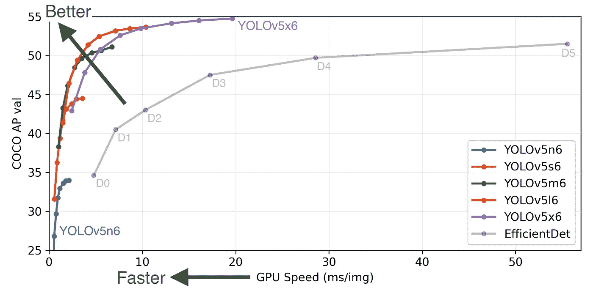
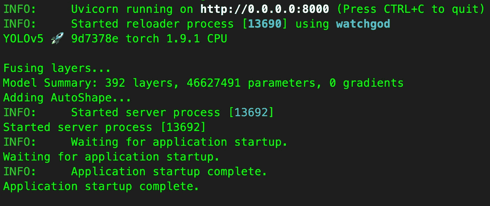
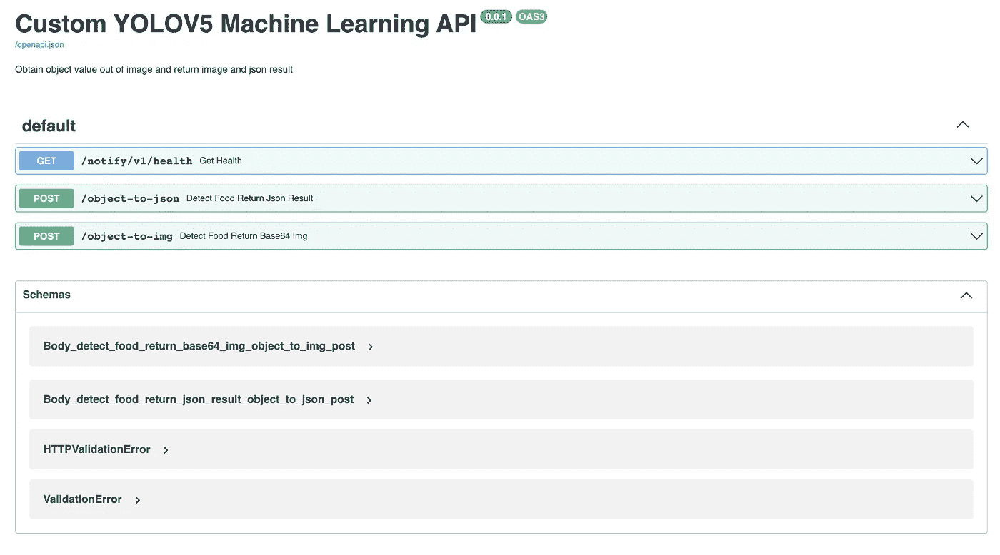
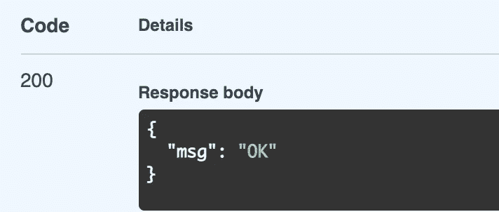
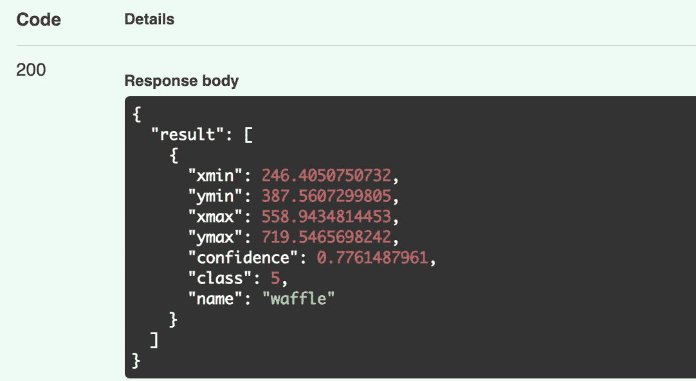
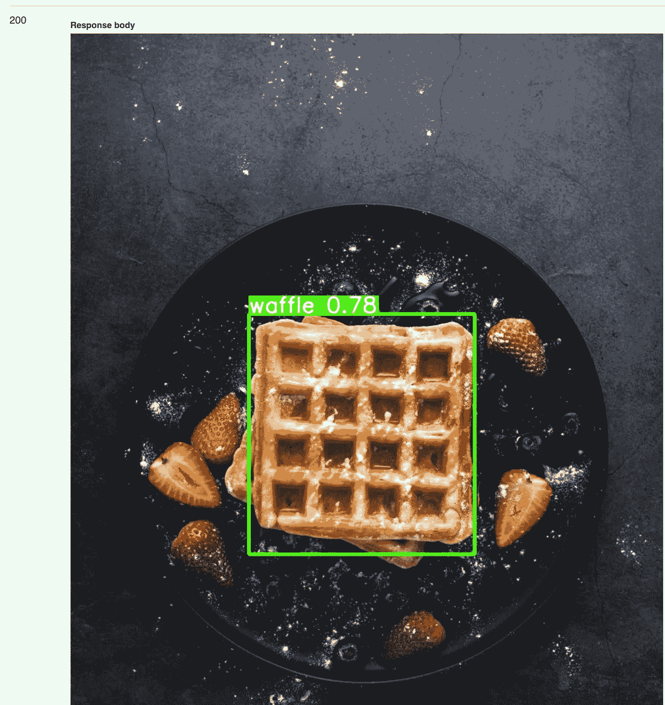
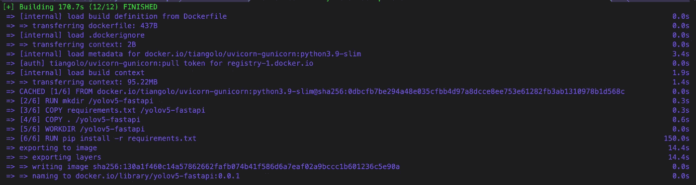

# 使用 YOLOv5 和 FAST API 分 5 步构建机器学习模型 API

> 原文：<https://betterprogramming.pub/machine-learning-model-api-using-yolov5-with-fast-api-192f1290a982>

你好。今天我们将利用 YOLOv5 和 FAST api 来构建一个机器学习 API。


jet dela cruz 在 [Unsplash](https://unsplash.com?utm_source=medium&utm_medium=referral) 上拍摄的照片

如果您以前使用过 Flask，您会发现使用 FAST API 很容易，因为它提供了生产就绪代码，只需进行少量调整。

FAST API 还附带了与 OpenAPI 的自动交互文档。除了更好的开发者体验之外，ASGI(异步服务器网关接口)使得 FAST API 成为可用的最快的 Python 框架之一[。](https://www.techempower.com/benchmarks/#section=test&runid=7464e520-0dc2-473d-bd34-dbdfd7e85911&hw=ph&test=query&l=zijzen-7)

## YOLOv5 是什么？

> YOLOv5 是在 COCO 数据集上预先训练的一系列对象检测架构和模型，代表了对未来视觉人工智能方法的 [Ultralytics](https://ultralytics.com/) 开源研究，融合了经过数千小时的研究和开发而获得的经验教训和最佳实践。

[](https://ultralytics.com/) [## 超 lytics

### YOLOv5🚀和视觉人工智能⭐

ultralytics.com](https://ultralytics.com/) 

YOLO 代表“你只看一次”，这是一种快速高效的深度学习模型，因为它使用单镜头检测器(SSD)和 YOLO 对象检测器来将输入图像划分到 SxS 网格系统中。

您可能会看到以下 YOLOv5 的令人印象深刻的对比:



来自[https://github.com/ultralytics/yolov5](https://github.com/ultralytics/yolov5)

# 使用的技术

1.  [FastAPI](https://fastapi.tiangolo.com/) 用于以异步模式提供认证 API。
2.  [OpenAPI](https://github.com/OAI/OpenAPI-Specification) (以前称为 swagger)用于记录 API 规范。
3.  [Docker](https://www.docker.com/) 用于构建容器图像。

# 步骤 0:准备您定制的 YOLOv5 模型

要使用 YOLOv5 训练自定义对象识别，您可以查看下面的链接:

[](https://colab.research.google.com/drive/1gDZ2xcTOgR39tGGs-EZ6i3RTs16wmzZQ) [## 谷歌联合实验室

### 编辑描述

colab.research.google.co](https://colab.research.google.com/drive/1gDZ2xcTOgR39tGGs-EZ6i3RTs16wmzZQ) 

> 您可以使用我自己的定制 ML 模型，而不需要这一步。该模型支持检测 6 种食品，包括鸡翅、甜甜圈、薯条、gyoza、热狗和华夫饼。

# 步骤 1:克隆或下载 Github 项目

去[https://github.com/DanielChuDC/yolov5-fastapi](https://github.com/DanielChuDC/yolov5-fastapi)克隆或下载项目。解压下载的 zip 文件。

## 目录解释:

```
.
├── Dockerfile # For containerised this application
├── README.md
├── main.py # The entry point of the program
├── model
│   ├── __init__.py
│   └── best.pt # Where you custom training model place
├── requirements.in # To generate requirements.txt
├── requirements.txt # Usage: pip install -r requirements.txt
├── segmentation.py # for import local yolov5 and scale image
└── yolov5 # Get from [https://github.com/ultralytics/yolov5](https://github.com/ultralytics/yolov5)
```

`main.py`是应用程序的入口点。在这里，我们将定义 3 个端点，并允许在 FAST API 中以字节为单位上传文件:

```
from fastapi import FastAPI, File
from segmentation import get_yolov5, get_image_from_bytes
from starlette.responses import Response
import io
from PIL import Image
import json
from fastapi.middleware.cors import CORSMiddlewaremodel = get_yolov5()app = FastAPI(
    title="Custom YOLOV5 Machine Learning API",
    description="""Obtain object value out of image
    and return image and json result""",
    version="0.0.1",
)origins = [
    "http://localhost",
    "http://localhost:8000",
    "*"
]app.add_middleware(
     CORSMiddleware,
     allow_origins=origins,
     allow_credentials=True,
     allow_methods=["*"],
     allow_headers=["*"],
) @app.get('/notify/v1/health')
def get_health():
    return dict(msg='OK') @app.post("/object-to-json")
async def detect_food_return_json_result(file: bytes = File(...)):
    input_image = get_image_from_bytes(file)
    results = model(input_image)
    detect_res = results.pandas().xyxy[0].to_json(orient="records")
    detect_res = json.loads(detect_res)
    return {"result": detect_res} @app.post("/object-to-img")
async def detect_food_return_base64_img(file: bytes = File(...)):
    input_image = get_image_from_bytes(file)
    results = model(input_image)
    results.render()  # updates results.imgs with boxes and labels
    for img in results.imgs:
        bytes_io = io.BytesIO()
        img_base64 = Image.fromarray(img)
        img_base64.save(bytes_io, format="jpeg")
    return Response(content=bytes_io.getvalue(),
media_type="image/jpeg")
```

`segmentation.py`定义了两种方法:

1.  `get_yolov5()`:这就是 yolov5 可以使用定制模型的地方。请注意`model.conf=0.5`，它意味着只有置信度大于 0.5 的被检测对象才会出现在返回结果中。
2.  `get_image_from_bytes()`:是调整图像大小的地方。

```
import torch
from PIL import Image
import iodef get_yolov5():
    model = torch.hub.load('./yolov5', 'custom', path='./model/best.pt', source='local')
    model.conf = 0.5
    return modeldef get_image_from_bytes(binary_image, max_size=1024):
    input_image =Image.open(io.BytesIO(binary_image)).convert("RGB")
    width, height = input_image.size
    resize_factor = min(max_size / width, max_size / height)
    resized_image = input_image.resize((
        int(input_image.width * resize_factor),
        int(input_image.height * resize_factor)
    ))
    return resized_image
```

# 第 2 步:将自定义的 best.pt 放到项目目录下的 model 文件夹中

在你训练好你的定制模型之后，你就有了名为`best.pt`的定制模型。替换`model`文件夹中的 best.pt。

# 步骤 3:通过以下命令启动项目

在终端中运行以下命令

```
uvicorn main:app --reload --host 0.0.0.0 --port 8000
```

> 如果您看到下面类似的结果，这意味着成功地启动了项目。



> 如果您遇到任何关于软件包丢失的错误，您可以通过运行`pip install -r requirements.txt`来安装所需的软件包。

# 第四步:测试结果

在浏览器中导航至[http://0 . 0 . 0 . 0:8000/docs #/](http://0.0.0.0:8000/docs#/)。您应该看到开放 API 方案有 3 个端点:



1.  `/notify/v1/health` —该端点用于检查 Kubernetes 的`readinessProbe`和`livenessProbe`。

您可以通过点击`try it out`按钮来执行端点。

> 预期结果是状态代码为 200 的`{"msg": "OK"}`。



2.`/object-to-json` —此端点用于以 JSON 格式返回检测到的对象值

您可以点击`try it out`按钮执行端点并上传图像。

> 预期结果是带有 200 状态代码的`*{"result": []}*`。如果模型检测到大于 0.5 的东西，它将追加到数组中。



> 注意:如果您使用了您的海关`*best.pt*`，检测的对象可能会有所不同。

3.`/object-to-img` *—* 此端点用于返回图像格式的检测对象值

您可以点击`try it out`按钮执行端点并上传图像。

> 预期的结果是带有 200 状态代码的检测到的食物对象的标签图像。如果模型检测到大于 0.5 的东西，它会显示一个标签和方框。



> 注意:如果您使用了您的海关`best.pt`，检测到的对象可能会有所不同。

# 步骤 5:将该项目构建为微服务的容器映像

我们已经走了这么远！让我们将这个项目构建成一个容器映像。

打开`docker desktop`并等待其准备就绪。

## Dockerfile 文件

```
FROM tiangolo/uvicorn-gunicorn:python3.9-slim
LABEL maintainer="danielchu"ENV WORKERS_PER_CORE=4
ENV MAX_WORKERS=24
ENV LOG_LEVEL="warning"
ENV TIMEOUT="200"
RUN mkdir /yolov5-fastapi
COPY requirements.txt /yolov5-fastapi
COPY . /yolov5-fastapi
WORKDIR /yolov5-fastapi
EXPOSE 8000
CMD ["uvicorn", "main:app", "--host", "0.0.0.0", "--port", "8000"]
```

现在通过运行以下命令来构建映像

```
docker build -t yolov5-fastapi:0.0.1 .
```

如果看到类似下面截图的结果，图像已经构建成功了！



您可以通过以下方式运行容器映像

```
docker run -p 8080:8000 yolov5-fastapi:0.0.1
```

# 结论

在本文中，我们使用 YOLOv5 和 FAST API 创建了一个机器学习模型 API。这个应用程序将适合对象检测，允许你上传图像，并以 JSON 或 image 格式返回结果。

这个应用程序也适合使用容器映像进行云部署。

我们可以通过将检测结果存储到数据库中来进一步增强这个项目，以用于机器学习改进。但那是以后的事了。

> 如果您对使用 FAST api 构建身份验证 API 感兴趣，可以查看下面的链接:

[](https://dc1888.medium.com/build-simple-authentication-api-using-fast-api-with-es256-encryption-in-10-mins-f8c0113937a) [## 使用带 ES256 加密的 FAST API 在 10 分钟内构建简单的身份验证 API

### 大家好！在本文中，我们将了解如何使用 FAST API 创建一个身份验证 API…

dc1888.medium.com](https://dc1888.medium.com/build-simple-authentication-api-using-fast-api-with-es256-encryption-in-10-mins-f8c0113937a)